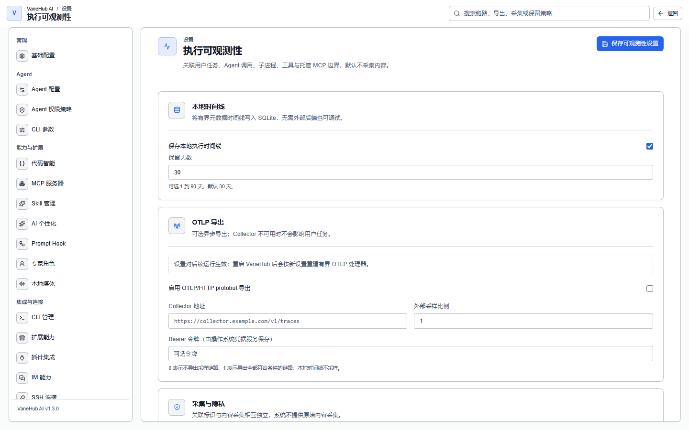
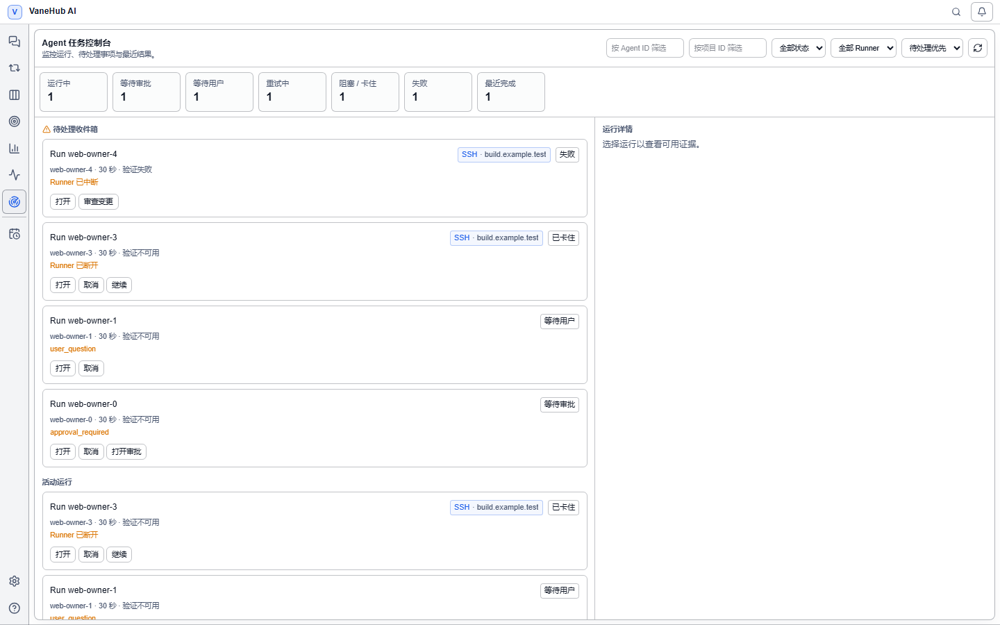

# 可观测性

## 功能概述

回答「刚才那次执行到底发生了什么」。**链路**标签用一棵 Span 树展示整次任务，**日志**标签提供可搜索、可按时间定位的脱敏日志。

## 查看执行链路

打开会话的**链路**标签。每次被接受的任务在执行开始前就分配了独立标识，因此**失败的执行同样可追溯**。

Span 树分四层：

```text
会话
 └─ Agent
     ├─ 工具 / MCP 边界
     └─ 进程执行
```

### 保真度：为什么有些节点展不开

**链路拓扑**里每个节点都带保真度徽标：

| 徽标 | 含义 |
| --- | --- |
| **原生** | 运行时的一手记录，信息最完整 |
| **中继** | 经中继层观测（走 MCP 中继的调用） |
| **推断** | 由其他信号推断得出 |
| **不可见** | 只知道边界，内部无从得知 |

**不可见与不完整的节点会带一条明确提示**：

> 观测缺口 —— 该边界不完整或不可见，不会推断成功状态和耗时。

**这是刻意的诚实**。外部 CLI 内部发生了什么是黑盒，系统只保留一个边界节点，**不会为了让时间线好看而虚构子节点或编造耗时**——否则你会基于错误的结构做判断。

想看到可展开的完整调用链，用 [OnePiece](native-agent.md)。


### 安全关联标识

时间线顶部列出这次执行的 **Run**、**Trace**、**会话**、**操作**、**Agent** 标识，排查时用来把多处记录对上。

### 执行来源

链路会记录这次执行是怎么触发的：

| 来源 | 场景 |
| --- | --- |
| 桌面 | 你在界面里手工发起 |
| IM 连接器 | 从飞书 / 钉钉等触发，带连接器标识 |
| 定时任务 | 按计划触发，带任务标识 |

因此可以反查「这次执行是哪个定时任务跑的」。

## 查看会话日志

打开会话的**日志**标签：

| 操作 | 说明 |
| --- | --- |
| 搜索 | 在脱敏日志中检索 |
| 定位 | 输入时间点跳转；目标更早时会提示再次定位 |
| 加载更多 | 分页加载 |
| 导出 | 导出到本地文件 |

日志分四级：**错误 / 警告 / 信息 / 调试**。


## 采集策略与脱敏

在**设置 → 执行可观测性**中配置。页面说明是「关联用户任务、Agent 调用、子进程、工具与托管 MCP 边界，**默认不采集内容**」。



### 本地时间线

默认开启，把有界元数据时间线写入本地，**无需外部后端也可调试**。

**保留天数可配 1 到 90 天，默认 30 天。**

### OTLP 导出（可选）

默认关闭。它是**异步导出，Collector 不可用时不会影响用户任务**。

| 配置项 | 说明 |
| --- | --- |
| Collector 地址 | 导出端点 |
| 外部采样比例 | **0 表示不导出，1 表示导出全部符合条件的链路** |
| Bearer 令牌 | **由操作系统凭据服务保存** |

> **本地时间线不采样**——采样比例只影响外部导出。设置对后续运行生效，重启后按新设置重建处理器。

### 采集策略

| 策略 | 效果 |
| --- | --- |
| 仅元数据 | 敏感字段**整条丢弃**，键都不保留 |
| 脱敏内容 | 敏感字段的值替换为脱敏标记 |

**「仅元数据」下敏感属性是整条消失的**，不是留空值——分析时要能区分「本来就没有这个属性」和「被策略丢掉了」。

即使字段名看起来无害，字符串值也会再过一层逐词脱敏，识别并替换私有路径、Bearer 令牌、provider 密钥等。

> **文件路径与命令参数被当作敏感信息处理**，因为它们会泄漏目录结构与调用细节。这会让某些排查场景信息不足，此时可临时切到「脱敏内容」策略。

## 日志与链路是分开的

**日志与链路是两套存储,但可以按标识符关联**。日志条目在来源提供时会把 `runId`、`traceId`、`spanId` 写进它的 context。

隐私设计排除的是**内容**而非标识符:原始提示词、Agent 输出、源码、诊断文本、stderr、环境变量、凭据与私有绝对路径都不会进入日志文件。所以用链路 id 是能找到对应日志条目的;找不到的是某段输出内容,那种情况才需要用时间去对。

## 任务控制台

链路回答的是「这一次运行内部发生了什么」。**任务控制台回答的是另一个问题:此刻哪些运行需要你介入**。入口在左侧活动栏的**运行**，默认落地页即是任务控制台（等待关注 / 活动运行 / 最近完成三个子标签）。



页面顶部是七个状态的汇总计数:

| 计数 | 含义 |
| --- | --- |
| 运行中 | 正在执行 |
| 等待审批 | 停在权限闸门上,等你做决定 |
| 等待用户 | 停在一个向你提出的问题上 |
| 重试中 | 失败后正在自动重试 |
| 阻塞 / 卡住 | 没有推进,并给出原因 |
| 失败 | 已以失败结束 |
| 最近完成 | 已结束,仍保留一段时间可见 |

计数下方是三段有界列表:**待处理收件箱**、**活动运行**与**最近完成**。每一行显示该运行及其归属者、Agent、安全标题、状态、已用时长、工作区、阶段、需要关注的原因,以及验证结论摘要。

有两个行为是刻意设计的,值得知道:

- **已完成运行的用时会停住**。它取自终态时间戳,所以刷新页面不会让一个已经结束的东西继续走表。
- **Token 与成本只在来源可靠时才显示**。没有上报用量、没有被显式归类的估算、或没有匹配的价格时,任务控制台会把该值标为不可用,而不是显示为零。这里的空白意味着「不知道」,不是「没花钱」。

这三段是有界分页而非全部历史:无论你有十次运行还是一万次,这个视图的体量都一样。要看某一行背后的细节——日志、差异、提示词、工具载荷——请打开那次运行本身。

## 注意事项与限制

- **仅桌面端可用**。
- **历史会被清理**。保留天数可配 1–90 天（默认 30），超出的记录会被删除，需要长期留存请自行导出或配置 OTLP。
- **系统不提供原始内容采集**。关联标识与内容采集相互独立，默认不采集内容。
- **一次执行内所有节点共用同一套采集策略**，无法对个别节点单独放宽。
- 重试会作为独立执行记录，通过关联关系与原执行相连，**不会复用原有标识**——两次执行不会被记成一次。
