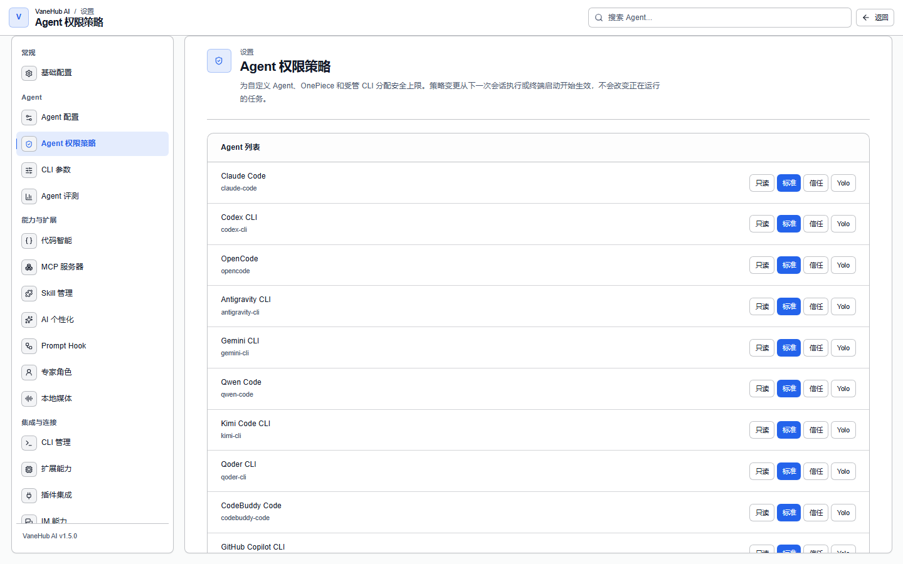

# 权限审批

## 功能概述

Agent 要执行命令、写文件、调用工具或写记忆时，操作会先经过一道闸门。判定为「需询问」时会中断执行并弹出审批，你的决定可以按作用域记住，避免反复打断。

这解决的是「各家 CLI 的确认机制各不相同、难以统一收口」的问题。

## 四档授权模板

在**设置 → Agent 权限策略**中选择档位。**模板只影响两类动作**：

| 动作 | 只读 | 标准 | 信任 | Yolo |
| --- | --- | --- | --- | --- |
| 读取文件 | 放行 | 放行 | 放行 | 放行 |
| 写入记忆 | 放行 | 放行 | 放行 | 放行 |
| **执行命令** | 拒绝 | **询问** | 放行 | 放行 |
| **写入文件** | 拒绝 | **询问** | 放行 | 放行 |

**每个 Agent 单独一行**，可以给不同 Agent 配不同档位。默认是**标准**。

两点容易误解的地方：

- **「只读」并不禁止一切**——读文件与写记忆照常放行。
- **「信任」与「Yolo」在 VaneHub AI 内部给出相同的答案**（都放行运行命令与写文件），差别在赋予时的确认强度。各 CLI *启动时拿到的参数*是模板的另一层投影，可能因 CLI 而异——见下文[每个 CLI 启动时拿到什么](#每个-cli-启动时拿到什么)。

## 提权需要确认

切换到**信任**或 **Yolo** 时会要求一次显式确认；切回**标准**或**只读**不需要。

判断依据是「该档位是否自动放行执行命令与写文件」，而不是名字本身。

## 处理一次审批

**审批不是弹窗**。命中「询问」时，对话里对应的**工具调用块**会停在 `awaiting_approval` 状态，同时右下角弹出通知告诉你「需要你的批准」。

**工具调用块默认是折叠的**——点开它才能看到审批区，提示为「该工具调用需要你的确认才能执行」，并标出风险等级（如**高风险**）。

展开后会列出三项信息：

| 字段 | 含义 |
| --- | --- |
| **Agent** | 哪个 Agent 发起的 |
| **操作** | 例如 `shell.exec` |
| **对象** | 作用目标 |

然后在**记住我的选择**中选一个范围，再点**批准**或**拒绝**：

| 范围 | 效果 |
| --- | --- |
| **仅此一次** | 不记忆，下次还问 |
| **本次会话** | 当前会话内不再询问 |
| **本项目** | 当前项目内不再询问 |
| **始终** | 一律不再询问 |

选择「仅此一次」以外的范围后，同类动作在该范围内直接放行。

## 判定优先级

系统按固定顺序解析，先命中先返回：

1. **MCP 工具下限**——无条件，最优先，不受模板影响
2. **你此前记住的授权**
3. **该 Agent 所属模板的规则**
4. 都没命中 → **询问**

**没有任何规则命中的动作会落到「询问」，而不是放行**。任何内部错误也一律退到「询问」——系统不会因为出错而放行。

## 每个 CLI 启动时拿到什么

你选的模板始终由 VaneHub AI 自己的策略层执行（审批卡片、记住的授权、审计记录）。除此之外，VaneHub AI 还会在启动时把模板传给各 CLI，让 CLI 自己的审批模式与之匹配。其中有多少是*由 VaneHub AI 保证的*取决于传输方式；逐 Agent 的完整表见 [Agent 能力矩阵](../../../reference/agents/capability-matrix.md)。

| 传输方式 | Agent | 只读 | 标准 | 信任 / Yolo | VaneHub AI 保证什么 |
| --- | --- | --- | --- | --- | --- |
| headless CLI | Claude Code、Codex CLI、Gemini CLI、OpenCode、Antigravity CLI | CLI 的 plan / 只读模式 | CLI 自己的先询问模式（OpenCode 通过环境变量） | CLI 的 accept-edits / 自动模式 | 旗标由 VaneHub AI 从审计过的目录中选取；绝不使用绕过旗标 |
| ACP Agent（受管会话） | Qwen Code、Kimi Code CLI、Qoder CLI、CodeBuddy Code、GitHub Copilot CLI、Cursor Agent CLI | CLI 有 plan 旗标时传入 | 不传启动旗标：每次工具调用都逐次向 VaneHub AI 询问 | 不传启动旗标：VaneHub AI 按你的模板逐次作答 | 逐次由 VaneHub AI 决策；无人值守时的"询问"会被拒绝，绝不放行 |
| ACP Agent 在 Agent Terminal 中 | 同上六个 | plan 旗标；**Qoder CLI 没有只读模式，只读的终端启动会被拒绝** | Qwen、CodeBuddy：default 旗标；Kimi、Copilot、Cursor：CLI 自己的先询问默认（**provider-delegated**，VaneHub AI 既不传入也不验证） | CLI 的自动放行旗标 | 只有启动旗标；CLI 内部的审批是它自己的 |
| 历史兼容终端 | iFlow CLI | `--plan` | `--default` | `--autoEdit` / `--yolo` | 只有启动旗标；没有受管会话 |

**Claude Code 还多一层**：启动旗标只设置它的权限模式，真正的闸门是一个**权限钩子**，每次被拦截的工具调用都会询问 VaneHub AI，比启动时固定的旗标更精确。钩子不可用时会退到基于风险分级的离线回退，而不是让整条链路失败。

**Antigravity CLI 有原生旗标**（`--mode` 与 `--sandbox`）；VaneHub AI 像对待其他 headless CLI 一样把模板投影进去，且绝不使用它的 `--dangerously-skip-permissions` 绕过旗标。

界面上的"provider-delegated"或"unverified"表示 VaneHub AI 没有传入限制、也没有校验——CLI 在按自己的默认行为工作。"VaneHub AI 不管理"永远不等于"该 CLI 自身没有这个能力"。

## 注意事项与限制

- **仅桌面端可用**。
- **模板是动作级的，不区分具体路径或命令内容**。无法配置「只允许写 `src/` 下的文件」这类规则。
- **各 CLI 自身的确认机制仍然存在**。VaneHub AI 的闸门是附加层，不替换 CLI 自己的沙箱或确认逻辑。
- **审批状态以桌面端为准**。界面重新加载时会主动拉取待审批列表对账，不依赖事件不丢失。
- 每一次已解析的判定都会写审计记录，包括直接放行与直接拒绝的。
