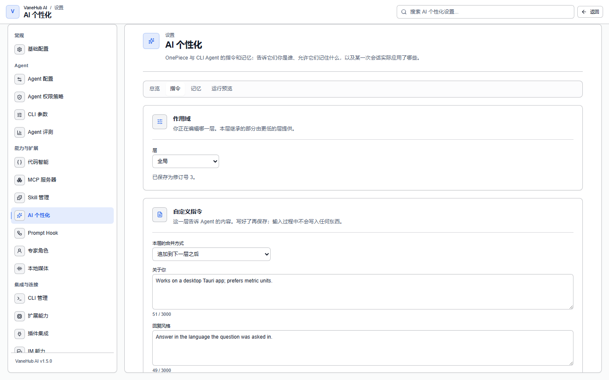

# 个性化

## 功能概述

把「关于你的信息」「风格偏好」「项目里积累的知识」统一存起来，在 Agent 执行前自动注入，省去每开一个会话都要重新交代一遍。

三层各管一段：**Custom Instructions**（手工填写）、**Agent 记忆（Agent Memory）**（自动积累）、**专家角色（Expert Role）**（可切换的人设）。

## Custom Instructions

在**设置 → 个性化**的**自定义指令**区填写两段内容：

| 字段 | 写什么 | 上限 |
| --- | --- | --- |
| **关于你** | 身份、背景、长期偏好 | 3000 字符 |
| **回复风格** | 输出格式、语言、详略程度 | 3000 字符 |

例如在**回复风格**里写「始终用中文回答，结论先行」，在**关于你**里写「我是一名后端工程师，主要使用 Rust 和 TypeScript」。

用**启用自定义指令**开关可整体停用注入——**关闭后新会话不再应用，已保存的内容不会丢失**。

## Agent 记忆

Agent 在会话中发现的项目约定会被自动记下，下次开新会话直接可用。同一页面的记忆区可以查看与管理。

两个开关：

| 开关 | 作用 |
| --- | --- |
| **启用记忆** | 总开关。**关闭后也会停止使用已保存的记忆**，不只是停止新增 |
| **从工具辅助的会话中记忆** | 控制 OnePiece 在用过 shell、文件或 MCP 工具的会话中是否自动提取。你主动要求记住的内容不受影响 |

> **第二个开关不影响 CLI Agent**。界面上的说明写得很明确：Claude Code、Codex CLI、Gemini CLI、OpenCode、Antigravity CLI 的记忆提取不受这个开关影响。

已保存的记忆在同页的**已保存的记忆**区查看与管理。

### 两个必须知道的前提

**1. 记忆是主机级共享的**。一个 Agent 记下的内容，其他 Agent 也能用。当前**无法按 Agent 隔离**——如果需要隔离，只能整体关闭记忆。

**2. CLI Agent 的记忆提取由 OnePiece 代做。**

这是界面上完全看不出来、但会实际影响你的约束：

> **未配置 OnePiece 的 provider 时，Claude Code、Codex CLI、Gemini CLI、OpenCode、Antigravity CLI 都不会产生记忆提取。**

原因是这些 CLI 没有可复用的模型凭据，提取动作需要借助 OnePiece 的 provider 完成。

**所以：即使你主力用 Claude Code，只要想要记忆功能，就得先配好 OnePiece**。配置方法见[原生 API Agent](native-agent.md)。

### 记忆什么时候写入

记忆提取依附于**上下文压缩**——对话变长触发压缩时顺带提取。这是尽力而为的，不保证每条有价值的信息都被记下。

记忆写入本身也受权限系统管辖（属于「写入记忆」动作，各档位下均放行）。

## 专家角色

Custom Instructions 和记忆是**跨会话、面向你个人**的；专家角色则描述**一份工作**，由席位在单个会话里绑到某个 Agent 上。两者可以叠加使用。

在**设置 → 专家角色**中管理，内置架构师、实现者、代码审查三个角色。字段含义、评审策略与使用方式见[专家角色](expert-roles.md)。

## 注意事项与限制

- **仅桌面端可用**，记忆与设置都依赖本地存储。
- **注入不会改写各 CLI 自己的配置文件**——不会去动 `CLAUDE.md`、`AGENTS.md` 之类。
- **OnePiece 自带的核心指令不可编辑**，自定义需求请通过 Custom Instructions 或专家角色表达。
- 设置读取失败时会退回「不注入自定义指令、记忆保持开启」的行为，一次瞬时错误不会静默关掉原本可用的功能。
