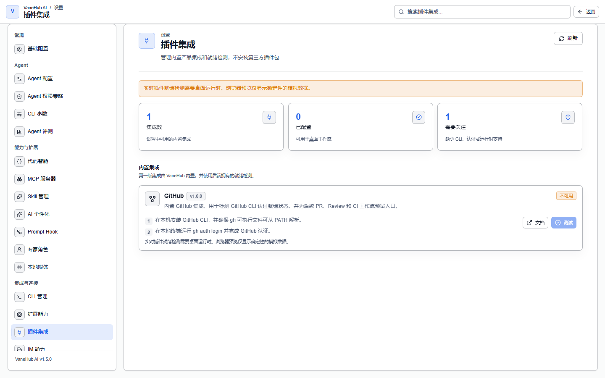

# 插件集成

## 功能概述

**设置 → 插件集成**管理 VaneHub AI 内置的产品集成，并对每个集成做**就绪检测**——确认它依赖的外部工具装好了、认证过了、现在能用。



先把最容易误解的一点说清楚：

> **这里不安装第三方插件包**。页面本身的描述就是「管理内置产品集成和就绪检测，不安装第三方插件包」。集成由 VaneHub AI 随版本内置，你不能在这里添加、上传或下载新的集成。

它和相邻几个页面的分工：

| 页面 | 管什么 |
| --- | --- |
| **插件集成** | 内置产品集成的就绪检测（当前只有 GitHub） |
| [扩展能力](extensions.md#扩展能力) | 本地多模态 AI 能力（OCR、语音识别、语音合成）的安装与启停 |
| [MCP 服务器](mcp.md) | 把外部工具通过 MCP 协议接给 Agent |
| [Skill 管理](skill-management.md) | Skill 的安装与绑定 |

想给 Agent 加一个新工具，多半该去 MCP 服务器或 Skill 管理，而不是这里。

## 当前内置的集成

**第一版只有 GitHub 一个**，页面顶部的「集成数」计数因此显示 1。

| 项 | 值 |
| --- | --- |
| 名称 | GitHub |
| 提供方 | GitHub |
| 版本 | 1.0.0 |
| 依赖 | 本机的 GitHub CLI（`gh`） |
| 官方文档 | <https://cli.github.com/manual/gh_auth_login> |

它做的事是**检测 GitHub CLI 的认证就绪状态**，并为后续的 PR、Review、CI 工作流预留入口。

> **它现在不替你发 PR**。第一版交付的是就绪检测本身；把 GitHub 操作接进会话是后续能力。检测通过只代表「这台机器上的 `gh` 已经认证好了」。

## 启用 GitHub 集成

两步，都在 VaneHub AI 之外完成：

### 1. 安装 GitHub CLI

装好 `gh`，并确保它能从 `PATH` 解析到。装法见 [GitHub CLI 官网](https://cli.github.com/)。

装完在终端验证一次：

```bash
gh --version
```

### 2. 在终端里完成认证

```bash
gh auth login
```

按提示走完浏览器或 token 认证。验证：

```bash
gh auth status
```

### 3. 回到 VaneHub AI 点「测试」

打开**设置 → 插件集成**，在 GitHub 卡片上点**测试**。VaneHub AI 会实际执行一次 `gh auth status`（**10 秒超时**），并按结果更新状态与「上次检查」时间。

卡片上另有**文档**按钮，直接打开上面那个官方认证文档。

## 读懂五种状态

页面顶部有三个计数：**集成数**、**已配置**（可用于桌面工作流）、**需要关注**（缺少 CLI、认证或运行时支持）。每个集成的状态有五种：

| 状态 | 界面说明 | 触发条件 | 该怎么办 |
| --- | --- | --- | --- |
| **已配置** | GitHub CLI 认证可用 | `gh auth status` 成功退出 | 无需处理 |
| **未配置** | GitHub CLI 已安装但尚未认证 | 命令跑起来了，但输出里出现未登录/未认证的字样 | 跑 `gh auth login` |
| **缺少 CLI** | 未在 PATH 中找到 GitHub CLI | 可执行文件根本没解析到 | 装 `gh`，或修好 `PATH` |
| **不可用** | 当前运行时不支持实时 GitHub 就绪检测 | 不在桌面客户端里 | 见下面的 Web 模式说明 |
| **错误** | GitHub 就绪检测失败 | 命令启动失败、超时，或失败但不是「没登录」这种原因 | 先在终端里手动跑一遍 `gh auth status` 看真实报错 |

尚未测试过时，卡片显示「尚未检查 GitHub 就绪状态。」

**「未配置」和「缺少 CLI」区分得很清楚**，这是有意的：前者装了但没登录，后者压根没装，处理方式完全不同。而**「错误」是兜底**——它意味着命令确实跑了但结果既不算成功、也不像是缺认证，这种情况直接去终端里看原始输出最快。

## 仅桌面端可用

**实时就绪检测需要桌面运行时**，它在你的机器上执行 `gh` 并读取结果。

## 注意事项与限制

- **不安装第三方插件包**，集成由 VaneHub AI 内置，不能自行添加。
- **仅桌面端可执行真实检测**。
- **认证在终端里做**，VaneHub AI 只检测结果，不代管 GitHub 凭据，也不走 `gh` 的登录流程。
- **检测有 10 秒超时**，网络异常时更可能落到「错误」而不是长时间挂起。
- **检测是一次性快照**，不持续监听。在终端里重新登录后，需要回来再点一次**测试**才会刷新。

## 相关

- 工具接入的其他途径 → [MCP 服务器](mcp.md)、[Skill 管理](skill-management.md)
- 本地多模态能力 → [工具与扩展](extensions.md#扩展能力)
- 代码评审工作流 → [代码评审](code-review.md)
