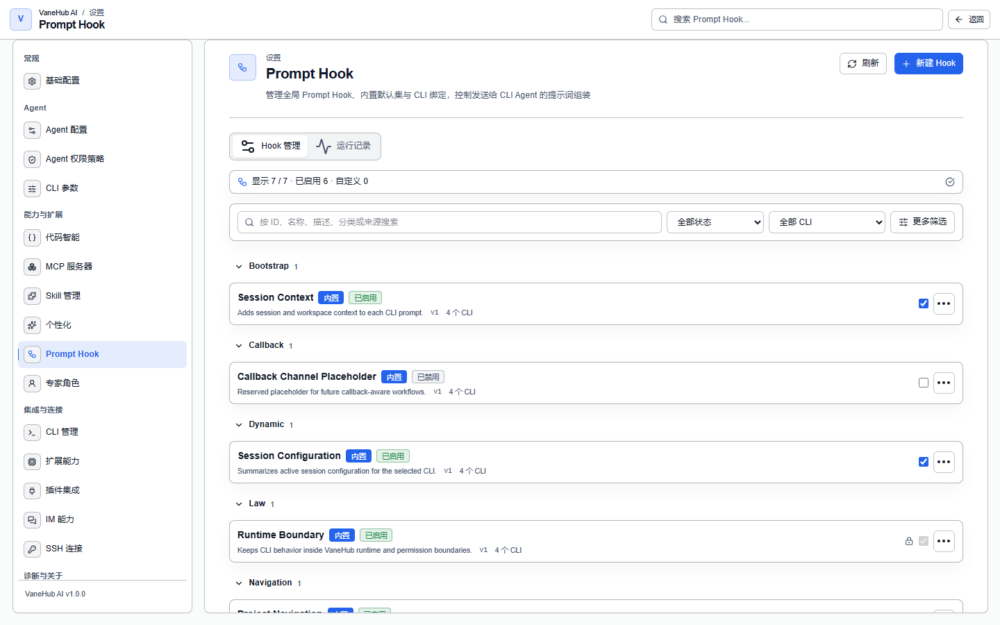

# Prompt Hook：在提示词组装链路里插入内容

## 什么是 Prompt Hook

**它是提示词组装流水线上的可插拔片段。**

每次给 CLI Agent 发请求前，系统会把若干片段按分类和顺序拼成最终提示词。Hook 就是这条流水线上的一格：你往里放一段模板，它就会在指定时机被渲染进去。

它解决的是「我希望每个会话都带上某段约定，但不想每次手打，也不想去改各 CLI 自己的配置文件」。

**它不是提示词编辑器**。你改的不是某一次对话的输入，而是**每一次组装都会经过的那一格**。

## 它能做什么

- 在**会话初始化时**注入一次，或在**每轮请求**都注入
- 按分类和执行顺序控制片段在最终提示词里的位置
- **绑定到指定的 CLI Agent**，不同 Agent 拿到不同片段
- **预览组装结果**，在生效前看到最终形态
- 用**草稿 / 发布 / 回滚**管理修改，线上用的永远是你选定的那一版
- 查看每个版本的**实际运行效果评估**

不能做的：**不能作用于 OnePiece**（原生 Agent 有自己的核心指令机制），**不能编辑内置 Hook 的内容**，**不能在模板里执行任何东西**（见下面的变量约束）。

## 内置与用户 Hook

| 来源 | 可做什么 | 不可做什么 |
| --- | --- | --- |
| **内置** | 预览、启用/停用（若允许）、绑定 | **不能编辑模板正文或不可变清单字段** |
| **用户** | 创建、编辑、删除、启用/停用、绑定、预览 | —— |

用户 Hook 与内置 Hook **在列表、预览、绑定和流水线行为上完全一致**，不是二等公民。

内置 Hook 带一个「是否可停用」标志：**标记为不可停用的内置 Hook 无法关闭**，尝试关闭会被拒绝并给出可读错误，Hook 保持启用。这类 Hook 承载的是不能被绕过的约束。

治理标记有三种：**不可变**、**人工审核**、**自动演进**。

页面默认打开 **Hook 管理**：按分类折叠展示紧凑 Hook 行，搜索、启用状态和 CLI 是常用筛选，来源、阶段与分类收在「更多筛选」中。点击 Hook 行进入同一个详情窗口，在「基本设置」「内容与发布」「版本历史」之间切换；不再需要判断「编辑」和「高级功能」该点哪一个。组装预览与安全的 Hook 追踪统一位于 **运行记录**。

## 一个 Hook 由什么组成

| 字段 | 说明 |
| --- | --- |
| **分类** | `Bootstrap`、`Callback`、`Dynamic`、`Law`、`Navigation`、`Routing`、`Static` 七类之一 |
| **阶段** | **会话初始化**（一次）或**每轮请求** |
| **执行顺序** | 同阶段内的先后 |
| 名称、描述 | 界面标识 |
| 模板正文 | 被渲染进提示词的内容 |
| CLI 绑定 | 作用于哪些 Agent |
| 版本 | 用户 Hook 的已发布版本号 |

**分类是封闭集合**，加载或保存时校验，七类之外的值不被接受。

## 模板变量：允许清单，且一律当作惰性文本

模板可以引用变量，但**只能用后端拥有的允许清单里的那些**：

| 变量 | 含义 |
| --- | --- |
| `{{agent_id}}` | 稳定的 Agent 标识 |
| `{{agent_name}}` | Agent 显示名 |
| `{{current_time}}` | RFC 3339 UTC 时间 |
| `{{sample_input}}` | 示例输入 |
| `{{session_id}}` | 会话标识 |

兼容别名 `{{agentId}}` 与 `{{sampleInput}}` 仍然解析为相同的值。

**`current_time` 在一次完整组装里只取一个时钟快照**，所以同一次组装里多处引用它得到的是同一个时间，不会前后差几毫秒。

两条关键约束：

**1. 发布时校验未知变量。** 草稿里含允许清单和兼容别名之外的变量时，**发布被拒绝并列出未知变量名**，当前已发布的版本保持不变。所以错误在发布时暴露，而不是在某次线上组装时才炸。

**2. 替换结果是惰性文本，不是可执行表达式。** 模板或替换值里含 shell 语法、命令替换、标记语言或类脚本文本时，渲染器**原样保留为字面提示词文本**——不执行它，也不用它去读环境变量、文件系统、进程或凭据。

## 草稿、发布与回滚

**用户 Hook 的草稿与已发布版本是分开的，线上组装只用你选定的那个已发布版本。**

| 操作 | 效果 |
| --- | --- |
| **保存草稿** | 不改变当前已发布版本；**未发布的新 Hook 不参与线上组装** |
| **发布** | 原子追加下一个单调递增的不可变版本，并选为已发布 |
| **回滚** | 把历史版本的内容作为**新版本**追加，带 `rollback_from_version` 引用 |

三条容易踩的规则：

- **发布是带版本预期的**。用过期的草稿修订号或过期的已发布版本预期去发布会被拒绝，且**草稿、版本历史、已选版本全都不变**。
- **回滚不是「退回去」，而是「把旧内容再发一次」**。历史不会被删除或改写，你能看到完整的发布链路，包括哪一版是从哪一版回滚来的。
- **回滚不会动你未发布的草稿**。有草稿时回滚已发布版本，草稿原样保留，不会被静默丢弃也不会被顺手发布。

版本历史按**最新在前**列出，含版本号、发布时间、内容哈希、发布类型和回滚来源。**完整模板正文只在显式请求版本详情或预览时返回**，列表里不带。

## 预览与效果评估

**预览**让你在生效前看到组装结果。点击 Hook 行后，「内容与发布」集中处理模板草稿、预览和发布，「版本历史」集中展示历史版本、回滚与运行效果；整条提示词的组装预览位于「运行记录」。

效果评估显示**成功率**、**成功 / 失败**计数与**平均耗时**；还没有已评估的线上运行时提示「暂无已评估的线上运行记录」——**它不会用零条数据算出一个好看的百分比**。

Hook 的执行会以摘要形式进入执行链路，见[可观测性](observability.md)。

## 注意事项与限制

- **仅作用于五个外部 CLI Agent**，OnePiece 不受 Prompt Hook 影响。
- **内置 Hook 的内容不可编辑**；需要调整就自建一个。
- **部分内置 Hook 不可停用**，这是有意的硬约束。
- **未发布的草稿不参与线上组装**——改完记得发布。
- **变量必须在允许清单内**，未知变量在发布时被拒。
- **模板内容永不被执行**，含 shell 语法也只是文字。
- 版本历史不可变，回滚是追加新版本而不是删除历史。

## 相关

- 其余工具与扩展配置 → [工具与扩展](tooling.md)
- 提示词里的另一层个人化内容 → [个性化](personalization.md)
- Hook 执行在链路里怎么看 → [可观测性](observability.md)
