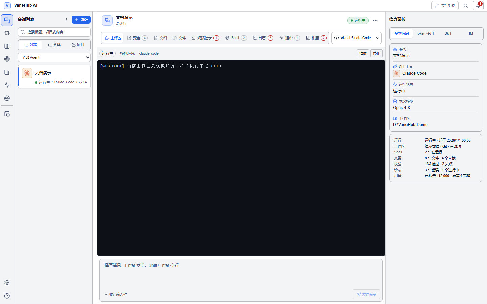

# 快速开始

五分钟从零到第一次 Agent 执行。已经装好 CLI 的话，直接从第 2 步开始。

> **不想安装任何 CLI**？内置的原生 Agent OnePiece 不需要 CLI：跳过第 1 步和官方登录，直接看 [1.5 → 原生 Agent OnePiece](#原生-agent-onepiece) 配好模型服务，再从第 3 步继续。

## 1. 准备一个 CLI

VaneHub AI **驱动已安装的 Coding Agent CLI**，本身不代管各家的订阅登录。至少装一个。装法有两种：

**方式 A：在 VaneHub AI 里装（推荐）**

打开**设置 → CLI 管理**，每个 CLI 旁会按状态给出操作：**安装**、**升级**、**降级**、**已是当前版本**、**不可用**或**手动处理**。点**安装**即可，VaneHub AI 会用 npm 替你装好，装完刷新检测。

> Antigravity CLI 没有 npm 包，界面不提供安装/升级操作，只能走方式 B 的官方安装脚本。

**方式 B：手动装**

```powershell
npm install -g @anthropic-ai/claude-code
```

其余 CLI（Codex CLI、Gemini CLI、OpenCode、Antigravity CLI）按各自官方说明安装。详见[安装并认证 CLI](getting-started.md)。

## 1.5 认证 / 配置模型

有两件事容易混为一谈，先分开看：**登录**是向厂商证明你是谁，**配置模型**是决定这个 CLI 去调哪个端点、哪个模型。VaneHub AI 管得了后者，管不了前者。

| | 官方订阅登录（OAuth） | 配置第三方大模型 |
| --- | --- | --- |
| **外部 CLI** | 只能在终端里做 | **可以在 VaneHub AI 里做** |
| **原生 Agent OnePiece** | 不涉及 | 在 VaneHub AI 里做 |

### 官方登录：在终端里完成

VaneHub AI 不替你走各家的 OAuth 流程，也不保存由此产生的会话凭据。先在普通终端里跑一次并完成认证：

```powershell
claude
```

按提示完成 Anthropic 订阅登录即可。Codex CLI、Gemini CLI、OpenCode 同理，用各自的登录命令；Antigravity CLI 走 Google 登录并存入系统钥匙串。**在终端里跑不通的 CLI，在 VaneHub AI 里也一样跑不通**。

### 第三方大模型：在 VaneHub AI 里配

不想用官方订阅，想让 CLI 去调 DeepSeek、OpenRouter、智谱 GLM 这类兼容端点时，**不必手改配置文件**。打开**设置 → Agent 配置**，选中目标 CLI，从内置的 25 家 provider 目录里挑一个存成配置，填好 API Key 再应用。VaneHub AI 会把相应字段写进该 CLI 自己的全局配置文件，并保留文件里与它无关的内容。

各 CLI 能配到什么程度并不一样：

| Agent | 第三方端点 | 纳管的配置文件 |
| --- | --- | --- |
| **Claude Code** | 支持 | `~/.claude/settings.json` |
| **Codex CLI** | 支持 | `~/.codex/config.toml` |
| **OpenCode** | 支持 | `~/.config/opencode/opencode.json` |
| **Gemini CLI** | 端点可改，但目录里只有 Google 官方预设 | `~/.gemini/.env` |
| **Antigravity CLI** | **VaneHub 暂未纳管** | `~/.gemini/antigravity-cli/settings.json` |

> **VaneHub 当前未纳管 Antigravity 的端点与密钥字段**：它的配置面板里没有这两项，能调的是模型与审批行为；Google 登录凭据由 CLI 自己存在系统钥匙串。这是 VaneHub 当前的纳管范围，不等于 Antigravity CLI 本身不支持 API Key 或自定义端点——上游能力以 Antigravity 官方文档为准，需要时可在 CLI 自身环境中按官方方式配置。

字段清单、凭据存放位置与漂移处理见[工具与扩展 → Agent 配置](agent-configuration.md#agent-配置)。

### 原生 Agent OnePiece

不想装 CLI 也能用。同样在**设置 → Agent 配置**里进入 OnePiece 配置面板：从同一份 25 家 provider 目录里选厂商，或填自定义兼容端点；填入 API Key——**保存前会实际调用一次校验，不通过不保存**；校验通过后拉取可用模型列表，选定即可。这里的 API Key 由 VaneHub AI 保存。详见[原生 API Agent](native-agent.md)。

## 2. 确认 VaneHub AI 检测到它

打开**设置 → CLI 管理**，检查目标 CLI 的状态。

如果显示未检测到，通常是桌面应用可见的 `PATH` 与你终端里的不一致——见[故障排查](troubleshooting.md)。

## 3. 创建第一个会话

1. 点击**新建**。
2. **会话类型**选择**单 Agent**。
3. 在 **Agent** 区选中一个可用的 Agent。
4. **工作区**选择**本地**，在**项目文件夹**中选定目录（可用**浏览**，或从**最近打开项目**里选）。
5. 填写会话标题，点击**创建**。

会话创建后进入 `idle` 状态，可以开始对话了。

## 4. 在工作区里干活



界面分三块：左侧**会话列表**、中间**工作区**、右侧**信息面板**（会话、CLI 工具、运行状态、本次模型、工作区路径）。

顶部有 9 个标签页（工作区、变更、文档、文件、终端记录、Shell、日志、链路、报告），逐个说明见[创建第一个会话 → 会话工作区的九个标签页](first-session.md#会话工作区的九个标签页)。

在**工作区**标签的输入框里写下你的任务，**Enter 发送、Shift+Enter 换行**。

## 5. 接下来做什么

| 想做的事 | 去这里 |
| --- | --- |
| 让多个 Agent 在一个会话里协作 | [多 Agent 群聊与 `@` 交接](multi-agent-workflow.md) |
| 让 Agent 自己迭代到测试通过 | [Loop 工程化](loop-engineering.md) |
| 限制 Agent 能做什么 | [权限审批](permissions.md) |
| 让 Agent 记住你的偏好 | [个性化配置](personalization.md) |
| 理解各种术语 | [核心概念](core-concepts.md) |

## 注意事项

- **官方订阅登录产生的凭据始终留在各 CLI 自己的存储里**，VaneHub AI 不接管、也不会要求你输入订阅账号密码。
- **你在 Agent 配置里填的第三方 API Key 由 VaneHub AI 保管**，存放在操作系统的凭据服务中，不写进 SQLite，界面上只回显「已配置」。
