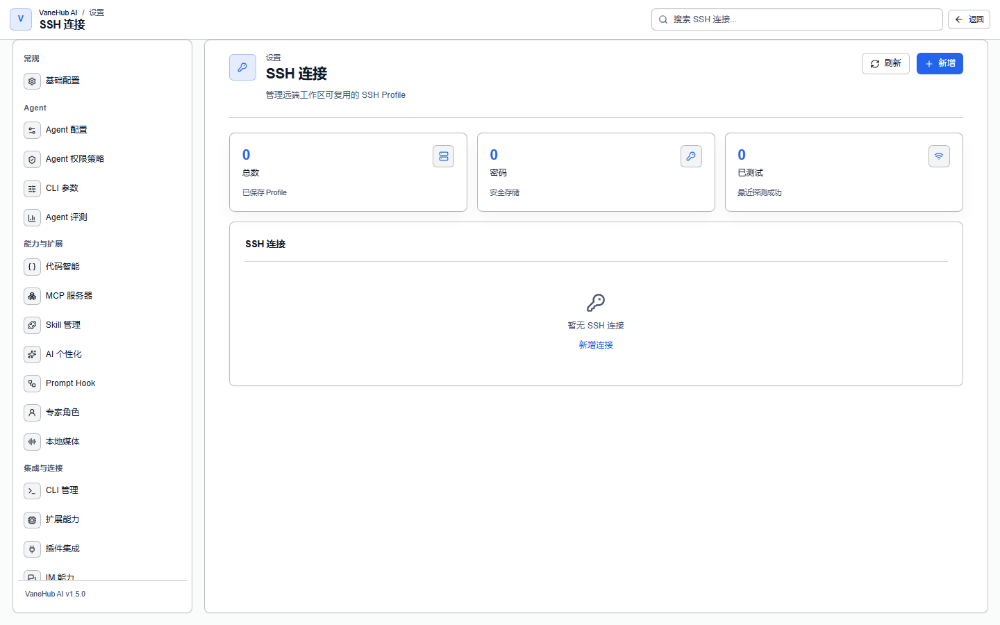

# 远程工作区与 SSH

把一台远程主机上的目录当作工作区使用：配置连接、确认主机密钥、在会话中使用，以及远端与本地的能力差异。

从 IM 触发会话是另一回事，见 [IM 连接器](im-connectors.md)。

## 配置连接

在**设置 → SSH 连接**中添加主机、端口、用户与认证信息。凭据交由操作系统的密钥链保存。

## 首次连接会要求确认主机密钥

第一次连接某台主机时，会出现主机密钥确认。确认后系统记住该指纹。

> **之后如果提示密钥「已变更」，请停下来查明原因**。这可能是服务器重装，也可能是中间人攻击。系统不会自动接受变更。

## 在会话中使用

创建会话时**工作区**选择**远端**，填写主机、端口、用户与远端路径，即可让 Agent 在远端目录里作业。

会话工作区的**终端**与 **Shell** 标签会连到远端主机。

## 限制

- **远端不支持 Git worktree**——只能指向远端已存在的路径，因此 [Loop 工程化](loop-engineering.md) 也不适用于远程工作区。
- **并发远程终端上限为 8**，超出需等待释放；空闲 5 分钟自动回收。
- 关闭连接时会给未读输出一个短暂窗口再断开，避免丢掉最后几行——通常正是报错所在。

## 注意事项与限制

- **仅桌面端可用**，依赖原生网络栈与系统凭据存储。
