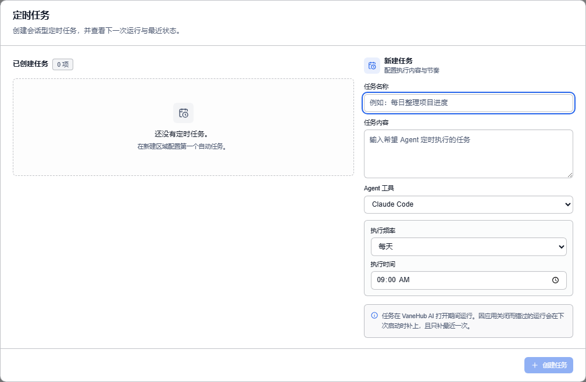

# 定时任务与通知

按计划自动运行的任务，正在后台跑的长时操作，以及它们完成时怎么通知你。

Token 用量统计见[使用统计](usage-statistics.md)。

## 定时任务

### 功能概述

把重复性工作固化成周期任务，到点自动创建会话执行。

### 创建

在左侧活动栏选择**运行**，切到**定时任务**标签：可筛选的任务列表，选中一条看详情与运行历史。点**新建任务**（或已有任务上的**编辑任务**）打开任务编辑器：

| 字段 | 说明 |
| --- | --- |
| **任务名称** | 例如「每日整理项目进度」 |
| **任务内容** | 希望 Agent 定时执行的任务 |
| **Agent 工具** | 用哪个 Agent 执行 |
| **执行频率** | 见下表 |

**五种执行频率**：

| 频率 | 参数 |
| --- | --- |
| 按分钟 | 间隔分钟数 |
| 按小时 | 间隔小时数 |
| 每天 | 时刻 |
| 每周 | 星期几 + 时刻 |
| 每月 | 几号 + 时刻 |

间隔必须为正数。任务卡片会显示**下次运行时间**，可随时**启用 / 停用**，不必删除。

### 时间怎么算

「每天早上 9 点」按**你本地时区**计算下一次运行时间；到期判定则用绝对时间，避免夏令时切换时重复或漏跑。

### 应用关闭时会怎样

**调度器在应用内运行，不是系统级服务**——应用没开就不会到点触发。但**并非直接丢弃**，界面上的说明是：

> 任务在 VaneHub AI 打开期间运行。因应用关闭而错过的运行会在**下次启动时补上，且只补最近一次**。

也就是说：关了三天、每天一次的任务，重启后只会补跑**一次**，不会连补三次。

由定时任务触发的执行在[链路](observability.md)中会标记来源与任务标识，方便反查。

## 长时操作跟踪

安装 SDK、连接 MCP、安装扩展这类耗时操作有明确的排队与状态：**排队中 → 运行中 → 成功 / 失败 / 已取消**，并逐行记录输出。

这些输出**同时**在界面上展示并写入统一日志目录。

## 通知

通知分四类：成功、错误、警告、信息。

作用域分两种：

- **全局**——应用级提示
- **会话级**——只与某个会话相关

会话级通知不会淹没在全局提示流里，切到那个会话时才是最相关的上下文。

## 注意事项与限制

- **仅桌面端可用。**
- **定时任务需要应用保持运行**；错过的运行只补最近一次，不会连补。
