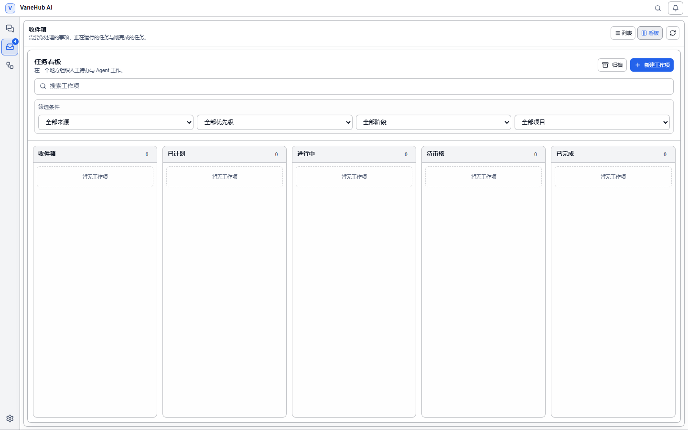

# 任务看板：人工待办与 Agent 工作放在一起

## 功能概述

会话、定时任务各有各的列表，人工待办则根本没地方记。任务看板把它们收进同一块看板：**你手写的待办和 Agent 产生的工作并排排列**，用同一套阶段、优先级和筛选来组织。

关键设计是**看板阶段与来源状态彻底分开**：卡片在哪一列由你决定，来源跑到哪一步由运行时投影。两者互不干扰——一个定时任务跑完了，卡片不会自己跳到「已完成」。

## 打开看板

在左侧活动栏选择**计划**，默认落地页即是任务看板。顶部有两个视图：**当前看板**与**归档**，默认进入当前看板，归档项不显示。

## 五个阶段

| 阶段 | 用途 |
| --- | --- |
| **收件箱** | 新建工作项的默认落点 |
| **已计划** | 排上日程 |
| **进行中** | 正在做 |
| **待审核** | 做完待确认 |
| **已完成** | 结束 |

**阶段完全由你控制**。没有任何自动流转会替你移动卡片。

移动卡片有两种方式：拖拽，或者用卡片上的**移至上一阶段**／**移至下一阶段**按钮。**这两条路径产生完全相同的持久化结果**——显式按钮不是拖拽的降级替代，而是等价操作。键盘和读屏用户可以完整操作看板，窄屏下也不会有控件被裁掉。

## 新建人工待办

点**新建工作项**，填写：

| 字段 | 说明 |
| --- | --- |
| **标题** | 必填 |
| **描述** | 可选 |
| **项目路径** | 可选，用于按项目筛选 |
| **优先级** | 无优先级 / 低 / 中 / 高 / 紧急 |
| **截止日期** | 可选，卡片上显示为「截止 …」 |

不带来源新建的工作项进入**收件箱**，并跨重启保留。

## 来源与自动对账

除了手写待办，看板会把已有的和之后新建的执行体**自动对账**成工作项：

| 来源 | 说明 |
| --- | --- |
| **会话** | 顶层会话 |
| **定时任务** | 计划任务 |

对账是**幂等**的：升级后首次打开看板，每个符合条件、尚未关联的来源会得到**恰好一个**工作项；之后新建的来源在下一次对账时补上。不会因为多次对账产生重复卡片。

三条容易被忽略的规则：

- **子会话不单独建卡**。为定时任务运行创建的会话会作为所属工作项下的活动出现，而**不会**变成一张独立的顶层卡片。
- **归档过的工作项不会被对账重建**。你归档掉的东西，下次对账仍然认它，不会冒出一张替代卡。
- **一张卡可以挂多个来源**。同时关联了会话和定时任务的卡片会同时命中两个来源筛选，但**它始终只是一张卡**，不会被筛成两份。

来源被删除或解析不了时，**工作项本身仍然在**，只是标注**来源不可用**——卡片不会跟着消失。

## 搜索与筛选

顶部提供搜索框和四个筛选器，**可以叠加使用**：

| 筛选 | 选项 |
| --- | --- |
| **按来源** | 全部来源 / 会话 / 定时任务 |
| **按阶段** | 全部阶段 / 五个阶段之一 |
| **按优先级** | 全部优先级 / 无优先级 / 低 / 中 / 高 / 紧急 |
| **按项目** | 全部项目 / 各项目路径 |

筛选后无结果时显示「没有符合筛选条件的事项」，与看板本身为空时的「暂无工作项」是两种不同提示。

## 归档与删除

| 操作 | 效果 | 对来源的影响 |
| --- | --- | --- |
| **归档工作项** | 离开当前看板 | 无 |
| **恢复** | 回到原来的阶段和排序位置 | 无 |
| **永久删除** | 删除工作项及其来源关联 | 无 |

**这三个操作都不动来源**。永久删除只删掉工作项本身和它的关联记录，被关联的会话和定时任务**原封不动**。看板是组织层，不是这些东西的所有者。

恢复时会回到**归档前的阶段和排序位置**，不会掉回收件箱。

## 注意事项与限制

- **阶段不会自动流转**。来源状态变化只更新卡片上的来源投影，不移动卡片。
- **对账不是实时同步**，新来源在下一次看板对账时出现。
- **归档不等于删除**，归档项仍在「归档」视图里，且会保护自己不被对账重建。
- 删除工作项不可撤销，但**不会影响任何被关联的执行体**。

## 相关

- 把工作项归到更大的目标下 → [目标管理](goal-management.md)
- 卡片来源之一的自动循环 → [Loop Engineering 工程](loop-engineering.md)
- 定时任务本身怎么配 → [定时与用量](automation.md)
