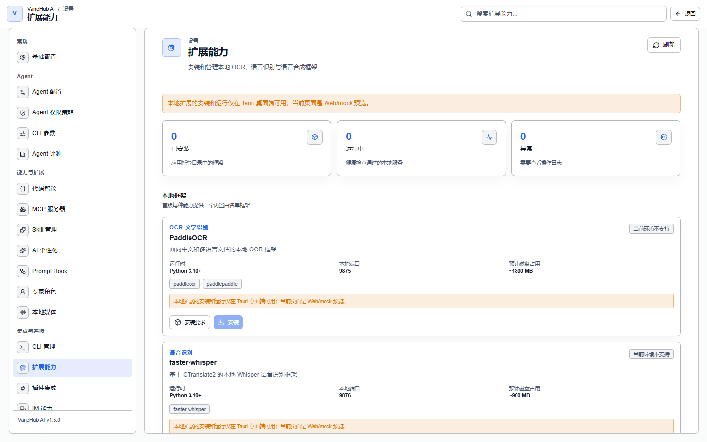
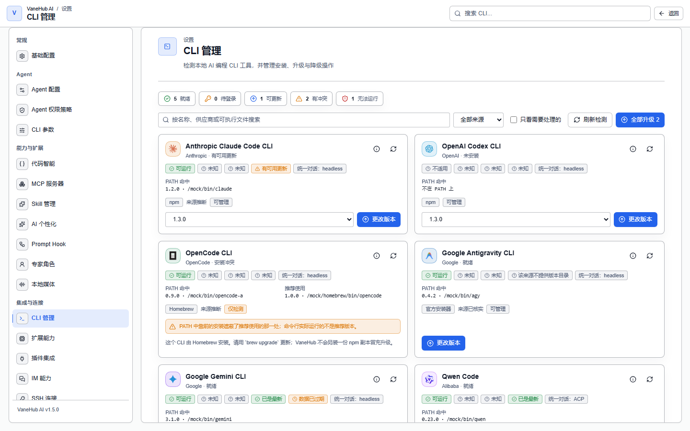
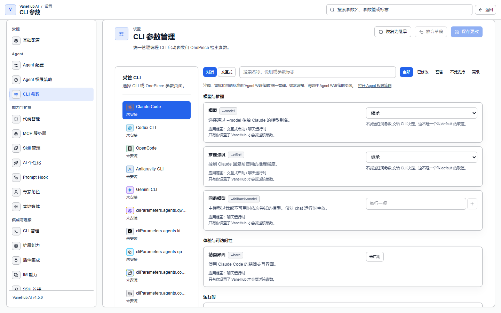
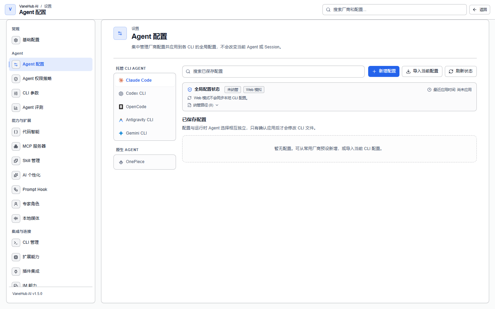

# 工具与扩展

## 功能概述

MCP 服务器、Prompt Hook、本地扩展、插件集成、SDK 依赖、CLI 管理与参数、Agent 配置都在设置中心集中配置，再按 Agent 下发，不必在每个 CLI 里各配一遍。

Skill 的管理见[管理 Skill](skill-management.md)。

## MCP 服务器

MCP 服务器把外部工具接给 Agent，在**设置 → MCP 服务器**中集中注册。三种传输方式、命名规则、连接测试与状态缓存、Claude Desktop 导入导出、中继范围、逐次工具审批与资源上限，见[MCP 服务器](mcp.md)。

## Prompt Hook

Prompt Hook 在提示词组装链路里插入内容，在**设置 → Prompt Hook** 中配置。七种分类、两个执行阶段、模板变量允许清单、草稿/发布/回滚与效果评估，见[Prompt Hook](prompt-hooks.md)。

> **Prompt Hook 只能绑定到四个外部 CLI Agent，不作用于 OnePiece**——原生 Agent 有自己的核心指令机制。

## 扩展能力

**设置 → 扩展能力**里装的是**本地多模态 AI 能力**，不是通用插件。首版每种能力提供一个内置白名单框架：

| 能力 | 框架 | 运行时 | 本地端口 | 预计磁盘占用 |
| --- | --- | --- | --- | --- |
| **OCR 文字识别** | PaddleOCR | Python 3.10+ | 9875 | **~1800 MB** |
| **语音识别** | faster-whisper | Python 3.10+ | 9876 | **~900 MB** |
| **语音合成** | sherpa-onnx | Python 3.10+ | — | — |

**装之前先看两件事**：需要本机有 Python 3.10+，以及**磁盘占用不小**——PaddleOCR 接近 1.8 GB。每个框架卡片上都有「安装要求」可展开查看。

页面顶部有**已安装 / 运行中 / 异常**三个计数，异常时到操作日志里查原因。

## 插件集成

**设置 → 插件集成**管理内置产品集成与就绪检测——注意它**不安装第三方插件包**。首版内置 GitHub 一个集成，检测本机 `gh` 的认证状态。五种状态的含义、启用步骤与 Web 模式限制，见[插件集成](plugin-integration.md)。

## SDK 依赖

**受管 SDK 只有两个**：Claude Code SDK 与 Codex SDK，各自对应一个 npm 包，并带三个备选版本——某个版本出问题时可以回退。

Gemini CLI、OpenCode 与 Antigravity CLI 没有对应的受管 SDK。

## CLI 管理与参数

### CLI 管理

**设置 → CLI 管理**集中查看四个 CLI 的安装状态，顶部有**已安装 / 未安装**计数与**诊断安装冲突**、**刷新检测**、**全部升级**三个操作。

**同一个 CLI 可能同时来自多个来源**（npm、winget、Homebrew、Volta、Bun 等），这正是冲突的根源。冲突分四种：

| 冲突 | 含义 |
| --- | --- |
| 检测到多份安装 | 装了不止一份 |
| 版本不一致 | 多份版本不同 |
| **实际执行的与预期不符** | **`PATH` 顺序决定真正跑起来的是哪一份** |
| 无冲突 | 正常 |

第三种最隐蔽——你以为在用 A，实际跑的是 B。

**能否代为升级取决于安装来源**：手工安装或来源不可识别时，只能提示你自行处理。

### CLI 参数

**设置 → CLI 参数**配置各 CLI 的启动开关。

参数带两项标注：

- **风险标注**——危险开关会被显著标记
- **启动场景**——区分「交互式终端」与「对话」，同一个 CLI 在两种场景下需要的参数不同

> **权限模板会压过你在这里保存的选择**。例如当前是「只读」模板时，即使参数里勾了某个宽松选项，也以模板为准。安全策略优先于便利性配置。

#### 各 CLI 常见参数参考

五个外部 CLI 各自有命令行参数，供在 VaneHub AI 中排查启动参数、脚本化调用时参考。各 CLI 更新较快，`--help` 常滞后于实际支持，完整清单以对应官方 CLI Reference 为准。

| 功能 | Claude Code | OpenCode | Codex CLI | Gemini CLI | Antigravity CLI |
| --- | --- | --- | --- | --- | --- |
| 非交互/单次执行 | `-p, --print` | `run "<prompt>"` | `exec "<prompt>"` | `-p, --prompt` | 无独立子命令，交互式为主 |
| 指定模型 | `--model` | `-m, --model provider/model` | `-m, --model`/`--profile` | `-m, --model` | 无需指定，自动路由 |
| 继续最近会话 | `-c, --continue` | `-c, --continue` | `resume --last` | `-r "latest"` | `-c` |
| 按 ID 恢复会话 | `-r, --resume` | `-s, --session <id>` | `resume <id>` | `-r "<id>"` | `--conversation <id>` |
| 跳过权限确认（高风险） | `--dangerously-skip-permissions` | `--dangerously-skip-permissions` | `--dangerously-bypass-approvals-and-sandbox` | `--yolo`/`--approval-mode yolo` | `--dangerously-skip-permissions` |
| 沙箱/权限模式 | `--permission-mode` | agent 的 `permissions` 配置 | `--sandbox`, `--ask-for-approval` | `--sandbox`, `--approval-mode` | 内置审批模式 |
| 输出格式（脚本用） | `--output-format json/stream-json` | `--format json` | `--json`, `--output-schema` | `-o, --output-format json` | —— |
| 附加工作目录 | `--add-dir` | `--dir` | `--cd` | `--include-directories` | —— |
| 版本/帮助 | `-v/--version`, `--help` | `-v/--version`, `-h/--help` | `codex --version` | `-v/--version`, `-h/--help` | `agy --version` |

各 CLI 高频参数：

- **Claude Code** —— `--model <alias|id>`（别名如 sonnet/opus/haiku）、`--permission-mode <default|acceptEdits|plan|bypassPermissions>`、`--allowedTools`/`--disallowedTools`、`--add-dir`、`--max-turns`/`--max-budget-usd`（仅 `-p`）、`--mcp-config`/`--strict-mcp-config`、`--worktree`/`--session-id`、`--verbose`。
- **OpenCode** —— `-m, --model <provider/model>`（固定格式如 `anthropic/claude-sonnet-4-6`）、`--fork`（从某会话分叉）、`--format json`、`--attach <server-url>`（连到已运行 `opencode serve`）、`--agent <name>`、`serve --port --hostname`（无 UI HTTP 后端）。
- **Codex CLI** —— `--profile <name>`（config.toml 预定义档）、`--sandbox <read-only|workspace-write|danger-full-access>`、`--ask-for-approval`、`--json`/`--output-schema`、`--ephemeral`（不落盘 rollout）、`--skip-git-repo-check`、`--image`（多模态）。
- **Gemini CLI** —— `-m, --model`（别名 auto/pro/flash/flash-lite）、`--sandbox`/`-s`、`--approval-mode <default|auto_edit|yolo|plan>`、`--checkpointing`（改文件前快照，可 `/restore` 回滚）、`--include-directories`、`--extensions`、`--worktree`。
- **Antigravity CLI** —— `agy -c`（继续上次）、`agy --conversation <id>`（恢复指定对话）、`agy --dangerously-skip-permissions`（"Turbo 模式"）。无需 `--model`（默认自动路由）。MCP/权限配置在 `~/.gemini/antigravity-cli/settings.json`。

> **权限参数是重点**：五款 CLI 都有"跳过确认/自动批准"类参数。VaneHub 的权限模板（只读/标准/信任/Yolo）决定是否附加这些高风险参数，**安全策略优先于便利性配置**——详见[权限审批](permissions.md)。

上表只列高频项。**逐个参数族的完全参考**——调用形态、会话管理、模型选择、权限与沙箱、输出格式、配置注入，以及宿主按统一任务模型向各 CLI 投影参数的映射矩阵——见[内置 CLI 参数完全参考](../../../agent-infrastructure/builtin-cli-reference.md)。

#### OnePiece 的等价配置

OnePiece 不走外部 CLI，没有上述命令行参数。它的等价配置是 **provider 配置**（在**设置 → Agent 配置**里管理）：选 provider 目录条目、填 API Key（保存前校验）、发现并选定模型、按需配自定义兼容端点。见下一节与[原生 API Agent](native-agent.md)。

## Agent 配置

**设置 → Agent 配置**做的是一件和上面几节都不同的事：**决定各个 Agent 去调哪个厂商、哪个模型**。它是本页唯一会主动改写各 CLI 自己配置文件的功能。

页面顶部按 Agent 分标签：**Claude Code / Codex CLI / OpenCode / Antigravity CLI / Gemini CLI / OnePiece**。同一页面下方还有[LSP 代码智能](lsp-code-intelligence.md)的语言服务器开关。

### 它解决什么

外部 CLI 的官方订阅登录（OAuth）VaneHub AI 管不了，那必须在终端里完成。但**换成第三方兼容端点**——DeepSeek、OpenRouter、智谱 GLM 之类——原本要你手改 `~/.claude/settings.json` 或 `~/.codex/config.toml`，现在在这个页面配好、应用即可。

内置目录含 **25 家 provider**（Anthropic、OpenAI 官方，以及 OpenRouter、DeepSeek、智谱 GLM、Kimi、Moonshot、SiliconFlow、阿里百炼、火山方舟、Groq、xAI、Mistral、Together、Fireworks、NVIDIA NIM、Cerebras、MiniMax、StepFun、百川、PPIO、七牛、ModelScope、小米 MiMo、Z.AI 等），也可以填自定义兼容端点。

### 各 CLI 能配到什么程度

| Agent | 第三方端点 | 纳管的配置文件 | 可配字段 |
| --- | --- | --- | --- |
| **Claude Code** | 支持 | `~/.claude/settings.json` | 端点、认证方式、主模型与 haiku/sonnet/opus 三档映射 |
| **Codex CLI** | 支持 | `~/.codex/config.toml`（`auth.json` 另需确认） | provider id、端点、模型、协议（Responses/Chat）、推理强度 |
| **OpenCode** | 支持 | `~/.config/opencode/opencode.json` | provider 定义、端点、npm 适配包、模型列表与默认模型 |
| **Gemini CLI** | 端点可改，但目录里只有 Google 官方预设 | `~/.gemini/.env` | 端点、模型、认证方式 |
| **Antigravity CLI** | **不支持** | `~/.gemini/antigravity-cli/settings.json` | 模型、工具审批模式、输出详细度、终端沙箱 |

> **Antigravity CLI 不接受自定义端点**。它只走 Google 登录、凭据存系统钥匙串，配置面板里没有端点和密钥字段——能调的是模型与审批行为。

Claude Code 与 Codex 是**互斥模式**：可以存很多份配置，但同一时刻只有一份处于「已应用」。OpenCode 是**累加模式**：provider 定义叠加保留，切换的只是全局默认的 `provider/model`。

### 应用时到底改了什么

- **只替换 VaneHub 拥有的那几个字段**。`~/.claude/settings.json` 里的 hooks、permissions、plugins 原样保留；`config.toml` 里的 projects、MCP server、注释和无关 provider 也不动。
- **先在内存里校验并构建完整结果，再原子替换**。Codex 涉及多文件时，任一步失败会把已改的文件全部还原。
- **切换配置前先回填**。离开某份配置时，VaneHub 会把当前生效文件里的纳管字段读回来写进那份配置，避免你在文件里的手工微调被静默丢弃。
- **应用后运行中的 CLI 进程不会自动重启**。VaneHub 不声称热重载，需要你自己重开会话或终端。

### 凭据与漂移

**API Key 存在操作系统的凭据服务里**，按 Agent/配置分账保存，不落 SQLite，界面上只回显「已配置」。只有在你显式点「应用」时，才会把明文写进那个 CLI 要求明文的配置文件。

应用成功后 VaneHub 会给纳管片段留指纹。**文件被外部改动时只报告漂移，不自动覆盖**；应用过程中若检测到文件正被并发改写，会中止写入而不是硬写。OpenCode 的外部编辑要等下次启动或手动导入才会并入。

启动时会做一次同步：Claude Code 与 Codex 在完全没有配置时，从可解析的现有文件导入一份 `default`（不回写文件）；一旦已有配置，后续启动就跳过。

### OnePiece

原生 Agent OnePiece 在同一个页面配置，但它的 Key 由 VaneHub AI 直接保管，且**保存前会实际调用一次校验，不通过不保存**，校验通过后再拉取可用模型列表。见[原生 API Agent](native-agent.md)。

## 注意事项与限制

- **全部仅桌面端可用**。
- **漂移只报告不自动修复**——检测到配置被外部改动时需要你确认处理方式。
- **MCP、Prompt Hook、扩展能力、CLI 参数都不改写各 CLI 自己的配置文件**，绑定通过启动参数与中继实现。**只有 Agent 配置例外**，它按上面的语义显式改写纳管字段。
