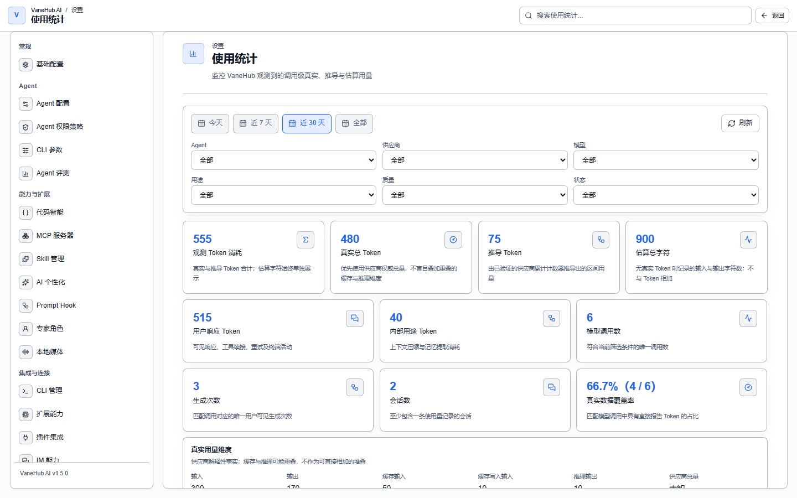

# 使用统计

Token 用量按时间、Agent、会话与模型四个维度的统计，以及这些数字的口径。

定时任务与通知见[定时任务与通知](scheduled-tasks.md)。

## 查看

**设置 → 使用统计**，可按时间范围与 Agent 筛选，查看汇总、趋势与按 Agent 拆分。

## 四个维度

页面顶部四张卡片：

| 卡片 | 含义 |
| --- | --- |
| **真实总 Token** | CLI 报告的输入、输出及缓存 Token 合计 |
| **输入 Token** | 不含缓存读取的输入 Token |
| **输出 Token** | 包含 CLI 报告的推理输出 |
| **缓存 Token** | 缓存读取与缓存创建 Token 合计 |

底层数据把**缓存读取**与**缓存写入**分开记录（会话信息面板中可分别看到），界面上的「缓存 Token」是两者之和。

另有三项辅助指标：**估算总字符**（无真实 Token 记录时的替代口径，不与 Token 相加）、**真实数据覆盖率**（具有 CLI 真实 Token 的助手响应占比）、**会话数**。

**「真实数据覆盖率」值得留意**——它直接告诉你有多少响应拿到了真实计量，比例低时趋势图的参考价值也随之下降。

## 数据口径

> **用量数据来自各 CLI 自己的报告，VaneHub AI 不独立计量 token。**

页面上有专门的口径说明区，使用数据做成本核算前请先读它。

四个 CLI 报告用量的格式各不相同，系统为每个 CLI 单独处理。采集是幂等的——终端打开期间会定期采集、退出时再采一次，重复采集不会重复计数。

## 注意事项与限制

- **仅桌面端可用。**
- **OnePiece 的用量不走终端采集路径**，与四个 CLI 的统计口径不同。
