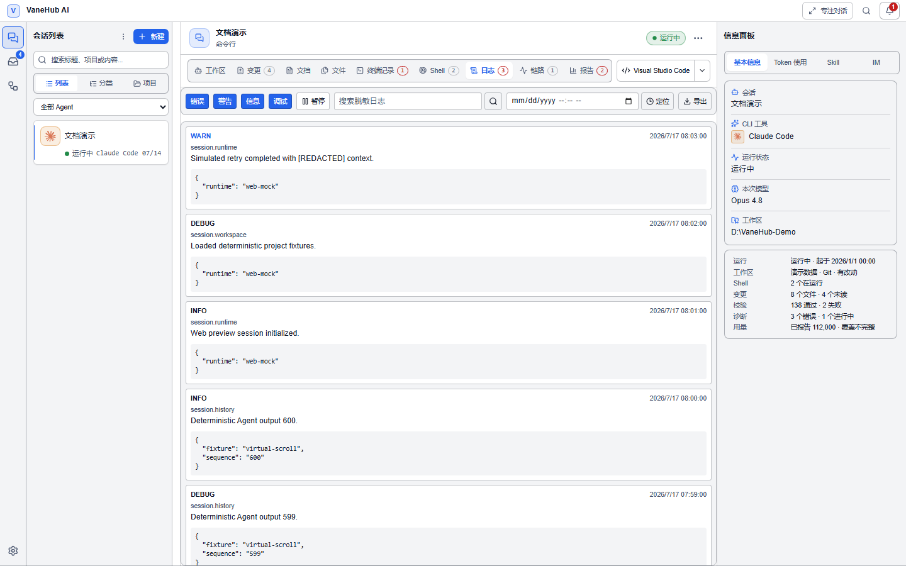
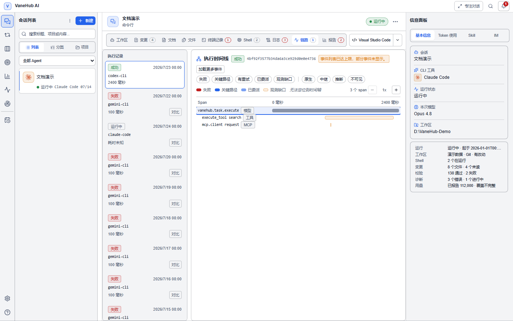
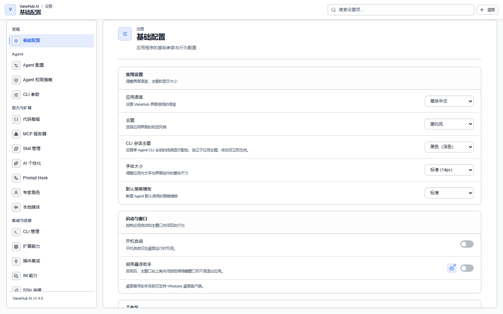
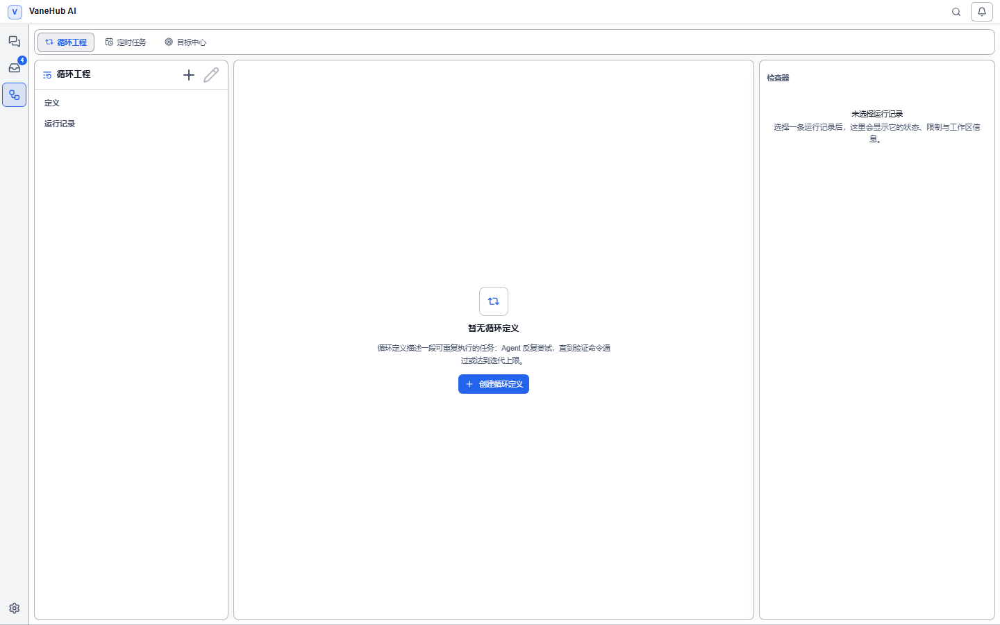

# 用户界面

VaneHub AI 的界面按功能讲解界面里能做什么。每个功能讲它是什么、怎么用。

## 会话管理

### 新建会话

选**新建**打开创建会话对话框，选会话类型（单 Agent / 多 Agent）、Agent、工作区（本地/远端）、项目文件夹、会话名称。Git 项目会标 **Git** 标记并可创建 worktree。多 Agent 时分配席位，见 [多 Agent 群聊](multi-agent-workflow.md)。

### 会话列表

左侧会话列表支持三种展示模式：**列表 / 分类 / 按项目**。可按名称或内容搜索、按 Agent 筛选、批量选择、拖拽排序、收藏筛选。**右键会话**可重命名、删除、归档、导出、置顶、分配分类。

### 专注模式

顶栏的**专注模式**折叠左侧会话列表和右侧信息面板，让工作区占满；再点一次恢复。顶栏还有**全局搜索**，跨会话搜消息和内容。

### 活动栏导航

会话列表左侧的活动栏切换五个主要业务域：**会话 / 项目与工作区 / 运行 / 计划 / 质量**，右下角另有**设置 / 帮助**两个工具项。部分业务域内部还有二级标签：**运行**下是等待关注、活动运行、最近完成（即[任务控制台](observability.md#任务控制台)）、[循环工程](loop-engineering.md)、[定时任务](automation.md)；**计划**下是[任务看板](todo-board.md)、[目标中心](goal-management.md)；**质量**即 [Agent 评测](evaluation.md)，没有二级标签。**项目与工作区**只读汇总已知项目与远程工作区，见[下文](#项目与工作区)。

## Agent 类型

VaneHub AI 内置 6 个 Agent，分两类：

### 外部 CLI Agent

前五个是**外部 CLI**——VaneHub AI 启动它们的进程并管理进程之外的部分（启动参数、权限拦截、输出采集），真正的代码生成由 CLI 自己完成。**官方订阅登录由各 CLI 自己管**，VaneHub AI 不保存由此产生的凭据；但要把它们换成第三方兼容端点，可以在[设置 → Agent 配置](tooling.md#agent-配置)里配。

| Agent | 提供方 | 命令 | 说明 |
| --- | --- | --- | --- |
| Claude Code | Anthropic | `claude` | Anthropic 官方 CLI，需 Anthropic 订阅或 API 凭据 |
| Codex CLI | OpenAI | `codex` | OpenAI 官方 CLI，需 OpenAI 账号 |
| Gemini CLI | Google | `gemini` | Google 官方 CLI，用 Google 账号认证 |
| Antigravity CLI | Google | `agy` | Google 官方 CLI，走 Google 登录并存入系统钥匙串 |
| OpenCode | OpenCode | `opencode` | 开源 CLI，支持多家 provider |

安装、认证与可用性检测见[安装并认证 CLI](getting-started.md)。

### VaneHub 原生 Agent：OnePiece

**OnePiece** 不同：它直接通过 HTTP 调用模型 provider，完全在应用内运行，**不依赖任何外部 CLI**。它的 API Key 由 VaneHub AI 保存，支持 25 家 provider（Anthropic、OpenAI 等官方目录 + 常用兼容端点），也可配置自定义兼容端点。

- 不想装 CLI 就能用——见[原生 API Agent](native-agent.md)
- 即使你主力用外部 CLI，记忆提取也由 OnePiece 代做，所以通常也要配好 OnePiece

## 对话

### 发送消息

工作区底部的输入框写任务：**Enter 发送、Shift+Enter 换行**。输入框上方有一排选择器和开关：

| 控件 | 作用 |
| --- | --- |
| Provider / Model / Agent 下拉 | 按你配置的可用项切换 |
| 交互模式 / 推理深度 / 配置 | 调整本次对话参数 |
| 流式开关 | 是否流式输出回复 |
| 思维链开关 | 是否显示 thinking 内容 |
| 增强按钮 | 对提示词做增强处理 |
| 文件引用 / 附件 | 把文件作为上下文附加给 Agent |

### 查看回复

Agent 回复支持富内容渲染：代码块（语法高亮）、Mermaid 图（内嵌渲染流程图/时序图）、思维块（折叠展示 thinking 过程）、工具调用（显示工具名与参数/结果）、图片/音频/卡片/清单/diff（按类型渲染）。长对话里有**回到底部**按钮快速跳到最新消息；首次进入显示**欢迎屏**。

### 轮次状态

对话区顶部有**轮次状态栏**：当前发言权归属、等待人类时长、轮次完成、链深度提示。多 Agent 群聊交接时显示 `交接 1/15`。细节见 [多 Agent 群聊](multi-agent-workflow.md)。

## 工作区标签页与运行时面板

会话打开后，工作区顶部是四个主标签：

| 标签 | 功能 |
| --- | --- |
| **工作区** | 与 Agent 的对话，默认停在这里 |
| **变更** | 看 Agent 改了哪些文件，含 Diff 视图（unified/split 切换、逐文件查看、Git 状态） |
| **文件** | 浏览工作区文件；标签内有 **资源管理器 / 文档** 视图切换，前者是文件树与预览，后者是工作区内的文档 |
| **报告** | Token 用量（输入/输出/字符数）、token 分布条、按消息状态计数 |

另外四个能力——**终端记录**、**Shell**、**日志**、**链路**——在独立的**运行时面板**里：主标签条下方可调整高度的面板，有自己的标签条、最大化/还原按钮与关闭按钮。点主标签条右侧的纯图标**运行时面板**按钮（仅在面板关闭时显示）可打开它，或者当证据链接、标签角标或 slash 命令指向这四个能力之一时会自动打开。关闭它不影响工作区/变更/文件/报告，切换这四个主标签也不会关闭它。

**「终端记录」和「Shell」不是一回事**：前者是 Agent 干了什么的记录，后者是给你自己敲命令的终端。Agent 还有一个**专属终端**，与你的 Shell 分开。标签页上的数字角标表示记录条数；数据量大时采用有界加载，可能只显示部分结果，界面会提示。

**日志**标签可搜索、可按时间定位：

**链路**标签展示本次执行的 Span 树，用来回答「这一步到底调了什么、花了多久」：

## 查看 Agent 改了什么

**变更**标签看 Agent 的文件改动：

- 文件列表带 Git 状态（新增/修改/删除）
- 选中一个文件看 Diff
- **unified / split** 两种 Diff 视图切换
- 逐文件查看

## 查看会话信息与运行状态

工作区右侧的**信息面板**是会话的"仪表盘"，一眼看清当前会话在什么状态、用的是谁、花了多少。逐项说明：

| 字段 | 含义 |
| --- | --- |
| **会话信息** | 会话标题、类型（单 Agent / 多 Agent）、分类、置顶与归档状态 |
| **CLI 工具** | 当前会话绑定的 Agent 用哪个 CLI（或 OnePiece），以及它的可用性状态 |
| **运行状态** | 五种：**空闲 / 启动中 / 运行中 / 失败 / 已停止**；`启动中`、`运行中` 时界面禁用重复提交，避免连点两下开出两个任务 |
| **本次模型** | 本轮对话实际使用的模型；没配模型时显示「未配置模型」 |
| **Token 用量** | 输入 / 输出 / 缓存读取 / 缓存写入 / 总计；缓存两项分开记录，面板里的合计是两者之和 |
| **工作区路径** | 当前工作区目录（本地路径、worktree 或远端 SSH 路径） |

信息面板里还有两个**就地页签**，不必跳到设置中心：

- **技能**：在会话内就地查看/管理本会话绑定的 Skill
- **代码索引**：在会话内就地查看工作区代码索引状态

> Token 用量是各 CLI 自己上报的，VaneHub AI 不独立计量，做成本核算前请先读[用量统计页](automation.md)的口径说明。

## 切换面板显隐

工作区右上角的**溢出菜单**（⋯）切换各面板显隐：会话列表、信息面板、各工作区标签页的显示开关。

## 会话恢复

崩溃或异常后重新打开会话，顶部显示**恢复提示横幅**：会话被 reconcile、隔离、或需要你人工确认的状态说明。

## 设置中心

左侧活动栏的**设置**进入设置中心，左侧是设置项导航，右侧是配置页。设置页按**通用 / Agent / 能力 / 集成 / 诊断**分组，共 20 个：

| 设置页 | 内容 |
| --- | --- |
| **基础配置** | 见[下一节](#基础配置) |
| **Agent 配置** | 按 Agent 配置 provider、端点与模型（含 OnePiece），见 [工具与扩展](tooling.md#agent-配置) |
| **Agent 权限策略** | 权限策略与审批模板，见 [权限审批](permissions.md) |
| **CLI 参数** | 按 CLI Agent 配置启动参数，见 [工具与扩展](tooling.md#cli-参数) |
| **代码智能** | 会话内代码智能的语言服务器开关与工作区信任范围，见 [LSP 代码智能](lsp-code-intelligence.md) |
| **MCP 服务器** | MCP server 配置与按 Agent 绑定，见 [MCP 服务器](mcp.md) |
| **Skill 管理** | Skill 安装与绑定，见 [Skill 管理](skill-management.md) |
| **AI 个性化** | Custom Instructions 与跨会话记忆，见 [个性化](personalization.md) |
| **Prompt Hook** | 钩子管理，见 [Prompt Hook](prompt-hooks.md) |
| **专家角色** | 角色与评审策略，见 [专家角色](expert-roles.md) |
| **本地媒体** | 配置通过扩展能力安装的 OCR/语音识别/语音合成引擎：启停各引擎、Python 环境，以及输入框里的文字识别/按住说话/朗读操作 |
| **CLI 管理** | 各 CLI 的安装检测、冲突诊断与升级，见 [安装并认证 CLI](getting-started.md) |
| **扩展能力** | 本地多模态能力的安装与启停，见 [工具与扩展](tooling.md#扩展能力) |
| **插件集成** | 内置产品集成与就绪检测，见 [插件集成](plugin-integration.md) |
| **IM 能力** | IM 连接器配置，见 [远程与 IM](remote-and-im.md#im-连接器) |
| **SSH 连接** | 保存的 SSH 连接，见 [远程与 IM](remote-and-im.md#ssh-远程工作区) |
| **执行可观测性** | 执行追踪与日志采集策略，见 [可观测性](observability.md) |
| **使用统计** | Token 用量统计，见 [定时与用量](automation.md) |
| **使用文档** | 内置的本用户指南，离线可看，附源代码仓库链接——也是活动栏**帮助**按钮打开的同一个页面 |
| **关于** | 版本、更新检查、changelog、仓库链接，见 [版本更新](app-updates.md) |

> 设置中心的页面注册表目前没有「SDK 依赖」条目——两个受管 SDK（Claude Code SDK、Codex SDK）暂时无法从设置导航进入配置。

### 基础配置

**设置 → 基础配置**是设置中心的默认落地页，管的是应用本身的行为，与具体 Agent 无关。

| 分组 | 项 | 说明 |
| --- | --- | --- |
| **外观** | 界面语言 | 客户端默认跟随宿主系统 locale |
| | 主题、字号 | 影响全局渲染 |
| **安全** | 默认权限模板 | 新建会话的默认模板，语义见[权限审批](permissions.md) |
| **启动** | 开机自启 | 与[系统托盘](#系统托盘)联动 |
| | 浮动助手开关 | 开启后才有[浮动助手](#浮动助手)窗口 |
| **网络** | 节点信息、网络代理 | 代理支持带认证 |
| **存储** | 数据目录、日志目录 | 改完需重启，按新目录重建；日志路径细节见[故障排查](troubleshooting.md#日志在哪) |
| | 文件夹打开器 | 决定「在文件管理器中打开」调用什么 |

> **改数据目录要当心**。多个 worktree 共用同一个数据库时，跨分支的迁移版本号可能撞车，见[故障排查](troubleshooting.md#启动报-no-such-table)。

## 浮动助手

设置里开启浮动助手后，桌面上有独立浮窗：在浮窗里启动会话/助手（不必打开主窗口）、状态徽章显示运行状态、主操作菜单快速发起任务。

## 循环中心

左侧活动栏选择**运行**，切到**循环工程**标签，管理 Loop 工程：运行列表与检视、运行控件（暂停/继续/取消/接受/拒绝）、验证命令编辑器、时间线。Loop 的概念与创建见 [Loop Engineering 工程](loop-engineering.md)。

## 项目与工作区

左侧活动栏的**项目与工作区**只读汇总你已知的本地项目与远程 SSH 工作区，以及它们各自的近期会话：**最近 / 全部 / 不可用**三个视图，每行显示可用性、安全路径、Git 仓库标记（本地行）、信任状态（仅远程行，目前只会是"已信任"或"信任未知"）。选中一行看详情：身份、信任、Git、近期会话，以及关联的[任务看板](todo-board.md)/[目标中心](goal-management.md)条目，还有**继续会话**/**新建会话**（远程工作区另有**重新连接**）。

当前不提供：收藏视图、"需要关注"视图、按工作区统计的活动运行数，以及在这个页面创建或删除 worktree——worktree 仍只能在[创建第一个会话](first-session.md)时勾选生成；SSH 连接怎么配置见[远程与 IM](remote-and-im.md#ssh-远程工作区)。

## OnePiece Plan 模式

OnePiece 会话在输入栏提供 **Plan** 与 **Agent** 两种模式。Plan 模式用于只读探索和规划：可以检查项目上下文，但不能执行 shell、写文件、调用有副作用的 MCP 工具或委派工作。

计划准备好后，OnePiece 可以请求 `exit_plan_mode`。批准后，会话从后续轮次起进入 Agent 模式；拒绝则继续停留在 Plan 模式。左侧活动栏不再提供独立的 Plan 执行入口，规划过程也不会创建任务图或 worktree。

需要带验证与验收控制的持久化自主迭代时，请使用 **Loop**。目标层面的追踪见[目标管理](goal-management.md)。

## 通知

顶栏的铃铛图标进入**通知中心**：未读数角标、全部已读、清除通知。通知的作用域（全局/会话）和四类通知见 [定时与用量](automation.md)。

## 系统托盘

桌面端在系统托盘有图标：显示/隐藏主窗口、开机自启开关在**设置 → 基础配置**里、托盘通知与系统通知联动。

## 相关

- 术语不熟 → [核心概念](core-concepts.md)
- 第一次用 → [创建第一个会话](first-session.md)
- 完整快捷键列表 → [快捷键](keyboard-shortcuts.md)
- 哪些能用键盘操作、哪些还没纳入扫描 → [无障碍说明](accessibility.md)
