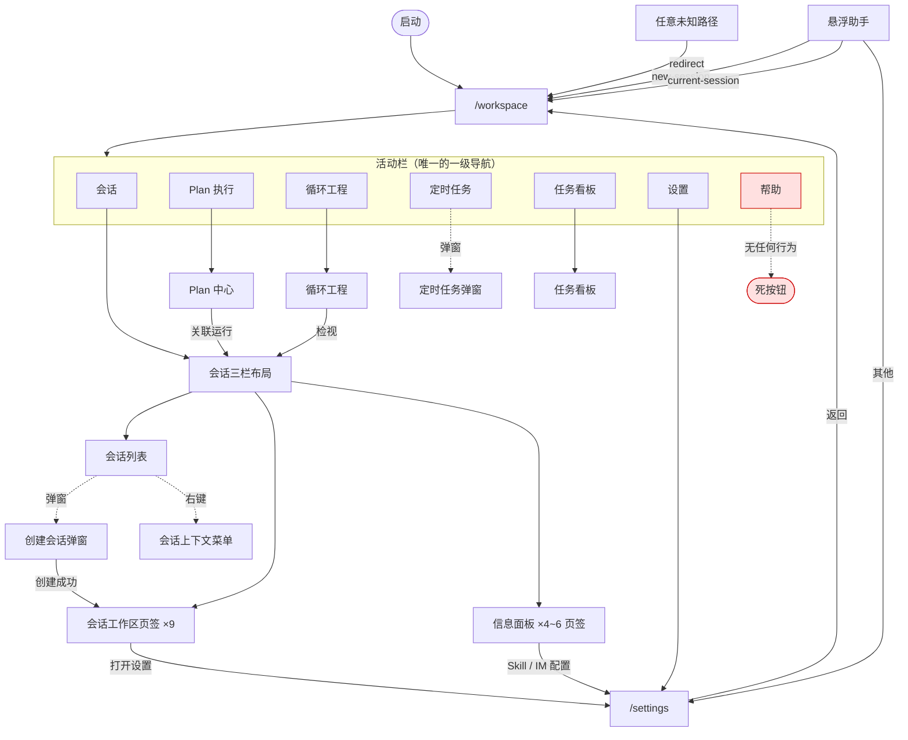

# VaneHub AI 用户体验审计报告（Phase 1）

> **历史快照**：本文描述 2026-08-14 审计时点的界面与上下文。独立 Plan 执行入口和 `task_orchestration` 已在后续重构中退役，当前行为以 OpenSpec 主规范和用户指南为准。

- 审计日期：2026-08-14
- 审计范围：`src/` 下全部已实现的前端页面与视图
- 审计分支：`worktree-ui-ux-optimization`，基线提交 `3164bdc8`
- 审计方式：源码走查 + Web/mock 运行时实际截图（`minimal` 与 `futuristic` 两种风格，1440×900 与 860×900 两种宽度）
- 截图产物：`.ux-audit/shots/`（一次性审计产物，未纳入版本控制）

> 本阶段只读，未改动任何代码。

---

## 0. 两处与任务前提不符的事实

在进入正文前先纠正两个前提，它们会影响 Phase 2 的边界判断。

### 0.1 实际是 15 个 bounded context，不是 7 个

`openspec/project.md` 的 "Bounded contexts" 表格列了 7 个，但 `src-tauri/src/contexts/` 与 `src-tauri/src/commands/` 下实际各有 15 个目录：

```
agent_runtime            code_intelligence        communications
desktop                  execution_observability  operations
permissions              retrieval                sessions
skill_evolution_evidence ssh_connections          task_orchestration
tooling                  work_board               workspaces
```

多出的 8 个（`code_intelligence`、`execution_observability`、`permissions`、`retrieval`、`skill_evolution_evidence`、`ssh_connections`、`task_orchestration`、`work_board`）在 project.md 中没有归属说明。这是文档漂移，不是代码问题，但它意味着"遵循七个 bounded context 边界"这一约束无法按字面执行。本报告按实际的 15 个 context 做映射。

**建议**：作为独立的文档修复项处理，不混进 UI 优化。

### 0.2 构建工具是 npm，不是 pnpm

任务描述里的 `pnpm typecheck` 在本仓库不适用。AGENTS.md 明确要求只用 npm，且仓库有 `package-lock.json`。Phase 3 的验证将执行 AGENTS.md「校验命令」一节的完整清单。另需注意本项目没有独立的 `typecheck` script，类型检查包含在 `npm run build`（`tsc && vite build && ...`）里。

---

## 1. 功能地图

### 1.1 路由层：只有两个真实路由

`src/App.tsx` 只注册了两条路由，其余全部是组件内状态：

| 路由 | 组件 | 说明 |
| --- | --- | --- |
| `/workspace` | `MainLayout` | 主工作区。支持 `?createSession=1` 直接打开新建会话弹窗 |
| `/settings` | `SettingsShell` | 设置。支持 `?section=<pageId>`、`?agentConfig=onepiece` |
| `*` | — | 重定向到 `/workspace` |

**这意味着**：除设置外，所有导航都不进浏览器历史，浏览器/键盘的"后退"在工作区内部完全无效。用户在循环工程里点进某个会话后，唯一的回退路径是界面上的返回按钮。

### 1.2 视图层级与 bounded context 映射

| 层级 | 视图 | 入口 | 归属 context |
| --- | --- | --- | --- |
| 路由 | 工作区 | `/workspace` | — |
| 工作区目的地 | 会话 | 活动栏「会话」 | `sessions` |
| 工作区目的地 | Plan 执行 | 活动栏「Plan 执行」 | `agent_runtime` |
| 工作区目的地 | 循环工程 | 活动栏「循环工程」 | `agent_runtime` |
| 工作区目的地 | 任务看板 | 活动栏「任务看板」 | `work_board` |
| 弹窗 | 定时任务 | 活动栏「定时任务」 | `task_orchestration` |
| 弹窗 | 创建会话 | 会话侧栏「新建」 | `sessions` + `workspaces` + `ssh_connections` |
| 会话页签 | 工作区 / 变更 / 文档 / 文件 / 终端记录 / Shell / 日志 / 链路 / 报告 | 会话工作区标签栏 | `sessions`、`workspaces`、`execution_observability` |
| 信息面板 | 成员 / 基本信息 / Token 使用 / Skill / IM / 代码索引 | 会话右侧面板 | `sessions`、`tooling`、`communications`、`code_intelligence` |
| 路由 | 设置（17 个页面） | 活动栏「设置」 | 见 1.4 |

### 1.3 跳转关系



关键观察：

- **活动栏是唯一的一级导航**，7 个入口中「帮助」是死按钮，「定时任务」是弹窗而非目的地——同一排图标混用了两种交互语义。
- **循环工程 → 会话** 是唯一有返回按钮的跨目的地跳转（`main-layout.tsx:313-329`）。**Plan 执行 → 会话** 通过 `activateAssociatedPlanRun` 跳转，但没有对应的返回入口。
- **没有面包屑**。工作区内部的层级（目的地 → 会话 → 页签 → 座位）完全靠视觉状态表达。

### 1.4 设置页面：17 项平铺

`src/settings/settings-pages.ts` 定义 17 个页面，`settings-sidebar.tsx` 无分组地平铺渲染：

基础配置、Agent 配置、Agent 权限策略、CLI 参数、MCP 服务器、Skill 管理、个性化、Prompt Hook、专家角色、CLI 管理、扩展能力、插件集成、IM 能力、SSH 连接、执行可观测性、使用统计、关于

---

## 2. 分维度评分

评分口径：5 = 无需改进，4 = 有小瑕疵，3 = 明显问题但不阻断，2 = 影响核心任务，1 = 破坏用户信任。

| 维度 | 会话工作区 | 循环工程 | Plan 执行 | 任务看板 | 设置 | 全局 |
| --- | --- | --- | --- | --- | --- | --- |
| 导航效率 | 3 | 2 | 2 | 4 | 3 | 2 |
| 状态反馈 | **1** | 2 | 3 | 4 | 4 | 3 |
| 信息层级 | 3 | 2 | 3 | 4 | 3 | 3 |
| 一致性 | **1** | 3 | 3 | 4 | 3 | 2 |
| 可发现性 | 3 | 2 | 2 | 4 | 2 | 2 |
| 错误恢复 | 4 | 3 | 3 | 3 | 4 | 4 |

### 分维度说明

**导航效率（全局 2）**：启动一个 CLI 会话需要「新建 → 选会话类型 → 选 Agent → 选工作区模式 → 填项目路径 → 等待 inspect → 填会话名 → 创建」8 步，且弹窗内容超出可视高度需要滚动才能看到"会话名称"字段（见 `.ux-audit/shots/minimal-02-create-session-dialog.png`，底部字段被裁切）。没有"用上次配置再开一个"的快捷路径，没有任何全局快捷键。

**状态反馈（会话工作区 1）**：见 P0-1 与 P0-2，同一会话状态在三处显示三个互相矛盾的标签。这是本次审计最严重的问题。

**一致性（会话工作区 1 / 全局 2）**：语料文件里就存在两套并行的生命周期文案；模态实现分裂为「共享原语」与「手写」两派，行为不一致。

**可发现性（设置 2）**：17 项平铺，无分组、无分类标题。用户找"权限"要在 17 项里逐个扫。

**错误恢复（全局 4）**：这是全局做得最好的一项。`LazyFeature`（`src/components/lazy-feature.tsx`）为每个懒加载特性提供了加载态、错误态和重试按钮；`SessionRecoveryNotice`（`src/session-workspace/session-recovery-notice.tsx`）对会话恢复的四种状态有完整的分级提示与二次确认；`App.tsx` 的 `ErrorBoundary` 会把错误上报到统一日志服务。这套基础设施应作为其他改进的参照标准。

---

## 3. 问题清单

### P0 — 破坏用户对状态的信任

#### P0-1 同一会话状态在会话列表与信息面板显示互相矛盾的标签

- 位置：`src/main-layout/session-sidebar.tsx:48-51`、`src/main-layout/session-info-panel.tsx:136`
- 证据：语料文件 `src/i18n/locales/zh-CN.json` 里存在两套并行文案

| `lifecycleState` | 会话列表显示 | 信息面板显示 |
| --- | --- | --- |
| `failed` | 需要输入（`layout.needsInput`） | 失败（`layout.lifecycle.failed`） |
| `starting` | 待验证（`layout.pendingVerification`） | 启动中（`layout.lifecycle.starting`） |
| `running` | 进行中（`layout.running`） | 运行中（`layout.lifecycle.running`） |

`failed` 那一行是实质性误导：一个已经失败的会话，在列表里被标成"需要输入"，用户会去点它然后等一个永远不会来的提示符。

- 改进建议：删除 `layout.*` 那套重复文案，全部统一到 `layout.lifecycle.*`，由一个共享的 `lifecycleLabel(state)` 函数出标签，五个 locale 同步。

#### P0-2 会话头部状态药丸只看流式状态，忽略会话真实生命周期

- 位置：`src/session-workspace/session-conversation-header.tsx:51-62`
- 证据：`.ux-audit/shots/minimal-04-session-workspace.png` — 头部绿色"就绪"药丸，与其正下方工具栏的"进行中"、右侧信息面板的"运行中"同屏矛盾
- 逻辑：`isStreaming ? t("layout.generating") : t("layout.ready")`，完全不读 `session.lifecycleState`。会话 `stopped`、`failed` 时同样显示绿色"就绪"
- 附带问题：未选中任何会话时也显示绿色"就绪"（见 `minimal-03-after-escape.png` 背景）
- 改进建议：药丸改为读取 `lifecycleState`，流式状态作为叠加态而非替代态；无会话时不渲染药丸

#### P0-3 顶栏全局搜索框完全没有实现

- 位置：`src/main-layout/top-bar.tsx:40-44`
- 证据：`<input>` 只有 `autoFocus`、`className`、`placeholder`，没有 `value`、`onChange`、`onKeyDown`、`form`。输入任何内容、按回车都不会有任何反应
- 影响：这不是"功能没做完"，是"看起来做完了但是假的"。用户会认为全局搜索坏了
- 改进建议：**注意这一项受既有规范约束**。`main-layout-ui` 规范明确写着"search SHALL NOT be removed from the top bar without a replacement control"，所以直接删除入口并不合规。同一条规范允许"等效的图标触发控件"，因此正确解法是让顶栏按钮聚焦到会话侧栏里那个**已经能用**的搜索框——既消除假控件，又不新增任何能力，也不需要改规范

### P1 — 关键路径受损或功能不可达

#### P1-1 主工作区的手写模态不响应 Escape、无焦点陷阱

- 位置：`src/main-layout/create-session-dialog-content.tsx:130`、`src/main-layout/scheduled-tasks-dialog.tsx:132`、`src/settings/pages/cli-conflict-dialog.tsx:19`、`src/main-layout/session-sidebar.tsx:266`（批量删除确认）
- 证据：`.ux-audit/shots/minimal-03-after-escape.png` — 按下 Escape 后创建会话弹窗仍然完全打开
- 背景：仓库已有完善的 `ApplicationDialog` 原语（`src/components/ui/application-dialog.tsx`），提供 Escape 关闭、Tab 焦点循环、焦点返回、`aria-labelledby`/`aria-describedby`。**25 个设置页文件都在用它，但主工作区的 4 个模态全部手写**，恰好是用户最常触达的那几个
- 例外：`src/loop-center/loop-definition-dialog.tsx` 虽然手写但自己实现了 Escape 与 autofocus
- 改进建议：把这 4 处迁移到 `ApplicationDialog`

#### P1-2 活动栏「帮助」按钮无任何行为

- 位置：`src/main-layout/workspace-activity-bar.tsx:88-90`
- 证据：`<button aria-label={labels.help} className={...} title={...} type="button">` — 没有 `onClick`。截图左下角可见
- 改进建议：接到「关于」设置页，或移除

#### P1-3 设置侧栏「导出当前配置」按钮无任何行为

- 位置：`src/settings/settings-sidebar.tsx:50-53`
- 证据：`<Button className="mt-2 justify-start" size="sm" title={...} variant="outline">` — 没有 `onClick`。截图左下角可见
- 改进建议：同 P0-3，需要决定是移除还是实现

#### P1-4 桌面应用里弹出浏览器原生 `window.prompt`

- 位置：`src/main-layout/main-layout.tsx:440`（新建会话分类）、`src/main-layout/scheduled-tasks-dialog.tsx:119`
- 影响：原生 prompt 不受主题控制、不可国际化、在 Tauri WebView 里样式与应用完全割裂，且无法校验输入
- 改进建议：替换为 `ApplicationDialog` + 受控输入

#### P1-5 顶栏硬编码假会话号

- 位置：`src/main-layout/top-bar.tsx:69` — `<span ...>#SID-20260714</span>`
- 证据：所有工作区截图右上角均可见，且与实际会话无关，切换会话不变
- 说明：i18n 硬编码文本护栏（`src/i18n/i18n-visible-text-guardrail.test.ts`）只拦截特定字面量模式，纯 ASCII 的假 ID 能通过检查
- 改进建议：移除，或绑定到当前会话的真实短 ID

#### P1-6 设置侧栏硬编码版本号与构建日期

- 位置：`src/settings/settings-sidebar.tsx:48-49` — `VaneHub AI v0.1.0`、`Build 2026-07-14`
- 证据：`.ux-audit/shots/minimal-06-settings-basic.png` 左下角
- **已经漂移了**：`package.json` 里的实际版本是 `0.1.0-preview.1`，而界面显示 `v0.1.0`。仓库有 `npm run version:check`/`scripts/check-version-sync.mjs` 做版本同步，这两行硬编码绕过了它，所以漂移没被拦下来
- 改进建议：从构建期注入或从 `desktop` context 读取

#### P1-7 会话副标题直接渲染未翻译的原始枚举值

- 位置：`src/session-workspace/session-conversation-header.tsx:34` — `: session.interactionMode`
- 证据：截图中会话标题下方显示裸的 `cli`
- 改进建议：加 `t(\`session.interactionMode.${mode}\`)` 映射，五个 locale 同步

#### P1-8 创建会话的错误信息被截断成单行且无无障碍语义

- 位置：`src/main-layout/create-session-dialog-content.tsx:229-231`
- 逻辑：`<span className="min-w-0 truncate text-xs text-destructive">{error}</span>`
- 影响：路径不存在、SSH 连接失败这类较长的错误会被 `truncate` 截掉，用户看不到失败原因；没有 `role="alert"`，读屏用户不会收到通知
- 改进建议：允许换行，加 `role="alert"`

#### P1-9 循环工程首次进入是三块空白面板

- 位置：`src/loop-center/loop-center.tsx`
- 证据：`.ux-audit/shots/minimal-05-loops.png` — 整屏只有一行居中的"暂无循环定义"，无图标、无说明、无主 CTA。创建入口是左侧面板标题栏里一个 24px 的 `+` 图标
- 对比：`WelcomeScreen`（`src/components/chat/WelcomeScreen.tsx`）与通知中心空态都做了「图标 + 标题 + 说明」，循环工程没跟上
- 改进建议：套用同一空态模式，加主按钮

#### P1-10 没有任何全局键盘快捷键

- 位置：全局。`src/` 下所有 `keydown` 监听器（7 处）都是局部的——下拉菜单、模态、溢出菜单的 Escape 处理
- 影响：新建会话、切换会话、打开设置、切换页签、命令面板全部只能用鼠标。对标 VS Code / Warp / Raycast 这类开发者工具，这是基础预期的缺失
- 改进建议：这属于新增能力，**记入建议清单，需走 OpenSpec**

### P2 — 体验打磨

| 编号 | 问题 | 位置 | 建议 |
| --- | --- | --- | --- |
| P2-1 | 设置 17 项无分组平铺 | `settings-sidebar.tsx:20-44` | 按「Agent / 工具与集成 / 系统」分 3 组加小标题 |
| P2-2 | 同一设置页三种叫法：侧栏「基础配置」、正文「通用设置」 | `settings-pages.ts:108`、`pages/basic-settings-page.tsx` | 统一术语 |
| P2-3 | 任务板三种叫法：`work-board`（目录/服务）、`todo-board`（destination/DOM id）、「任务看板」（UI） | `main-layout.tsx:114`、`work-board/` | 代码层统一到一个词 |
| P2-4 | 窄屏（860px）会话页签栏被裁切，无溢出菜单 | `session-tab-bar.tsx` | 见 `minimal-08-narrow-workspace.png`，改为可横向滚动或收进溢出菜单 |
| P2-5 | Toast 遮挡输入区右下角的发送按钮 | `notifications/notification-toast-viewport.tsx` | 上移或避让 |
| P2-6 | 空态不区分「筛选无结果」与「确实没有数据」 | `work-board.tsx:76`、`session-sidebar.tsx:262` | 拆成两种文案，筛选态给「清除筛选」 |
| P2-7 | 无会话时信息面板五个字段重复显示"未选择会话" | `session-info-panel.tsx:132-143` | 整体替换为单个空态 |
| P2-8 | 死代码：`conversation-sidebar.tsx`、`flow-canvas.tsx`、`info-panel.tsx` 均无任何引用；`main-layout.tsx` 导出的 `ConversationCard` 只被自身测试渲染 | `src/main-layout/` | 删除（这些文件里的按钮均无 `onClick`，是早期原型残留） |
| P2-9 | 活动栏把「目的地」与「弹窗」混在同一排图标，语义不一致 | `workspace-activity-bar.tsx` | 用分隔线或分组区分 |
| P2-10 | 创建会话弹窗里「当前选中：Claude Code」与已高亮的卡片重复 | `create-session-agent-section.tsx` | 移除冗余行，可省一屏滚动 |
| P2-11 | `minimal`（浅色）主题下终端面板纯黑，与整体浅色 chrome 割裂 | `session-workspace/terminal-theme.ts` | 需设计决策：是否给浅色主题配浅色终端 |
| P2-12 | 工作区内部导航不进浏览器历史，后退键无效 | `App.tsx:66-71` | 需架构决策，见建议清单 |
| P2-13 | Agent 不可用原因把后端英文诊断原文直接摊在中文界面上（Web/mock 为 `OnePiece requires provider configuration.`，原生侧有 `authentication required` 等） | 渲染点 `create-session-agent-section.tsx:65`，来源 `web-agent-client.ts:774`、`src-tauri/.../mapper.rs:559` | **注意这不是规范违规**：project.md 明确把"后端返回的诊断文本"列为允许的字面量例外。纯体验层面建议对已知 reason 做映射，未知的再回落到原文 |

---

## 4. 建议清单（发现的功能缺口，本次不实现）

以下是审计中发现的能力缺失，按约束 1 只记录不实现：

1. **全局搜索**：顶栏搜索框存在但无实现（P0-3）。已按现有规范把入口接到会话侧栏搜索，跨工作区的全局搜索能力仍缺
2. **全局快捷键体系**：新建/切换会话、命令面板、页签切换（P1-10）
3. **配置导出**：设置侧栏按钮存在但无实现（P1-3）
4. **帮助入口**：活动栏按钮存在但无实现（P1-2）
5. **工作区目的地进路由**：让浏览器后退、深链、窗口恢复对工作区内部层级生效（P2-12）
6. **Plan 执行 → 会话的返回路径**：循环工程有返回按钮，Plan 执行没有

---

## 5. 做得好的部分（改动时不要破坏）

- `src/components/lazy-feature.tsx`：懒加载特性的加载态 / 错误态 / 重试三态完整，`role="status"` 与 `role="alert"` 用法正确
- `src/components/ui/application-dialog.tsx`：焦点陷阱、焦点返回、Escape、ARIA 关联都实现了，是模态的正确基线
- `src/session-workspace/session-recovery-notice.tsx`：按恢复状态分级的 `aria-live`（`assertive`/`polite`）与二次确认，是错误恢复的范例
- `src/notifications/notification-center.tsx`：空态、未读计数、批量已读、逐条删除、时间本地化都完整
- `src/main-layout/session-sidebar.tsx`：列表/分类/项目三种视图 + 拖拽分类 + 批量管理 + 归档切换，功能密度高且状态持久化到 localStorage
- 整体 i18n 覆盖率高，五个 locale 有 parity 测试保障

---

## 6. 处置结果

本报告的问题已进入实施，逐条处置情况见 `docs/ux-optimization-summary.md`。最终分类：

- **已直接实现**：P0-1、P0-2、P0-3、P1-2、P1-3、P1-5、P1-6、P1-7、P1-8、P2-1、P2-2、P2-3、P2-4、P2-5、P2-6、P2-7、P2-8、P2-9、P2-10、P2-13
- **P2-11 改了做法**：审计建议"浅色主题配浅色终端"会导致 TUI 自绘背景错乱，属功能回退。改为只给终端加边框收口，画布底色不动，理由见总结文档
- **已起 OpenSpec change，待实现**：
  - `harden-workspace-dialogs-and-empty-states`：P1-1（4 个手写模态迁移到 `ApplicationDialog`）、P1-4（`window.prompt` 替换）、P1-9（循环工程空态）
  - `address-workspace-destinations-by-route`：P2-12（工作区目的地进路由）
- **不做（新增能力，记入建议清单）**：P1-10（快捷键体系）
- **未处理**：§0.1 的文档漂移（project.md 记 7 个 bounded context、实际 15 个），建议独立处理
