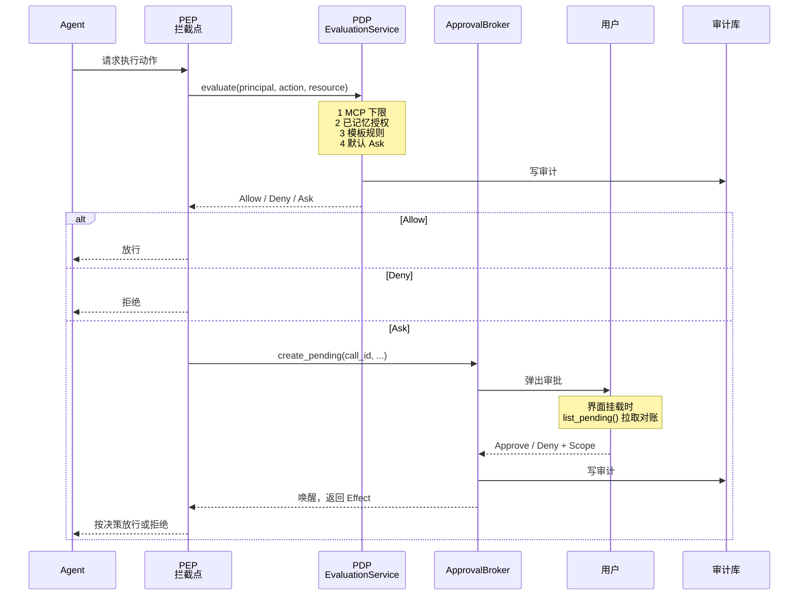

# Agent 权限审批

> **权限系统是 VaneHub AI 对 Agent 危险操作的统一闸门**：执行命令、写文件、调用 MCP 工具、写入记忆等动作在落地前先经过策略判定，判定为"需询问"时弹出审批，决策结果可按作用域记忆复用并留下审计记录。

## 功能定位

**它把各家 CLI 各不相同的确认机制，收敛成一套可配置、可审计的统一策略。**你不再需要分别理解 Claude Code、Codex、OpenCode 各自的确认弹窗与沙箱开关——授权模板一次配好，对所有 Agent 生效。

## 使用场景

1. **只读探索** —— 让 Agent 先通读仓库给方案，用只读模板确保它不会动任何文件。
2. **受控修改** —— 允许改文件但每次执行 shell 命令都要确认。
3. **信任提速** —— 对熟悉的项目放开常规操作，只在真正危险的动作上拦一道。
4. **批量授权** —— 一次审批中选择"本项目内不再询问"，避免重复打断。
5. **事后追溯** —— 出问题时回查审计记录，确认某个操作是谁在什么时候批准的。

## 能力清单

| 能力 | 说明 | 运行时 |
|---|---|---|
| 策略判定 | 对每个动作计算 `Allow` / `Deny` / `Ask` | **仅桌面** |
| 授权模板 | 四档预设模板，一键切换整体宽严 | **仅桌面** |
| 提权确认 | 提升信任度需显式确认，降低不需要 | **仅桌面** |
| 审批弹窗 | `Ask` 判定时中断执行并等待人工决策 | **仅桌面** |
| 决策记忆 | 审批结果按四种作用域记住 | **仅桌面** |
| 风险分级 | 动作按 L0–L2 风险分级（L3 保留） | **仅桌面** |
| 审计记录 | 决策与来源落库，可回查 | **仅桌面** |
| 待审批对账 | 界面挂载时拉取原生侧权威状态 | **仅桌面** |
| Claude Code 钩子 | 以独立二进制介入权限回调，含离线降级 | **仅桌面** |

## 判定结果

**只有三种**（`src-tauri/src/contexts/permissions/domain/effect.rs:5-9` 的 `Effect`）：

| Effect | 含义 |
|---|---|
| `Allow` | 直接放行 |
| `Deny` | 直接拒绝 |
| `Ask` | 中断并询问用户 |

**冲突消解规则是"显式 Deny 优先"**（`effect.rs:11-12`）：

```
显式 Deny  >  显式 Allow  >  默认 Ask
```

**没有任何规则命中的动作默认落到 `Ask`**——未知动作倾向于打断而不是放行。

## 受管动作

**内置五个动作标识**（`domain/action.rs:10-14`）：

| Action | 含义 |
|---|---|
| `shell.exec` | 执行 shell 命令 |
| `file.read` | 读取文件 |
| `file.write` | 写入文件 |
| `mcp.tool` | 调用 MCP 工具 |
| `memory.write` | 写入 Agent 记忆 |

### 为什么 Action 不是封闭枚举

**`Action` 被有意设计成开放的 `String` newtype**（`action.rs:1-6`），文件头注释给出了理由：

> 后续要接入的各 CLI 各有本地概念——**Codex 的 sandbox escalation、OpenCode 的 `external_directory` / `doom_loop`、Gemini 的工具级模型**——封闭枚举会在需要新变体时造成破坏性变更。

## 授权模板

### 四档模板

（`domain/template.rs:16-21` 的 `PolicyTemplateName`）

| 模板 | 存储值 |
|---|---|
| `Readonly` | `readonly` |
| `Standard` | `standard` |
| `Trusted` | `trusted` |
| `Yolo` | `yolo` |

### 模板到底改变了什么

**这是理解权限系统最关键的一张表**（`template.rs:58-74` 的 `policies_for_template`）：

| Action | `Readonly` | `Standard` | `Trusted` | `Yolo` |
|---|---|---|---|---|
| `file.read` | **Allow** | **Allow** | **Allow** | **Allow** |
| `memory.write` | **Allow** | **Allow** | **Allow** | **Allow** |
| `shell.exec` | Deny | Ask | Allow | Allow |
| `file.write` | Deny | Ask | Allow | Allow |

**三条结论直接写在代码注释里**（`template.rs:51-57`）：

1. **模板只区分 `shell.exec` 与 `file.write` 这两个动作。**其余动作不受模板影响。
2. **`file.read` 与 `memory.write` 恒为 `Allow`，与模板无关**——注释原话："即使 `readonly` 也仍然允许读取，那正是这个名字的全部含义。"
3. **`Trusted` 与 `Yolo` 产生完全相同的策略规则**，它们的差别只在赋予时的确认强度上。

**`mcp.tool` 不在模板规则中**——它由无条件的 MCP 下限管辖，排在所有模板规则之前，见 [权限架构的判定顺序](../03-architecture/permissions-architecture.md#判定顺序)。

### 提权需确认，降权不需要

**`requires_confirmation_to_assign()`**（`template.rs:45-49`）对 `Trusted` 与 `Yolo` 返回 `true`，对 `Readonly` 与 `Standard` 返回 `false`。

注释引用了规范原文：

> Increasing a principal's trust requires explicit confirmation; decreasing it does not.

**判定依据是"该模板是否自动放行 `shell.exec` / `file.write`"**——两个会自动放行的需要确认，两个不会的不需要。这是一条从后果而非从名字出发的规则。

**`Yolo` 更强的文案与流程是界面层的事**，不是领域层的规则差异——领域层认为它和 `Trusted` 一样。

## 决策作用域

**审批结果可按四种作用域记住**（`domain/scope.rs:4-9` 的 `Scope`）：

| Scope | 记住范围 |
|---|---|
| `Once` | 仅本次，不记忆 |
| `Session` | 当前会话内有效 |
| `Project` | 当前项目内有效 |
| `Global` | 全局有效 |

**授权记录按作用域携带不同字段**（`domain/grant.rs:11-24` 的 `Grant`）：

| 字段 | 何时设置 |
|---|---|
| `session_id` | **仅** `Scope::Session` |
| `project_key` | **仅** `Scope::Project` |

**`Once` 授权永远不匹配**（`grant.rs:26-29` 的 `matches`），注释解释了这个看似多余的判断：

> `Scope::Once` 的授权永远不会匹配——存储里本就不应该存在这类记录，**但这个检查保持显式，而不是假定它成立**。

这是一条防御性设计：即便某天有 `Once` 记录被误写入存储，它也不会意外放行。

## 风险分级

**动作按风险分级**（`domain/risk_level.rs:11-18` 的 `RiskLevel`）：`L0`、`L1`、`L2` 为当前实际产生的等级。

**`L3` 已声明但当前不会产生**（`risk_level.rs:15-17`），代码注释标明它是为未来的网络/外部副作用类别预留的。

## Principal

**Principal 是"某个 Agent 在权限系统中的身份"**（`domain/principal.rs:16-72`）。

**首次见到的 Agent 会按可配置默认模板惰性创建**，并且：

- **读取模板不会创建 principal**（`evaluation_service.rs:141-143`）——查询是纯读操作
- **`template` 是 principal 唯一持久化的模板相关状态**（`principal.rs:31-33`），因为规则（`policies_for_template`）是模板名的纯函数，没有别的东西需要存
- **支持重新赋予模板**（`principal.rs:71` 的 `reassign_template`）

### 委派的预留设计

**`parent_principal_id` 列从 Phase 1 就存在，但当前必须为空**（`principal.rs:25-29`）：

> 拒绝非空的 `parent_principal_id` 并报 `delegation_not_enabled`（design.md D2）——**这一列从 Phase 1 就存在，好让未来的委派阶段无需破坏性迁移**，但委派本身在那个阶段激活之前是惰性的。

**构造函数同时用于新建与从存储重建**，因此依据同一不变式，**任何 Phase-1 存储行也不可能带有非空的 `parent_principal_id`**——这个论证把"数据一定合法"的保证从运行时检查提升到了结构性保证。

## 判定与审批流程



**用户决策只有两种**（`domain/approval_request.rs:31-34` 的 `ApprovalDecision`）：`Approve` 或 `Deny`，各自映射到对应的 `Effect`（`:37-38` 的 `as_effect`）。

**待审批状态以 Rust 侧为权威**——界面挂载时通过 `list_pending()` 拉取对账，而不是依赖事件不丢，详见 [权限架构](../03-architecture/permissions-architecture.md#审批链路)。

## Claude Code 权限钩子

**Claude Code 的权限回调通过一个独立二进制接入**，而不是让主程序去猜测它的行为：

| 组件 | 位置 |
|---|---|
| 钩子二进制 | `src-tauri/src/bin/vanehub-permission-hook.rs` |
| 桥接服务 | `infrastructure/hook_bridge_server.rs` |
| 发现 | `hook_bridge_discovery.rs` |
| 映射 | `hook_bridge_mapping.rs` |
| 等待注册表 | `hook_bridge_wait_registry.rs` |
| 端口 | `application/ports.rs:104` 的 `ClaudeCodeHookPort` |

**第二个 binary target 带来一个构建副作用**：`Cargo.toml` 必须声明 `default-run = "vanehub-ai"`，否则 Tauri 的 `tauri dev` / `tauri build`（内部调用不带 `--bin` 的 `cargo run`）会直接失败（`src-tauri/Cargo.toml:7-10`）。

**钩子具备离线降级**（`src-tauri/src/bootstrap/permissions.rs:65`）：桥接不可用时走风险分级的离线回退，而不是让整个流程失败。

**注意 Claude Code 不走 CLI 参数注入**——它完全跳过参数查表（`cli_profile.rs:296` 的测试 `claude_code_is_never_looked_up`），权限完全由钩子接管。其他 CLI 的处理方式见 [CLI 集成](../03-architecture/cli-integration.md#差异吸收点一启动参数)。

## 使用方式

### 配置授权模板

设置中心 → Agent 策略页（`src/settings/pages/agent-policies-page.tsx`）选择模板档位。

**切到 `Trusted` 或 `Yolo` 时会要求显式确认**；切回 `Standard` 或 `Readonly` 不需要。

更细的按 Agent 配置见 Agent 配置页（`agent-configurations-page.tsx`）。前端服务在 `src/services/permissions.ts` 与 `runtime-permissions-client.ts`。

### 处理审批

执行过程中命中 `Ask` 时界面弹出审批请求，选择批准或拒绝，并指定记忆范围（本次 / 本会话 / 本项目 / 全局）。选择 `Once` 以外的作用域后，同类动作在该范围内不再询问。

### 回查审计

审计记录由 `infrastructure/audit_repository.rs` 持久化，记录决策、主体与时间。**每一次已解析的判定都会写审计**，包括 `Allow` 与 `Deny`，不只是需要询问的那些。

## 边界与限制

- **仅桌面可用** —— 权限判定与审批依赖原生进程拦截与 SQLite，Web/mock 模式下不具备实际拦截能力。
- **模板只管两个动作** —— `shell.exec` 与 `file.write`；`file.read` 与 `memory.write` 恒为放行，即使 `Readonly` 也不例外。
- **`Trusted` 与 `Yolo` 规则相同** —— 选哪个不改变实际策略，只改变赋予时的确认强度。
- **模板是动作级而非资源级** —— 不区分具体文件路径或命令内容；`ResourcePattern::Exact` 已存在但当前不由任何模板规则构造。
- **`L3` 风险等级不会出现** —— 已声明但当前无动作产生。
- **委派尚未启用** —— `parent_principal_id` 必须为空。
- **PEP 覆盖靠调用点自觉** —— 判定逻辑集中了，但"哪些动作必须先问"取决于各调用点是否老实调用 `evaluate`，没有编译期强制。
- **各 CLI 的原生确认机制仍然存在** —— VaneHub AI 的闸门是附加层，不替换 CLI 自身的沙箱或确认逻辑。

## 相关文档

- [权限架构](../03-architecture/permissions-architecture.md) —— PDP/PEP 分层与四步判定顺序
- [CLI 集成](../03-architecture/cli-integration.md) —— 模板如何变成各 CLI 的启动参数
- [工具生态](tooling.md) —— MCP 工具与 `mcp.tool` 动作
- [个性化](personalization.md) —— `memory.write` 对应的记忆写入
- [会话管理](session-management.md) —— 会话级权限模式（与模板是两套机制）
