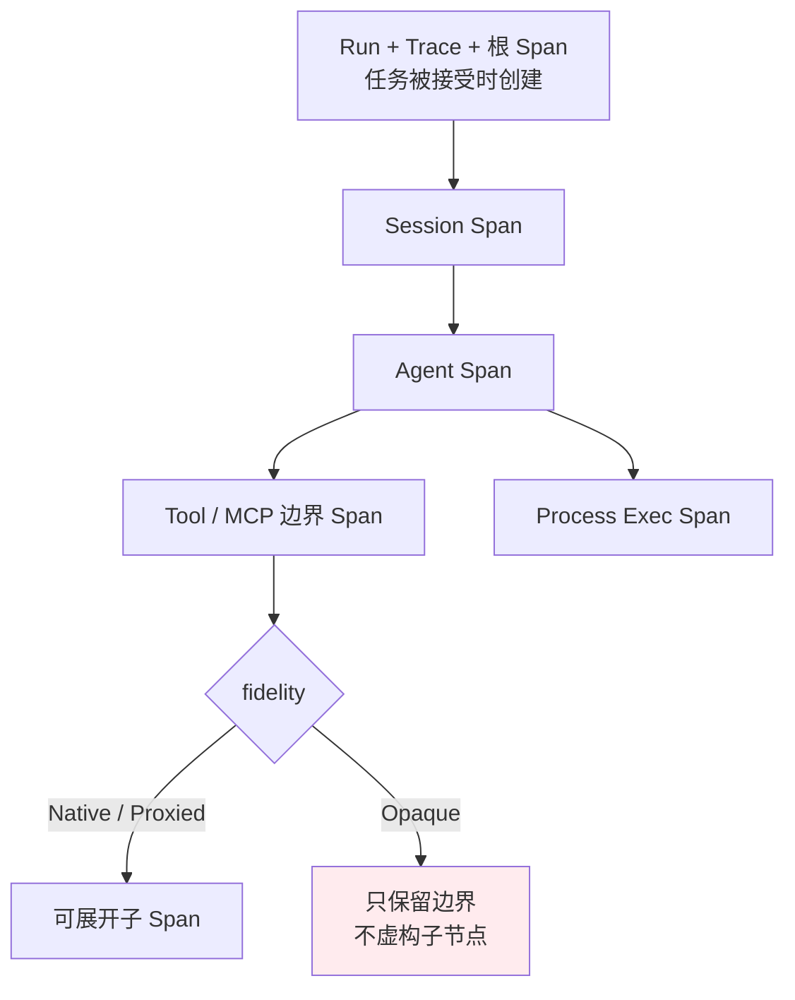
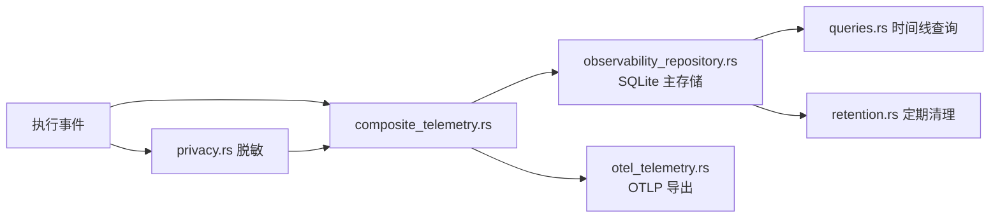

# 可观测性：执行追踪与统一日志

> **一次任务从提交到结束的全过程可以被串起来看**：执行追踪用 Span 树记录 Session → Agent → 工具边界 → 进程执行四层，统一日志把所有诊断输出收进一个脱敏后的目录。

## 功能定位

**它回答的是"刚才那次执行到底发生了什么"。**每次被接受的用户任务在执行开始前就获得独立的 run、trace 与根 span 标识，后续所有活动挂在这棵树上；日志则按四个级别写入统一目录，敏感信息在落盘前经两级脱敏。

## 使用场景

1. **定位卡顿** —— 看时间线上哪一段耗时异常，是模型返回慢还是工具调用慢。
2. **排查失败** —— 顺着 Span 树找到失败节点及其错误分类。
3. **审计执行来源** —— 区分某次执行是桌面手工发起、IM 连接器触发还是定时任务。
4. **关联外部工具** —— 通过 W3C `traceparent` 把 MCP relay 的调用关联进同一条 trace。
5. **控制隐私** —— 用采集策略决定只记元数据还是记脱敏后的内容。

## 能力清单

| 能力 | 说明 | 运行时 |
|---|---|---|
| 执行追踪 | 四层 Span 树，含状态与耗时 | **仅桌面** |
| trace 传播 | W3C `traceparent` 跨进程 / 跨 relay 传播 | **仅桌面** |
| 保真度标注 | 区分原生、代理、推断、不透明四种来源 | **仅桌面** |
| 采集策略 | 仅元数据 / 脱敏内容 | **仅桌面** |
| 属性脱敏 | 敏感键丢弃或替换，其余值仍过 token 级脱敏 | **仅桌面** |
| 执行来源 | 桌面 / IM 连接器 / 定时任务 | **仅桌面** |
| 时间线视图 | 会话内 `traces` 标签页 | **仅桌面** |
| 统一日志 | 四级日志写入统一目录，落盘前脱敏 | **仅桌面** |
| 会话日志查看 | 会话内 `logs` 标签页 | **仅桌面** |
| 保留与清理 | 每 6 小时按保留策略清理 | **仅桌面** |
| OTLP 导出 | 通过 OpenTelemetry 导出 | **仅桌面** |

## 四层 Span 结构

**规范要求一次执行的 trace 至少包含四类关联 Span**（`openspec/specs/agent-execution-observability/spec.md:28`）：



**标识符在执行开始之前就分配**（`spec.md:7`）：每个被接受的用户任务提交，在 Agent 执行开始前就获得独立的 run、trace 与根 span 标识。这保证了"任务一定有 trace"，而不是"执行成功了才有"。

**重试不复用身份**（`spec.md:40`）：改用父 span 或 span link 关联，避免把两次独立执行记成一次。关联关系由 `ExecutionLink`（`domain/model.rs:46-50`）表达，携带 `run_id`、`trace_id`、`span_id` 与 `relationship`。

## 保真度：不知道就说不知道

**四种保真度**（`src-tauri/src/contexts/execution_observability/domain/model.rs:25-30` 的 `ExecutionFidelity`）：

| 保真度 | 含义 | 典型来源 |
|---|---|---|
| `Native` | 运行时自身的一手记录 | OnePiece 原生 Agent |
| `Proxied` | 经代理层观测 | MCP 中继 |
| `Inferred` | 由其他信号推断 | 进程输出解析 |
| `Opaque` | 只知边界，内部不可见 | 外部 CLI 的内部工具调用 |

**`Opaque` 有一条硬约束**（`spec.md:34`）：只发出已知的终端工具/MCP 边界，**不得虚构具体的工具调用或 MCP 操作子 Span**。

**这条约束的价值在于诚实性**：外部 CLI 是黑盒，如果为了让时间线好看而编造子节点，用户会基于错误的结构做判断。宁可显示一个不可展开的边界。

## 执行状态

**六种**（`model.rs:6-13` 的 `ExecutionStatus`）：`Accepted`、`Running`、`Succeeded`、`Failed`、`Cancelled`、`Incomplete`。

**四种为终态**（`model.rs:16-22` 的 `is_terminal`）：`Succeeded`、`Failed`、`Cancelled`、`Incomplete`。

**`Incomplete` 也算终态**——用于表达"结束了但没跑完"，避免这类执行永远挂在"运行中"。

## 执行来源

**三种**（`model.rs:39-43` 的 `ExecutionSource`）：

| 来源 | 携带信息 |
|---|---|
| `Desktop` | 无 |
| `InstantMessage { connector_id }` | 触发的连接器 |
| `Scheduled { task_id }` | 触发的定时任务 |

**后两种带上下文 id**，因此可以反查"这次执行是哪个 IM 连接器或哪个定时任务触发的"。

## 属性与脱敏

### 属性有硬性上限

（`domain/attributes.rs:4-6`）

| 常量 | 值 |
|---|---|
| `MAX_ATTRIBUTE_COUNT` | `32` |
| `MAX_ATTRIBUTE_KEY_LENGTH` | `128` |
| `MAX_ATTRIBUTE_VALUE_LENGTH` | `256` |

**`SafeAttributes` 内部是 `BTreeMap`**（`attributes.rs:29`），保证键序确定——同样的属性集永远序列化成同样的 JSON。

**属性不是裸 JSON 直塞**：值必须先经 `SafeAttributeValue::bounded_string`（`:17`）构造，超长直接报错。

### 两级脱敏

**第一级：按键名分类**（`infrastructure/privacy.rs:31-51` 的 `is_sensitive_key`），键名（小写化后）**包含**以下任一片段即视为敏感：

```
prompt   output   content   payload   body      header
authorization    credential  secret   token
environment      env.       path      argument
```

**注意 `path` 与 `argument` 也在列**——文件路径与命令参数被当作敏感信息处理，因为它们会泄漏目录结构与调用细节。

**敏感键的处理取决于采集策略**（`privacy.rs:12-20`）：

| 策略 | 处理 |
|---|---|
| `MetadataOnly` | **整条丢弃**（键都不留） |
| `RedactedContent` | 值替换为 `[REDACTED_CONTENT]` |

**第二级：非敏感值仍过 token 级脱敏**（`privacy.rs:22-26`）——即使键名看起来无害，字符串值也要经 `redact_text` 处理。

### token 级脱敏

**`redact_text` 按空白切词后逐 token 判断**（`platform/logging.rs:275-301`）：

| 识别 | 替换为 |
|---|---|
| 疑似私有路径 | `[REDACTED_PATH]` |
| `Bearer <token>` | `Bearer [REDACTED]`（消费两个 token） |
| provider 令牌 | `[REDACTED]` |
| 内联敏感 token（如 `key=value`） | 替换，必要时连带下一个值 |

**`Bearer` 的特殊处理值得注意**：保留 `Bearer` 这个词本身、只脱掉后面的令牌，这样日志仍能看出用的是 Bearer 认证。

## 存储

**Span 落 SQLite**，列结构见 `infrastructure/queries.rs:14`：

`run_id`、`span_id`、`trace_id`、`parent_span_id`、`name`、`status`、`fidelity`、`started_at`、`ended_at`、`error_classification`、`attributes_json`

采集策略挂在 `runs.capture_policy` 上——**策略是 run 级而非 span 级**。

**Span 名称上限 128 字符**（`model.rs:3` 的 `MAX_SPAN_NAME_LENGTH`）。

**保留维护每 6 小时执行一次**（`infrastructure/retention.rs:6` 的 `MAINTENANCE_INTERVAL_DAYS = 0.25`），产出 `RetentionOutcome`（`:9`）。

## OpenTelemetry 集成

**本地存储优先，OTLP 导出是组合上去的**：



**全部 OTel crate 用 `=` 精确固定版本**（`src-tauri/Cargo.toml`）：`opentelemetry =0.32.0`、`opentelemetry-otlp =0.32.0`、`opentelemetry_sdk =0.32.1`、`opentelemetry-semantic-conventions =0.32.1`、`tracing =0.1.44`、`tracing-opentelemetry =0.33.0`、`tracing-subscriber =0.3.23`。这套生态跨版本耦合紧密，浮动版本极易导致编译期类型不匹配。

## 统一日志

**四个级别**（`src-tauri/src/platform/logging.rs:32-37` 的 `LogLevel`）：`Error`、`Warn`、`Info`、`Debug`。

**目录管理**：`default_log_dir(app_data_dir)`（`logging.rs:67`）确定默认位置，`set_active_log_dir(path)`（`:71`）可切换。

**前端错误经专用通道上报**：`logging.rs:52` 的 `ErrorBoundary` 变体，对应 React 侧的 `react-error-boundary`；原生接收端是 `DesktopClientLoggingPort`（`desktop/application/ports.rs:76`）。

### 规范约束

（`openspec/specs/unified-log-management/spec.md`）

- 所有 Rust/native 侧日志必须通过统一日志服务写入，**禁止新增 feature-local 日志文件**或绕过脱敏直接落盘
- React 组件**不得直接写本地日志文件**
- SDK/CLI/任务类操作的输出必须**同时**保留页面内展示与统一日志目录写入
- 敏感信息必须在落盘前脱敏

### 日志与追踪的边界

**这是一条容易被忽视但很重要的规范**（`spec.md:97`）：日志中**不得包含** run、trace、span、session、message、operation、process、node、tool-call 等任何标识符。

**理由是防止通过日志反查执行身份**。代价是排查时必须分别看日志和追踪，无法直接用 trace id 去 grep 日志。

## 使用方式

| 想做什么 | 去哪 |
|---|---|
| 查看执行时间线 | 会话工作区 `traces` 标签页（`src/session-workspace/execution-timeline-tab.tsx`） |
| 查看会话日志 | 会话工作区 `logs` 标签页 |
| 配置采集与保留 | 设置中心 → 可观测性页（`src/settings/pages/observability-settings-page.tsx`） |
| 管理日志目录 | 设置中心 → 日志管理（`log-management-section.tsx`） |

前端服务：`src/services/execution-observability-service.ts`、`runtime-execution-observability-client.ts`、`tauri-execution-observability-client.ts`；契约定义在 `src/contracts/execution-observability.ts`。

## 边界与限制

- **仅桌面可用** —— 追踪与日志依赖原生存储，Web/mock 模式无实际采集。
- **不透明边界不展开** —— 外部 CLI 内部的工具调用细节不可见时只保留边界 Span，这是设计约束而非缺失。
- **日志不含执行标识符** —— 无法靠日志直接反查某条 trace，二者需分别查看。
- **属性上限 32 条** —— 超出的属性不会被记录。
- **`MetadataOnly` 下敏感键整条消失** —— 不是留空值，而是键都不在；分析时需注意区分"没有这个属性"与"被策略丢弃了"。
- **路径与参数被当作敏感信息** —— 这会让某些排查场景信息不足，需要临时切到 `RedactedContent` 策略。
- **保留清理会删除历史** —— 超出保留期的 run 与 span 会被清理，需要长期留存应自行导出。
- **OTLP 导出需额外配置** —— 默认以本地 SQLite 为主。

## 相关文档

- [可观测性架构](../03-architecture/observability-architecture.md) —— 四级 Span 与传播的实现细节
- [MCP 集成](../03-architecture/mcp-integration.md) —— 中继的 traceparent 传播
- [自动化与洞察](automation-and-insight.md) —— 定时任务作为执行来源
- [远程与 IM](remote-and-im.md) —— IM 连接器作为执行来源
