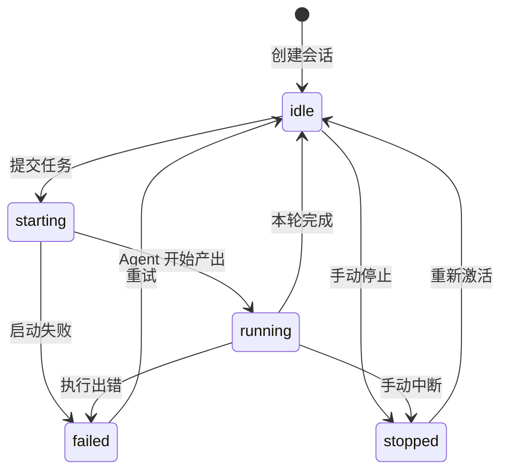

# 多 CLI 会话管理

> **会话是 VaneHub AI 的核心工作单元**：绑定一个项目工作区和一个或多个 Agent 席位，承载对话、终端、文件变更与执行追踪，并持久化到本地 SQLite。

## 功能定位

**它把各家 CLI 各自为政的会话历史，收敛成一套统一的、可检索可归档的会话模型。**你不再需要记住某次重构是在哪个终端窗口、用哪个 CLI 做的——所有会话都在同一个侧边栏里，带分类、置顶和归档。

## 使用场景

1. **并行推进多个任务** —— 给同一个仓库开三个会话：一个修 bug、一个补测试、一个写文档，各自独立保留上下文。
2. **对比不同 Agent** —— 同一个需求分别开 Claude Code 会话和 Codex CLI 会话，比较产出。
3. **调整思考深度** —— 复杂问题拉到 `max` 推理深度，日常问答降到 `low` 控制成本。
4. **按项目归档** —— 项目收尾后把相关会话整体归档，需要时再翻出来。
5. **交接与留证** —— 把会话导出，作为变更依据交给同事或存档。
6. **远程执行** —— 会话工作区指向 SSH 远端主机，在本地界面里操作远程仓库。

## 能力清单

| 能力 | 说明 | 运行时 |
|---|---|---|
| 会话创建 | 选择 Agent、交互模式、项目工作区后创建 | 桌面 / Web（模拟） |
| 多席位绑定 | 一个会话可绑定多个 Agent 席位，支持 `@` 交接 | 桌面 / Web（模拟） |
| 生命周期状态 | 五态状态机 | 桌面 / Web（模拟） |
| 聊天配置 | 权限模式、provider、模型、推理深度、流式、思考、长上下文 | **仅桌面** |
| 推理深度钳制 | 按模型能力自动下钳，不报错 | **仅桌面** |
| 会话分类 | 自定义分类分组，带排序 | 桌面 / Web（模拟） |
| 置顶与归档 | 置顶常用会话；归档不再活跃的会话 | 桌面 / Web（模拟） |
| 消息持久化 | 用户与助手消息落 SQLite，含流式状态 | **仅桌面** |
| 文件引用 | 消息可携带文件引用，有数量与大小限制 | **仅桌面** |
| 工作区标签页 | 单会话内 9 个功能标签页 | 桌面 / Web（部分模拟） |
| 会话导出 | 导出会话内容 | **仅桌面** |
| 项目检查 | 查看会话绑定的项目与 Git 状态 | **仅桌面** |
| 连接器会话 | 由 IM 连接器创建并归属的会话 | **仅桌面** |
| 定时任务 | 按周期自动创建会话执行 | **仅桌面** |

## 会话模型

### 生命周期

**五个状态**（`src-tauri/src/contexts/sessions/domain/session.rs:30-36` 的 `SessionLifecycle`）：



**`starting` 与 `running` 被判定为"有活跃生成中"**（`session.rs:59-61` 的 `has_active_generation`），界面据此禁用重复提交。

**从存储读取时是有损容错的**（`session.rs:39-47` 的 `from_storage_lossy`）：无法识别的状态值一律落到 `idle` 而不是报错——一条状态列被写坏的会话仍然能打开。

### 归属

**两种归属**（`session.rs:94-97` 的 `SessionOwner`）：

| 归属 | 含义 |
|---|---|
| `Desktop` | 在桌面界面中手工创建 |
| `Connector { connector_id }` | 由 IM 连接器代表远端用户创建 |

**连接器会话不能被激活**（`domain/error.rs` 的 `ConnectorCannotActivate`）——它没有对应的桌面界面焦点概念。

### Loop 角色

**Loop 中的会话带角色**（`session.rs:71-73` 的 `LoopSessionRole`）：`worker`（执行）与 `verifier`（验证）。二者是独立会话，验证方不会被执行方的上下文带偏。详见 [Loop 工程化](loop-engineering.md#worker-与-verifier)。

## 标识与校验

**三种 id 由同一个宏生成**（`domain/identity.rs:13-31`）：`SessionId`、`MessageId`、`CategoryId`。

**统一校验有两条规则**（`identity.rs:3-11` 的 `validate_identity`）：

| 规则 | 错误 |
|---|---|
| 去空白后不得为空 | `IdentityRequired(kind)` |
| **不得含任何控制字符** | `IdentityContainsControl(kind)` |

**拒绝控制字符的理由与 SSH 那边一致**：id 会被拼进日志、界面与导出内容，允许控制字符等于允许注入。

**错误携带字段名**（`&'static str` 的 `kind`），因此报错能指明是哪种 id 出了问题，而不是笼统的"标识非法"。

## 消息模型

**角色两种**（`domain/message.rs:92-95` 的 `MessageRole`）：`user`、`assistant`。

**状态五种**（`message.rs:115-121` 的 `MessageStatus`）：`pending`、`streaming`、`completed`、`failed`、`cancelled`。

**状态流转受约束**（`domain/error.rs` 的 `InvalidMessageTransition { from, to }`）——错误结构体同时携带来源与目标状态，诊断时不必猜。

**消息归属会被校验**（`MessageOwnershipMismatch { message_id, expected_session_id, actual_session_id }`）：三个字段全带上，防止跨会话误操作时只报一句"不匹配"。

### 文件引用

消息可携带文件引用，领域层设了四道闸：

| 错误 | 触发条件 |
|---|---|
| `FileReferenceFieldRequired(field)` | 必填字段缺失 |
| `InvalidFileReferenceSize` | 大小非法 |
| `DuplicateFileReferencePath(path)` | 同一路径重复引用 |
| `TooManyFileReferences` | 数量超限 |

## 聊天配置

**每个会话有一套聊天偏好**（`domain/chat_configuration.rs:119-155` 的 `ChatPreferences`）：

| 项 | 说明 |
|---|---|
| `permission_mode` | 权限模式 |
| `provider_id` | provider |
| `model_id` | 模型 |
| `reasoning_depth` | 推理深度（可选） |
| `streaming` | 是否流式输出 |
| `thinking` | 是否展示思考过程 |
| `long_context` | 是否启用长上下文 |

### 支持的聊天 Agent

**五种**（`chat_configuration.rs:4-10` 的 `ChatAgent`）：`Claude`、`Codex`、`Gemini`、`OpenCode`、`OnePiece`，分别由 `claude-code` / `codex-cli` / `gemini-cli` / `opencode` / `onepiece` 解析而来（`:13-20`）。

**未知 agent 报 `UnsupportedChatAgent`**——聊天配置这一层是封闭枚举，与开放的 `AgentId` 不同。

### 权限模式

**四种**（`chat_configuration.rs:50-55` 的 `PermissionMode`）：`default`、`plan`、`agent`、`auto`。

**这是会话级的模式**，与 [权限审批](agent-permission.md) 的授权模板（`Readonly` / `Standard` / `Trusted` / `Yolo`）是两套不同的东西：前者控制本次对话的交互形态，后者控制动作级的放行策略。

### 推理深度与模型钳制

**四档深度**（`chat_configuration.rs:79-84` 的 `ReasoningDepth`）：`low`、`medium`、`high`、`max`。

**不同模型的上限不同**（`chat_configuration.rs:189-200` 的 `max_reasoning_for_model`）：

| 上限 | 模型 |
|---|---|
| `Max` | `claude-opus-4-8`、`claude-sonnet-5`、`gpt-5-5`、`gpt-5-1-codex-max` |
| `High` | `claude-sonnet-4-6`、`gpt-5-4`、`gpt-5-2-codex`、`gemini-2-5-pro` |
| `Medium` | `gemini-2-5-flash` |
| 无限制条目 | 其余模型返回 `None` |

**超限时是下钳而非报错**（`:202-206` 的 `clamp_reasoning_for_model`）：

```rust
Some(requested.min(maximum).as_str().to_string())
```

**这个选择很务实**：用户把深度设成 `max` 后换到一个只支持 `medium` 的模型，会话应该继续能用，而不是弹一个错误框要求先改设置。

### 一致性校验

**provider 与 agent 必须匹配**（`ProviderMismatch { provider_id, agent_id }`）；**模型必须被支持**（`UnsupportedModel { model_id, ... }`）。

**从 CLI 侧回读模型也有映射**（`chat_configuration.rs:167` 的 `model_id_from_cli`）——CLI 报告的模型名与内部 id 不一定一致。

**快照可校验、可恢复**（`:246` 的 `is_valid_chat_snapshot`、`:262` 的 `restore_chat_preferences`）：会话重开时先验快照有效性，无效则回落到默认，而不是带着坏配置启动。

## 分类

**`SessionCategory` 三个字段**（`domain/category.rs:23-28`）：`id`、`name`、`sort_order`。

**名称是校验过的 newtype**（`category.rs:4-21` 的 `CategoryName`），空名报 `CategoryNameRequired`。

**支持重命名**（`category.rs:38` 的 `rename`），**排序由 `sort_order` 显式控制**而非依赖插入顺序。

## 归档保护

**归档会话被禁止三类动作**（`domain/error.rs:4-8` 的 `ArchivedSessionAction`）：

| 动作 | 含义 |
|---|---|
| `Activate` | 激活为当前会话 |
| `SendMessage` | 发送消息 |
| `StartGeneration` | 启动生成 |

违反时报 `ArchivedSession { session_id, action }`，**错误里带上具体是哪个动作**，界面因此能给出针对性提示而不是笼统的"会话已归档"。

**注意归档不等于只读**：重命名、改分类、导出、删除这些不在禁止列表里。

## 工作区标签页

**9 个标签页**（`src/session-workspace/session-tab-bar.tsx:19-28` 的 `SessionTabId`）：

| 标签 | 用途 | 加载方式 |
|---|---|---|
| `chat` | 对话主界面，含 Agent 终端视图 | 立即 |
| `changes` | 本次会话产生的文件变更 | 懒加载 |
| `documents` | 相关文档 | 懒加载 |
| `files` | 工作区文件浏览 | 懒加载 |
| `terminal` | Agent 交互终端 | 懒加载 |
| `shell` | 独立 shell 终端 | 懒加载 |
| `logs` | 会话日志查看 | 懒加载 |
| `traces` | 执行时间线与 Span 追踪 | 懒加载 |
| `report` | 会话报告 | 懒加载 |

**除 `chat` 外全部按需 `import()`**（`session-tabs.tsx:16-24`），首次切换时才加载对应模块，以控制初始包体积。切过的标签会被记入 `mountedTabs` 保持挂载（`session-tabs.tsx:66`），来回切换不重复加载。

## 端口

`sessions` 上下文定义了 15 个端口（`application/ports.rs`），是全仓端口最多的上下文：

| 端口 | 行号 | 职责 |
|---|---|---|
| `SessionRepository` | `:13` | 会话读写 |
| `SessionMessageRepository` | `:47` | 消息读写 |
| `SessionCategoryRepository` | `:70` | 分类 |
| `SessionConfigurationRepository` | `:92` | 会话配置 |
| `SessionUsageRepository` | `:106` | 用量 |
| `SessionTransactionPort` | `:129` | 事务 |
| `SessionClockPort` | `:182` | 时钟 |
| `SessionIdentityPort` | `:193` | id 生成 |
| `SessionCreationContextPort` | `:199` | 创建上下文 |
| `SessionAgentEligibilityPort` | `:237` | Agent 资格校验 |
| `SessionRuntimePort` | `:245` | 运行时 |
| `SessionFileContentPort` | `:249` | 文件内容 |
| `SessionOperationPort` | `:264` | 操作 |
| `SessionLoggingPort` | `:285` | 日志 |
| `SessionChatProfilePort` | `:289` | 聊天档案 |

详见 [端口与适配器](../03-architecture/ports-and-adapters.md#端口的粒度)。

## 使用方式

### 创建会话

1. 主界面新建会话，打开创建对话框（`src/main-layout/create-session-dialog.tsx`）
2. 在 Agent 区选择 Agent；需要多 Agent 协作时在席位分配区添加席位（`session-seat-assignment.tsx`）
3. 选择交互模式：`cli`、`native-desktop`、`browser` 或 `api`，可选项取决于所选 Agent
4. 指定工作区：本地项目目录，或已配置的 SSH 远程工作区（`create-session-remote-workspace-section.tsx`）
5. 确认创建，会话进入 `idle`

### 调整聊天配置

会话内可调整权限模式、模型与推理深度。换模型后推理深度会自动下钳到该模型支持的上限，无需手动调整。

### 组织会话

| 操作 | 入口 |
|---|---|
| 分类 | 会话侧边栏分类分组（`src/main-layout/conversation-sidebar.tsx`） |
| 置顶 | 会话卡片置顶操作 |
| 归档 | 会话卡片归档操作 |
| 查看详情 | 会话信息面板（`session-info-panel.tsx`） |

### 切换标签页与席位

顶部标签栏切换 9 个视图。多席位会话可用席位切换器（`src/session-workspace/seat-switcher.tsx`）在不同 Agent 之间切换视角。

## 边界与限制

**运行时适用范围**：

| 能力 | 桌面（Tauri） | Web/mock |
|---|---|---|
| 会话创建与组织 | 可用 | 可用（内存数据） |
| SQLite 持久化 | 可用 | **不可用** |
| CLI 进程启动 | 可用 | **不可用** |
| PTY 终端 | 可用 | **不可用** |
| 文件与变更浏览 | 可用 | **不可用** |
| 远程 SSH 工作区 | 可用 | **不可用** |

**其他限制**：

- **归档会话禁止三类动作** —— 激活、发消息、启动生成；其余操作仍可用。
- **聊天 Agent 是封闭枚举** —— 只支持五种；新增 CLI 需要同时改 `ChatAgent`。
- **推理深度上限表是硬编码的** —— 新模型需要在 `max_reasoning_for_model` 中登记，否则视为无上限。
- **交互模式受 Agent 限制** —— 例如 `opencode` 仅支持 `cli`；见 [项目概览](../01-overview.md#内置-agent)。
- **多个 worktree 共享同一个数据库** —— 跨分支的迁移版本冲突可能导致启动异常，见 [开发环境搭建](../04-development/setup.md#迁移版本号冲突)。
- **会话不跨 CLI 迁移** —— 会话与创建时选定的 Agent 绑定；相关工作仅存在于未合并分支，见 [演进方向](../01-overview.md#演进方向)。

## 相关文档

- [多 Agent 群聊](group-chat.md) —— 席位与 `@` 交接
- [Loop 工程化](loop-engineering.md) —— worker / verifier 会话角色
- [可观测性](observability.md) —— `traces` 标签页背后的 Span 模型
- [项目与工作区](workspaces.md) —— 工作区、worktree 与文件浏览
- [端口与适配器](../03-architecture/ports-and-adapters.md) —— `sessions` 的端口设计
