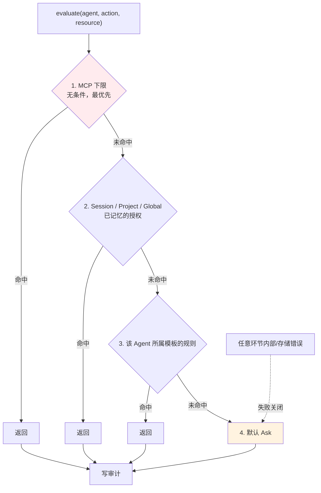
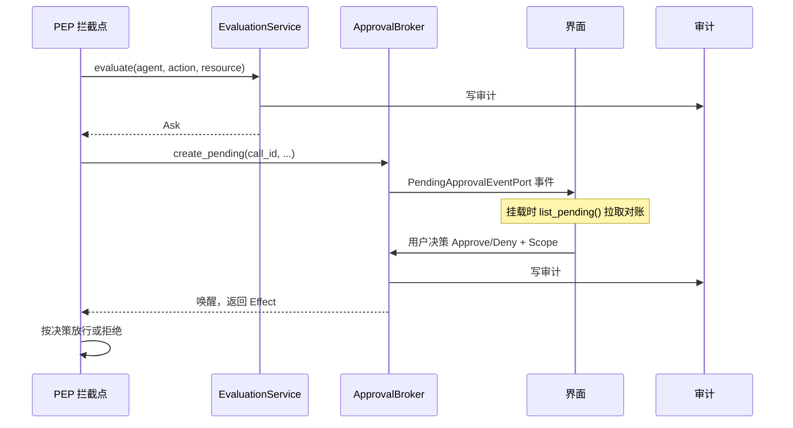

# 权限架构：PDP / PEP 分层

> **判定与执行分离**：`EvaluationService` 是策略决策点（PDP），负责回答"这个动作允许吗"；拦截点（PEP）散布在各调用处，负责在动作发生前提问并遵守答案。`ApprovalBroker` 处理答案是"问用户"时的等待与唤醒。

## 设计目标与约束

| 目标 | 手段 |
|---|---|
| 判定逻辑单点可审计 | 全部集中在 `EvaluationService::evaluate` |
| 出错时不放行 | 任何内部/存储失败**失败关闭**到 `Ask` |
| 每次决策留痕 | 所有已解析的决策写审计 |
| 读取不产生副作用 | 查询模板不会隐式创建 principal |
| 状态以 Rust 侧为准 | 待审批列表由原生侧权威持有 |
| 等待机制不耦合 | `call_id` 对权限上下文是不透明字符串 |

## 判定顺序

**`evaluate(agent, action, resource)` 严格按四步解析**（`src-tauri/src/contexts/permissions/application/evaluation_service.rs:45-51`）：



**四步的次序不是随意的：**

| 顺位 | 内容 | 理由 |
|---|---|---|
| 1 | **MCP 下限，无条件** | design.md D3；一条不可被任何授权或模板绕过的底线 |
| 2 | 已记忆的授权 | 用户明确批准过的东西优先于通用策略 |
| 3 | 模板规则 | 该 Agent 被分配的授权模板 |
| 4 | 默认 `Ask` | 什么都没命中时倾向于打断 |

**失败关闭是显式承诺**（`evaluation_service.rs:49-50`）：

> 这个函数**绝不会因为错误的副作用而返回 `Allow`**。

对应 `permissions-core` 规范的 "Evaluation failure fails closed"。

**注意 `mcp.tool` 不在模板规则中**——它由第 1 步的 MCP 下限管辖，因此模板改档不影响 MCP 工具的放行策略。

## 冲突消解

**当多条规则同时命中时，按显式 Deny 优先**（`domain/effect.rs:11-12`）：

```
显式 Deny  >  显式 Allow  >  默认 Ask
```

**没有任何规则命中的动作落到 `Ask`，而不是 `Allow`。**

`Effect` 只有三种（`effect.rs:5-9`）：`Allow`、`Deny`、`Ask`。

## 模板规则的实际内容

**模板只区分两个动作**（`domain/template.rs:58-74` 的 `policies_for_template`）：

| Action | `Readonly` | `Standard` | `Trusted` | `Yolo` |
|---|---|---|---|---|
| `file.read` | Allow | Allow | Allow | Allow |
| `memory.write` | Allow | Allow | Allow | Allow |
| `shell.exec` | Deny | Ask | Allow | Allow |
| `file.write` | Deny | Ask | Allow | Allow |

**三条结论写在注释里**（`template.rs:51-57`）：

1. `shell.exec` / `file.write` 是模板唯一区分的动作
2. `file.read` 与 `memory.write` 恒为 `Allow`——"即使 `readonly` 也仍然允许读取，那正是这个名字的全部含义"
3. **`Trusted` 与 `Yolo` 产生完全相同的策略规则**，只在赋予时的确认强度上有别

**规则是模板名的纯函数**——这解释了为什么 principal 只需持久化 `template` 一个字段（`principal.rs:31-33`）。

### 提权需确认，降权不需要

**`requires_confirmation_to_assign()`**（`template.rs:45-49`）对 `Trusted` 与 `Yolo` 返回 `true`。

**判定依据是"该模板是否自动放行 `shell.exec` / `file.write`"**——这是一条从**后果**而非从**名字**出发的规则。将来若新增模板，只要它自动放行这两个动作，就该返回 `true`。

## Principal 的生命周期

**惰性创建**（`evaluation_service.rs:116-121`）：首次见到的 Agent 按可配置默认模板创建 principal。

**这条设计要同时满足两个历史约定**：

| 来源 | 约定 |
|---|---|
| `permissions-core` | Newly created principals default to a configurable template |
| 旧 `agent-tool-trust` | new agents default to requiring approval |

**两者只有在默认模板保持 `Standard` 时才等价**——注释明确指出了这个前提，也说明存量 Agent 当初是被回填成 `standard` 的（除非已被标记为 trusted）。

**读取不写库**（`:141-143`）：查询某个 Agent 的当前模板时，若无对应行则**合成一个返回值**，不会作为副作用创建 principal。这满足 `permissions-approval` 的 "Reading a principal's policy template never creates it"。

### 委派的预留设计

**`parent_principal_id` 列从 Phase 1 就存在，但当前必须为空**（`domain/principal.rs:25-29`）：

> 拒绝非空的 `parent_principal_id` 并报 `delegation_not_enabled`（design.md D2）——**这一列从 Phase 1 就存在，好让未来的委派阶段无需破坏性迁移**，但委派本身在那个阶段激活之前是惰性的。

**构造函数同时用于新建与从存储重建**，因此依据同一不变式，**任何 Phase-1 存储行也不可能带有非空的 `parent_principal_id`**。

**这个论证把"数据一定合法"的保证从运行时检查提升到了结构性保证**——不需要额外的数据校验任务。

## 授权记录

**`Grant` 按作用域携带不同字段**（`domain/grant.rs:11-24`）：

| 字段 | 何时设置 |
|---|---|
| `session_id` | **仅** `Scope::Session` |
| `project_key` | **仅** `Scope::Project` |

**`matches()` 判断一次评估是否被某条授权覆盖**（`grant.rs:26-29`），签名包含 `principal_id` / `action` / `resource` / `session_id` / `project_key`。

**`Once` 授权永远不匹配**，注释解释了这个看似多余的判断：

> 存储里本就不应该存在这类记录，**但这个检查保持显式，而不是假定它成立。**

**这是防御性设计**：即便某天有 `Once` 记录被误写入存储，它也不会意外放行。

## 审批链路



### call_id 是不透明字符串

（`approval_broker.rs:64-67`）

> `create_pending` 由 PEP 集成调用——在 `EvaluationService::evaluate` 解析出 `Ask` 之后。**`call_id` 关联回该集成使用的任何等待机制；`permissions` 把它当作不透明字符串。**

**这是刻意的解耦**：调用方可以用通道、future、HTTP 长轮询等任意等待实现，权限上下文不需要知道。

### 待审批状态以 Rust 侧为权威

（`approval_broker.rs:104-106`）

> 完整的待审批列表——`permissions-approval` 的"待审批状态以 Rust 侧为权威"及其"挂载时拉取对账"要求都读它。

**界面挂载时主动拉取，而不是依赖事件不丢**——这是应对界面重载、事件遗漏的稳健做法。

### finalize 区分 delivered

（`approval_broker.rs:123-124`）**决策是否成功送达调用方**，与**决策本身是什么**，是两件独立的事。用户批准了但调用方已经超时退出，这种情况需要能被区分出来。

### ResolvedApproval 的字段暂无生产消费者

（`approval_broker.rs:31-34`）`request` / `effect` 目前只被本模块测试读取，为未来的审计/界面预留。注释显式说明了这一点，避免后来者误以为是死代码而删除。

## Claude Code 钩子桥接

**Claude Code 不走参数注入，而是通过独立二进制的回调接入**：

| 组件 | 位置 |
|---|---|
| 钩子二进制 | `src-tauri/src/bin/vanehub-permission-hook.rs` |
| 桥接服务 | `infrastructure/hook_bridge_server.rs` |
| 发现 | `hook_bridge_discovery.rs` |
| 映射 | `hook_bridge_mapping.rs` |
| 等待注册表 | `hook_bridge_wait_registry.rs` |
| 端口 | `application/ports.rs:104` 的 `ClaudeCodeHookPort` |

**桥接服务基于 `axum 0.8`**——本地 HTTP 服务接收钩子回调。

### 为什么用钩子而非启动参数

**动态强制优于静态配置**：启动参数在进程起来时就固定了，钩子可以在每次调用时重新判定。因此 `claude-code` 被排除在 `POLICY_TEMPLATE_GOVERNED_AGENT_IDS` 之外（`providers/invocation.rs:7-12`）。

### 构建副作用

**第二个 binary target 要求 `Cargo.toml` 声明 `default-run = "vanehub-ai"`**（`src-tauri/Cargo.toml:7-10`），否则 Tauri 的 `tauri dev` / `tauri build`（内部调用不带 `--bin` 的 `cargo run`）会直接失败。

**这条注释本身就是一次故障的记录**——注释说明了失败的具体表现（"could not determine which binary to run"）。

### 离线降级

（`src-tauri/src/bootstrap/permissions.rs:65`）桥接不可用时走**风险分级的离线回退**，而不是让整条链路失败。

## 端口

`permissions` 定义了 8 个端口（`application/ports.rs:10-104`）：

| 端口 | 行号 | 职责 |
|---|---|---|
| `PermissionsClockPort` | `:10` | 时钟 |
| `PermissionsIdPort` | `:14` | id 生成 |
| `DefaultTemplatePort` | `:23` | 默认模板查询 |
| `PrincipalRepository` | `:27` | principal 持久化 |
| `GrantRepository` | `:48` | 授权持久化 |
| `AuditRepository` | `:86` | 审计 |
| `PendingApprovalEventPort` | `:95` | 待审批事件广播 |
| `ClaudeCodeHookPort` | `:104` | 钩子安装/移除 |

**测试用 `NoopClaudeCodeHook`（`mod.rs:192-193`）等假实现替换**，因此权限逻辑可以完全脱离真实钩子测试。

## 领域模型全览

`permissions/domain/` 是全仓领域建模最细的目录之一：

| 文件 | 内容 |
|---|---|
| `action.rs` | 开放的 `Action` newtype + 五个内置常量 |
| `effect.rs` | `Allow` / `Deny` / `Ask` + 优先级消解 |
| `scope.rs` | `Once` / `Session` / `Project` / `Global` |
| `risk_level.rs` | `L0`–`L2`（`L3` 预留） |
| `template.rs` | 四档模板 + `policies_for_template` |
| `policy.rs` | `ResourcePattern` + `resolve_for` |
| `principal.rs` | 主体与模板赋予 |
| `grant.rs` | 授权记录与匹配 |
| `approval_request.rs` | `ApprovalDecision` + `as_effect` |
| `resource.rs` | 资源标识 |
| `error.rs` | 领域错误 |

## 已知取舍与演进

- **委派尚未启用** —— `parent_principal_id` 必须为空（`domain/error.rs:5-6`）。
- **模板是动作级而非资源级** —— `ResourcePattern::Exact` 已定义但当前不由任何模板规则构造，仅记忆型授权使用（`policy.rs:12-15`）。
- **`L3` 风险等级已声明但不产生** —— 为未来的网络/外部副作用类别预留（`risk_level.rs:15-17`）。
- **`ResolvedApproval` 的字段暂无生产消费者** —— 为未来审计/界面预留。
- **PEP 分散意味着覆盖靠自觉** —— 判定集中了，但"哪些动作必须先问"取决于各调用点是否老实调用 `evaluate`，**没有编译期强制**。这是本设计最大的软肋。
- **`Trusted` 与 `Yolo` 规则相同** —— 界面上呈现为两档，领域层只有一档；这个不对称需要界面文案来弥合。

## 相关文档

- [权限审批功能说明](../02-features/agent-permission.md) —— 面向使用者的视角
- [CLI 集成](cli-integration.md) —— 模板如何变成各 CLI 的启动参数
- [端口与适配器](ports-and-adapters.md) —— 端口设计模式
- [数据层](data-layer.md) —— `agent_principals` / `permission_grants` / `approval_audit`
