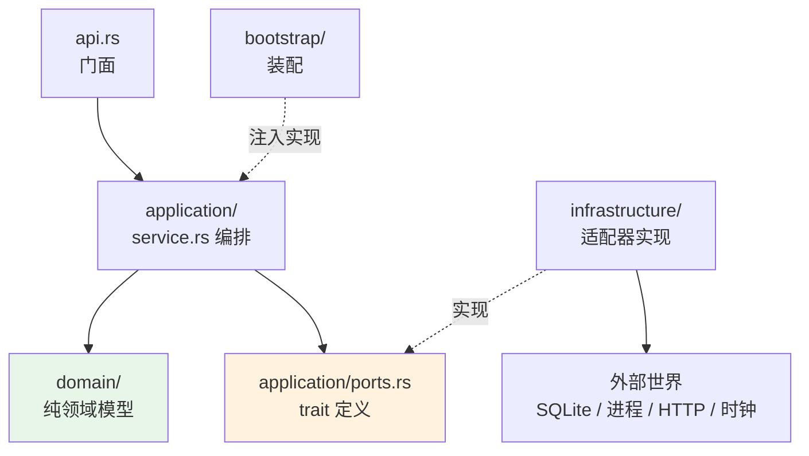

# 端口与适配器

> **每个限界上下文都是同一套四层结构**：`api.rs` 对外、`application/` 编排并定义端口 trait、`domain/` 放纯领域模型、`infrastructure/` 实现端口。依赖倒置通过 `application/ports.rs` 落地，由 `bootstrap/` 装配。

## 设计目标与约束

**要解决的问题是"领域逻辑不能被 SQLite、文件系统和系统时钟绑架"。**

| 目标 | 手段 |
|---|---|
| 领域可独立测试 | `domain/` 不依赖任何 IO |
| 编排可用假实现测试 | `application/` 只依赖 `ports.rs` 中的 trait |
| 实现可替换 | `infrastructure/` 提供真实适配器，测试提供假的 |
| 上下文间不硬耦合 | 跨上下文调用也走本地定义的端口 |
| 时间与随机可控 | 时钟与 id 生成也是端口 |

## 先澄清一个常见误解

**代码中不存在 `AgentAdapter` 或 `ContextInjector` 这类全局统一 trait。**

这两个名字只出现在归档设计稿里：

- `openspec/changes/archive/2026-08-06-add-personalization-settings/design.md`
- `openspec/changes/archive/2026-08-06-add-cli-custom-instructions-injection/design.md`

**实际做法是每个上下文定义自己的一组细粒度端口。**任何以"实现了 AgentAdapter trait"为前提的理解都是错的，详见 [CLI 集成](cli-integration.md#先澄清一个常见误解)。

## 四层结构

```
contexts/<name>/
├── api.rs              # 对外门面，唯一被其他上下文引用的入口
├── application/
│   ├── ports.rs        # 端口 trait 定义（依赖倒置的核心）
│   ├── service.rs      # 用例编排
│   ├── models.rs       # 应用层 DTO
│   └── error.rs
├── domain/             # 纯领域：实体、值对象、不变量、状态机
│   ├── <aggregate>.rs
│   └── error.rs
└── infrastructure/     # 适配器：SQLite 仓储、HTTP 客户端、进程、时钟
    ├── sqlite_repository.rs
    ├── schema.rs
    └── <gateway>.rs
```



**箭头方向就是依赖方向**：`infrastructure` 依赖 `application`（实现它的 trait），而不是反过来。这就是依赖倒置。

## 端口的粒度

**端口按职责切得很细，而不是一个大接口打天下。**`sessions` 一个上下文就定义了 15 个端口（`src-tauri/src/contexts/sessions/application/ports.rs`）：

| 端口 | 行号 | 职责 |
|---|---|---|
| `SessionRepository` | `:13` | 会话读写 |
| `SessionMessageRepository` | `:47` | 消息读写 |
| `SessionCategoryRepository` | `:70` | 分类 |
| `SessionConfigurationRepository` | `:92` | 会话配置 |
| `SessionUsageRepository` | `:106` | 用量 |
| `SessionTransactionPort` | `:129` | 事务 |
| `SessionClockPort` | `:182` | 时钟 |
| `SessionIdentityPort` | `:193` | id 生成 |
| `SessionCreationContextPort` | `:199` | 创建上下文 |
| `SessionAgentEligibilityPort` | `:237` | Agent 资格校验 |
| `SessionRuntimePort` | `:245` | 运行时 |
| `SessionFileContentPort` | `:249` | 文件内容 |
| `SessionOperationPort` | `:264` | 操作 |
| `SessionLoggingPort` | `:285` | 日志 |
| `SessionChatProfilePort` | `:289` | 聊天档案 |

### 时钟与 id 也是端口

**这是可重复测试的前提。**同一模式在多个上下文重复出现：

| 上下文 | 时钟端口 | id 端口 |
|---|---|---|
| `sessions` | `SessionClockPort`（`:182`） | `SessionIdentityPort`（`:193`） |
| `permissions` | `PermissionsClockPort`（`ports.rs:10`） | `PermissionsIdPort`（`:14`） |
| `workspaces` | `WorkspaceClockPort`（`ports.rs:75`） | — |
| `desktop` | `DesktopClockPort`（`ports.rs:27`） | — |

**测试可以给出确定的时间与 id**，因此断言可以精确到具体值，而不是"某个时间戳"。

**所有端口都是 `Send + Sync`**，因为它们跨异步任务共享。

## 跨上下文调用也走端口

**这是避免循环依赖的关键。**`sessions` 需要校验 Agent 是否可用，但不直接调用 `agent_runtime`：

```
sessions/application/ports.rs:237
    trait SessionAgentEligibilityPort   ← sessions 自己定义所需的接口

agent_runtime 侧提供实现，bootstrap 注入
```

反方向同理，`agent_runtime` 通过 `*_gateway.rs` 访问其他上下文。

**`agent_runtime/infrastructure/` 下的六个 gateway**：

| 文件 | 访问的上下文 |
|---|---|
| `sessions_gateway.rs` | `sessions` |
| `permission_adapter.rs` | `permissions` |
| `personalization_gateway.rs` | `desktop` |
| `skill_gateway.rs` | `tooling/skills` |
| `mcp_tool_gateway.rs` | `tooling/mcp` |
| `memory_extraction_gateway.rs` | 自身 + provider |

## 命名约定

| 后缀 | 含义 | 例子 |
|---|---|---|
| `*Repository` | 持久化读写 | `GrantRepository`、`RetrievalDocumentRepository`、`WorkspaceHistoryRepository` |
| `*Port` | 通用能力出口 | `DesktopClockPort`、`WorkspaceGitPort`、`EmbeddingPort` |
| `*_gateway.rs` | 跨上下文访问的实现 | `sessions_gateway.rs`、`skill_gateway.rs` |
| `*_adapter.rs` | 外部系统适配 | `credential_adapter.rs`、`openai_embedding_adapter.rs` |

## 各上下文的端口概览

### permissions（8 个）

`PermissionsClockPort`（`:10`）、`PermissionsIdPort`（`:14`）、`DefaultTemplatePort`（`:23`）、`PrincipalRepository`（`:27`）、`GrantRepository`（`:48`）、`AuditRepository`（`:86`）、`PendingApprovalEventPort`（`:95`）、`ClaudeCodeHookPort`（`:104`）

### desktop（10 个）

`DesktopSettingsRepository`（`:11`）、`DesktopClockPort`（`:27`）、`DesktopNetworkProxyPort`（`:31`）、`DesktopLogDirectoryPort`（`:38`）、`DesktopStartupPort`（`:44`）、`DesktopLocalePort`（`:48`）、`DesktopDirectoryPort`（`:52`）、`DesktopNodeInfoPort`（`:62`）、`DesktopNetworkProxyActionsPort`（`:67`）、`DesktopClientLoggingPort`（`:76`）

**另有生命周期端口**：`DesktopLifecyclePort`、`DesktopShutdownPort`（`application/lifecycle/ports.rs:4,11`）

### workspaces（6 个）

`WorkspaceHistoryRepository`（`:10`）、`WorkspaceFilesystemPort`（`:30`）、`WorkspaceGitPort`（`:39`）、`ProjectDirectorySelectionPort`（`:71`）、`WorkspaceClockPort`（`:75`）、`WorkspaceSessionQueryPort`（`:78`）

### retrieval（5 个）

`RetrievalDocumentRepository`（`ports.rs:14`）、`EmbeddingPort`（`:71`）、`EmbeddingEndpointPort`（`:97`）、`RetrievalConfigurationRepository`（`:116`）、`IndexSourcePort`（`indexing_service.rs:31`）

### communications（4 个主要）

`ConnectorAdapter`（`transports/runtime.rs:117`）、`HttpTransport`（`http.rs:27`）、`SecureCredentialStore`（`credential_adapter.rs:14`）、`InboundAgent`（`runtime_manager.rs:59`）、`ConnectorLifecycleEventPort`（`runtime_manager.rs:76`）

**另有五个连接器各自的传输 trait**：`FeishuLongConnection`、`DingTalkStream`、`WeComLongConnection`、`WeChatSessionStore`、`TelegramCheckpoint`——**每个平台的接入语义不同，因此没有强行统一成一个 trait**，而是让 `ConnectorAdapter` 统一上层。

### agent_runtime

端口相对少，多数逻辑在 `infrastructure` 内部；对外的抽象是 `AgentMemoryDeletionGateway`（`api.rs:506`）与前述六个 gateway。

## 装配与测试替身

**`bootstrap/` 是唯一同时知道 trait 与实现的地方。**

**测试注入假实现**，例如：

| 假实现 | 位置 | 替代 |
|---|---|---|
| `NoopClaudeCodeHook` | `permissions/mod.rs:192-193` | 真实钩子安装 |
| `NoopDiagnosticLog` | `cli_profile.rs:178-180` | 诊断日志写入 |
| `FixedDefaultTemplate` | `cli_profile.rs:185-187` | 默认模板查询 |
| `NoopEvents` | `cli_profile.rs:202-204` | 审批事件广播 |
| `test_adapter.rs` | `execution_observability/application/` | 整套遥测 |

**`execution_observability` 甚至有专门的测试适配器模块**，说明它的端口足够多，值得集中提供一套替身。

## 已知取舍

- **端口多意味着装配代码长** —— `sessions` 一个上下文 15 个端口，构造服务时参数列表相当可观。
- **`pub(crate)` 而非 `pub`** —— 端口对 crate 内可见，靠模块结构而非编译器强制上下文边界；跨上下文误用 domain 类型在编译期不会报错。
- **`tooling` 的 8 个子域各有一套端口** —— 一致性好，但相似的仓储 trait 重复出现多次。
- **异步 trait 依赖 `async-trait`** —— 见 `Cargo.toml` 的 `async-trait 0.1`，带来少量装箱开销。
- **端口粒度细到时钟** —— 好处是可测试，代价是每个上下文都要自己定义一份几乎相同的 `*ClockPort`。

## 相关文档

- [限界上下文](bounded-contexts.md) —— 11 个上下文的职责
- [数据层](data-layer.md) —— `*Repository` 端口背后的 SQLite 实现
- [前端架构](frontend.md) —— 前端侧同构的服务边界层
- [架构总览](README.md) —— 装配入口与架构测试
