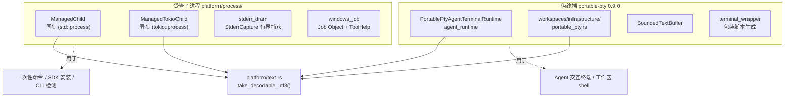
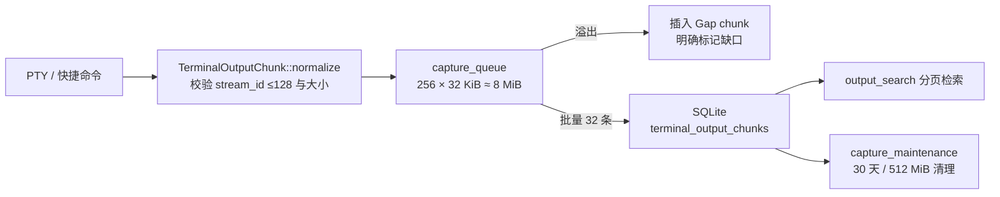

# 进程管理与 PTY

> **有两条并行的子进程路径**：`platform/process/` 的受管子进程（管道 IO，用于一次性命令与 SDK 操作），以及 `portable-pty` 的伪终端（用于 CLI Agent 的交互式终端）。两者对输出解码共用同一个流式 UTF-8 解码器。

## 设计目标与约束

| 目标 | 手段 |
|---|---|
| 子进程树能被整体终止 | Windows Job Object / Unix 进程组，经 `process-wrap` |
| 应用退出不留孤儿进程 | `Drop` 实现兜底清理 |
| 输出不因分片而乱码 | 流式 UTF-8 解码，保留不完整尾部 |
| stderr 不撑爆内存 | 有界捕获 + 截断标记 |
| CLI 需要真实终端语义 | PTY 而非管道 |
| 长跑终端不无限增长 | 有界缓冲 + 落库 + 保留策略 |

## 两条路径

**选择依据很清楚**：需要用户看到并交互的走 PTY，程序读取输出后自行处理的走管道。

## 受管子进程

**两个变体覆盖同步与异步**（`src-tauri/src/platform/process/managed_child.rs`）：

| 类型 | 行号 | 基础 |
|---|---|---|
| `ManagedChild` | `:21` | `std::process` |
| `ManagedTokioChild` | `:165` | `tokio::process` |

**两者接口对称**：

| 方法 | `ManagedChild` | `ManagedTokioChild` |
|---|---|---|
| `spawn` | `:30` | `:174` |
| `id` | `:68` | `:213` |
| `take_stdin` | `:72` | `:217` |
| `take_stdout` | `:78` | `:223` |
| `take_stderr` | `:84` | `:229` |
| `wait_until` | `:90` | — |
| `shutdown` | `:116` | — |
| `Drop` | `:154` | `:313` |

### shutdown 带 deadline

**`shutdown(&mut self, deadline: Instant)`**（`:116`）而非无限等待——**进程不响应时必须能强制收场**。

**典型序列**是：先请求优雅退出、等到 deadline、超时则强制终止整棵进程树。

### Drop 是兜底而非主路径

**两者都实现了 `Drop`**（`:154`、`:313`）：即使调用方忘记显式关闭，析构时也会清理，避免孤儿进程。

**但这是安全网，不是优雅退出**：正常路径仍应显式 `shutdown` 并给足 deadline，否则子进程可能来不及保存状态。

## Windows 进程树终止

**Windows 上单纯 kill 父进程不会终止子孙进程**，因此用 Job Object（`platform/process/windows_job.rs`）：

| Win32 API | 用途 |
|---|---|
| `CreateJobObjectW` | 创建作业对象 |
| `AssignProcessToJobObject` | 把进程放进作业 |
| `SetInformationJobObject` | 配置 `JobObjectExtendedLimitInformation` 与完成端口关联 |
| `TerminateJobObject` | **一次性终止整棵树** |
| `CreateToolhelp32Snapshot` / `Thread32First` / `Thread32Next` | 线程快照，用于挂起态进程的处理 |

**完成端口关联**（`JobObjectAssociateCompletionPortInformation`）让父进程能收到作业内进程退出的通知，而不必轮询。

**跨平台的进程组封装由 `process-wrap 9.1.0` 提供**（features `std`、`tokio1`）；Unix 侧走 `libc` 的进程组。

**两边行为不完全等价**，需分别验证——这是本项目 Windows 专属代码最集中的地方之一。

## stderr 有界捕获

**`StderrCapture` 三个字段**（`platform/process/stderr_drain.rs:8-12`）：

| 字段 | 含义 |
|---|---|
| `retained` | 实际保留的字节 |
| `observed_bytes` | **观察到的总字节数** |
| `truncated` | 是否发生了截断 |

**同时记录"保留了多少"和"总共来了多少"**，这样诊断信息里能如实说明输出被截断，而不是让用户以为那就是全部。

**捕获在独立线程中进行**（`stderr_drain.rs:2-3` 引入 `std::thread` 与 `JoinHandle`），同时支持同步与异步读取（`AsyncRead` / `AsyncReadExt`）——因为两种 `ManagedChild` 都要用它。

## PTY

**CLI Agent 需要真实终端语义**——颜色、光标控制、交互式提示、TUI 框线字符。管道做不到这些。

**两处独立使用**：

| 位置 | 用途 |
|---|---|
| `agent_runtime/infrastructure/terminal_process.rs:118` 的 `PortablePtyAgentTerminalRuntime` | Agent 交互终端 |
| `workspaces/infrastructure/portable_pty.rs` | 工作区独立 shell |

**核心类型**（`terminal_process.rs`）：`ManagedAgentTerminal`（`:54`）、`BoundedTextBuffer`（`:67`）。

**引入的 portable-pty 组件**（`terminal_process.rs:27`）：`native_pty_system`、`Child`、`CommandBuilder`、`MasterPty`、`PtySize`。

### 终端尺寸有安全上界

**`TerminalDimensions::bounded(rows, cols)`**（`workspaces/domain/shell.rs:8`）对行列数做钳制，测试名直言 `terminal_dimensions_keep_the_existing_safety_bounds`——**异常巨大的尺寸会导致 PTY 分配过大的缓冲**。

### 空闲清理

**后台任务每分钟检查一次，清理空闲超过 2 小时的终端会话**（`bootstrap/runtime.rs:328-331`）。

**这是必要的**：PTY 会持有子进程与文件描述符，用户开了忘关的终端不能永远占着。

## 终端包装脚本

**Agent 终端不是直接 exec CLI，而是经一层生成的包装脚本**（`agent_runtime/infrastructure/terminal_wrapper.rs`）：

| 成员 | 行号 | 职责 |
|---|---|---|
| `AgentTerminalWrapperRequest` | `:15` | 请求 |
| `AgentTerminalWrapperSpec` | `:30` | 规格 |
| `default_agent_terminal_shell()` | `:37` | 按平台选默认 shell |
| `generate_agent_terminal_wrapper()` | `:58` | 生成包装脚本 |

**包装层的作用**：注入环境、统一退出码处理，并为用量摄取提供落点。

**代价是一层间接**——排查启动问题时需要看包装脚本生成的实际内容，而不只是 CLI 命令行。

## 工作区 shell 的切目录命令

**按宿主生成**（`workspaces/domain/shell.rs:30-38` 的 `reset_directory_command`）：

| 宿主 | 生成的命令 |
|---|---|
| `Windows` | `cd /d "<root>"` + `\r\n` |
| `Unix` | `cd '<escaped>'` + `\n` |

**Unix 侧的引号转义值得留意**：把 `'` 替换成 `'"'"'`，这是 POSIX shell 中在单引号串里插入单引号的标准写法。**目录名含引号时不会导致命令注入。**

**换行符也按平台区分**（`\r\n` vs `\n`），因为两边的行编辑器对裸 `\n` 的处理不同。

## 流式 UTF-8 解码

**这是一个具体且容易被忽略的正确性问题。**

**问题**：PTY 与管道的读取落在任意字节边界上，一个多字节序列（中文 / emoji / TUI 框线）可能被切在两次读取之间。**孤立地解码每次读取，会在本来有效的输出中间吐出 U+FFFD 替换字符。**

**解法**（`platform/text.rs:9` 的 `take_decodable_utf8`），文档注释写得很清楚：

> 取走 `pending` 中所有构成完整 UTF-8 的字节，**把不完整的尾部序列留给下一次读取补齐**。

**它的演进路径记录在三个提交里**：

| 提交 | 内容 |
|---|---|
| `8887c98` | fix(workspaces): 停止破坏 shell 终端输出中的多字节 UTF-8 |
| `9ddd171` | refactor(platform): **提取流式 UTF-8 解码器供跨上下文复用** |
| `4cb55c4` | perf(platform): 解码进程输出时**不再克隆字节缓冲** |

**先修 bug，再抽公共实现，最后优化掉多余拷贝**——这是本仓库处理这类问题的典型节奏，也说明这个解码器最初是从一处具体故障里长出来的。

## 输出捕获链路

**工作区终端的输出有完整的落库链路**：

**`Gap` 是一个诚实性设计**（`workspaces/domain/output_chunk.rs:4-8` 的 `TerminalOutputSource`）：输出因队列溢出而丢失时，不是静默跳过，而是插入一个 `Gap` chunk 明确标记"这里丢了东西"。

**容量常量集中在** `workspaces/domain/remote_terminal_limits.rs:7-12`，完整表见 [项目与工作区](../02-features/workspaces.md#容量与超时常量)。

## 已知取舍

- **两条路径并存增加认知成本** —— 受管子进程与 PTY 各有一套生命周期与缓冲逻辑，只有解码环节是共享的。
- **Windows 专属代码不小** —— Job Object 与 ToolHelp 是纯 Windows 实现，Unix 侧走 `libc`，两边行为需分别验证。
- **有界缓冲会丢历史输出** —— 长时间运行的终端只保留尾部；完整输出需依赖统一日志或落库的 chunk。
- **包装脚本引入一层间接** —— 排查启动问题需看生成的脚本内容。
- **`Drop` 兜底不等于优雅退出** —— 析构清理是安全网，正常路径仍应显式 `shutdown`。
- **PTY 空闲 2 小时才清理** —— 期间持续占用子进程与描述符。

## 相关文档

- [CLI 集成](cli-integration.md) —— 启动参数如何决定
- [项目与工作区](../02-features/workspaces.md) —— 输出捕获与检索的用户视角
- [远程与 IM](../02-features/remote-and-im.md) —— 远程终端的连接池与超时
- [可观测性架构](observability-architecture.md) —— 进程执行 Span
