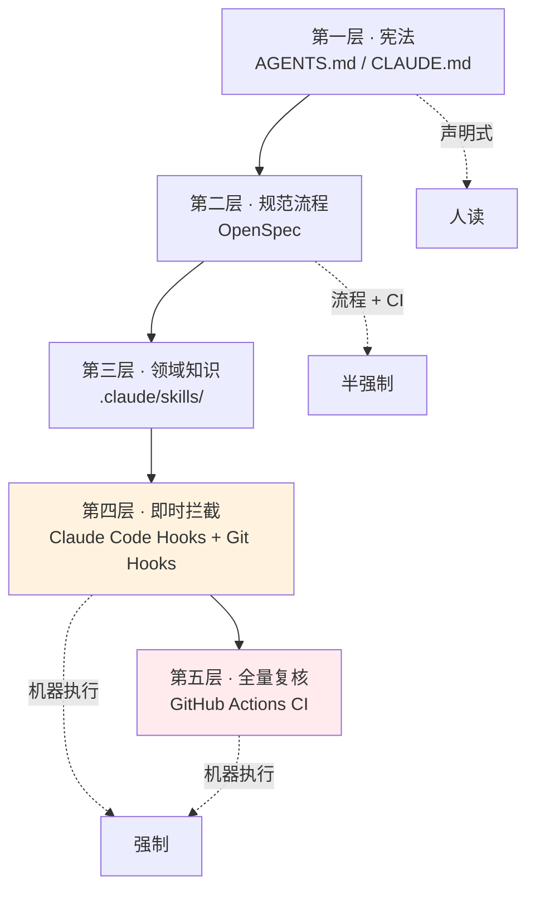

# 五层 AI 协作约束体系

> **规范不只写在文档里，而是逐层被机器执行。**从宪法式的文本约定，到编辑时自动触发的钩子，再到提交拦截与 CI 全量复核——五层各管一段，越靠后越难绕过。

## 为什么需要分层

**单靠文档约定会漂移，单靠 CI 反馈又太晚。**分层的意义是让问题在离产生最近的地方被拦住：写错的一瞬间比提交时便宜，提交时比 CI 时便宜。



| 层 | 触发时机 | 强制力 | 绕过成本 |
|---|---|---|---|
| AGENTS.md | 会话开始 | 声明式 | 无（靠自觉） |
| OpenSpec | 动代码前 | 流程 + CI job | 中 |
| Skills | 任务匹配时 | 声明式 | 无 |
| Hooks | 编辑 / 提交时 | 机器执行 | 高（且明令禁止） |
| CI | 推送 / PR 时 | 机器执行 | **不可绕过** |

## 第一层：宪法（AGENTS.md）

**唯一入口是 `AGENTS.md`**，`CLAUDE.md` 与 `GEMINI.md` 都指向它，**不分别维护三份**。

**这条设计本身就是一次教训的产物**：三份内容各自演化的结果必然是三套不一致的约定。

| 内容 | 性质 |
|---|---|
| 技术栈严格约束 | 不允许引入替代方案（状态管理、样式、包管理） |
| 架构核心约束 | 组件禁止直接 `invoke()`；两套 client 接口一致；领域逻辑留 Rust 侧 |
| 日志规范 | 统一日志服务、四级语义、落盘前脱敏 |
| 代码规范 | 禁 `any`、禁 `@ts-ignore`、单文件 ≤300 行、注释只写"为什么" |
| 提交语言 | commit message 与 PR 标题正文一律英文 |
| 校验命令清单 | 改完必须全部跑通的命令，**要求逐字照抄参数** |

**`CLAUDE.md` 的补充部分明确了分工**：深度实现示例与单功能域的详细 pattern 放 `.claude/skills/`，**不塞进 `AGENTS.md`**——避免主约束文件膨胀到没人读。

**这一层是声明式的**——它不能阻止你写错，但定义了"什么是错"。

## 第二层：OpenSpec 流程

**任何新功能或架构调整必须先起 proposal**，通过校验后再动代码。

| 目录 | 作用 | 规模 |
|---|---|---|
| `openspec/specs/` | 已确认规范，唯一真源 | 88 个能力 |
| `openspec/changes/` | 未归档的活跃提案 | — |
| `openspec/changes/archive/` | 已完成变更的历史，**不可变** | 116 条 |
| `openspec/project.md` | 项目上下文与详细规范 | — |

**机器强制点**：

- `openspec/changes/archive/` 在工具层被**禁止直接编辑**
- CI 有独立的 `openspec` job，**逐个校验**活跃变更

详见 [OpenSpec 工作流](openspec-workflow.md)。

## 第三层：Skills

**`.claude/skills/` 存放按需触发的领域知识**——单个功能域的详细实现 pattern、深度示例。

**触发时机**：任务匹配到对应 skill 时才加载。

**这一层解决的是"约束文件太长没人读"与"细节不写会被反复问"之间的矛盾**：把细节移到按需加载的位置，主文件保持可读长度。

## 第四层：即时拦截

这一层是**真正的机器强制**开始的地方，分两个触发点。

### 编辑即校验（Claude Code Hook）

**`.claude/settings.json` 注册了 PostToolUse hook**（`:43-49`）：

| 项 | 值 |
|---|---|
| 匹配器 | `Edit\|Write\|MultiEdit` |
| 命令 | `node "$CLAUDE_PROJECT_DIR/scripts/hooks/post-edit-quality.mjs"` |

**脚本行为**（`scripts/hooks/post-edit-quality.mjs:2-6`）：

| 文件类型 | 动作 |
|---|---|
| `.ts` / `.tsx` | `eslint --fix --no-warn-ignored --max-warnings=0`，残余错误回报给 agent（`:44`） |
| `.rs` | `rustfmt --edition 2021`（`:57-58`） |

**两处细节值得注意：**

**1. rustfmt 失败的诊断价值**（`:67`）：脚本的中文提示直言——rustfmt 无法格式化通常意味着你写出了**语法错误**。把格式化工具当语法检查器用，比等编译慢得多的 `cargo check` 更早给出反馈。

**2. 环境问题不阻塞编辑**（`:6`）：工具链缺失、payload 畸形、eslint 崩溃这类情况直接放行。**基础设施故障不应该挡住工作**——这是一个刻意的取舍，宁可漏掉一次校验也不让人卡住。

**退出码 2** 让反馈进入 agent 的上下文，而不是静默丢弃。

### 提交即拦截（Git Hooks / husky）

| 钩子 | 内容 |
|---|---|
| `.husky/pre-commit` | `npx lint-staged` |
| `.husky/commit-msg` | `npx --no -- commitlint --edit "$1"` |

**lint-staged 规则**（`lint-staged.config.mjs`）：

| 匹配 | 动作 |
|---|---|
| `*.{ts,tsx}` | `eslint --fix --max-warnings=0 --no-warn-ignored` |
| `*.{js,mjs}` | 同上 |
| `*.rs` | `rustfmt --edition 2021` |

**配置里有一条注释约束**：`--edition` 必须与 `src-tauri/Cargo.toml` 中的 edition 一致——**这是一处必须手工同步的耦合**，注释把它标了出来。

**commitlint 规则**（`commitlint.config.mjs`）：继承 `@commitlint/config-conventional`，`type-enum` 允许 12 种：

`build`、`chore`、`ci`、**`deps`**、`docs`、`feat`、`fix`、`perf`、`refactor`、`revert`、`style`、`test`

**`deps` 是本仓库自加的**，配置注释说明它是依赖升级的既定约定：`deps(npm)` / `deps(cargo)` / `deps(actions)`。

### 300 行硬规则

**`max-lines` 是 ESLint error 级规则**（`eslint.config.js:55`）：

```js
"max-lines": ["error", { max: 300, skipBlankLines: false, skipComments: false }]
```

**按物理行计**——空行和注释都算，无法靠格式技巧规避。

**两类豁免**：

| 豁免 | 位置 | 理由 |
|---|---|---|
| 测试文件 | `:59-61` | 注释写明"用例行数随覆盖线性增长，硬拆损害用例内聚" |
| 存量超限文件 | `:67-78` | 技术债清单，**禁止新增** |

**测试豁免的理由值得单独说**：它承认了一条边界——**这条规则的目标是控制生产代码的复杂度，不是控制测试的详尽程度**。硬套会让人为了合规而拆散本该在一起的用例。

## 第五层：CI 全量复核

**`.github/workflows/ci.yml` 有 7 个 job**：

| Job | 步骤 |
|---|---|
| **`frontend`** | ESLint → `tsc` + Vite build → 覆盖率策略回归测试 → Vitest 覆盖率 → 前端覆盖率门槛 → 上传报告 |
| **`contracts`** | `npm run contracts:check` |
| **`openspec`** | `npx @fission-ai/openspec@1.6.0 validate --specs --strict` → **逐个校验活跃变更** |
| **`documentation`** | `docs:check` + `docs:test` → 截图校验 → 文档站构建 → **`git diff --exit-code`** |
| **`rust`** | Linux 前置依赖 → **验证快速链接器** → fmt → check → clippy → tests |
| **`native-coverage`** | 原生覆盖率与门槛 |
| **`native-platform-check`** | `windows-latest` + `macos-latest` 矩阵 |

### 三个值得注意的 CI 细节

**1. OpenSpec 版本被钉死**：`@fission-ai/openspec@1.6.0`（`ci.yml:92`）。校验工具本身升级会改变判定结果，因此不用浮动版本。

**2. 文档构建必须只读**：`docs:build` 之后跑 `git diff --exit-code`（`ci.yml:165-166`）——**确认构建过程不修改仓库内容**。这防止了"构建产物被提交进来"和"构建有副作用"两类问题。

**3. 验证快速链接器**：`rust` job 有一步专门确认 Linux 快速链接器可用——Rust 链接是编译耗时大头，这一步保证 CI 不会悄悄退回慢速链接器。

### 覆盖率门槛

（`coverage-policy.json`）

| 范围 | 最低行覆盖率 |
|---|---|
| 前端整体 | 45.2% |
| 原生整体 | 67% |
| **三个关键组** | **各 80%** |

关键组为 `agent-startup-and-terminal-control`、`mcp-routing`、`sqlite-transactions`——终端控制、MCP 路由、SQLite 事务与迁移。详见 [开发环境搭建](setup.md#覆盖率门槛)。

### 架构测试

**除常规测试外，CI 还会跑两组架构断言**：

| 位置 | 内容 |
|---|---|
| `src-tauri/src/contract_tests.rs` | 用 `syn` 解析自身源码，断言**每个 Tauri command 恰好注册一次**、命令名与前端 `invoke` 一致、DTO 形态稳定 |
| `src/contracts/contract-conformance.test.ts` | 前端契约一致性，由 `contracts` job 单独跑 |

详见 [架构总览](../03-architecture/README.md#架构约束的机器强制)。

## 禁止绕过

**`AGENTS.md` 明确列出的禁止事项**：

| 禁止 | 理由 |
|---|---|
| `git commit --no-verify` | 本地绕过不改变 CI 的判定 |
| `git push --force` | 破坏协作历史 |
| 修改或删除 `.husky/` | 移除拦截层 |
| 修改 `.claude/settings.json` | 同上 |
| 向 eslint 豁免清单新增文件 | 技术债只减不增 |
| 修改 lint-staged / commitlint 配置以放宽 | 同上 |

**理由很实际**：即使本地绕过，CI 也会以同样标准全量复查。**绕过只是把失败推迟到更贵的地方。**

**个人化配置的正确出口**：

| 内容 | 位置 |
|---|---|
| 权限放宽、本地实验 | `.claude/settings.local.json`（已 gitignore） |
| 个人临时指令 | `CLAUDE.local.md`（需确认已 gitignore） |

## 这套体系的边界

**它拦不住的东西同样值得知道：**

- **PEP 覆盖靠自觉** —— 权限判定集中了，但"哪些动作必须先问"取决于各调用点是否调用 `evaluate`，没有机器强制。
- **跨上下文误用 domain 类型** —— 端口是 `pub(crate)`，编译期不报错。
- **`tauri-*` 与 `web-*` 的行为差异** —— 类型一致查得出，行为不一致查不出。
- **前后端镜像实现的漂移** —— `mock-agent-data.ts` 与 `schema.rs` 的 `AGENTS`、`model-family.ts` 与 Rust `ModelFamily` 等，靠约定与测试维持。
- **迁移版本号冲突** —— 静默跳过，无任何机制拦截，见 [开发环境搭建](setup.md#迁移版本号冲突)。

**知道边界在哪，比以为"有 CI 就万事大吉"更有用。**

## 相关文档

- [OpenSpec 工作流](openspec-workflow.md) —— 第二层的具体流程
- [开发环境搭建](setup.md) —— 本地跑通这些校验
- [架构总览](../03-architecture/README.md) —— 约束如何塑造了架构
- [前端架构](../03-architecture/frontend.md) —— 300 行规则带来的文件拆分
