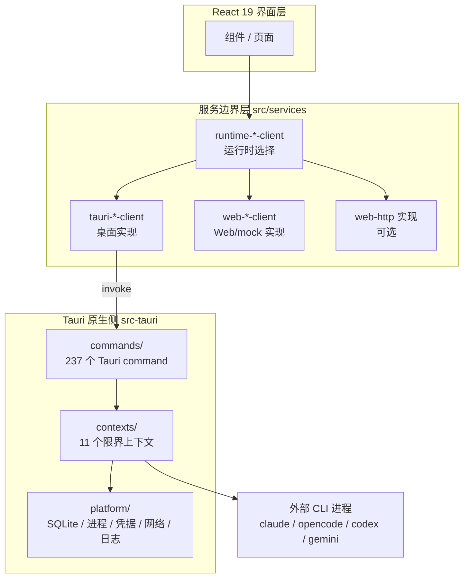

# 项目定位与用途

> VaneHub AI 是一个**桌面端多 AI 编程助手管理终端**：把 Claude Code、OpenCode、Codex CLI、Gemini CLI 以及一个原生 API Agent 收进同一个工作台，用一套 React 界面统一管理它们的可用性、会话、终端、权限、工具与可观测性。

## 一句话定位

**VaneHub AI 解决的是"多个 AI 编程 CLI 各自为政"的问题**。它不替代这些 CLI，而是在它们之上提供统一的会话模型、权限审批、工具接入与执行追踪，让你在一个窗口里完成原本要在多个终端之间来回切换的工作。

应用标识与版本（`src-tauri/tauri.conf.json:3-5`）：

| 项 | 值 |
|---|---|
| 产品名 | **VaneHub AI** |
| 应用标识符 | `ai.vanehub.app` |
| 当前版本 | `0.1.0` |

## 它解决什么问题

**痛点在于工具是割裂的，而工作是连续的**。直接使用各家 CLI 时会遇到这些具体问题：

| 问题 | 直接使用各 CLI 的现状 | VaneHub AI 的处理 |
|---|---|---|
| **会话散落** | 每个 CLI 自己管理会话，历史分散在各自的目录与格式里 | 统一会话模型与 SQLite 持久化，支持分类、置顶、归档、导出 |
| **可用性不透明** | 装没装、版本对不对、认证过没过期，要逐个敲命令确认 | 集中的 CLI 检测与可用性状态，含安装来源冲突识别 |
| **权限失控** | 各 CLI 的危险操作确认机制不一，难以统一收口 | 独立的权限上下文，**PDP/PEP 分离**的审批链路与审计记录 |
| **工具重复配置** | MCP server、Skill、Prompt Hook 要在每个 CLI 里配一遍 | 集中管理后按 Agent 绑定下发，MCP 还可经中继复用 |
| **执行不可观测** | 出问题只能翻各自的日志，无法串起一次任务的全链路 | 四级 Span 执行追踪 + 统一脱敏日志 |
| **上下文重复交代** | 个人偏好、项目约定要对每个 Agent 重说一遍 | Custom Instructions 与跨会话记忆统一注入 |
| **人不在电脑前就断线** | 只能坐在终端前盯着 | 定时任务 + IM 连接器 + 通知 |

## 目标场景

**典型场景是"同一个仓库、多个 Agent、长期协作"。**

1. **横向比较** —— 同一个需求分别交给 Claude Code 与 Codex CLI，比较产出质量与成本，而不必手工搭两套环境。
2. **按长项分工** —— 用一个 Agent 做重构、另一个做测试补全，各自在独立会话里推进，共享同一套项目上下文与权限策略。
3. **角色化协作** —— 在一个会话里坐下架构、实现、评审三个席位，用 `@` 交接发言权，全程共享同一条线索。
4. **目标驱动自动循环** —— 定义"让 CI 全绿"这类目标与必过检查，让 Loop 反复迭代到达成，且强制人工验收。
5. **长期项目记忆** —— 跨会话保留项目约定与个人偏好，新会话开箱即带上下文。
6. **受控执行** —— 对写文件、执行命令这类高风险操作统一走审批，留下可审计的决策记录。
7. **远程与自动化** —— 通过 SSH 连接远端主机执行，或用定时任务把重复性工作固化下来，结果经 IM 连接器推送。

## 核心价值主张

**相对于分别使用各 CLI，差异集中在"统一层"带来的这些事：**

| 维度 | 分别使用各 CLI | VaneHub AI |
|---|---|---|
| 会话管理 | 各自的历史格式与存储位置 | 统一 SQLite 会话库，可分类/搜索/导出 |
| 权限 | 各自的确认提示，粒度不一 | 统一四档模板与审批，含审计轨迹 |
| 工具生态 | 每个 CLI 单独配置 MCP/Skill | 集中注册，按 Agent 绑定，含漂移检测 |
| 可观测性 | 分散的 stdout 与日志文件 | 四级 Span 追踪 + 统一脱敏日志目录 |
| 个性化 | 各自的配置文件 | 统一的 Custom Instructions 与跨会话记忆 |
| 多 Agent 协作 | 手工在多个终端间搬运上下文 | 会话内席位交接 / Loop 自动循环 |
| 用量核算 | 各看各的 | 四维 token 统一采集与趋势 |
| 界面 | 多个终端窗口 | 单窗口多标签工作区，含内置终端 |

**需要说清的边界**：VaneHub AI **不修改各 CLI 的内部行为**，也不代理它们的模型调用。它管理的是"进程之外"的部分——启动参数、会话上下文、权限拦截、输出采集。真正的代码生成仍由各 CLI 自己完成。

**唯一的例外是 OnePiece**：它是内置的原生 API Agent，完全在本进程内运行。

## 内置 Agent

**当前内置 5 个 Agent**，原生侧种子定义在 `src-tauri/src/contexts/agent_runtime/infrastructure/schema.rs:17`（`const AGENTS: [SeedAgent; 5]`），Web/mock 侧等价目录在 `src/services/mock-agent-data.ts:3-57`：

| Agent id | 显示名 | 提供方 | 启动方式 | 支持的交互模式 | 受管 SDK |
|---|---|---|---|---|---|
| `claude-code` | Claude Code | Anthropic | CLI (`claude`) | `cli`、`native-desktop` | `claude-sdk` |
| `opencode` | OpenCode | OpenCode | CLI (`opencode`) | `cli` | — |
| `codex-cli` | Codex CLI | OpenAI | CLI (`codex`) | `cli`、`native-desktop` | `codex-sdk` |
| `gemini-cli` | Gemini CLI | Google | CLI (`gemini`) | `cli`、`browser` | — |
| `onepiece` | OnePiece | VaneHub | API | `api` | — |

**交互模式共四种**（`src-tauri/src/contexts/agent_runtime/domain/catalog.rs:18-45` 的 `InteractionMode`）：`browser`、`native-desktop`、`cli`、`api`。

**各 Agent 的接入方式差异不小**——权限如何表达、是否走 MCP 中继、模型族如何判定，每个都不一样。完整对照见 [CLI 集成](02-architecture/cli-integration.md#各-cli-的特例汇总)。

**`onepiece` 是原生 API Agent**——不依赖外部 CLI 进程，直接通过 provider 接口调用模型，可选 25 家 provider。它还为其他 CLI Agent 代做记忆提取，详见 [原生 API Agent](02-architecture/native-agent.md)。

## 整体形态

**同一套 React UI 服务三种运行时**（`src/services/runtime-adapter.ts:3` 的 `RuntimeKind`）：`tauri`（桌面客户端）、`web-mock`（浏览器模拟数据）、`web-http`（浏览器经 HTTP 后端）。组件只依赖服务接口，不直接触碰原生 API。

**关键约束**：React 组件禁止直接调用 Tauri `invoke()`，必须经服务边界层；`tauri-*-client` 与 `web-*-client` 必须保持接口一致。详见 [前端架构](02-architecture/frontend.md) 与 [限界上下文](02-architecture/bounded-contexts.md)。

## 支持的平台与语言

### 桌面三平台

打包目标定义在 `.github/workflows/package.yml`：

| 平台 | Rust target | 位置 |
|---|---|---|
| Windows | `x86_64-pc-windows-msvc` | `package.yml:48` |
| macOS | `aarch64-apple-darwin`（Apple Silicon） | `package.yml:53` |
| Linux | `x86_64-unknown-linux-gnu` | `package.yml:58` |

CI 的原生检查矩阵覆盖 `windows-latest` 与 `macos-latest`（`.github/workflows/ci.yml:286-289`）。

`package.json` 中另有 `package:windows:arm64`、`package:macos:x64`、`package:linux:arm64` 等脚本。

### 界面语言五种

（`src/i18n/supported-locales.ts:14-38`）：`zh-CN`、`en`、`zh-TW`、`ja`、`ko`。

**五个语言资源文件键数完全一致（各 2197 条）**，无缺漏；有专门的守卫测试防止漏译与硬编码文本，详见 [前端架构](02-architecture/frontend.md#多语言)。

> **注意**：根 `README.md` 称日语 UI 资源为「Planned」，该说法已过时。

### Web/mock 模式

在浏览器中运行同一套 UI，用于开发与文档截图，**不具备**原生进程、SQLite、文件系统与操作系统级副作用。任何声称原生副作用的说明都不适用于该模式。

## 技术栈速览

完整的选型理由见 [技术栈与选型](02-architecture/tech-stack.md)，此处仅列实际版本：

| 层 | 选型 | 版本 |
|---|---|---|
| 前端框架 | React | `19.2.8` |
| 语言 | TypeScript（strict） | `6.x` |
| 构建 | Vite | `8.2.0` |
| 样式 | Tailwind CSS | `4.3.3` |
| 桌面运行时 | Tauri | `2.x` |
| 数据库 | rusqlite（bundled） | `0.40` |
| PTY | portable-pty | `0.9.0` |
| MCP | rmcp | `3.0.1` |
| 追踪 | opentelemetry | `=0.32.0` |
| SSH | russh | `=0.62.5` |
| 终端渲染 | @xterm/xterm | `6.0.0` |
| 测试 | Vitest / Playwright | `4.1.10` / `1.62.1` |

## 当前状态

**项目处于 `0.1.0`，能力覆盖面已经相当广**：

| 指标 | 数量 |
|---|---|
| 已归档 OpenSpec 变更 | **116** |
| 已确认能力规范 | **88** |
| 限界上下文 | **11** |
| Tauri command | **237** |
| SQLite 表 | 约 **70** |
| 内置 Agent | **5** |
| OnePiece provider 目录 | **25** |
| 界面语言 | **5** |

上表所列能力全部已交付。**功能与限界上下文的对应关系**——也就是"改这个功能该进哪个上下文"——见 [架构总览](02-architecture/README.md#功能与限界上下文的对应)，同页还列出了几处**从命名上看不出来的实际约束**。

## 演进方向

以下是已在仓库中留痕、但**尚未合并到 `main`** 的在研方向，列在此处仅作说明，不代表当前可用：

- **跨 CLI 会话迁移（Session Portability）** —— 相关工作位于未合并分支 `feature/cross-cli-session-portability`，`openspec/specs/` 与归档中均无对应能力，本文档集暂不描述其设计。

**代码中另有若干已声明但当前不产生的预留**，它们说明了设计者预期的演进方向：

| 预留 | 位置 | 说明 |
|---|---|---|
| 权限委派 | `permissions/domain/principal.rs:25-29` | `parent_principal_id` 列已存在，激活前保持惰性 |
| `L3` 风险等级 | `permissions/domain/risk_level.rs:15-17` | 为网络/外部副作用类别预留 |
| 资源级授权 | `permissions/domain/policy.rs:12-15` | `ResourcePattern::Exact` 已定义但模板不构造 |
| 检索的其他来源 | `retrieval/domain/document.rs:4-8` | `SourceKind` 当前只有 `AgentMemory` |

## 延伸阅读

| 你想了解 | 去这里 |
|---|---|
| 架构怎么切分、为什么这么选 | [架构总览](02-architecture/README.md) |
| 改某个功能该进哪个上下文 | [功能与限界上下文的对应](02-architecture/README.md#功能与限界上下文的对应) |
| 四个 CLI 的差异如何被吸收 | [CLI 集成](02-architecture/cli-integration.md) |
| 怎么搭环境、怎么参与开发 | [开发环境搭建](03-development/setup.md) |
| 哪些规则会被机器拦下来 | [五层约束体系](03-development/constraints.md) |
| **怎么用这个产品**（而非怎么实现） | [用户指南（简体中文）](../user/zh-CN/index.html) |
