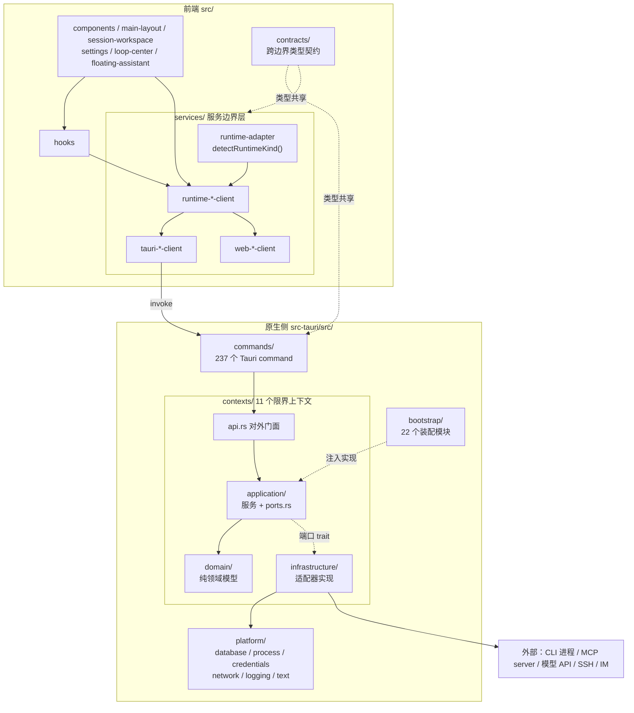

# 架构总览

> **一句话概括**：React 组件只依赖服务边界层，服务边界层按运行时分派到三种实现，桌面实现经 Tauri command 进入 Rust 侧的 11 个限界上下文，每个上下文都是端口-适配器结构，由 `bootstrap/` 在启动时装配。

## 设计目标与约束

**四条约束决定了整体形状**，它们写在 `AGENTS.md` 里并由机器强制执行：

| 约束 | 后果 | 强制层 |
|---|---|---|
| React 组件**禁止**直接调用 Tauri `invoke()` | 必须有服务边界层；组件可在浏览器中独立测试 | 代码评审 + 架构测试 |
| 桌面实现与 Web 实现**接口必须一致** | 新增能力要同时改两处 | TypeScript 类型 |
| CLI 检测、启动路由、SQLite、会话状态**留在 Rust 侧** | 前端不承载领域逻辑 | 代码评审 |
| 单文件**不超过 300 行**（ESLint `max-lines`） | 强制模块拆分 | ESLint error |

## 分层全貌

**依赖方向是单向的**：`domain` 不依赖任何外层；`application` 定义端口 trait 但不知道实现；`infrastructure` 实现端口并触碰外部世界；`bootstrap` 在启动时把实现注入进来。

## 三种运行时

**运行时种类由 `RuntimeKind` 定义**（`src/services/runtime-adapter.ts:3`）：

| 运行时 | 用途 | 原生能力 |
|---|---|---|
| `tauri` | 桌面客户端 | 完整 |
| `web-mock` | 浏览器，模拟数据 | 无 |
| `web-http` | 浏览器，经 HTTP 后端 | 取决于后端 |

**检测按固定优先级进行**（`runtime-adapter.ts:19-33` 的 `detectRuntimeKind`）：

1. `window.__VANEHUB_RUNTIME__` 显式指定
2. `window.__TAURI_INTERNALS__` 存在 → `tauri`
3. `window.__VANEHUB_HTTP_BASE_URL__` 存在 → `web-http`
4. 都没有 → `web-mock`

**显式覆盖排在最前**，这样 Playwright 截图场景可以钉死运行时，不依赖环境推断。

**`web-http` 在 `RuntimeAdapterSet` 中是可选字段**（`runtime-adapter.ts:5-9` 的 `webHttp?: T`）——并非每个服务都提供 HTTP 实现。

## 运行时边界

| 能力 | tauri | web-mock |
|---|---|---|
| CLI 子进程启动 | 是 | 否 |
| PTY 终端 | 是 | 否 |
| SQLite 持久化 | 是 | 否 |
| 文件系统访问 | 是 | 否 |
| 系统凭据存储 | 是 | 否 |
| SSH / IM 网络连接 | 是 | 否 |
| 托盘 / 通知 / 自启 | 是 | 否 |
| 权限拦截 | 是 | 否 |
| 执行追踪采集 | 是 | 否 |
| 界面与交互逻辑 | 是 | 是 |

**Web/mock 实现不得声称原生副作用**——这条要求写在用户指南规范里（`openspec/specs/user-guide-documentation/spec.md:17`）。

## 启动装配

**`bootstrap/` 有 22 个模块**，与上下文及其子域一一对应：`agent_runtime`、`cli`、`cli_config`、`cli_parameters`、`communications`、`desktop`、`execution_observability`、`extensions`、`managed_mcp_relay`、`mcp`、`operations`、`permissions`、`plugin_integrations`、`prompt_hooks`、`retrieval`、`runtime`、`scheduled_tasks`、`sdk`、`sessions`、`skills`、`ssh_connections`、`workspaces`。

**`bootstrap/runtime.rs` 是总装入口**，其中文注释说明了职责（`runtime.rs:66-71`）：

> Tauri 应用初始化回调函数——负责**组装所有领域 API、初始化数据库、注册状态管理、启动后台任务**。

### 启动时的三件事

| 事项 | 说明 |
|---|---|
| 数据库初始化 | 建池、跑全部迁移、开外键、播种内置数据 |
| 依赖注入 | 把 `infrastructure` 的实现注入各上下文的 `application` |
| 后台任务 | 见下 |

**后台任务之一是 Agent 终端空闲清理**（`runtime.rs:328-331`）：**每分钟检查一次，清理空闲超过 2 小时的终端会话。**

### 数据目录可覆盖

**环境变量 `VANEHUB_APP_DATA_DIR` 可自定义数据目录**（`runtime.rs:345-350`），但**必须是绝对路径**——相对路径直接报错，空值退回默认。

**这为并行开发提供了隔离手段**：不同 worktree 指向不同数据目录，可以规避共享 SQLite 带来的迁移版本冲突，见 [开发环境搭建](../03-development/setup.md#迁移版本号冲突)。

### 启动阶段的日志

**正式日志系统初始化之前另有一套启动日志**（`runtime.rs:364-365`）——用于记录启动过程本身的错误与警告。没有它，"日志系统起不来"这类故障将无从诊断。

## 架构约束的机器强制

**`src-tauri/src/contract_tests.rs` 用 `syn` 解析仓库自身的 Rust 源码做静态断言**，这是本项目最有特色的一层保护。

| 测试 | 行号 | 断言内容 |
|---|---|---|
| `every_tauri_command_is_registered_exactly_once` | `:91` | 遍历所有 Rust 源文件，找出 `#[tauri::command]`，验证每个在注册表中**恰好出现一次** |
| `*_command_registration_and_frontend_invokes_keep_stable_names` | `:156`–`:319` | 按域验证命令注册名与前端 `invoke` 调用点的名称一致 |
| `operation_contract_keeps_lowercase_enums_and_camel_case_fields` | `:10` | DTO 序列化形态稳定 |
| `operation_contract_exposes_optional_execution_correlation` | `:36` | 执行关联字段存在 |
| `mcp_contract_keeps_transport_and_scope_values` | `:58` | MCP 传输与作用域取值稳定 |
| `command_error_contract_remains_a_display_string` | `:80` | 错误跨边界仍是可显示字符串 |

**这解决了一类靠 review 很难拦住的问题**：新增命令忘了注册（运行期才发现）、注册了两次、前端 invoke 名写错。`syn` 的 `span-locations` feature 让断言能指出具体位置。

**前端侧有对应机制**：`src/contracts/contract-conformance.test.ts`，由 `npm run contracts:check` 单独执行，CI 中是独立门槛。

**根 crate 还有另外三组测试**（`lib.rs:13-19`）：`migration_fixture_tests`（迁移夹具）、`native_lifecycle_tests`（原生生命周期）、`remote_terminal_migration_tests`（远程终端迁移）。

## 功能与限界上下文的对应

**从"我要改哪个功能"反查"该进哪个上下文"**（`src-tauri/src/contexts/mod.rs:3-13`）：

| 限界上下文 | 承载的功能 | 实现详解 |
|---|---|---|
| `sessions` | 会话、分类、消息、聊天配置、工作区标签页、导出、**定时任务** | [会话](sessions.md)、[自动化与洞察](automation.md) |
| `agent_runtime` | Agent 目录、CLI 进程、终端、群聊席位、Loop、记忆、个性化、专家角色、原生 API Agent | [群聊](group-chat.md)、[Loop](loop-engineering.md)、[个性化](personalization.md)、[原生 API Agent](native-agent.md) |
| `permissions` | 权限审批、授权模板、审计、Claude Code 钩子桥接 | [权限架构](permissions-architecture.md) |
| `tooling` | MCP、Skills、扩展、插件、Prompt Hooks、SDK、CLI 配置与参数（8 个子域） | [工具生态](tooling.md)、[MCP 集成](mcp-integration.md) |
| `workspaces` | 项目、worktree、路径边界、shell 与输出捕获、命令模板、文件夹打开器 | [项目与工作区](workspaces.md) |
| `ssh_connections` | SSH 连接与远程终端运行时 | [远程与 IM](remote-and-im.md) |
| `communications` | 五个 IM 连接器 | [远程与 IM](remote-and-im.md) |
| `operations` | 长时操作的排队、状态与日志 | [自动化与洞察](automation.md) |
| `execution_observability` | 执行追踪、Span 存储、采集策略、保留清理 | [可观测性架构](observability-architecture.md) |
| `retrieval` | 记忆池的混合检索（服务于原生 API Agent） | [原生 API Agent](native-agent.md) |
| `desktop` | 设置、悬浮助手、托盘、启动项、网络代理、前端日志上报 | [自动化与洞察](automation.md) |

## 各篇导航

**基础**——先读这三篇，其余各篇都建立在它们之上：

| 文档 | 讲什么 |
|---|---|
| [技术栈与选型](tech-stack.md) | 每项技术为什么选它，实际版本 |
| [限界上下文](bounded-contexts.md) | 11 个上下文的职责与边界 |
| [端口与适配器](ports-and-adapters.md) | 四层结构与依赖倒置的落地方式 |

**横切机制**——跨多个上下文的公共设施：

| 文档 | 讲什么 |
|---|---|
| [CLI 集成](cli-integration.md) | 四个 CLI 的差异如何被吸收 |
| [进程与 PTY](process-and-pty.md) | 子进程管理、Job Object、PTY、UTF-8 解码 |
| [权限架构](permissions-architecture.md) | PDP/PEP 分层与四步判定 |
| [可观测性架构](observability-architecture.md) | 四级 Span、traceparent 传播与统一日志 |
| [数据层](data-layer.md) | SQLite、连接池与迁移 |
| [前端架构](frontend.md) | React 结构与 services 层约定 |
| [MCP 集成](mcp-integration.md) | rmcp、中继与私有目录 |

**功能域实现**——单个能力从领域模型到落库的完整链路：

| 文档 | 讲什么 |
|---|---|
| [会话](sessions.md) | 会话模型、标识校验、聊天配置与推理深度钳制、归档保护、9 个标签页 |
| [多 Agent 群聊](group-chat.md) | 席位、句柄派生、**交接解析的五条防御**、三种交回意图、模型族判定 |
| [Loop 工程化运行时](loop-engineering.md) | 七态五阶段、判定优先级、十二种终止原因、**三维指纹无进展检测**、启动恢复 |
| [个性化](personalization.md) | Custom Instructions、共享记忆池、**OnePiece 代做提取**、专家角色与评审策略 |
| [原生 API Agent](native-agent.md) | 25 家 provider、调用构造、两层记忆、**记忆池混合检索与 RRF 融合** |
| [工具生态](tooling.md) | MCP、Skills 漂移检测、Prompt Hooks、**OCR/ASR/TTS 扩展**、两个受管 SDK、CLI 冲突 |
| [项目与工作区](workspaces.md) | 项目探测、worktree、**两层路径防逃逸**、shell、输出捕获与容量常量 |
| [远程与 IM](remote-and-im.md) | SSH 与 **TOFU 主机密钥**、连接池、五个 IM 连接器、七态生命周期、字段级密级 |
| [自动化与洞察](automation.md) | 定时任务与时区分工、长时操作、通知作用域、**四维 token 与幂等采集**、桌面集成 |

## 几处容易误解的地方

**这些是读代码时确认过、但从命名上看不出来的事实**——每一条都曾让人绕过弯路：

| 常见理解 | 实际情况 |
|---|---|
| 「向量检索」= 对项目代码建索引 | **只索引 `agent_memories`**——`SourceKind` 当前唯一变体是 `AgentMemory`（`retrieval/domain/document.rs:4-8`） |
| 记忆按 Agent 隔离 | **主机级共享池**，迁移 42 之后读取不再按 `agent_id`/`folder` 过滤 |
| CLI Agent 自己提取记忆 | **由 OnePiece 代劳**；未配置 OnePiece provider 则不产生记忆（`memory_extraction_gateway.rs:12-19`） |
| 「本地扩展」= 通用插件 | **是 OCR / ASR / TTS 三类本地 AI 框架**（PaddleOCR、faster-whisper、sherpa-onnx） |
| 定时任务属于 `operations` 上下文 | **实现在 `sessions`**，因为它的产物是会话 |
| `Trusted` 比 `Yolo` 更严格 | **两者策略规则完全相同**，只在赋予时的确认强度上有别（`template.rs:51-57`） |
| `Readonly` 模板禁止一切 | **`file.read` 与 `memory.write` 恒为放行**，模板只区分 `shell.exec` 与 `file.write` |

## 已知取舍

- **`tooling` 是元上下文** —— 它下辖 8 个各自独立的子域，而非单一领域，边界不如其他上下文清晰。
- **`agent_runtime` 明显偏大** —— 46 个命令文件、`infrastructure/` 下近 50 个文件，同时承载 Agent 目录、CLI 进程、终端、群聊、Loop、记忆、原生 Agent。这是当前最大的聚合点。
- **`web-http` 覆盖不完整** —— 可选字段意味着部分能力只有 tauri 与 web-mock 两种实现。
- **上下文边界靠约定而非编译器** —— 端口都是 `pub(crate)`，跨上下文误用 domain 类型在编译期不会报错。
- **迁移版本号跨分支易冲突** —— 见 [数据层](data-layer.md#迁移版本号的冲突风险)。
- **mock 数据需与原生种子手工同步** —— `src/services/mock-agent-data.ts` 与 `schema.rs:17` 的 `AGENTS` 是两份数据。
