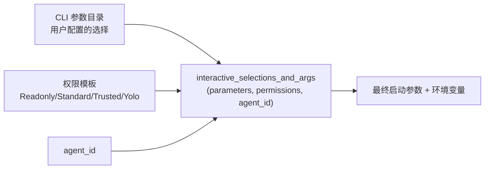
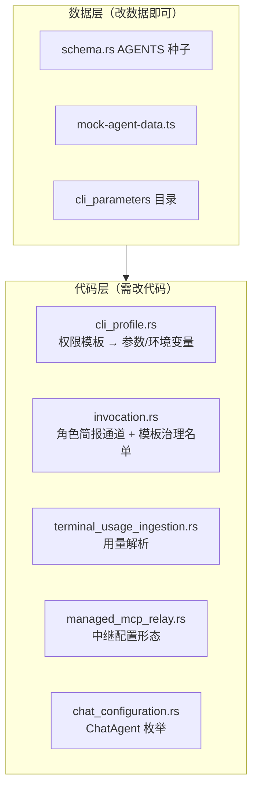

# CLI 集成：四个 CLI 的差异如何被吸收

> **没有统一的 `AgentAdapter` trait。**四个 CLI 的差异不是靠一个多态接口消化的，而是靠"数据驱动的目录 + 若干处按 agent_id 分派的显式特例"。理解这一点是理解本项目 CLI 集成的关键。

## 先澄清一个常见误解

**`AgentAdapter` 与 `ContextInjector` 这两个 trait 在代码中不存在。**它们只出现在两份归档设计稿里：

- `openspec/changes/archive/2026-08-06-add-personalization-settings/design.md`
- `openspec/changes/archive/2026-08-06-add-cli-custom-instructions-injection/design.md`

**设计稿的命名没有原样落地。**实际实现散在 `agent_runtime/infrastructure/` 的若干具体文件里，且不构成单一抽象。

**为什么值得单独说明**：读归档设计稿理解架构是很自然的做法，但在这个项目里会被误导。**以代码为准。**

## 设计目标与约束

| 目标 | 手段 |
|---|---|
| 新增 Agent 不改核心代码 | Agent 目录数据化（种子表 + provider 目录 JSON） |
| 权限策略统一表达 | 模板 → 各 CLI 的启动参数 / 环境变量 / 钩子 |
| 各 CLI 的本地概念不被强行统一 | `Action` 用开放 `String` newtype 而非封闭枚举 |
| 用量口径差异各自处理 | 四条独立的摄取函数，不抽象 |
| 角色不被上下文压缩丢掉 | 优先走 CLI 的 system-prompt 通道 |

## 数据化的 Agent 目录

**Agent 不是代码里的枚举，而是数据库中的行。**

| 层 | 位置 |
|---|---|
| 原生种子 | `agent_runtime/infrastructure/schema.rs:17` 的 `const AGENTS: [SeedAgent; 5]` |
| Web/mock 镜像 | `src/services/mock-agent-data.ts:3-57` |
| 领域标识 | `agent_runtime/domain/catalog.rs` 的 `AgentId`（`String` newtype） |

**`AgentId::parse` 接受任意非空字符串**（`catalog.rs:6-13`），不做白名单校验——这是"目录可扩展"的基础。

**交互模式与启动方式是封闭枚举**（`catalog.rs:18-45` 的 `InteractionMode`、`:49-55` 的 `LaunchKind`）：`browser`、`native-desktop`、`cli`、`api`。**`LaunchKind` 另有 `Other(String)` 变体作为逃生舱**——启动方式可能出现目录之外的形态，交互模式则不会。

**但聊天配置层是封闭的**（`sessions/domain/chat_configuration.rs:4-10` 的 `ChatAgent`）：只认 `Claude`、`Codex`、`Gemini`、`OpenCode`、`OnePiece` 五种，未知报 `UnsupportedChatAgent`。

**两处松紧不同是有道理的**：Agent 目录只需要能标识，聊天配置需要知道 provider 与默认模型，后者无法从任意 id 推导。

## 差异吸收点一：启动参数

**这是最核心的统一层。**`agent_runtime/infrastructure/cli_profile.rs` 的 `interactive_selections_and_args(parameters, permissions, agent_id)`（`:110`）把三样东西合成一次启动：



### 四条测试定义了全部行为

（`cli_profile.rs:254-311`）

| 测试 | 行号 | 揭示的行为 |
|---|---|---|
| `readonly_template_overrides_a_conflicting_saved_codex_selection` | `:254` | **权限模板压过用户保存的 CLI 参数选择** |
| `unassigned_agent_resolves_the_configured_default_template` | `:282` | 未单独分配模板的 Agent 落到全局默认模板 |
| `claude_code_is_never_looked_up` | `:296` | **`claude-code` 完全不走参数查表** |
| `opencode_standard_injects_the_permission_env_var` | `:311` | **`opencode` 通过注入环境变量**表达权限 |

**第一条是安全优先于便利的体现**：用户在参数页勾了某个宽松选项，但当前 Agent 是 `Readonly` 模板，模板赢。

**这四条测试把四个 CLI 的差异说清楚了**：同一个权限模板，在 Claude Code 上表现为钩子回调、在 OpenCode 上表现为环境变量、在 Codex 上表现为命令行选择项。

### 受模板治理的只有三个

**`POLICY_TEMPLATE_GOVERNED_AGENT_IDS: [&str; 3]`**（`infrastructure/providers/invocation.rs:7-12`），注释写明：

> `claude-code` 被有意排除，因为它的策略模板已经通过 `claude-code-permission-hook` 的**逐调用钩子动态强制执行**，而不是靠启动参数。

**动态钩子比静态启动参数更强**：启动参数在进程起来时就固定了，钩子可以在每次调用时重新判定。Claude Code 因此不需要也不应该走参数注入。

### 参数模型

**参数目录本身也是数据化的**（`tooling/cli_parameters.rs`）：

| 维度 | 取值 | 行号 |
|---|---|---|
| 控件类型 | `Enum`、`Boolean`、`MultiEnum`、`CustomText` | `:30-35` |
| 风险 | `Normal`、`Warning` | `:39-42` |
| 启动场景 | `Interactive`、`Chat` | `:46-49` |

**同一个 CLI 在交互式终端与对话两种场景下需要的参数不同**，因此参数带 `LaunchScope` 维度。

## 差异吸收点二：权限动作

**`Action` 被有意做成开放的 `String` newtype**（`permissions/domain/action.rs:1-6`），文件头注释给出了理由：

> 后续要接入的各 CLI 各有本地概念——**Codex 的 sandbox escalation、OpenCode 的 `external_directory` / `doom_loop`、Gemini 的工具级模型**——封闭枚举会在需要新变体时造成破坏性变更。

**这条注释同时是一份路线图**：它点名了三个尚未接入但已知存在的 CLI 本地概念。

内置五个常量（`action.rs:10-14`）：`shell.exec`、`file.read`、`file.write`、`mcp.tool`、`memory.write`。

## 差异吸收点三：角色简报的投递通道

**`build_invocation_with_role`**（`providers/invocation.rs:52-58`）处理一个容易被忽视的问题：席位的角色简报该放在哪里。

**答案是放进 CLI 自己的 system-prompt 通道，而不是普通提示词文本**：

> 简报不能作为普通提示词文本传递：**那个通道会被上下文压缩影响，长会话中角色会被丢掉，Agent 会悄悄不再扮演它。**

**没有 system-prompt 通道的 Agent 不在这里注入**——调用方退回逐轮注入，并**把该席位标记为"非压缩免疫"**，而不是让这里静默丢弃。

**这条设计把"角色会不会在长对话中失效"变成了显式的、可被上层感知的属性**，而不是一个只有跑长了才发现的隐性缺陷。

**`ProviderPromptDelivery`**（`invocation.rs:15`）就是描述这个投递通道差异的枚举。

## 差异吸收点四：进程网关

| 文件 | 职责 |
|---|---|
| `composite_process_gateway.rs` | 组合多种进程执行方式 |
| `process_adapter.rs` | CLI 进程适配，负责 `traceparent` 传播 |
| `api_process_adapter.rs` | API 路径（原生 Agent） |
| `terminal_process.rs` | PTY 运行时 |
| `terminal_wrapper.rs` | 包装脚本生成 |
| `terminal_observability.rs` | 终端追踪 |
| `terminal_usage_ingestion.rs` | 用量摄取 |
| `message_terminal_completions.rs` / `seat_turn_completions.rs` | 完成回调 |

详见 [进程与 PTY](process-and-pty.md)。

## 差异吸收点五：用量摄取

**四个 CLI 报告用量的方式完全不同，因此有四条独立路径**（`terminal_usage_ingestion.rs`）：

| 函数 | 行号 |
|---|---|
| `ingest_claude_terminal_usage` | `:29` |
| `ingest_opencode_terminal_usage` | `:66` |
| `ingest_codex_terminal_usage` | `:116` |
| `ingest_gemini_terminal_usage` | `:164` |

**Claude 的用量按项目目录组织**，另有 `claude_project_dir_name(cwd)` 做目录名推导（`:292`）；`load_terminal_usage_message_id`（`:199`）恢复已有关联。

**这里刻意没有抽象。**四个函数各自处理各自的格式。抽象一个"通用用量解析器"会把四种互不相干的格式硬塞进一个形状。**代价是新增 CLI 必须新增一条。**

**共同的输出结构是 `TerminalUsageTotals`**（`:18-23`）：`input_tokens`、`output_tokens`、`cache_read_tokens`、`cache_creation_tokens`——**统一的是结果形状，不是解析过程。**

## 差异吸收点六：受管 MCP 中继

**只对两个 Agent 启用**（`src-tauri/src/bootstrap/managed_mcp_relay.rs:110`）：

```rust,ignore
if !matches!(agent_id, "claude-code" | "codex-cli") {
    // 返回空 invocation_args，不启用中继
}
```

**两者的接入形态完全不同**（`managed_mcp_relay.rs:144-165` 的 `provider_invocation_args`）：

| Agent | 形态 |
|---|---|
| `claude-code` | 写配置文件，传 `--mcp-config <path>` |
| `codex-cli` | 传一组命令行覆盖项（`codex_overrides`），**不写文件** |

详见 [MCP 集成](mcp-integration.md)。

## 六个吸收点的分布



**数据层三处、代码层五处**——这个比例说明当前的"数据化"只覆盖了目录信息，行为差异仍需编码。

## 加一个新 CLI 需要动哪些地方

| 步骤 | 位置 | 类型 |
|---|---|---|
| 1. 加种子 | `agent_runtime/infrastructure/schema.rs` 的 `AGENTS` | 数据 |
| 2. 同步 mock | `src/services/mock-agent-data.ts` | 数据 |
| 3. 参数目录 | `tooling/cli_parameters.rs` 与 CLI 参数配置 | 数据 |
| 4. 聊天配置 | `sessions/domain/chat_configuration.rs` 的 `ChatAgent` | 代码 |
| 5. 权限映射 | `cli_profile.rs` 的 `interactive_selections_and_args` | 代码 |
| 6. 模板治理名单 | `providers/invocation.rs` 的 `POLICY_TEMPLATE_GOVERNED_AGENT_IDS` | 代码 |
| 7. 模型族 | `seat_roster.rs` 的 `family_by_agent_id` | 代码 |
| 8. 用量摄取 | `terminal_usage_ingestion.rs` 新增一条 | 代码 |
| 9. 中继（可选） | `bootstrap/managed_mcp_relay.rs` | 代码 |
| 10. Prompt Hook 绑定（可选） | `prompt_hooks/domain/binding.rs` 的 `ManagedCliAgentId` | 代码 |

**十处中七处是代码。**没有一个"注册一个新 Agent"的单一入口。

## 各 CLI 的特例汇总

| Agent | 特例 |
|---|---|
| `claude-code` | 独立钩子二进制；跳过参数查表；不在模板治理名单；启用受管中继；用量按项目目录组织 |
| `codex-cli` | 启用受管中继但用命令行覆盖项；受模板治理 |
| `opencode` | 权限走环境变量；**模型族判为 `Unknown`**（用户自配模型，声称某一族会让跨族评审建立在错误前提上，见 `seat_roster.rs:96-98`） |
| `gemini-cli` | 支持 `browser` 交互模式；受模板治理 |
| `onepiece` | 非 CLI；不接 Prompt Hook；带核心指令；为其余 Agent 代做记忆提取 |

**`claude-code` 是特例最多的一个**——它有独立二进制、跳过参数查表、单独的中继配置形态、单独的用量组织方式。

## 已知取舍

- **没有统一抽象是有意的，但代价是分散** —— 差异吸收点散在六处，新增 CLI 需要逐个走查，容易漏。
- **种子与 mock 是两份需手工同步的数据** —— 编译期不会发现二者不一致。
- **`matches!(agent_id, ...)` 这类硬编码分派散在多处** —— 没有集中的"能力矩阵"可查。
- **归档设计稿与实现命名不一致** —— 读设计稿理解架构会被误导。
- **`ChatAgent` 封闭枚举是扩展瓶颈** —— 加 CLI 必须改它，与"目录可扩展"的设计意图不一致。

## 相关文档

- [进程与 PTY](process-and-pty.md) —— 进程启动与终端
- [权限架构](permissions-architecture.md) —— 模板与判定
- [MCP 集成](mcp-integration.md) —— 受管中继
- [限界上下文](bounded-contexts.md) —— `agent_runtime` 的规模问题
- [多 Agent 群聊](group-chat.md) —— 模型族与角色简报的使用方
