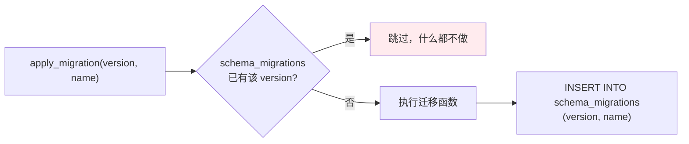

# 数据层：SQLite、连接池与迁移

> **所有持久化都在 Rust 侧的一个 SQLite 文件里**，通过 r2d2 连接池共享，schema 由版本门控的迁移序列演进，各上下文自带表定义。前端不直接连库。

## 设计目标与约束

| 目标 | 手段 |
|---|---|
| 免安装、免运维 | SQLite `bundled` feature，编译期内联，不依赖系统库 |
| 并发读写不阻塞界面 | r2d2 连接池 |
| schema 可演进且幂等 | `schema_migrations` 版本门控 |
| 各上下文自治 | schema 定义分散在各自 `infrastructure/` |
| 前端零数据库耦合 | 只经 Tauri command 访问 |

## 技术选型

| 依赖 | 版本 | 为什么 |
|---|---|---|
| `rusqlite` | `0.40`（`bundled`、`trace`） | `bundled` 让 SQLite 随二进制分发，用户无需安装；`trace` 支持语句级追踪 |
| `r2d2` | `0.8` | 通用连接池抽象 |
| `r2d2_sqlite` | `0.35` | SQLite 的池化适配 |

均见 `src-tauri/Cargo.toml`。

## 连接与路径

**`NativeDatabase` 是数据库入口**（`src-tauri/src/platform/database/mod.rs:47-80`）：

| 成员 | 行号 | 职责 |
|---|---|---|
| `new(data_dir)` | `:53` | 建池、跑迁移、开外键、播种 |
| `connection()` | `:80` | 从池中取一条 `PooledSqlite` |
| `database_path(data_dir)` | `:85` | 解析实际文件路径 |

**启动时一次性完成三件事**，由测试守住（`mod.rs:105` 的 `connection_applies_all_migrations_foreign_keys_and_seeds`）：应用全部迁移、开启外键约束、播种内置数据。

### 池的四个常量

（`platform/database/mod.rs:14-26`）

| 常量 | 值 | 作用 |
|---|---|---|
| `MAX_POOL_SIZE` | 12 | 池上限 |
| `BUSY_TIMEOUT` | 5 秒 | 遇到锁时等待而非立即失败 |
| `CONNECTION_TIMEOUT` | 5 秒 | 从池中取连接的等待上限 |
| `DATABASE_FILE_NAME` | `vanehub.sqlite` | 文件名 |

**`min_idle` 设为 1**（`:68`）——始终保留一条空闲连接，避免完全空池后首次请求付出建连成本。

### PRAGMA 在建连时设一次，不在每次取出时设

**这个细节写在注释里**（`mod.rs:56-58`）：

> Every physical connection is configured once here instead of on every checkout: WAL lets readers proceed without blocking the writer, and the busy-timeout makes contended access wait rather than fail immediately.

```rust,ignore
let manager = SqliteConnectionManager::file(&db_path).with_init(|connection| {
    connection.busy_timeout(BUSY_TIMEOUT)?;
    connection.query_row("PRAGMA journal_mode=WAL", [], |_row| Ok(()))?;
    connection.pragma_update(None, "foreign_keys", "ON")?;
    Ok(())
});
```

**三条设置各有目的**：

| 设置 | 解决什么 |
|---|---|
| `busy_timeout` | 争用时等待，而不是立刻报 `SQLITE_BUSY` |
| `journal_mode=WAL` | 读不阻塞写，写不阻塞读 |
| `foreign_keys=ON` | SQLite **默认关闭**外键约束，必须显式打开 |

**第三条特别容易忘**：SQLite 的外键默认不生效，而且是**每连接**的设置，不是每数据库。放在 `with_init` 里意味着池中每条物理连接都带上它；写在别处则会漏掉后续新建的连接。

### 迁移与播种在池共享之前完成

**注释说明了为什么这样安全**（`mod.rs:71-72`）：

> Migration and seeding are one-time work. `new` runs once during bootstrap, before the pool is shared, so this happens exactly once for the database.

`new()` 从池里取一条连接跑完迁移和播种后 `drop` 掉，此时 `NativeDatabase` 尚未交给任何上下文，**不存在并发跑迁移的可能**。

**另两条测试守住关键性质**：

| 测试 | 行号 | 断言 |
|---|---|---|
| `reopening_is_idempotent_and_preserves_existing_records` | `:156` | 重开幂等且保留既有记录 |
| `pooled_connections_serve_concurrent_readers_and_writers` | `:188` | 池化连接支持并发读写 |

**数据目录可通过环境变量覆盖**：`VANEHUB_APP_DATA_DIR`，必须为绝对路径（`bootstrap/runtime.rs:345-350`）。

## 迁移机制

**版本表在第一条迁移里建立**（`platform/database/migrations.rs:9-11`）：

```sql
CREATE TABLE IF NOT EXISTS schema_migrations (
    version INTEGER PRIMARY KEY,
    name ...
)
```

**每条迁移由 `apply_migration(conn, version, name, f)` 施加**（`migrations.rs:625-644`）：



**门控逻辑本身很短**（`migrations.rs:629-647`）：

```rust,ignore
let applied = conn
    .query_row(
        "SELECT 1 FROM schema_migrations WHERE version = ?1",
        params![version],
        |_| Ok(()),
    )
    .optional()?
    .is_some();
if applied {
    return Ok(());
}

migration(conn)?;
conn.execute(
    "INSERT INTO schema_migrations (version, name) VALUES (?1, ?2)",
    params![version, name],
)?;
```

**关键在 `WHERE version = ?1`——只看版本号，不看 `name`**。这就是下一节那个陷阱的全部成因：号码占了，内容是谁的无所谓。

**当前最高版本为 48**，`migrations.rs` 中约 46 处 `apply_migration` 调用。

### 还有一个事务型变体

**`apply_transactional_migration`（`migrations.rs:649`）把迁移函数与版本登记包在同一个事务里**，当前有 4 处使用。

**普通版本不带事务**：迁移函数执行成功后才写 `schema_migrations`，但两步之间若进程崩溃，迁移已生效而版本未登记——下次启动会重跑。**这要求普通迁移必须写成幂等的**（`CREATE TABLE IF NOT EXISTS`、`ALTER TABLE` 前先查列）。

**需要多步且中途状态不可接受的迁移才用事务版本**，代价是长事务期间持有写锁。

## 迁移版本号的冲突风险

**这是本项目一个真实且已发生过的陷阱**，代码注释里留了完整记录（`migrations.rs:267-270`）：

> `45-48, not 43-46`：`retrieval-vector-index` 与 `permissions-core` 在本分支开着的时候以 43、44 进入了 main，所以这四条要往后挪。`apply_migration` 是版本门控的——**第二个占用同一号码的迁移永远不会运行，它本该创建的表在启动时直接缺失。**

**后果的严重性在于它不报错**：版本号被占用时迁移被静默跳过，故障表现为运行期的 `no such table: X`，而不是启动时的迁移失败。

**并行开发时的具体风险**：多个 worktree 或分支共用同一个 SQLite 文件。A 分支先写入版本 45，B 分支也用 45，则 B 的迁移在这台机器上永远不会执行。

**诊断方法**：直接查 `schema_migrations` 表，看该版本号对应的 `name` 是不是自己那条。**不要先假设是代码回归。**

**两种规避手段**：

1. 新增迁移前确认 `main` 上已用到的最大版本号，并留意其他在途分支
2. 用 `VANEHUB_APP_DATA_DIR` 让不同 worktree 指向不同数据目录

## 清理型迁移

**迁移不仅要能向前建，还要能收拾旧版本的残留。**`migrations.rs:306` 处理的就是这类情况：

> 删除版本 27 在**真正执行过它的安装**上留下的东西；全新数据库上则是空操作。

这类迁移的写法必须同时兼顾两种数据库：跑过旧版本的和全新的。

## 表清单

**全库约 70 处 `CREATE TABLE` 定义**（含测试夹具，以及后续迁移中被删除的表，例如 `coordination_runs` 已由迁移 45 删除），按上下文归属：

### sessions

`sessions`、`messages`、`session_categories`、`session_details`、`scheduled_tasks`、`usage_records`

### agent_runtime

| 分组 | 表 |
|---|---|
| Agent 目录 | `agents`、`agent_capability_tags`、`agent_modes` |
| 记忆 | `agent_memories` |
| 角色 | `expert_roles` |
| 原生 Agent | `onepiece_provider_profiles` |
| 协作 | `workflow_state` |
| Loop | `loop_definitions`、`loop_runs`、`loop_iterations`、`loop_evidence` |

### permissions

`agent_principals`、`permission_grants`、`approval_audit`

### execution_observability

`execution_runs`、`execution_spans`、`execution_events`、`execution_links`、`execution_observability_settings`

### tooling

| 子域 | 表 |
|---|---|
| MCP | `mcp_servers`、`mcp_transport_migration_journal` |
| Skills | `skills`、`skill_agent_bindings`、`skill_agent_mount_paths`、`skill_api_agent_bindings`、`skill_drift_snapshots`、`deleted_builtin_skills` |
| Prompt Hooks | `prompt_hooks_user`、`prompt_hook_drafts`、`prompt_hook_versions`、`prompt_hook_overrides`、`prompt_hook_executions`、`prompt_hook_traces` |
| SDK | `sdk_operation_logs` |
| CLI | `cli_tool_status`、`cli_config_profiles`、`cli_config_applied_state`、`cli_parameter_settings` |
| 扩展 | `extension_framework_state` |

**`deleted_builtin_skills` 值得一提**：内置 Skill 被删除这件事本身需要持久化，否则每次启动都会把它重新装回来。

**Prompt Hooks 有 6 张表**——草稿、版本、覆盖、执行、追踪各自独立，说明它有完整的版本管理与执行留痕。

### workspaces

`known_projects`、`known_remote_workspaces`、`terminal_command_templates`、`terminal_command_runs`、`terminal_output_chunks`、`terminal_capture_settings`

### ssh_connections

`ssh_connections`、**`ssh_host_trust`**

**`ssh_host_trust` 就是 TOFU 主机密钥库**——记录首次接受的主机密钥指纹，后续连接据此判定 `FirstSeen` 还是 `Changed`，见 [远程与 IM](remote-and-im.md#主机密钥校验)。

### communications

`im_connector_configs`、`im_connector_checkpoints`、`im_credential_refs`、**`im_inbound_dedup`**、`im_routing_settings`、`im_session_bindings`、`im_wechat_reply_contexts`

**`im_inbound_dedup` 解决 IM 平台的重复投递问题**——长连接与轮询都可能重复推送同一条消息，去重表保证不会重复触发 Agent。

**`im_credential_refs` 存的是引用而非凭据本身**——真实凭据在系统密钥链里，见 [远程与 IM](remote-and-im.md#字段级密级)。

### retrieval / desktop / 核心

`retrieval_documents`、`retrieval_configuration`；`settings`、`floating_assistant_config`；`schema_migrations`

## 代表性表结构

### agent_memories

（`agent_runtime/infrastructure/memory_schema.rs:10-19`）

| 列 | 说明 |
|---|---|
| `id` | 主键 |
| `agent_id` | 外键 → `agents(id)` |
| `folder` | 工作区；**空字符串是"无工作区"哨兵** |
| `content` / `source` | 内容与来源 |
| `created_at` / `updated_at` | 时间戳 |

`folder` 用空串哨兵而不是可空列，是为了让 `WHERE folder = ?` 统一工作、不必分支处理 `IS NULL`（`memory_schema.rs:4-6`）。

### execution_spans

（列见 `execution_observability/infrastructure/queries.rs:14`）

`run_id`、`span_id`、`trace_id`、`parent_span_id`、`name`、`status`、`fidelity`、`started_at`、`ended_at`、`error_classification`、`attributes_json`

**采集策略挂在 `execution_runs.capture_policy`**——策略是 run 级而非 span 级。

### sessions 的席位列

**席位存 JSON 列而非关联表**（`sessions/domain/session_seat.rs:1-5`），理由是 `SESSION_SELECT` 是列表、搜索、读取的热路径，为一个多数会话用不到的功能加 join 会让每次读都变慢。

**代价是可查询性**：按席位检索会话需要额外手段。

## 演进模式：索引替换要另起迁移

**记忆共享池化时的做法值得作为范例**（`memory_schema.rs:28-32`）：

原先按 `(agent_id, folder, created_at DESC)` 的复合索引在读取不再过滤后失去意义。替换动作被写成**独立的版本化迁移** `apply_memory_shared_pool_schema`，而不是回头修改 `apply_memory_schema`——因为后者已经在存量数据库上执行过，直接改它对那些安装不会生效。

**这条经验可以推广**：任何"修改已发布迁移"的冲动都应该转成"新增一条修正迁移"。

## 已知取舍

- **单文件数据库被所有 worktree 共享** —— 这是版本号冲突问题的放大器；可用 `VANEHUB_APP_DATA_DIR` 隔离。
- **迁移只前进不回滚** —— 没有 down 迁移；写错了只能再加一条修正迁移。
- **schema 分散在各上下文** —— 边界清晰，但想看全库结构必须跨多个文件。
- **席位 JSON 列牺牲了可查询性** —— 换来了热路径读性能。
- **外键在连接建立时开启** —— 依赖每条池化连接都正确配置。
- **`mcp_transport_migration_journal` 这类"迁移日志表"** —— 说明某些数据迁移需要记录进度以便断点续做，增加了 schema 复杂度。

## 相关文档

- [限界上下文](bounded-contexts.md) —— 各上下文与表的归属
- [端口与适配器](ports-and-adapters.md) —— `*Repository` 端口
- [开发环境搭建](../03-development/setup.md) —— 迁移冲突的排查方法
- [可观测性架构](observability-architecture.md) —— Span 存储与保留
