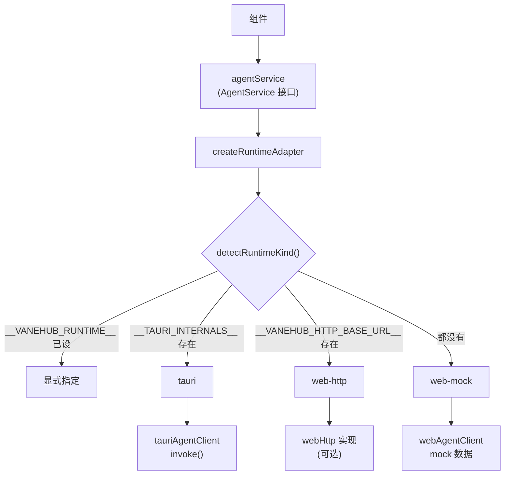
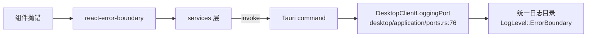

# 前端架构与 services 层约定

> **组件只依赖服务边界层。**`src/services/` 是唯一允许被组件依赖的一层，它按运行时把调用分派到 `tauri-*` 或 `web-*` 实现。组件里出现 `invoke()` 是被禁止的。

## 设计目标与约束

| 约束 | 来源 | 后果 |
|---|---|---|
| 组件禁止直接调用 Tauri `invoke()` | `AGENTS.md` | 组件可在 jsdom 中独立测试，无需 Tauri 环境 |
| `tauri-*-client` 与 `web-*-client` 接口必须一致 | `AGENTS.md` | 新增能力要同时改两处 |
| 函数组件 + Hooks，禁止 class component | `AGENTS.md` | — |
| 单文件不超过 300 行 | ESLint `max-lines`（物理行） | 强制拆分；存量超限文件在豁免清单且禁止新增 |
| 禁止 `any` 与 `@ts-ignore` | `AGENTS.md` | 需要绕过时用 `@ts-expect-error` 并写明原因 |
| 组件不得直接写本地日志文件 | 日志规范 | 前端错误经 service boundary 上报到原生日志服务 |
| 不引入状态管理库 | `AGENTS.md` | 只用 React 内置 state / context |
| 不引入 UI 组件库 | `AGENTS.md` | 只用 Tailwind + Radix Slot + cva |

## 目录结构

```text
src/
├── components/          # 纯展示型组件，不直接依赖 Tauri API
│   └── chat/            # 对话相关：消息、发言者、席位补全、轮次状态
├── main-layout/         # 主界面：侧边栏、创建会话、席位、活动栏、定时任务
├── session-workspace/   # 会话工作区：9 个标签页 + 席位切换
├── settings/            # 设置中心：pages/ 按功能域分
├── loop-center/         # Loop 中心（19 个文件）
├── floating-assistant/  # 悬浮助手
├── notifications/       # 通知中心与 toast
├── services/            # 服务边界层（唯一允许被组件依赖的一层，144 个文件）
├── contracts/           # 跨边界类型契约
├── hooks/               # 自定义 hook
├── lib/                 # 纯工具函数
├── i18n/                # 多语言（5 种语言）
├── types/ config/ theme/ assets/
```

## 服务边界层的三件套模式

**每个能力域由三到四个文件构成**，以 Agent 服务为例：

| 文件 | 角色 |
|---|---|
| `agent-service.ts` | **接口定义**（`AgentService`），组件面向它编程 |
| `tauri-agent-client.ts` | 桌面实现，内部调用 `invoke()` |
| `web-agent-client.ts` | Web/mock 实现，用 `mock-agent-data.ts` 的数据 |
| `runtime-agent-client.ts` | **装配**，按运行时选实现并导出单例 |

装配代码极简（`src/services/runtime-agent-client.ts:6-13`）：

```ts
export function createAgentService(): AgentService {
  return createRuntimeAdapter({
    tauri: tauriAgentClient,
    webMock: webAgentClient,
  });
}

export const agentService = createAgentService();
```

**同一模式覆盖十余个域**：`runtime-mcp-client`、`runtime-permissions-client`、`runtime-settings-client`、`runtime-im-client`、`runtime-sdk-client`、`runtime-workspace-client`、`runtime-extension-client`、`runtime-operation-client`、`runtime-ssh-connection-client`、`runtime-execution-observability-client`、`runtime-plugin-integration-client`、`runtime-floating-assistant-client`。

## 运行时选择



**三种运行时**（`src/services/runtime-adapter.ts:3` 的 `RuntimeKind`）：`tauri`、`web-mock`、`web-http`。

**`webHttp` 是可选字段**（`:5-9`），并非每个域都提供。

**显式覆盖优先级最高**（`:19-21`）——`window.__VANEHUB_RUNTIME__` 让 Playwright 截图场景可以钉死运行时。

## 错误规范化

**所有服务调用经统一包装**（`runtime-adapter.ts:1` 引入的 `withServiceErrorNormalization`，实现在 `src/services/service-error.ts:37`）。

**错误被归一到五种码**（`service-error.ts:1` 的 `ServiceErrorCode`）：

| 码 | 含义 |
|---|---|
| `validation` | 入参校验失败 |
| `not-found` | 目标不存在 |
| **`unsupported-runtime`** | **当前运行时不支持该能力** |
| `runtime` | 运行时错误 |
| `unknown` | 未分类 |

**`unsupported-runtime` 是这套设计的关键**（`service-error.ts:15` 的 `unsupportedRuntimeError`）：Web/mock 下调用桌面专属能力时，组件拿到的是一个明确的、可判别的错误码，而不是一个含糊的失败。界面因此能给出"此功能需要桌面版"这类准确提示。

**`withServiceErrorNormalization` 包装整个服务对象**，因此组件面对的错误形状一致，无论底层是 Tauri IPC 失败还是 mock 抛错。

## 类型契约

**`src/contracts/` 存放跨边界的类型契约**：`agent.ts`、`chat.ts`、`execution-observability.ts`、`folder-opener.ts`、`im.ts`、`loop.ts`、`mcp.ts`、`operation.ts`、`sdk.ts`。

**契约有一致性测试**：`src/contracts/contract-conformance.test.ts`，由 `npm run contracts:check` 单独执行，CI 中是独立门槛。

**Rust 侧有对应断言**（`src-tauri/src/contract_tests.rs`）：验证 DTO 保持小写枚举 + camelCase 字段、命令注册名与前端 `invoke` 名一致。**两侧一起构成跨语言的契约保护。**

## 纯逻辑与组件分离

**大量业务逻辑被抽成不带 React 依赖的纯模块**，因而可单元测试。

### services/ 中的纯逻辑

| 模块 | 职责 |
|---|---|
| `mention-routing.ts` | `@` 提及路由解析 |
| `message-speaker.ts` | 消息发言者解析 |
| `seat-briefing.ts` / `seat-context.ts` / `seat-mutation.ts` / `session-seats.ts` | 席位相关 |
| `human-handoff.ts` | 人工交接意图 |
| `model-family.ts` / `agent-model-family.ts` | 模型族判定（**与 Rust 侧 `ModelFamily` 镜像**） |
| `mcp-validation.ts` / `mcp-import.ts` / `mcp-tool-validation.ts` | MCP 校验与导入 |
| `cli-parameter-catalog.ts` | CLI 参数目录 |
| `sdk-versioning.ts` | SDK 版本比较 |
| `loop-run-polling.ts` | Loop 轮询 |
| `reviewer-recommendation.ts` | 评审推荐（依赖模型族） |
| `expert-role-runtime.ts` | 专家角色运行时 |
| `chat-configuration.ts` / `chat-events.ts` | 聊天配置与事件 |
| `external-url.ts` | 外部链接处理 |

### lib/ 中的工具

| 模块 | 职责 |
|---|---|
| `bounded-text-buffer.ts` | **有界文本缓冲（与 Rust 侧 `BoundedTextBuffer` 同名同责）** |
| `virtual-list.ts` | 虚拟列表计算 |
| `scheduled-task-recurrence.ts` | 定时任务周期计算 |
| `session-path.ts` | 会话路径 |
| `skill-management.ts` | Skill 管理逻辑 |
| `agent-visual-identity.ts` | Agent 视觉标识 |
| `agents.ts` / `utils.ts` | 通用 |

### hooks/

`use-active-session-chat.ts`、`use-session-speakers.ts`、`use-loop-queries.ts`、`loop-query.ts`、`use-debounced-value.ts`、`use-media-query.ts`

**约定是：能不依赖 React 就不依赖**。这类文件几乎都配有同名 `.test.ts`。

## 多语言

**支持 5 种语言**（`src/i18n/supported-locales.ts:14-38`）：`zh-CN`、`en`、`zh-TW`、`ja`、`ko`。

**资源完整度一致**——五个 `locales/*.json` **各含 2197 个键**，无缺漏。

**每个语言定义带三项元数据**：`id`、`labelKey`（形如 `basic.language.<id>`）、`direction`（`ltr` / `rtl`），并用 `load()` 异步加载。

### 三道 i18n 守卫测试

| 测试 | 作用 |
|---|---|
| `i18n-resource-parity.test.ts` | 各语言资源键必须对齐，防止漏译 |
| `i18n-visible-text-guardrail.test.ts` | **防止硬编码可见文本**绕过 i18n |
| `i18n-representative-surfaces.test.tsx` | 代表性界面的渲染校验 |

**第二道尤其关键**：没有它，新代码里直接写中文字符串不会被任何机制发现，多语言支持会随时间悄悄腐化。

> **注意**：根 `README.md` 称日语 UI 资源为「Planned」，该说法已过时——`ja.json` 与其他语言键数完全一致，日语 UI 已完整支持。

## 性能处理

| 手段 | 位置 |
|---|---|
| 标签页懒加载 | 会话工作区除 `chat` 外 8 个标签按需 `import()`（`session-tabs.tsx:16-24`） |
| 长列表虚拟化 | `@tanstack/react-virtual` + `lib/virtual-list.ts` |
| 有界文本缓冲 | `lib/bounded-text-buffer.ts`，终端输出不无限增长 |
| 防抖 | `hooks/use-debounced-value.ts` |
| 分包检查 | `npm run build` 末尾跑 `scripts/check-frontend-chunks.mjs` |
| 懒加载测试 | `src/frontend-lazy-loading.test.ts` |

**构建产出的实测数据**：16 个懒加载 chunk，主静态闭包 108.2 KiB gzip。

## 日志与错误上报

**组件不写本地日志文件**。前端错误经 `react-error-boundary` 捕获后，通过服务边界上报到原生日志服务：



对应的日志类型标记在 `src-tauri/src/platform/logging.rs:52`。

**另有启动失败处理**：`src/bootstrap-failure.ts` 处理应用启动阶段的失败展示。

## 已知取舍

- **接口一致性靠人工维持** —— `tauri-*` 与 `web-*` 实现同一 TS 接口，编译期能查签名，但**行为差异查不出来**（例如 web 实现返回空数组而 tauri 实现抛错）。
- **`web-http` 覆盖不完整** —— 可选字段意味着部分能力在该运行时下不可用。
- **300 行硬规则带来文件碎片** —— 创建会话对话框被拆成 `create-session-dialog.tsx`、`-content.tsx`、`-utils.ts`、`-agents.ts`、`-workspace-sections.tsx`、`-remote-workspace-section.tsx`、`-agent-section.tsx` 等多个文件。
- **mock 数据需与原生种子同步** —— `mock-agent-data.ts` 与 `schema.rs:17` 的 `AGENTS` 是两份需手工保持一致的数据。
- **前后端有多处镜像实现** —— `model-family.ts` ↔ Rust `ModelFamily`、`bounded-text-buffer.ts` ↔ Rust `BoundedTextBuffer`、`builtin-expert-roles.ts` ↔ Rust `builtin_expert_roles.rs`、专家角色校验两侧各一份。**一致性靠约定与测试，不靠代码生成。**
- **`@tanstack/react-query` 与"不引入状态管理库"的边界** —— 它管异步数据缓存而非应用状态，这条边界靠约定维持。

## 相关文档

- [架构总览](README.md) —— 三种运行时与边界
- [端口与适配器](ports-and-adapters.md) —— 原生侧的同构分层
- [限界上下文](bounded-contexts.md) —— 命令层对应关系
- [技术栈](tech-stack.md) —— 前端依赖版本与选型
