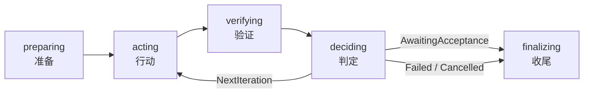
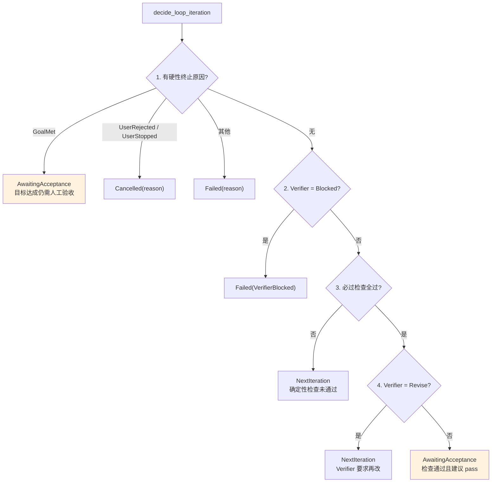

# Loop 工程化运行时

> **给定目标和验收命令，让 Agent 自己迭代到达成为止**：Loop 是"行动 → 验证 → 判定"的自动循环，带迭代上限、超时预算、无进展检测、崩溃恢复和强制的人工验收。

## 这一层解决什么问题

**Loop 解决的是"改完要跑测试，测试挂了要再改"这种反复循环的手工成本**。你定义目标与必过检查（例如 `npm run lint` 和 `npm test`），Loop 驱动 Worker 席位执行、Verifier 席位评估，按判定结果决定继续迭代还是收尾。

与 [多 Agent 群聊](group-chat.md) 的区别：群聊是会话内的发言权流转，由 Agent 自己 `@` 决定下一位；Loop 是**目标驱动的自动循环**，由运行时按阶段推进并强制执行各项限额。

## 能力与运行时边界

| 能力 | 说明 | 运行时 |
|---|---|---|
| Loop 定义 | 目标、限额、验收命令的可复用定义 | **仅桌面** |
| 五阶段循环 | 准备 → 行动 → 验证 → 判定 → 收尾 | **仅桌面** |
| Worker / Verifier | 执行与验证由不同会话角色承担 | **仅桌面** |
| 专用 worktree | 基于指定基线分支创建隔离工作区 | **仅桌面** |
| 必过检查 | 指定命令作为客观验收标准 | **仅桌面** |
| 无进展检测 | 三维指纹比对识别原地打转 | **仅桌面** |
| 限额保护 | 迭代数、单步超时、总超时、连续错误上限 | **仅桌面** |
| 强制人工验收 | 即使目标达成也需人工确认 | **仅桌面** |
| 启动恢复 | 应用重启后对中断的运行做对账 | **仅桌面** |
| 运行控制 | 暂停、取消、恢复 | **仅桌面** |
| 时间线检视 | 逐迭代查看动作与检查结果 | **仅桌面** |

## 状态与阶段

### 七种运行状态

（`src-tauri/src/contexts/agent_runtime/domain/loop_engineering.rs:4-12` 的 `LoopRunStatus`）

| 状态 | 含义 |
|---|---|
| `queued` | 已排队 |
| `running` | 执行中 |
| `paused` | 已暂停 |
| `awaiting-acceptance` | **等待人工验收** |
| `succeeded` | 成功 |
| `failed` | 失败 |
| `cancelled` | 已取消 |

### 五个阶段

（`loop_engineering.rs:53-59` 的 `LoopRunPhase`）



## 判定规则

**判定输入四项**（`domain/loop_decision.rs:23-29` 的 `LoopDecisionInput`）：必过检查是否全过、Verifier 建议、用户反馈、硬性终止原因。

**判定按严格的优先级短路**（`loop_decision.rs:44-90` 的 `decide_loop_iteration`）：



### 关键：目标达成也不会直接成功

**`GoalMet` 的结果是 `AwaitingAcceptance` 而不是 `Succeeded`**（`loop_decision.rs:47`），附带的说明就是一句话：

> Goal completion still requires human acceptance.

**这是 Loop 最重要的一条安全设计**：自动循环永远不会自己宣布成功。无论是硬性判定的目标达成，还是检查全过加 Verifier 放行，终点都是"等你确认"。

### Verifier 建议

**三种**（`loop_decision.rs:6-10` 的 `LoopVerifierRecommendation`）：`pass`、`revise`、`blocked`。

**三者的权重不同**：

| 建议 | 效果 |
|---|---|
| `blocked` | **直接失败**，不再迭代 |
| `revise` | 进入下一轮，但**必过检查未通过时优先级更高** |
| `pass` | 仅在必过检查也通过时才导向验收 |

**必过检查排在 Verifier 建议之前**（`loop_decision.rs:72-77`）：客观的确定性检查压过主观的模型判断。Verifier 说"可以了"但 lint 还挂着，照样得改。

### 四种判定结果

（`loop_decision.rs:31-36` 的 `LoopDecisionOutcome`）

| 结果 | 含义 |
|---|---|
| `NextIteration` | 继续下一轮 |
| `AwaitingAcceptance` | 转入人工验收 |
| `Failed(reason)` | 失败并附终止原因 |
| `Cancelled(reason)` | 取消并附终止原因 |

**每个判定都带人类可读的 `reason` 字符串**（`LoopDecision.reason`），因此界面上能解释"为什么停在这里"，而不只是给一个状态码。

## 终止原因

**十二种**（`loop_engineering.rs:85-97` 的 `LoopTerminalReason`）：

| 类别 | 原因 | 归入 |
|---|---|---|
| 正常达成 | `GoalMet` | `AwaitingAcceptance` |
| 用户干预 | `UserRejected`、`UserStopped` | `Cancelled` |
| 触顶 | `MaxIterations`、`TimeBudget`、`PhaseTimeout` | `Failed` |
| 执行问题 | `RuntimeErrors`、`RuntimeError`、`RecoveryRequired` | `Failed` |
| 无进展 | `NoProgress` | `Failed` |
| 验证不通过 | `VerificationFailed`、`VerifierBlocked` | `Failed` |

**只有 `GoalMet` 走验收路径，只有用户主动干预算取消**，其余一律记为失败——这个分类让事后统计"多少次真的成了"不会被噪声污染。

## 限额

**五项限额在构造时即校验**（`loop_engineering.rs:138-166` 的 `LoopLimits`）：

| 限额 | 约束 | 违反时 |
|---|---|---|
| `max_iterations` | **必须在 1–20 之间** | `InvalidLoopLimit("max iterations")` |
| `step_timeout_seconds` | 不得为 0 | `InvalidLoopLimit("timeout")` |
| `total_timeout_seconds` | **不得小于单步超时** | `InvalidLoopLimit("timeout")` |
| `max_consecutive_runtime_errors` | 不得为 0 | `InvalidLoopLimit` |
| `max_consecutive_no_progress` | 不得为 0 | `InvalidLoopLimit` |

**校验在领域层完成**，非法配置根本无法构造出 `LoopLimits`，也就进不了运行时。

## 必过检查与无进展检测

### 检查结果

**五种**（`domain/loop_progress.rs:5-11` 的 `LoopCheckOutcome`）：`passed`、`failed`、`timed-out`、`cancelled`、`error`。

每次观测记录三项（`loop_progress.rs:26-30` 的 `LoopRequiredCheckObservation`）：`command_id`、`outcome`、`exit_code`。

### 三维指纹

**目标状态被压成三个维度**（`loop_progress.rs:33-37` 的 `LoopObjectiveFingerprints`）：

| 维度 | 内容 |
|---|---|
| `diff` | 代码变更指纹 |
| `required_check_failures` | 失败检查集合的指纹 |
| `passing_required_checks` | 已通过检查的 id 集合（`BTreeSet`，内部字段） |

**指纹计算做了两项归一化**（`loop_progress.rs:59-67` 的 `fingerprint_objective_state`）：

1. **换行统一** —— `\r\n` 与 `\r` 都归一成 `\n`，跨平台的换行差异不会被误判成"有变化"
2. **观测排序去重** —— `sort()` + `dedup()`，检查执行顺序不影响指纹

`BTreeSet` 而非 `HashSet` 也是为了顺序确定——同样的输入必须给出同样的指纹。

#### 失败集的编码带长度前缀

**每个字段按 `长度:内容;` 拼接**（`loop_progress.rs:124-129` 的 `append_field`）：

```rust,ignore
fn append_field(output: &mut String, value: &str) {
    output.push_str(&value.len().to_string());
    output.push(':');
    output.push_str(value);
    output.push(';');
}
```

**这不是为了好看，是为了避免歧义**。直接用分隔符拼接的话，`("lint", "failed")` 与 `("lint:failed", "")` 可能拼出同一个串，两种不同的失败状态会得到相同指纹。带长度前缀后，任何内容都无法伪装成分隔结构。

**失败观测每项写三个字段**：`command_id`、`outcome`、`exit_code`（无退出码时写字面量 `none`）。**`exit_code` 参与指纹**意味着同一个命令以不同退出码失败会被视为状态变化。

#### 只有失败项进指纹，通过项进集合

**注意两者的处理方式不同**：失败的检查被哈希成一个串，通过的检查以 id 集合原样保留。

**因为它们回答的问题不同**：失败集只需判断「是不是同一批失败」，集合形态无所谓；通过集需要做**差集**运算来找出「这轮新过了哪个」，必须保留元素。

### 进展判定是"三选一"

**只要满足任意一条就算有进展**（`loop_progress.rs:94-122` 的 `assess_revision_progress`）：

```rust,ignore
progressed: !repeated_diff
    || !repeated_required_check_failures
    || has_new_passing_required_evidence
```

| 条件 | 含义 |
|---|---|
| diff 变了 | 代码有实质改动 |
| 失败集变了 | 失败的检查换了一批 |
| **有新通过的检查** | 之前没过的某项现在过了 |

**第三条尤其重要**：假设 Agent 修好了 lint 但没动别的文件，diff 相对上一轮可能一样、失败集也可能只少了一项——`passing_required_checks` 的差集能捕捉到这个真实进展。

**首轮无前序指纹时直接判为有进展**（`:98-105`），避免第一轮就被判无进展。

**测试名直说了边界**（`loop_progress.rs:180`）：`only_repeated_objective_state_without_new_pass_is_no_progress`——只有当三个维度全都没变化时才算原地打转。

**连续达到 `max_consecutive_no_progress` 次才以 `NoProgress` 终止**，单轮无进展不触发。

#### 重启后的第一轮比对必然判为有进展

**`rehydrate` 只恢复两个哈希，通过集合置空**（`loop_progress.rs:40-47`）：

```rust,ignore
pub(crate) fn rehydrate(diff: String, required_check_failures: String) -> Self {
    Self {
        diff,
        required_check_failures,
        passing_required_checks: BTreeSet::new(),
    }
}
```

**因为只有两个哈希被持久化**，通过集合无法从存储重建。

**直接后果**：重启后与前序指纹比对时，`previous.passing_required_checks` 是空集，于是**当前任何一项通过的检查都会被算作「新通过」**，`has_new_passing_required_evidence` 为真，整轮判为有进展。

**方向是安全的**——宁可多跑一轮，也不因为重启这个与目标无关的事件误判为原地打转。但它意味着**崩溃恢复会重置无进展计数的一次机会**：本该是第 N 次连续无进展的那一轮，重启后会被记成有进展。

**只有当所有必过检查都失败时这个偏差才不存在**（通过集为空，差集也为空）。

## Worker、Verifier 与隔离

### 双会话角色

**Loop 中的会话有两种角色**（`sessions/domain/session.rs:71-73` 的 `LoopSessionRole`）：`worker` 负责执行，`verifier` 负责验证。

**二者是独立会话**，因此验证方不会被执行方的上下文带偏——Verifier 看到的是产出与检查结果，而不是 Worker 的思考过程。

### 专用 worktree

**Loop 在独立的 Git worktree 中作业**，且比普通 worktree 多一层校验（`workspaces/application/ports.rs:52-67`）：

| 方法 | 说明 |
|---|---|
| `validate_loop_worktree(project_path, target_path, branch, base_branch)` | 创建前校验 |
| `create_loop_worktree(project_path, target_path, branch, base_branch)` | 基于指定基线分支创建 |

**多出 `base_branch` 参数与前置校验**是因为 Loop 是自动执行的——出错时没有人在旁边看着，必须先确认环境可用再动手。详见 [项目与工作区](workspaces.md#worktree)。

## 启动恢复

**应用重启后对中断的运行做对账**（`application/loop_recovery.rs:27` 的 `reconcile_startup`）：返回需要处理的 `LoopRun` 列表。

**这对应终止原因中的 `RecoveryRequired`**：进程在 Loop 运行中途被杀（崩溃、断电、强制退出），重启时这些运行不会永远挂在 `running`，而是被识别出来并做相应处置。

## 实现分布

**Loop 的代码量在 `agent_runtime` 里占比可观**：

| 层 | 文件 |
|---|---|
| 领域 | `domain/loop_engineering.rs`、`loop_decision.rs`、`loop_progress.rs` |
| 应用 | `application/loop_orchestrator.rs`（含 `_decision` / `_support`）、`loop_service.rs`、`loop_worker.rs`（含 `_prompt`）、`loop_verifier.rs`、`loop_verification.rs`、`loop_recovery.rs`、`loop_control.rs`、`loop_progress.rs`、`loop_observability.rs`、`loop_models.rs` |
| 基础设施 | `infrastructure/loop_execution_coordinator.rs`、`loop_scheduler.rs`、`loop_repository.rs`（含 `_control_tests` / `_views`）、`loop_schema.rs`、`loop_project.rs`、`loop_verification_process.rs`、`loop_generation_completions.rs` |
| 界面 | `src/loop-center/` 共 19 个文件 |

**几乎每个应用层文件都配有同名 `_tests.rs`**——`loop_orchestrator_tests`、`loop_control_tests`、`loop_progress_tests`、`loop_recovery_tests`、`loop_service_tests`、`loop_verification_tests`、`loop_verifier_tests`、`loop_worker_tests`。

## 界面入口与前端服务

### 定义 Loop

Loop 中心（`src/loop-center/loop-center.tsx`）新建定义，在定义对话框（`loop-definition-dialog.tsx`）中填写：

1. **目标** —— 要达成什么
2. **限额** —— 迭代上限（1–20）、单步与总超时、连续错误与无进展容忍次数
3. **验收命令** —— 在命令编辑器（`loop-verification-command-editor.tsx`）中添加必过检查

表单校验逻辑在 `loop-definition-form.ts`。

### 运行与控制

运行控制条（`loop-run-controls.tsx`）提供启动、暂停、取消。前端轮询逻辑在 `src/services/loop-run-polling.ts`。

**运行进入 `awaiting-acceptance` 后必须人工确认才会收尾**——这不是可选步骤。

### 检视过程

| 视图 | 文件 |
|---|---|
| 时间线（按迭代展示阶段流转） | `loop-timeline.tsx` |
| 迭代详情（动作与检查结果） | `loop-iteration-details.tsx` |
| 检视器 | `loop-inspector.tsx` |
| 检视操作 | `loop-inspection-actions.tsx` |
| 监控 | `loop-monitoring.ts` |

## 边界与限制

- **仅桌面可用** —— 依赖原生进程执行验收命令、Git worktree 与 SQLite。
- **迭代上限硬性封顶 20** —— 领域层强制，无法通过配置突破。
- **必须人工验收** —— Loop 不会自己判定成功；无人确认时运行停在 `awaiting-acceptance`。
- **无进展检测可被"假变化"绕过** —— 若 Agent 每轮产生无意义但不同的 diff，指纹会变化，检测不触发。
- **必过检查是客观标准，Verifier 建议是主观参考** —— 检查未过时 `pass` 建议不足以收尾。
- **Loop worktree 需要本地 Git 可用** —— 远程工作区不支持 worktree，因此 Loop 不适用于远程工作区。
- **Loop 与群聊不共用编排** —— 见 [多 Agent 群聊](group-chat.md)。

## 相关文档

- [会话管理](sessions.md) —— Worker / Verifier 会话角色
- [项目与工作区](workspaces.md) —— Loop 专用 worktree
- [可观测性](observability-architecture.md) —— Loop 执行的 Span 追踪
- [多 Agent 群聊](group-chat.md) —— 另一套协作机制
