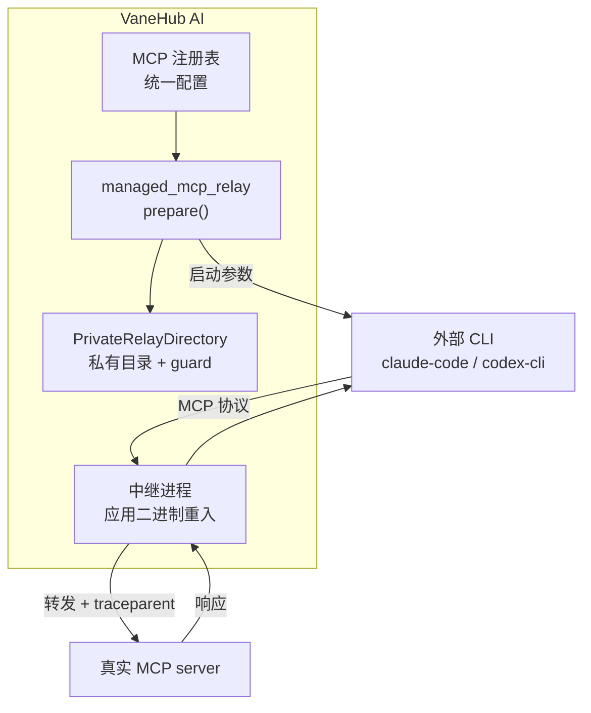
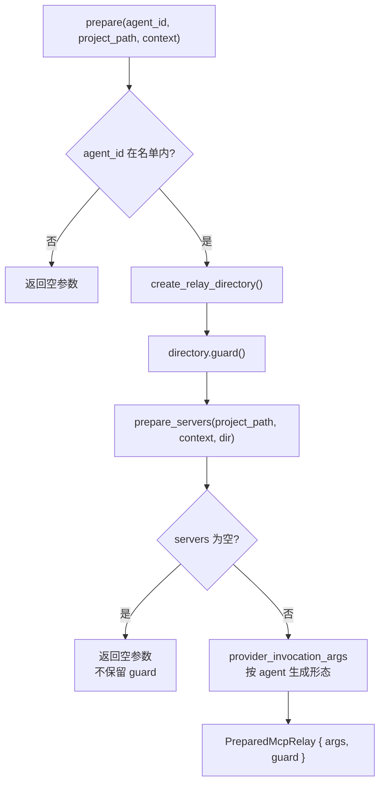

# MCP 集成：客户端、中继与工具暴露

> **两条路径**：VaneHub AI 自身作为 MCP 客户端连接 server（供原生 Agent 使用）；同时作为**中继**把统一注册的 server 暴露给外部 CLI Agent，让 Claude Code 与 Codex CLI 也能用上同一套配置。

## 设计目标与约束

| 目标 | 手段 |
|---|---|
| 一次注册，多 Agent 可用 | 中继而非逐个 CLI 配置 |
| 外部 CLI 的 MCP 调用可追踪 | 中继传播 W3C `traceparent` |
| 中继配置不泄漏给其他进程 | 私有中继目录 + 平台级权限收紧 |
| 各 CLI 配置格式差异隔离 | 按 agent_id 分派生成不同形态的启动参数 |
| 不额外分发可执行文件 | 应用二进制自身重入充当中继 |

## 技术选型

**`rmcp 3.0.1`**（`src-tauri/Cargo.toml`），`default-features = false`，显式启用五个 feature：

| feature | 用途 |
|---|---|
| `client` | 作为 MCP 客户端 |
| `transport-child-process` | stdio 传输（子进程） |
| `client-side-sse` | 传统 SSE |
| `transport-streamable-http-client` | Streamable HTTP |
| `transport-streamable-http-client-reqwest` | 基于 reqwest 的实现 |

**关闭默认特性只按需启用**——MCP 生态还在演进，默认特性会拉进不需要的传输实现。

**中继的 HTTP 服务基于 `axum 0.8`**。

## 领域模型

### 传输

**三种**（`tooling/mcp/domain/mod.rs:89-93` 的 `TransportType`）：

| 传输 | 必需字段 | 缺失时 |
|---|---|---|
| `Stdio` | `command` | `MissingStdioCommand` |
| `Sse` | `url` | `MissingUrl` |
| `StreamableHttp` | `url` | `MissingUrl` |

名称非法报 `InvalidServerName`（`mod.rs:9-15`）。**校验规则直接体现在领域错误里**，而不是散在应用层。

### 作用域与状态

**作用域两种**（`mod.rs:115-118` 的 `Scope`）：`User`、`Project`。

**连接状态四种**（`mod.rs:262-267` 的 `ConnectionStatus`）：`Connected`、`Disconnected`、`Error`、`Disabled`。

**`Disabled` 与 `Disconnected` 分开**：用户主动停用和连接掉了是两回事，界面提示与重连策略都不同。

### 失败分类

**六种**（`mod.rs:23-29` 的 `McpFailureCode`）：

| 分类 | 典型原因 | 用户该做什么 |
|---|---|---|
| `Validation` | 配置写错 | 改配置 |
| `Spawn` | 子进程起不来 | 检查命令与 PATH |
| `Timeout` | 超时 | 检查网络或增大超时 |
| `Cancelled` | 被取消 | 通常无需处理 |
| `Protocol` | 协议层错误 | server 兼容性问题 |
| `UpstreamHttp` | 上游 HTTP 故障 | 等待或联系 server 方 |

**把六类分开的价值在于每一类对应不同的处置动作**，而不是让用户面对一个笼统的"连接失败"。

## 中继架构



### 中继进程就是应用自身

**`relay.rs` 提供 `try_run_from_process_args()`**（`tooling/mcp/infrastructure/relay.rs:84`）：应用二进制在启动时检查进程参数，若匹配中继模式则**以中继身份运行**，而不是启动完整的桌面应用。

**好处**：

| 好处 | 说明 |
|---|---|
| 不需单独分发中继可执行文件 | 配置里指向的就是应用自己 |
| 版本天然一致 | 中继与主程序永远同版本 |
| 打包简单 | 无需处理第二个产物的签名与分发 |

**代价**：主程序启动路径上多了一次参数检查，且这条分支必须优先于任何 GUI 初始化。

**相关类型**：`RelayConfiguration`（`:54`）、`RelayObservation`（`:45`）、`write_configuration`（`:62`）。

### 判定只看第二个参数

```rust,ignore
let mut args = args.into_iter();
let _ = args.next();
if args.next().as_deref() != Some(std::ffi::OsStr::new(RELAY_FLAG)) {
    return Ok(false);
}
```

**跳过 argv[0]，只检查第二个参数是否为中继标志**——不是遍历查找。位置固定意味着这条分支的判定成本是常数，且不会被后续参数意外触发。

**出错时直接 `std::process::exit(2)`**（`relay.rs:84-89`），不返回错误。**中继进程配置读不出来时无事可做**，继续跑下去只会让上游 CLI 拿到一个不响应 MCP 协议的进程。

### 配置文件打开后立刻删除

```rust,ignore
let file = fs::File::open(path).map_err(|error| error.to_string())?;
fs::remove_file(path).map_err(|error| error.to_string())?;
```

**先 `open` 再 `remove`，然后才读内容**。文件描述符仍然有效，但路径已经消失。

**这么做的意义**：中继配置里带着目标 server 的地址、超时、以及可能的请求头，**它不应该在磁盘上留存**。删除紧跟打开，中间没有任何可能失败并提前返回的操作，因此不存在「读失败导致文件留下」的路径。

**代价是配置文件是一次性的**——中继进程崩溃重启后无法重读，必须由主程序重新写一份。

### 读取时故意多读一个字节

```rust,ignore
file.take((McpLimits::DEFAULT.configuration_serialized_bytes + 1) as u64)
    .read_to_end(&mut bytes)?;
McpLimits::DEFAULT.validate_bytes(
    "MCP relay configuration",
    bytes.len(),
    McpLimits::DEFAULT.configuration_serialized_bytes,
)?;
```

**`take(limit + 1)` 而不是 `take(limit)`**：读满上限时无法区分「正好这么大」和「还有更多」，多读一个字节就能判断。**上限是 256 KiB**，超限时只多读了 1 字节就报错，不会把超大文件全读进内存。

### 十五个容量上限

**`McpLimits::DEFAULT`（`tooling/mcp/application/runtime.rs:68-83`）集中定义了 15 个上限**，MCP 是全仓限额最密集的子域：

| 上限 | 值 | 管的是 |
|---|---|---|
| `import_document_bytes` | 1 MiB | 导入文档 |
| `import_server_entries` | 128 | 一次导入的 server 数 |
| `configuration_collection_entries` | 128 | 配置集合条目 |
| `configuration_serialized_bytes` | 256 KiB | 中继配置 |
| `protocol_message_bytes` | 2 MiB | 单条协议消息 |
| `tools_per_server` | 128 | 每个 server 的工具数 |
| `catalog_serialized_bytes` | 2 MiB | 工具目录 |
| `provider_tools` | 256 | 单个 provider 的工具总数 |
| `tool_name_bytes` | 256 | 工具名 |
| `tool_description_bytes` | 8 KiB | 工具描述 |
| `schema_bytes` | 128 KiB | 工具 schema |
| `json_depth` | 32 | JSON 嵌套深度 |
| `tool_arguments_bytes` | 256 KiB | 调用参数 |
| `tool_result_bytes` | 1 MiB | 调用结果 |
| `stderr_bytes` | 64 KiB | 子进程 stderr |

**`json_depth: 32` 值得单独一提**——它防的是深层嵌套 JSON 导致的栈溢出，这类输入来自外部 server，属于不可信数据。其余各项防的是内存耗尽。

**上限集中成一个常量而不是散在各处**，意味着调整策略时只有一个地方要改，而且能一眼看出各项之间的相对宽严。

### 按 Agent 分派的配置形态

**只有两个 Agent 启用受管中继**（`src-tauri/src/bootstrap/managed_mcp_relay.rs:110`）：

```rust,ignore
if !matches!(agent_id, "claude-code" | "codex-cli") {
    return Ok(PreparedMcpRelay {
        invocation_args: Vec::new(),
        guard: None,
    });
}
```

**两者接入方式完全不同**（`managed_mcp_relay.rs:144-165` 的 `provider_invocation_args`）：

| Agent | 形态 | 产物 |
|---|---|---|
| `claude-code` | 写配置文件，传 `--mcp-config <path>` | 磁盘文件 |
| `codex-cli` | 传一组命令行覆盖项（`codex_overrides`） | **不写文件** |
| 其他 | 空参数 | 无 |

**这个差异不是实现偷懒，而是两个 CLI 各自的配置机制不同**——Claude Code 读配置文件，Codex 接受命令行覆盖。

### 零 server 时短路

（`managed_mcp_relay.rs:119-124`）`servers.is_empty()` 时直接返回空参数，**不创建中继目录**——避免为零配置的场景付出目录创建与守卫的成本。

**准备流程**：



### 私有中继目录

**中继配置写在受保护的私有目录里**（`src-tauri/src/platform/private_relay_fs.rs`，Windows 变体 `private_relay_fs_windows.rs`）。

**Windows 侧依赖 `Win32_Security` 与 `Win32_Security_Authorization`**（`Cargo.toml` 的 `windows` crate features）收紧 ACL。

**理由很直接**：中继配置里可能包含 server 凭据，不能让同机其他进程随意读取。

**目录带 `guard()`**（`managed_mcp_relay.rs:116`），生命周期结束时清理——`PreparedMcpRelay` 持有它，Agent 进程退出后配置文件随之消失。

**Unix 侧走文件权限**，与 Windows 的 ACL **强度不完全等价**，这是跨平台安全实现的固有差异。

## 传输实现

**每种传输有独立实现与独立测试**（`tooling/mcp/infrastructure/`）：

| 文件 | 内容 |
|---|---|
| `relay.rs` | 中继核心 |
| `relay_streamable_http.rs` | Streamable HTTP |
| `relay_streamable_http_tests.rs` | 正常路径测试 |
| `relay_streamable_http_failure_tests.rs` | **失败路径测试** |
| `relay_legacy_sse.rs` | 传统 SSE |
| `relay_legacy_sse_session.rs` | SSE 会话管理 |
| `relay_legacy_sse_tests.rs` | 正常路径测试 |
| `relay_legacy_sse_failure_tests.rs` | **失败路径测试** |
| `relay_tests.rs` | 中继核心测试 |

**失败路径有单独的测试文件**——传输层的错误处理被当作一等公民测试，而不是只测 happy path。这在网络协议实现里是必要的：多数生产问题出在异常路径。

**另有集成测试** `src-tauri/tests/mcp_relay_provider_invocations.rs`。

## traceparent 传播

**`traceparent` 出现在全部中继实现中**：`relay.rs`、`relay_streamable_http.rs`、`relay_legacy_sse.rs`、`relay_legacy_sse_session.rs` 及各自测试，以及 `bootstrap/managed_mcp_relay.rs`。

**这是让外部 CLI 的 MCP 调用并入同一条 trace 的关键**——CLI 自己不懂追踪，但中继在转发时注入了上下文，因此这些调用能以 **`Proxied` 保真度**出现在时间线上。

**对比**：不走中继的 MCP 调用（例如 OpenCode 自己配置的 server）在 VaneHub AI 的追踪里是不可见的，因为没有中继这一跳可以注入上下文。

详见 [可观测性架构](observability-architecture.md#传播)。

## 工具注册与权限

MCP 暴露的工具进入统一的工具注册表（capability `agent-tool-registry`），调用受权限系统的 `mcp.tool` 动作管辖。

**MCP 下限在权限判定中无条件排在最前**（design.md D3），**先于已记忆的授权和模板规则**——这意味着模板改档不影响 MCP 工具的放行策略。详见 [权限架构](permissions-architecture.md#判定顺序)。

**原生 Agent 侧的工具网关**是 `agent_runtime/infrastructure/mcp_tool_gateway.rs`。

**前端相关模块**：`src/services/mcp-service.ts`、`runtime-mcp-client.ts`、`tauri-mcp-client.ts`、`mcp-validation.ts`、`mcp-tool-validation.ts`、`mcp-import.ts`；契约在 `src/contracts/mcp.ts`。

**契约有跨语言断言**：`contract_tests.rs:58` 的 `mcp_contract_keeps_transport_and_scope_values` 验证传输与作用域取值稳定，`:156` 的 `mcp_command_registration_and_frontend_invokes_keep_stable_names` 验证命令名一致。

## 数据

**两张表**（见 [数据层](data-layer.md#tooling)）：

| 表 | 用途 |
|---|---|
| `mcp_servers` | server 注册 |
| `mcp_transport_migration_journal` | **传输迁移日志** |

**迁移日志表的存在说明传输方式发生过迁移**（例如从传统 SSE 迁到 Streamable HTTP），且该迁移需要记录进度以便断点续做。

## 已知取舍

- **受管中继只覆盖两个 Agent** —— OpenCode、Gemini CLI 与 Antigravity CLI 目前不走中继，需各自配置，且它们的 MCP 调用不可追踪。
- **配置形态按 Agent 硬编码分派** —— 新增支持中继的 CLI 需要在 `provider_invocation_args` 里加分支。
- **中继是额外一跳** —— 引入延迟与一个可能的故障点，换来配置统一与可追踪。
- **私有目录的保护依赖平台实现** —— Windows 走 ACL，Unix 走文件权限，两边强度不完全等价。
- **两套传输各自维护** —— Streamable HTTP 与传统 SSE 是两条独立实现路径，协议层改动需两边同步验证。
- **应用二进制重入增加启动路径复杂度** —— 中继分支必须优先于 GUI 初始化，任何启动逻辑变更都要考虑它。

## 相关文档

- [工具生态](tooling.md) —— MCP 之外的七个 `tooling` 子域
- [CLI 集成](cli-integration.md) —— 按 Agent 分派的其他差异点
- [可观测性架构](observability-architecture.md) —— traceparent 传播链路
- [权限架构](permissions-architecture.md) —— MCP 下限
- [数据层](data-layer.md) —— MCP 相关表
