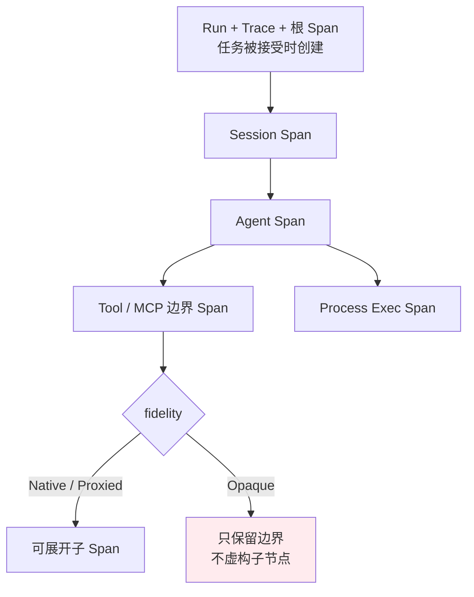
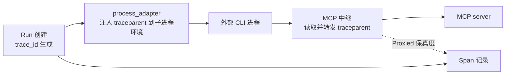
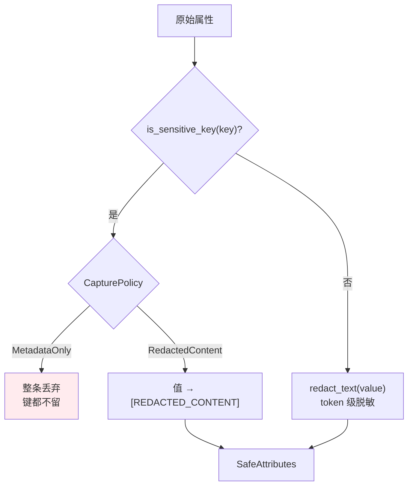
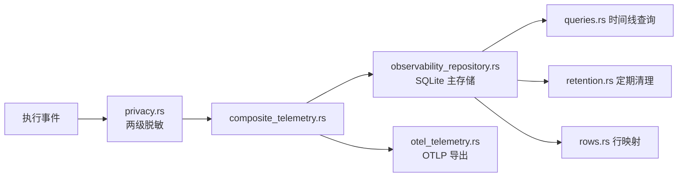

# 可观测性架构：四级 Span 与传播

> **SQLite 优先，OTLP 附加**：Span 首先落本地 SQLite，OpenTelemetry 导出是组合上去的第二条通路。追踪身份在任务被接受时就分配，跨进程用 W3C `traceparent` 传播。

## 设计目标与约束

| 目标 | 手段 |
|---|---|
| 离线可用 | 本地 SQLite 为第一存储，不依赖 collector |
| 一次任务可完整回溯 | 接受任务时即分配 run / trace / 根 span |
| 外部黑盒不被虚构 | `Opaque` 保真度只记边界，不编造子 Span |
| 重试不污染原 trace | 用父 span 或 span link，不复用原身份 |
| 日志与追踪解耦 | 日志中禁止出现任何执行标识符 |
| 属性不泄漏敏感信息 | 键名分类 + token 级脱敏两级处理 |
| 序列化确定 | `SafeAttributes` 用 `BTreeMap` |

## 四级 Span

**规范要求一次执行的 trace 至少包含四类关联 Span**（`openspec/specs/agent-execution-observability/spec.md:28`）：



**标识符在执行开始之前就分配**（`spec.md:7`）：

> 系统 SHALL 为每个被接受的用户任务提交，**在 Agent 执行开始之前**，创建带独立 run、trace 与根 span 标识的执行运行。

**这保证了"任务一定有 trace"**，而不是"执行成功了才有"——失败的执行同样可追溯。

## 保真度：不知道就说不知道

**四种保真度**（`domain/model.rs:25-30` 的 `ExecutionFidelity`）：

| 保真度 | 含义 | 典型来源 |
|---|---|---|
| `Native` | 运行时自身的一手记录 | OnePiece 原生 Agent |
| `Proxied` | 经代理层观测 | MCP 中继 |
| `Inferred` | 由其他信号推断 | 进程输出解析 |
| `Opaque` | 只知边界，内部不可见 | 外部 CLI 的内部工具调用 |

**`Opaque` 有一条硬约束**（`spec.md:34`）：

> 运行时 SHALL 只发出已知的终端 Tool/MCP 边界（`opaque` 保真度），**且 SHALL NOT 虚构具体的工具调用或 MCP 操作子 Span**。

**这条约束的价值在于诚实性**：外部 CLI 是黑盒，如果为了让时间线好看而编造子节点，用户会基于错误的结构做判断。**宁可显示一个不可展开的边界。**

**保真度也是一种能力声明**：看到 `Native` 就知道这段数据可以深挖，看到 `Opaque` 就知道到此为止。

## 执行身份与关联

**状态六种**（`model.rs:6-13` 的 `ExecutionStatus`）：`Accepted`、`Running`、`Succeeded`、`Failed`、`Cancelled`、`Incomplete`。

**四种为终态**（`model.rs:16-22`）：`Succeeded`、`Failed`、`Cancelled`、`Incomplete`。

**`Incomplete` 也算终态**——表达"结束了但没跑完"，避免这类执行永远挂在"运行中"。

**来源三种**（`model.rs:39-43` 的 `ExecutionSource`）：`Desktop`、`InstantMessage { connector_id }`、`Scheduled { task_id }`。

### 重试不复用身份

（`spec.md:40`）改用父 span 或 span link 关联，不复用原有 run/trace 身份。

**关联由 `ExecutionLink` 表达**（`model.rs:46-50`）：`run_id`、`trace_id`、`span_id`（可选）、`relationship`。

**`relationship` 是自由字符串**——灵活但缺乏枚举约束，这是当前模型的一处松散点。

## 传播

**W3C `traceparent` 是跨边界的传播载体**，出现在四类位置：

| 位置 | 作用 |
|---|---|
| `execution_observability/domain/model.rs` | 身份模型 |
| `execution_observability/infrastructure/random_identity.rs` | 标识生成 |
| `agent_runtime/infrastructure/process_adapter.rs` | 注入子进程环境 |
| `tooling/mcp/infrastructure/relay*.rs` | 随 MCP 请求转发 |
| `bootstrap/managed_mcp_relay.rs` | 中继装配 |



**这条链路让"外部 CLI 通过中继调用 MCP 工具"这件事能并回同一条 trace**，即便 CLI 本身对追踪一无所知。

## 属性与脱敏

### 属性有硬性上限

（`domain/attributes.rs:4-6`）

| 常量 | 值 |
|---|---|
| `MAX_ATTRIBUTE_COUNT` | `32` |
| `MAX_ATTRIBUTE_KEY_LENGTH` | `128` |
| `MAX_ATTRIBUTE_VALUE_LENGTH` | `256` |

**`SafeAttributes` 内部是 `BTreeMap`**（`attributes.rs:29`）——键序确定，同样的属性集永远序列化成同样的 JSON，便于比对与去重。

**值必须先经 `SafeAttributeValue::bounded_string` 构造**（`:17`），超长直接报错。**属性不是裸 JSON 直塞。**

### 两级脱敏



**第一级：按键名分类**（`infrastructure/privacy.rs:31-51` 的 `is_sensitive_key`），键名小写化后**包含**以下任一片段即视为敏感：

```text
prompt   output   content   payload   body      header
authorization    credential  secret   token
environment      env.       path      argument
```

**`path` 与 `argument` 也在列**——文件路径与命令参数被当作敏感信息，因为它们会泄漏目录结构与调用细节。

**第二级：非敏感值仍过 token 级脱敏**（`privacy.rs:22-26`）——即使键名看起来无害，字符串值也要经 `redact_text` 处理。

### token 级脱敏

**`redact_text` 按空白切词后逐 token 判断**（`platform/logging.rs:275-301`）：

| 识别 | 替换为 | 消费 token 数 |
|---|---|---|
| 疑似私有路径 | `[REDACTED_PATH]` | 1 |
| `Bearer <token>` | `Bearer` + `[REDACTED]` | 2 |
| provider 令牌 | `[REDACTED]` | 1 |
| 内联敏感 token（如 `key=value`） | 替换 | 1 或 2 |

**`Bearer` 保留而令牌被脱掉**——日志仍能看出用的是 Bearer 认证，这是可诊断性与隐私之间的平衡点。

## 存储



**`spans` 表列结构**（`infrastructure/queries.rs:14` 的 `SPAN_COLUMNS`）：

`run_id`、`span_id`、`trace_id`、`parent_span_id`、`name`、`status`、`fidelity`、`started_at`、`ended_at`、`error_classification`、`attributes_json`

**采集策略挂在 `runs.capture_policy`**——**策略是 run 级而非 span 级**，一次执行内的所有 span 共享同一策略。

**Span 名称上限 128 字符**（`model.rs:3` 的 `MAX_SPAN_NAME_LENGTH`）。

**保留维护每 6 小时执行一次**（`infrastructure/retention.rs:6` 的 `MAINTENANCE_INTERVAL_DAYS = 0.25`），产出 `RetentionOutcome`（`:9`）供上层报告清理结果。

**相关表**（见 [数据层](data-layer.md#execution_observability)）：`execution_runs`、`execution_spans`、`execution_events`、`execution_links`、`execution_observability_settings`。

## OpenTelemetry 集成

**组合式设计**（`infrastructure/composite_telemetry.rs`）：SQLite 与 OTLP 是两个并列的接收端，**本地存储是第一位的**。

**实现文件**：

| 文件 | 职责 |
|---|---|
| `composite_telemetry.rs` | 组合多个遥测后端 |
| `otel_telemetry.rs` | OTLP 实现 |
| `otel_support.rs` | OTel 辅助 |
| `lifecycle.rs` | 遥测生命周期 |
| `storage_mapping.rs` | 存储映射 |
| `random_identity.rs` | 标识生成 |
| `credential_adapter.rs` | 导出端点凭据 |

**测试支持**：`composite_test_support.rs`、`otel_telemetry_tests.rs`、`application/test_adapter.rs`。

**全部 OTel crate 用 `=` 精确固定版本**（详见 [技术栈](tech-stack.md#可观测性)）——这套生态跨版本耦合紧密，浮动版本极易导致编译期类型不匹配。**升级必须整组同步。**

## 日志与追踪的边界

**日志中不得包含任何执行标识符**（`spec.md:97`）：

> 它们 SHALL NOT 包含 run、trace、span、session、message、operation、process、node 或 tool-call 标识符。

**理由是防止通过日志反查执行身份。**

**代价是排查时必须分别看日志和追踪**，无法直接用 trace id 去 grep 日志。这是隐私与可排查性之间一次明确的取舍。

**统一日志四级**（`platform/logging.rs:32-37`）：`Error`、`Warn`、`Info`、`Debug`。

**前端错误经 `ErrorBoundary` 通道上报**（`logging.rs:52`），原生接收端是 `DesktopClientLoggingPort`（`desktop/application/ports.rs:76`）。

**目录可切换**：`default_log_dir(app_data_dir)`（`logging.rs:67`）确定默认位置，`set_active_log_dir(path)`（`:71`）在运行期改写。

### 写日志时必须遵守的四条

（`openspec/specs/unified-log-management/spec.md`，同时被 `AGENTS.md` 复述）

| 约束 | 含义 |
|---|---|
| 统一入口 | Rust/native 日志一律走统一日志服务，**禁止新增 feature-local 日志文件**或绕过脱敏直接落盘 |
| 前端不落盘 | React 组件**不得直接写本地日志文件**，需持久化的错误必须经 service boundary 上报 |
| 双写 | SDK/CLI/任务类操作的输出必须**同时**保留页面内展示与统一日志目录写入 |
| 先脱敏后落盘 | 敏感信息在写入前完成 token 级脱敏 |

**第三条最容易漏**：只写文件会让用户在界面上失去反馈，只显示在界面上则事后无从追溯，两者缺一都不合规。

## 已知取舍

- **本地存储会增长** —— 靠保留策略定期清理；需要长期留存必须自行导出。
- **日志与追踪无法交叉检索** —— 规范禁止日志携带标识符。
- **`Opaque` 边界信息量有限** —— 外部 CLI 内部发生了什么无从得知，这是集成外部黑盒的固有成本。
- **OTel 版本锁死升级成本高** —— 升级需整组同步并验证类型兼容。
- **`ExecutionLink.relationship` 是自由字符串** —— 灵活但缺乏枚举约束。
- **采集策略是 run 级** —— 无法在一次执行内对不同 span 采用不同策略。
- **属性上限 32 条** —— 超出的属性不会被记录，且当前没有"被截断"的显式标记（对比 `StderrCapture` 的 `truncated` 字段）。
- **`path` / `argument` 被判为敏感** —— 排查某些问题时信息不足，需临时切到 `RedactedContent`。

## 相关文档

- [MCP 集成](mcp-integration.md) —— 中继的 traceparent 传播
- [数据层](data-layer.md) —— Span 表与保留
- [技术栈](tech-stack.md) —— OTel 版本固定策略
