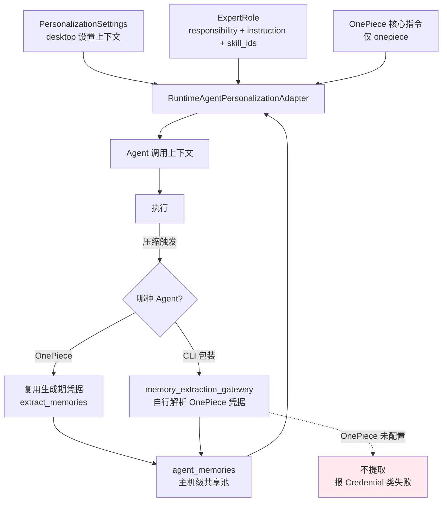

# 个性化：Custom Instructions、记忆与专家角色

> **个性化解决的是"每开一个会话都要重新交代一遍"的问题**：把关于你的信息、风格偏好、跨会话积累的项目知识和角色化人设统一存起来，在 Agent 执行前自动注入。

## 这一层解决什么问题

**三层各管一段**：手工填写的 **Custom Instructions**（关于你 + 风格规则）、自动积累的 **Agent 记忆**（主机级共享池）、可切换的**专家角色**（人设 + 职责 + 技能 + 评审策略）。三者都在调用 Agent 前进入上下文。

## 能力与运行时边界

| 能力 | 说明 | 运行时 |
|---|---|---|
| Custom Instructions | 「关于你」与「风格规则」两段自定义指令 | **仅桌面** |
| 指令开关 | 一键启用/停用自定义指令注入 | **仅桌面** |
| 跨会话记忆 | 自动提取并持久化的长期记忆 | **仅桌面** |
| 记忆开关 | 全局启用/停用记忆 | **仅桌面** |
| 工具辅助对话记忆 | 单独控制工具辅助场景是否写记忆 | **仅桌面** |
| CLI Agent 记忆提取 | 由 OnePiece 代为提取 | **仅桌面** |
| 上下文压缩 | 长对话触发压缩，压缩时顺带提取记忆 | **仅桌面** |
| 专家角色 | 3 个内置 + 自定义角色 | **仅桌面** |
| 角色技能绑定 | 角色可绑定一组 Skill | **仅桌面** |
| 评审策略 | 声明角色是否可作评审、是否要求异模型族 | **仅桌面** |
| OnePiece 核心指令 | 内置于原生 Agent 的版本化核心指令 | **仅桌面** |

## Custom Instructions

**设置项共五个字段**（`src-tauri/src/contexts/agent_runtime/application/models.rs:1138-1144` 的 `PersonalizationSettings`）：

| 字段 | 含义 |
|---|---|
| `custom_instructions_about_user` | 关于你——身份、背景、长期偏好 |
| `custom_instructions_style_rules` | 风格规则——输出格式、语言、详略 |
| `custom_instructions_enabled` | 自定义指令总开关 |
| `memory_enabled` | 记忆总开关 |
| `memory_tool_assisted_chats_enabled` | 工具辅助对话是否写记忆 |

**读取失败时的降级是"退回个性化功能出现之前的行为"**（`models.rs:1147-1150`）：不注入自定义指令、记忆完全开启。

**这个降级方向值得注意**：一次瞬时的设置读取错误不会静默关掉一个原本一直可用的功能（记忆），也不会把用户没确认过的指令注入进去。两个方向各自选了更安全的那一侧。

设置由 `infrastructure/personalization_gateway.rs:11-22` 的 `RuntimeAgentPersonalizationAdapter` 从 `desktop` 设置上下文读取，构成 `agent_runtime` → `desktop` 的一条明确跨上下文依赖。

### 拼成什么样子

**`custom_instructions_block()`（`models.rs:1168-1186`）是唯一的格式化点**：

```rust,ignore
if !style_rules.is_empty() {
    parts.push(format!("### Response style\n{style_rules}"));
}
if !about_user.is_empty() {
    parts.push(format!("### About the user\n{about_user}"));
}
...
Some(format!("## Custom Instructions\n{}", parts.join("\n\n")))
```

产出形如：

```text
## Custom Instructions

### Response style
<风格规则>

### About the user
<关于你>
```

### 风格排在「关于你」前面，这是刻意的

**界面上「关于你」在上、「回复风格」在下，注入时顺序却相反**。理由写在函数注释里（`models.rs:1161-1163`，引 `add-personalization-settings` design.md D3）：

> style is a cross-cutting constraint on every response, about-you is background fact, so style gets the higher-priority earlier position.

**风格是对每一次回复的横切约束，「关于你」是背景事实**——前者更该占据靠前的高优先级位置。

**两个字段各自可省**：只填一个时另一个的三级标题整个不出现，两个都空（或总开关关闭）则返回 `None`，连 `## Custom Instructions` 这一节都不会有。**不会出现空标题**。

### 一套格式，两种投递

**同一个 `custom_instructions_block()` 同时服务两条完全不同的路径**（注释末句）：

| 消费方 | 投递方式 | 依据 |
|---|---|---|
| OnePiece | 作为 system prompt 的一节 | `add-personalization-settings` |
| CLI 包装的 Agent | 作为前置的 prompt 块 | `add-cli-custom-instructions-injection` |

**「one formatting rule, two delivery mechanisms」**——格式规则只有一份，避免两条路径的指令长得不一样。这也是为什么这个方法住在 `application/models.rs` 而不是任何一个适配器里。

## Agent 记忆

### 表结构

**持久化在 `agent_memories` 表**（`infrastructure/memory_schema.rs:10-19`）：

| 列 | 说明 |
|---|---|
| `id` | 主键 |
| `agent_id` | 外键 → `agents(id)` |
| `folder` | 工作区目录；**空字符串是"无工作区"哨兵** |
| `content` | 记忆内容 |
| `source` | 来源 |
| `created_at` / `updated_at` | 时间戳 |

`folder` 用空串哨兵而不是可空列，是为了让 `WHERE folder = ?` 统一工作、不必分支处理 `IS NULL`（`memory_schema.rs:4-6`）。这与 `skill-management` 的全局作用域约定一致。

### 从隔离到共享的演进

**记忆现在是主机级共享池。**`add-cli-memory-support` 之后，读取不再按 `agent_id` / `folder` 过滤——**一个 Agent 记下的内容，其他 Agent 也能用**。

**索引也随之替换**（`memory_schema.rs:28-32`）：原先按 `(agent_id, folder, created_at DESC)` 的复合索引不再匹配查询模式。替换动作被写成**独立的版本化迁移**（`apply_memory_shared_pool_schema`），而不是回头修改 `apply_memory_schema`——因为后者已经在存量数据库上执行过，直接改它对那些安装不会生效。

### 记忆有两种来源

**`MemorySource` 只有两个变体**（`models.rs:1192-1197`），落库时分别存 `"explicit"` 与 `"automatic"`：

| 变体 | 怎么产生 |
|---|---|
| `Explicit` | **模型主动调用 `remember` 工具**保存 |
| `Automatic` | 上下文压缩触发时**尽力而为**地提取 |

**两条路径的可靠性完全不同**。`Explicit` 是模型判断「这条值得记住」后的显式动作；`Automatic` 依附于压缩，压缩没触发就不会发生，而且注释明写是 best-effort——**失败不会中断主流程，也不会重试**。

**这解释了一个常见困惑**：短会话往往不产生任何记忆，因为没触及压缩阈值，而模型也未必会主动调 `remember`。

### 提取时机与执行者

**自动提取依附于上下文压缩**（`models.rs:1196`）：压缩触发时以尽力而为的方式提取记忆。

**CLI Agent 的记忆由 OnePiece 代为提取**——这是一条不显然但影响很大的设计（`infrastructure/memory_extraction_gateway.rs:12-19`）：

> `ONEPIECE_AGENT_ID` 是这个网关唯一会解析的凭据/provider，**无论触发提取的是哪个 CLI 包装的 Agent**。

原因写在注释里：OnePiece 自己的 `extract_memories` 可以复用生成过程中已解析的凭据，而 **CLI 包装的 Agent 没有生成期作用域的凭据可复用**，因此这个适配器每次调用都自行解析 OnePiece 的凭据。

**直接后果**：**未配置 OnePiece provider 时，CLI Agent 不会产生记忆提取。**

**两类失败被刻意区分**（`memory_extraction_gateway.rs:270-273`）：缺凭据绝不会表现为 `Memory` 失败，真实调用失败也绝不会表现为 `Credential` 失败。这个区分让调用方（`service.rs` 的 CLI 完成钩子）能把"OnePiece 没配置"和"提取调用本身失败"分开记录——用户看到的提示因此是可操作的。

### 权限管辖

记忆写入受权限系统的 `memory.write` 动作管辖，见 [权限审批](permissions-architecture.md#受管动作)。

## 专家角色

### 角色模型

**`ExpertRole` 有 12 个字段**（`domain/expert_role.rs:39-52`）：

| 字段 | 说明 |
|---|---|
| `id` / `display_name` | 标识与显示名 |
| `avatar` / `color` | 头像与配色 |
| **`responsibility`** | **职责——会发布给其他席位作为交接依据，因此是必填** |
| `instruction` | 角色指令 |
| `skill_ids` | 绑定的 Skill 列表 |
| `review_policy` | 评审策略 |
| `preferred_providers` | 偏好的 provider |
| `origin` | 来源 |
| `created_at` / `updated_at` | 时间戳 |

**`responsibility` 必填是有原因的**（`expert_role.rs:44`）：它会进入 [席位简报](group-chat.md#席位简报)，是其他 Agent 决定"该把话交给谁"的依据。职责空着，交接就成了瞎猜。

**前后端共用同一套校验**（`expert_role.rs:66`）：`ExpertRole::new` 镜像前端的 `validateExpertRoleInput`，**保证两个运行时拒绝同样的输入**。

### 来源

**两种来源**（`expert_role.rs:17-20` 的 `ExpertRoleOrigin`）：`Builtin` 与 `User`。

**解析时非 `builtin` 一律当 `User`**（`:30-36`）——未知值向宽松侧降级，不会因为数据里出现意外字符串而整体读取失败。

### 三个内置角色

定义在 `infrastructure/builtin_expert_roles.rs:14,24,34`，前端镜像在 `src/config/builtin-expert-roles.ts:14,33,52`：

| id | 定位 |
|---|---|
| `builtin-architect` | 架构 |
| `builtin-implementer` | 实现 |
| `builtin-reviewer` | 评审 |

**这三个角色正好对应一条典型协作链**：架构出方案 → 实现落地 → 评审把关，与 [多 Agent 群聊](group-chat.md) 的 `@` 交接直接配套。

### 评审策略

**两个布尔量**（`expert_role.rs:11-15` 的 `ExpertRoleReviewPolicy`）：

| 字段 | 含义 |
|---|---|
| `peer_reviewer` | 持有该角色的席位是否可被推荐为同行评审 |
| `require_different_family` | 推荐时是否应优先选择**不同模型族**的席位 |

**`require_different_family` 是一个有意思的设计**：同一模型族的两个实例容易共享同样的盲区，让评审来自不同族（`anthropic` / `openai` / `google`，见 [群聊的 ModelFamily](group-chat.md#席位简报)）能提高发现问题的概率。

前端的推荐逻辑在 `src/services/reviewer-recommendation.ts`。

## OnePiece 核心指令

**原生 Agent 带一份版本化的内置核心指令**（`infrastructure/core_instructions.rs`）：

| 项 | 值 |
|---|---|
| 版本常量 | `ONEPIECE_CORE_VERSION = "1.0.0"` |
| 内容来源 | `include_str!("onepiece-core-v1.md")`，编译期内联 |
| 生效范围 | **只对 `onepiece`**（`core_instructions.rs:16-20`） |

**有测试守住版本与体积**（`core_instructions.rs:27` 的 `shipped_onepiece_core_is_versioned_and_within_budget`）：断言版本号与内容非空，并对体积设了预算——核心指令占用的是每次调用的上下文额度，不能无限增长。

外部 CLI Agent 有自己的指令体系，不注入此内容。

## 注入链路



## 界面入口与前端服务

### 填写 Custom Instructions

设置中心 → 个性化页（`src/settings/pages/personalization-page.tsx`），自定义指令区（`personalization/custom-instructions-section.tsx`）分别填写「关于你」与「风格规则」。

### 管理记忆

同一页面的记忆区（`personalization/agent-memory-section.tsx`）查看与管理已积累的记忆，可整体关闭记忆，或单独关闭工具辅助对话的记忆写入。

**若使用 CLI Agent 且希望有记忆，需先配置 OnePiece provider**，见 [原生 API Agent](native-agent.md#配置流程)。

### 配置专家角色

设置中心 → 专家角色页（`src/settings/pages/expert-roles-page.tsx`），用角色表单（`expert-roles/expert-role-form.tsx`）新建或编辑。**职责字段必填**。

创建群聊会话时为席位分配角色，见 [多 Agent 群聊](group-chat.md#分配席位)。

## 边界与限制

- **仅桌面可用** —— 记忆依赖 SQLite、设置依赖原生存储。
- **记忆跨 Agent 共享** —— 当前是主机级共享池，无法按 Agent 隔离；若需隔离只能整体关闭。
- **CLI Agent 的记忆依赖 OnePiece** —— 未配置 OnePiece provider 时不产生记忆提取。
- **记忆提取是尽力而为** —— 依附于上下文压缩时机，不保证每条有价值的信息都被记下。
- **核心指令不可编辑** —— 编译期内联，且有体积预算；自定义需求走 Custom Instructions 或专家角色。
- **注入不改写 CLI 自身的配置文件** —— 不会去改 `CLAUDE.md`、`AGENTS.md` 等各 CLI 自己的指令文件。
- **内置角色不可删除** —— `origin` 为 `Builtin` 的角色与用户自建角色在生命周期上不同。

## 相关文档

- [多 Agent 群聊](group-chat.md) —— 角色如何进入席位简报与评审推荐
- [原生 API Agent](native-agent.md) —— OnePiece 配置与核心指令
- [权限审批](permissions-architecture.md) —— `memory.write` 管辖
- [工具生态](tooling.md) —— 角色绑定的 Skill
- [数据层](data-layer.md) —— 记忆表与索引替换迁移
