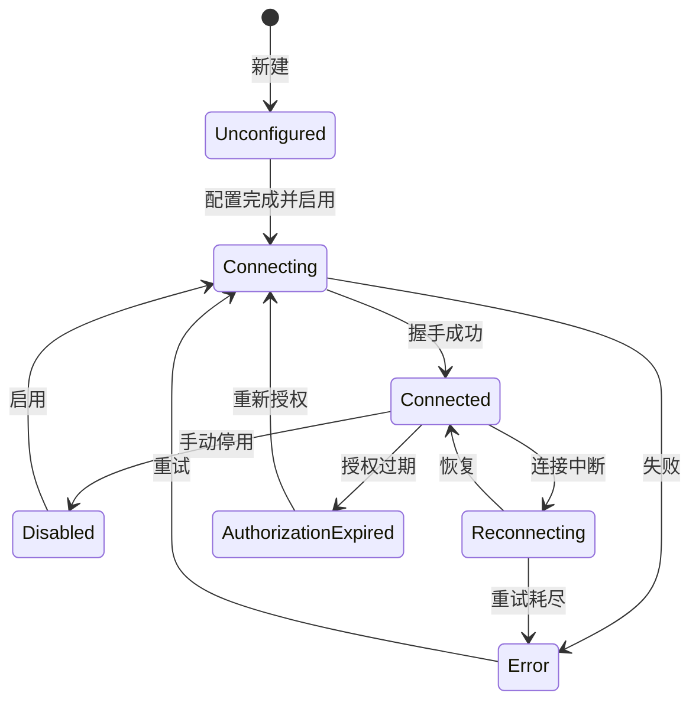
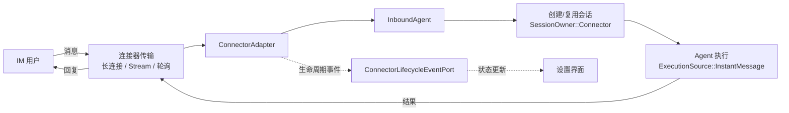

# 远程执行与 IM 连接器

> **把工作台延伸到本机之外**：SSH 连接让会话在远端主机上执行，IM 连接器让你从飞书、钉钉、企业微信、微信或 Telegram 直接驱动 Agent。

## 这一层解决什么问题

**这两组能力共同解决"人不在电脑前"的问题**。SSH 把执行环境搬到远端；IM 把控制入口搬到手机。两者由独立的限界上下文承载——`ssh_connections` 与 `communications`——但共用同一套凭据安全存储抽象。

## 能力与运行时边界

| 能力 | 说明 | 运行时 |
|---|---|---|
| SSH 连接配置 | 主机、端口、认证方式的管理 | **仅桌面** |
| 主机密钥校验 | 首次信任与变更告警 | **仅桌面** |
| 凭据安全存储 | 密钥与口令经系统凭据服务保存 | **仅桌面** |
| 远程终端 | 在远端主机上的 PTY 运行时 | **仅桌面** |
| 连接池 | 上限 8 条，空闲自动回收 | **仅桌面** |
| 远程工作区 | 会话工作区指向远端路径 | **仅桌面** |
| 五个 IM 连接器 | 飞书、钉钉、企业微信、微信、Telegram | **仅桌面** |
| 连接器生命周期 | 七态状态机，含重连与授权过期 | **仅桌面** |
| 扫码授权 | 微信的二维码授权流程 | **仅桌面** |
| 字段级密级 | 配置字段区分公开与机密 | **仅桌面** |
| 连接器会话归属 | 由连接器创建的会话被标记来源 | **仅桌面** |

## SSH 连接

### 技术选型

底层使用 **`russh`，固定版本 `=0.62.5`，仅启用 `ring` feature**（`src-tauri/Cargo.toml`）。

**固定版本而非范围依赖是刻意的**：SSH 实现的行为变化风险高于一般依赖，一次意外的次版本升级可能改变握手或算法协商行为。

领域模型在 `src-tauri/src/contexts/ssh_connections/domain/runtime.rs`，运行时实现在 `infrastructure/runtime/`，配置持久化在 `infrastructure/sqlite_repository.rs`。

### 主机密钥校验

**采用 TOFU（首次使用即信任）模型，并对变更告警**（`domain/runtime.rs:24-27` 的 `HostKeyChallengeKind`）：

| 挑战类型 | 含义 | 应对 |
|---|---|---|
| `FirstSeen` | 首次见到该主机的密钥 | 由用户确认接受 |
| **`Changed`** | **密钥与已记录的不一致** | 高危信号，可能是中间人攻击或服务器重装 |

**密钥证据只记两项**（`runtime.rs:30-33` 的 `HostKeyEvidence`）：`algorithm` 与 `fingerprint`。

### 输入校验

**所有有界字段共用一套校验**（`runtime.rs` 的 `validate_bounded`），三条规则同时生效：

| 规则 | 拒绝原因 |
|---|---|
| 去空白后为空 | `InvalidBoundedField` |
| 超出字节上限 | `InvalidBoundedField` |
| **含任何控制字符** | `InvalidBoundedField` |

**拒绝控制字符这条尤其重要**：主机名与指纹会被显示在终端与界面上，若允许控制字符，恶意服务器可以通过指纹字符串注入 ANSI 转义序列，伪造界面输出。

**各字段上限**（`runtime.rs:4-6`）：

| 常量 | 值 |
|---|---|
| `MAX_HOST_BYTES` | `255` |
| `MAX_ALGORITHM_BYTES` | `96` |
| `MAX_FINGERPRINT_BYTES` | `160` |

### 通道事件

**远程通道产生六种事件**（`runtime.rs:104-112` 的 `RemoteSshChannelEvent`）：

| 事件 | 含义 |
|---|---|
| `Output(Vec<u8>)` | 标准输出 |
| `ExtendedOutput { stream, content }` | 扩展流（如 stderr），带流编号 |
| `ExitStatus(u32)` | 正常退出码 |
| `ExitSignal(String)` | 被信号终止 |
| `Eof` | 输入结束 |
| `Closed` | 通道关闭 |

**`ExitStatus` 与 `ExitSignal` 是分开的**——被 `SIGKILL` 杀掉和返回非零退出码是两回事，混作一谈会让诊断失真。

**输出是 `Vec<u8>` 而非 `String`**，因为字节边界可能切断多字节字符，解码统一交给 [流式 UTF-8 解码器](process-and-pty.md#流式-utf-8-解码)。

### 连接池与超时

**常量集中在 `workspaces/domain/remote_terminal_limits.rs:1-6`**：

| 常量 | 值 | 含义 |
|---|---|---|
| `REMOTE_TERMINAL_POOL_CAPACITY` | `8` | 并发连接上限 |
| `REMOTE_TERMINAL_CONNECT_TIMEOUT_SECONDS` | `15` | 建连超时 |
| `REMOTE_TERMINAL_IDLE_TIMEOUT_SECONDS` | `300` | 空闲 5 分钟回收 |
| `REMOTE_TERMINAL_KEEPALIVE_SECONDS` | `30` | 保活心跳 |
| `REMOTE_TERMINAL_DRAIN_TIMEOUT_SECONDS` | `30` | 关闭时排空输出的等待上限 |
| `REMOTE_TERMINAL_TRANSCRIPT_BYTES` | `1 MiB` | 单次会话记录上限 |

**排空超时的存在说明关闭不是立即的**：通道关闭前会给未读输出一个 30 秒的窗口，避免丢掉最后几行——通常正是报错所在。

### 远程工作区的限制

远程工作区**不支持 Git worktree**（`workspaces/domain/error.rs:8` 的 `RemoteWorktreeUnsupported`），只能指向远端已存在的路径。详见 [项目与工作区](workspaces.md#工作区约束)。

## IM 连接器

### 五种连接器

**枚举定义**（`communications/domain/connector.rs:7-14` 的 `ConnectorKind`）：`Feishu`、`Telegram`、`DingTalk`、`WeCom`、`WeChat`。

**微信的序列化名有历史包袱**（`connector.rs:12`）：`#[serde(rename = "weixin", alias = "wechat")]`——对外写作 `weixin`，同时接受旧的 `wechat` 作为别名，保证既有配置不失效。

### 各自的接入方式

**传输实现在 `communications/infrastructure/transports/`**，每种平台的接入机制不同：

| 连接器 | 抽象 trait | 行号 | 机制 |
|---|---|---|---|
| 飞书 | `FeishuLongConnection` | `feishu.rs:25` | 长连接 |
| 钉钉 | `DingTalkStream` | `dingtalk.rs:25` | Stream 模式 |
| 企业微信 | `WeComLongConnection` | `wecom.rs:19` | 长连接 |
| 微信 | `WeChatSessionStore` | `wechat.rs:20` | 会话存储 + 扫码授权 |
| Telegram | `TelegramCheckpoint` | `telegram.rs:17` | 带 checkpoint 的轮询 |

**Telegram 用 checkpoint 而非长连接**，因为它的 API 是拉取式的——checkpoint 记录已处理到哪条更新，避免重启后重复处理。

**三家有独立的原始协议层**：`feishu_raw.rs`、`dingtalk_raw.rs`、`wecom_raw.rs`，把协议编解码与业务逻辑分开。

### 统一抽象

**所有连接器实现同一个 `ConnectorAdapter`**（`transports/runtime.rs:117`），运行时由 `infrastructure/runtime_manager.rs` 统一管理：

| 抽象 | 位置 | 职责 |
|---|---|---|
| `ConnectorAdapter` | `transports/runtime.rs:117` | 连接器统一接口 |
| `InboundAgent` | `runtime_manager.rs:59` | 入站消息进入系统的入口 |
| `ConnectorLifecycleEventPort` | `runtime_manager.rs:76` | 生命周期事件广播 |
| `HttpTransport` | `transports/http.rs:27` | 共用 HTTP 传输 |
| `SecureCredentialStore` | `infrastructure/credential_adapter.rs:14` | 凭据存储 |

共用基础设施还包括 `token_cache.rs`（访问令牌缓存）与 `protocol.rs`。

### 生命周期状态机

**七种状态**（`communications/domain/status.rs:7-15` 的 `ConnectorLifecycle`）：

**`AuthorizationExpired` 与 `Error` 是分开的状态**——授权过期是可预期的、需要用户重新授权的正常情况，不该和网络故障混在一起显示。

### 扫码授权

**微信授权单独成模块**（`infrastructure/wechat_authorization.rs`），定义两个 trait：`WeChatAuthorizationTransport`（`:25`）与 `WeChatCredentialPersistence`（`:60`）。二维码生成依赖 `qrcode 0.14.1`（`svg` feature）。

**授权状态六态**（`domain/authorization.rs:4-11` 的 `AuthorizationStatus`）：`Waiting`、`Scanned`、`Confirmed`、`Expired`、`Error`、`Cancelled`。

**观测结果另有一套枚举**（`authorization.rs:34-40` 的 `AuthorizationObservation`）：`Waiting`、`Scanned`、`Confirmed`、`Expired`、`Failed(String)`。

**两套枚举的区别在于 `Failed(String)` 携带原因**——观测层保留具体错误信息，状态层只保留可显示的状态。`Cancelled` 只存在于状态层，因为它是用户动作而非观测结果。

**`Scanned` 与 `Confirmed` 分开**：扫了码但没点确认是一个真实存在的中间态，界面据此提示"请在手机上确认"。

### 字段级密级

**配置字段带存储分类**（`domain/connector.rs:17-20` 的 `ConnectorFieldStorage`）：

| 分类 | 处理 |
|---|---|
| `Public` | 普通存储，可回显 |
| `Secret` | 走安全凭据存储，不回显 |

**这让"哪些字段是密钥"成为数据而非约定**——新增连接器时声明字段密级，存储与回显逻辑自动遵守，不必在每处手工判断。

底层依赖 `keyring 4.1.5`，敏感值在内存中用 `zeroize` 清理。

### 会话归属

**由连接器创建的会话带来源标记**（`sessions/domain/session.rs:94-97` 的 `SessionOwner::Connector { connector_id }`），与桌面手工创建的会话区分开。

执行追踪同样记录来源（`ExecutionSource::InstantMessage { connector_id }`），详见 [可观测性](observability-architecture.md#执行身份与关联)。

## 接入流程

## 界面入口与前端服务

### 配置 SSH 连接

设置中心 → SSH 连接页（`src/settings/pages/ssh-connections-page.tsx`）添加主机与认证信息。首次连接时会出现 `FirstSeen` 主机密钥挑战，确认后记录；后续若出现 `Changed` 应当停下来查明原因。

创建会话时在远程工作区区块选择该连接。

### 配置 IM 连接器

设置中心 → IM 页（`src/settings/pages/im-page.tsx`）选择连接器类型并填入应用凭据。标记为 `Secret` 的字段保存后不再回显。

微信需走扫码授权流程，界面展示二维码并轮询授权状态。

前端服务见 `src/services/im-service.ts` 与 `runtime-im-client.ts`，契约定义在 `src/contracts/im.ts`。

### 使用远程终端

会话工作区的 `terminal` 或 `shell` 标签页在远程工作区下连接到远端主机。前端客户端见 `src/services/remote-terminal-client.ts`。

## 边界与限制

- **仅桌面可用** —— SSH 与 IM 都依赖原生网络栈与系统凭据存储。
- **远端不支持 worktree** —— 见上文。
- **并发远程终端上限 8** —— 超出需等待释放；空闲 5 分钟自动回收。
- **连接器需要各平台的应用凭据** —— 需先在对应开放平台创建应用。
- **授权会过期** —— `AuthorizationExpired` 是正常状态，需要重新走授权流程。
- **连接器会话能力受限于 IM 形态** —— 文件浏览、终端交互等桌面专属视图在 IM 侧不可用。
- **主机密钥变更不会自动接受** —— `Changed` 需要显式处理，这是安全设计而非不便。

## 相关文档

- [项目与工作区](workspaces.md) —— 远程工作区约束与终端容量常量
- [会话管理](sessions.md) —— 会话归属模型
- [可观测性](observability-architecture.md) —— 执行来源标记
- [进程管理与 PTY](process-and-pty.md) —— 输出解码
