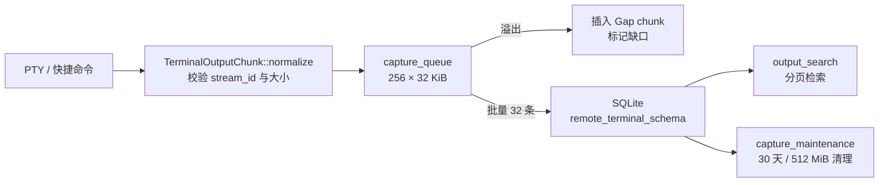

# 项目与工作区

> **每个会话绑定一个工作区**：本地项目目录、Git worktree 或远端 SSH 路径。工作区决定 Agent 能看到哪些文件、命令在哪里执行，也决定了文件访问的安全边界。

## 这一层解决什么问题

**工作区是会话与文件系统之间的边界。**`workspaces` 上下文负责项目目录选择、Git 集成、worktree 管理、命令模板、shell 终端、输出捕获与检索、外部打开器——把"在哪儿干活"以及"干活留下什么痕迹"统一管起来。

## 能力与运行时边界

| 能力 | 说明 | 运行时 |
|---|---|---|
| 项目目录选择 | 选定本地项目作为工作区 | **仅桌面** |
| 项目探测 | 识别是否为 Git 仓库并定位仓库根 | **仅桌面** |
| 工作区历史 | 记录并快速切换用过的本地与远程工作区 | **仅桌面** |
| Git worktree | 创建与管理 worktree，含 Loop 专用 worktree | **仅桌面** |
| Git 状态与差异 | 查看工作区 Git 状态与 diff | **仅桌面** |
| 远程工作区 | 指向 SSH 远端主机的路径 | **仅桌面** |
| 文件浏览 | 目录列举与文件内容读取 | **仅桌面** |
| shell 终端 | 工作区内的独立 shell | **仅桌面** |
| 终端输出捕获 | 有界队列 + 落库 + 保留策略 | **仅桌面** |
| 终端输出检索 | 分页检索历史输出 | **仅桌面** |
| 命令模板 | 三级作用域的可复用命令 | **仅桌面** |
| 命令执行跟踪 | 命令运行的状态流转与输出 | **仅桌面** |
| 会话日志导出 | 导出会话日志 | **仅桌面** |
| 文件夹打开器 | 用外部编辑器 / 文件管理器打开 | **仅桌面** |

## 核心模型

### 项目

**`ProjectPath` 是校验过的路径 newtype**（`src-tauri/src/contexts/workspaces/domain/project.rs:4-19`），带 `display_name()` 派生显示名（`:21`）。

**`ProjectInspection` 是探测结果**（`project.rs:31-65`），由 `from_probe` 构造（`:38`），携带三项信息：

| 方法 | 返回 |
|---|---|
| `path()` | 项目路径 |
| `display_name()` | 显示名 |
| `is_git()` | 是否为 Git 仓库 |
| `git_root()` | 仓库根（非 Git 时为 `None`） |

**历史记录带打开时间**（`application/ports.rs:10-27` 的 `WorkspaceHistoryRepository`）：`remember_project(inspection, opened_at)` 与 `remember_remote_workspace(workspace, opened_at)` 分别记录本地与远程工作区，`list_projects()` / `list_remote_workspaces()` 供界面快速切换。

### Worktree

**两个 newtype 承担校验**（`domain/worktree.rs`）：`WorktreeName`（`:4`）与 `GitReference`（`:7`），各自有 `parse` 做合法性检查（`:10`、`:34`）。`GitReference::branch_name()`（`:53`）派生分支名。

**`ensure_worktree_compatible()`（`worktree.rs:58`）** 在创建前做兼容性校验。

**Git 端口提供四个操作**（`application/ports.rs:39-67` 的 `WorkspaceGitPort`）：

| 方法 | 用途 |
|---|---|
| `repository_root(project_path)` | 定位仓库根 |
| `create_worktree(project_path, target_path, branch)` | 创建普通 worktree |
| `validate_loop_worktree(..., base_branch)` | **Loop 专用**：创建前校验 |
| `create_loop_worktree(..., base_branch)` | **Loop 专用**：基于指定基线分支创建 |

**Loop 有独立的 worktree 路径**，且比普通 worktree 多一个 `base_branch` 参数并强制先校验——因为 Loop 是自动执行的，出错时没有人在旁边看着。详见 [Loop 工程化](loop-engineering.md)。

**worktree 建在项目的同级目录**（`application/ports.rs:32-37` 的 `sibling_worktree_target`），而不是项目内部。

### 路径安全边界

**这是本上下文最值得注意的一段**——Agent 可以请求读写文件，路径必须严格校验。

**第一层：`WorkspaceRelativePath::parse`**（`domain/path.rs:9-31`）逐项拒绝：

| 输入形态 | 拒绝原因 |
|---|---|
| 绝对路径 | `AbsoluteWorkspacePath` |
| 以 `/` 开头 | `AbsoluteWorkspacePath` |
| Windows 盘符前缀（如 `C:`） | `AbsoluteWorkspacePath` |
| 任一段以 `.` 开头（隐藏文件） | `HiddenWorkspacePath` |
| 含 `..`、根组件或前缀组件 | `WorkspacePathEscape` |

**反斜杠先被统一成正斜杠**（`path.rs:10`），因此 `..\..\etc` 这类 Windows 风格的逃逸同样会被 `ParentDir` 分支拦下。**`.` 当前目录组件被允许**（`Component::CurDir => {}`），它不构成逃逸。

**第二层：`CanonicalPathBoundary`**（`path.rs:55-72`）——以规范化后的根路径为界，`ensure_inside(candidate)` 确认候选路径确实落在边界内，`relative(candidate)` 反解相对路径。

**两层是互补的**：第一层拦语法上的逃逸，第二层拦符号链接这类语法合法但实际指向外部的情况。

### shell 终端

**终端尺寸有安全上界**（`domain/shell.rs:2-21`）：`TerminalDimensions::bounded(rows, cols)`（`:8`）对行列数做钳制，测试名直言 `terminal_dimensions_keep_the_existing_safety_bounds`。

**宿主分两种**（`shell.rs:25-28` 的 `ShellHost`）：`Windows` 与 `Unix`。

**切目录命令按宿主生成**（`shell.rs:30-38` 的 `reset_directory_command`）：

| 宿主 | 生成的命令 |
|---|---|
| Windows | `cd /d "<root>"` + `\r\n` |
| Unix | `cd '<escaped>'` + `\n`，单引号按 `'"'"'` 惯用法转义 |

**Unix 侧的引号转义值得留意**：把 `'` 替换成 `'"'"'`，这是 POSIX shell 中在单引号串里插入单引号的标准写法。目录名含引号时不会导致命令注入。

### 终端输出捕获

**输出被切成有序 chunk**（`domain/output_chunk.rs:11-16` 的 `TerminalOutputChunk`）：

| 字段 | 含义 |
|---|---|
| `stream_id` | 流标识 |
| `sequence` | 序号，保证顺序 |
| `source` | 来源 |
| `content` | 内容 |

**来源有三种**（`output_chunk.rs:4-8` 的 `TerminalOutputSource`）：

| 来源 | 含义 |
|---|---|
| `Pty` | 终端正常输出 |
| `QuickCommand` | 快捷命令产生的输出 |
| **`Gap`** | **输出缺口标记** |

**`Gap` 是一个诚实性设计**：当输出因队列溢出而丢失时，不是静默跳过，而是插入一个 `Gap` chunk 明确标记"这里丢了东西"。读者因此知道自己看到的不是全部。

**规范化时做两项校验**（`output_chunk.rs:26-35` 的 `normalize`）：`stream_id` 不得为空或超过 128 字符（否则 `InvalidStream`），chunk 超出限额报 `TooLarge`。

### 容量与超时常量

**全部集中在一个文件里**（`domain/remote_terminal_limits.rs:1-17`），便于一眼看清系统边界：

**远程终端连接**

| 常量 | 值 | 含义 |
|---|---|---|
| `REMOTE_TERMINAL_POOL_CAPACITY` | `8` | 连接池容量 |
| `REMOTE_TERMINAL_CONNECT_TIMEOUT_SECONDS` | `15` | 连接超时 |
| `REMOTE_TERMINAL_IDLE_TIMEOUT_SECONDS` | `300`（5 分钟） | 空闲回收 |
| `REMOTE_TERMINAL_KEEPALIVE_SECONDS` | `30` | 保活间隔 |
| `REMOTE_TERMINAL_DRAIN_TIMEOUT_SECONDS` | `30` | 关闭时排空超时 |
| `REMOTE_TERMINAL_TRANSCRIPT_BYTES` | `1 MiB` | 会话记录上限 |

**输出捕获**

| 常量 | 值 | 含义 |
|---|---|---|
| `TERMINAL_CAPTURE_CHUNK_BYTES` | `32 KiB` | 单 chunk 大小 |
| `TERMINAL_CAPTURE_QUEUE_CHUNKS` | `256` | 队列深度（约 8 MiB 缓冲） |
| `TERMINAL_CAPTURE_BATCH_CHUNKS` | `32` | 批量落库条数 |
| `TERMINAL_CAPTURE_CAPACITY_BYTES` | `512 MiB` | 总容量上限 |
| `TERMINAL_CAPTURE_RETENTION_DAYS` | `30` | 保留天数 |

**输出检索**

| 常量 | 值 |
|---|---|
| `TERMINAL_SEARCH_DEFAULT_PAGE_SIZE` | `50` |
| `TERMINAL_SEARCH_MAX_PAGE_SIZE` | `100` |
| `TERMINAL_SEARCH_MAX_QUERY_BYTES` | `512` |
| `TERMINAL_SEARCH_MAX_CURSOR_BYTES` | `512` |

**查询与游标都有字节上限**，防止构造超长查询串拖垮检索。

### 命令模板与运行

**三级作用域**（`domain/command_template.rs:4-8` 的 `CommandTemplateScope`）：

| 作用域 | 适用范围 |
|---|---|
| `Global` | 全局可用 |
| `Connection` | 绑定到某个连接（如 SSH 连接） |
| `Workspace` | 仅当前工作区 |

作用域绑定不合法时领域层直接拒绝（`command_template.rs:25-27` 的 `InvalidScope`）。

**命令运行五态**（`domain/command_run.rs:4-10` 的 `CommandRunStatus`）：`Queued`、`Running`、`Succeeded`、`Failed`、`Cancelled`。

**命令快照不可变**（`command_run.rs:28-30`）：一次运行必须携带非空的命令快照，否则 `InvalidCommand`。**事后回看时看到的是当时真正执行的命令**，而不是模板后来被改成的样子。

**状态流转受约束**（`command_run.rs:33-34` 的 `InvalidTransition`）：不允许从任意状态跳到任意状态。

### 工作区约束

**领域错误直接表达了边界**（`domain/error.rs:4-10` 的 `WorkspaceDomainError`）：

| 错误 | 含义 |
|---|---|
| `ProjectPathRequired` | 必须指定项目路径 |
| `RemoteWorkspaceIncomplete` | 远程工作区信息不完整 |
| `InvalidRemoteWorkspace` | 远程工作区非法 |
| **`RemoteWorktreeUnsupported`** | **远端不支持 worktree** |
| `GitWorktreeUnavailable` | Git worktree 不可用 |
| `InvalidWorktreeName` | worktree 名称非法 |
| `AbsoluteWorkspacePath` / `HiddenWorkspacePath` / `WorkspacePathEscape` | 路径校验失败 |

## 输出捕获链路

## 端口全览

`workspaces` 上下文定义的端口（`application/ports.rs`）：

| 端口 | 行号 | 职责 |
|---|---|---|
| `WorkspaceHistoryRepository` | `:10` | 项目与远程工作区历史 |
| `WorkspaceFilesystemPort` | `:30` | 路径规范化、worktree 目标推导 |
| `WorkspaceGitPort` | `:39` | Git 仓库与 worktree 操作 |
| `ProjectDirectorySelectionPort` | `:71` | 目录选择对话框 |
| `WorkspaceClockPort` | `:75` | 时钟 |
| `WorkspaceSessionQueryPort` | `:78` | 会话根解析 |

**应用层分三个服务**：`service.rs`（写操作）、`query_service.rs`（读操作）、`shell_service.rs`（终端）。

## 界面入口与前端服务

### 选择工作区

创建会话时在工作区区块（`src/main-layout/create-session-workspace-sections.tsx`）选择本地目录，或切换到远程工作区区块（`create-session-remote-workspace-section.tsx`）指定 SSH 连接与远端路径。

目录选择对话框由 `ProjectDirectorySelectionPort` 驱动，底层是 `tauri-plugin-dialog`。

### 查看项目状态

| 想看什么 | 去哪 |
|---|---|
| 本次会话的文件变更 | 会话工作区 `changes` 标签页 |
| 工作区文件浏览 | `files` 标签页 |
| 独立 shell | `shell` 标签页 |
| 绑定的项目信息 | 会话信息面板（`src/main-layout/session-info-panel.tsx`） |

### 配置文件夹打开器

设置中心 → 文件夹打开器（`src/settings/pages/folder-openers-section.tsx`）。原生侧的发现与启动分别由 `desktop/infrastructure/folder_openers.rs:147,151` 的 `FolderOpenerDiscoveryPort` 与 `FolderOpenerLaunchPort` 负责；前端适配在 `src/services/folder-opener-adapter.test.ts` 对应的实现中，契约定义在 `src/contracts/folder-opener.ts`。

## 边界与限制

- **仅桌面可用** —— 全部能力依赖文件系统与进程，Web/mock 模式不可用。
- **远端不支持 worktree** —— `RemoteWorktreeUnsupported` 是明确的领域约束，SSH 远程工作区只能指向已存在的路径。
- **worktree 依赖本地 Git 可用** —— Git 不可用时报 `GitWorktreeUnavailable`。
- **隐藏文件不可通过工作区路径访问** —— 任何以 `.` 开头的路径段都会被 `HiddenWorkspacePath` 拒绝，这意味着 `.env`、`.git/` 内部文件无法经此通道读取。
- **终端输出会丢** —— 队列满时插入 `Gap` 而非阻塞；超过 30 天或 512 MiB 会被清理。需要长期留存应依赖 [统一日志](observability-architecture.md#日志与追踪的边界)。
- **命令快照不可变** —— 修改模板不改变已发生运行的记录，这是设计意图。
- **远程终端并发上限 8** —— 超出时需等待连接释放（空闲 5 分钟自动回收）。

## 相关文档

- [会话管理](sessions.md) —— 会话与工作区的绑定
- [远程与 IM](remote-and-im.md) —— SSH 连接配置与远程终端
- [Loop 工程化](loop-engineering.md) —— Loop 专用 worktree
- [进程管理与 PTY](process-and-pty.md) —— PTY 与输出解码
- [限界上下文](bounded-contexts.md) —— `workspaces` 的职责边界
