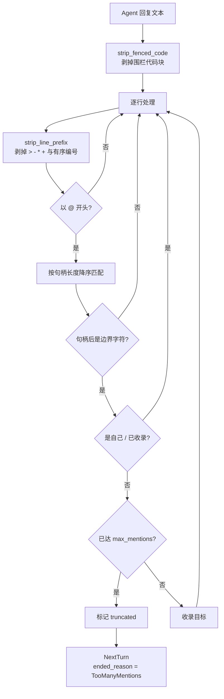
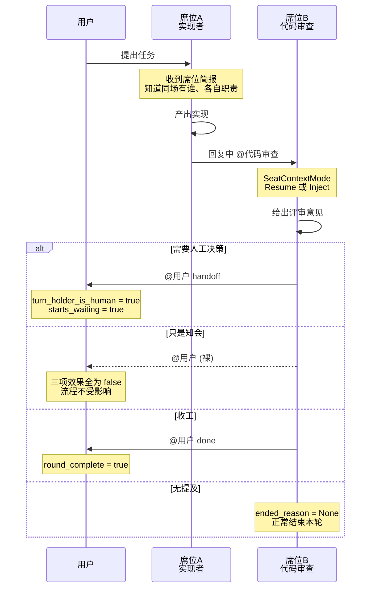

# 多 Agent 群聊与 `@` 交接

> **一个会话里坐多个 Agent，像群聊一样协作**：每个席位是「一个 Agent + 一个专家角色」，Agent 在回复中用 `@` 点名把发言权交给下一位，也可以交还给你。

## 功能定位

**这是"多 Agent 协作"在 VaneHub AI 里的会话内形态**，区别于 [Loop 工程化运行时](loop-engineering.md) 的目标驱动自动循环。群聊强调**共享同一条对话线索**：所有席位读同一份上下文，发言按轮次流转，你随时可以插话。

## 使用场景

1. **写码 + 评审** —— 一个席位实现，完成后 `@评审` 交给另一个席位做代码评审，意见接在同一条线索上。
2. **跨模型互补** —— 让 Anthropic 系与 OpenAI 系模型在同一问题上先后发言。
3. **多角色会诊** —— 架构、实现、评审三个角色对同一方案分别给意见。
4. **人工介入** —— Agent 判断需要你决策时 `@用户`，把发言权交回来并等待。
5. **只是知会** —— Agent 想让你知道进展但不需要你回应，用轻量的 `@用户` 而不打断流程。

## 能力清单

| 能力 | 说明 | 运行时 |
|---|---|---|
| 席位分配 | 创建会话时绑定多个「Agent + 角色」席位 | 桌面 / Web（模拟） |
| 句柄自动派生 | 由角色名生成唯一 `@` 句柄，重名自动加后缀 | **仅桌面** |
| `@` 交接 | 回复中点名把发言权交给指定席位 | **仅桌面** |
| 代码块豁免 | 围栏代码块内的 `@` 不触发交接 | **仅桌面** |
| 交回人类 | `@用户` 三种意图：交接 / 知会 / 完成 | **仅桌面** |
| 席位简报 | 每个席位知道同场还有谁、各自负责什么 | **仅桌面** |
| 上下文传递 | 按席位选择续接自身会话或注入历史 | **仅桌面** |
| 链路防失控 | 提及过多或深度超限时终止并说明原因 | **仅桌面** |
| 模型族识别 | 按稳定 id 判定模型族，支持跨族评审 | **仅桌面** |
| 席位切换视图 | 在界面中切换查看不同席位 | 桌面 / Web（模拟） |
| 发言人标注 | 消息按席位标注发言者 | 桌面 / Web（模拟） |

## 席位

**一个席位 = 一个 Agent + 一个可选的专家角色**（`src-tauri/src/contexts/sessions/domain/session_seat.rs:7-12`）：

```rust,ignore
pub(crate) struct SessionSeat {
    pub(crate) agent_id: String,
    /// `None` for a plain single-Agent session, which has no role assigned.
    pub(crate) role_id: Option<String>,
}
```

**席位存在 JSON 列而不是关联表**，理由写在文件头（`session_seat.rs:1-5`）：`SESSION_SELECT` 是列表、搜索、读取的热路径，为一个多数会话用不到的功能在那里加 join，会让每一次读都付出代价。

**读取损坏数据时降级为单席位而不是报错**（`session_seat.rs:27-30`）：席位是加到一张已有数据的表上的，早于席位存在的会话——或者列被写坏的会话——必须仍然能打开。

## 句柄派生

**句柄由角色名自动生成**（`domain/seat_roster.rs:69-88` 的 `derive_mentions`），三条规则：

| 规则 | 处理 | 理由 |
|---|---|---|
| 空白折叠为 `-` | `代码 审查` → `代码-审查` | 句柄跟在 `@` 后输入，**空白会截断 token** |
| 空名兜底 | 第 n 个席位 → `席位n` | 角色名缺失时仍要可寻址 |
| 重名加后缀 | 第二个 `评审` → `评审-2` | **一个会话坐两个"评审"是合理阵容**，重名该区分而不是拒绝 |

## 交接解析

**这是群聊里最考究的一段逻辑**（`domain/seat_turn.rs:139-181` 的 `parse_handoff_mentions`），逐条防的都是真实会出错的情况：



### 五条防御

**1. 围栏代码块内的 `@` 不算数**（`strip_fenced_code`）。Agent 贴一段含 `@reviewer` 的示例代码，不应该真的触发交接。

**2. 引用与列表标记不影响识别**（`seat_turn.rs:45-47` 的 `strip_line_prefix`）：`>`、`-`、`*`、`+` 以及有序列表编号都会被剥掉——**Agent 写清单时仍然是在对人说话**。

**3. 长句柄优先匹配**（`seat_turn.rs:145-147`）：

> Longest first, so a handle that prefixes another cannot shadow it.

若同时存在 `opus` 与 `opus-45` 两个句柄，短的会先匹配上、把长的吃掉。降序排序消除了这个歧义——测试里正是用 `["架构师", "代码审查", "实现者", "opus", "opus-45"]` 这组句柄验证的（`seat_turn.rs:256-260`）。

**4. 句柄后必须是边界字符**（`:155-161`）：`@opus45` 不应该匹配到 `opus`。

**5. 自我提及与重复提及被跳过**（`:165-167`）：Agent 不能把发言权交给自己，同一目标提两次也只算一次。

### 链路深度限制

**`next_turn_targets` 在解析前先查深度**（`seat_turn.rs:190-206`），注释说明了为什么需要它：

> 深度限制存在是因为 Agent 之间是自主提及的；没有它，两个 Agent 可以无限乒乓下去。**当它触发时，原因会被显式暴露而不是让链路悄悄停下**，这样用户不会疑惑为什么没人回应。

**两种强制终止原因**（`seat_turn.rs:11-14` 的 `ChainEndReason`）：

| 原因 | 触发 |
|---|---|
| `TooManyMentions` | 一次回复中提及数超过 `max_mentions` |
| `MaxDepth` | 交接链路深度达到 `max_depth` |

**正常结束不是失败**（`seat_turn.rs:18-23` 的 `NextTurn`）：`ended_reason` 为 `None` 表示链路自然耗尽了提及。注释直言——把两者混为一谈会让每一次正常结束都看起来像出错。

## 交回人类

**句柄是 `@用户`**（`seat_turn.rs:42` 的 `USER_MENTION`）。

**三种意图**（`seat_turn.rs:28-32` 的 `HumanHandoffIntent`），由 `@用户` 后面的词决定（`:212-231` 的 `parse_human_handoff`，大小写不敏感）：

| 写法 | 意图 | 含义 |
|---|---|---|
| `@用户 handoff ...` | `Handoff` | 需要你接手 |
| `@用户 done ...` | `Done` | 任务完成 |
| `@用户`（其余任何形式） | `Fyi` | 只是知会 |

### 为什么裸 `@用户` 默认是"知会"而非"打断"

注释把理由说得很直接（`seat_turn.rs:208-211`）：

> 一个不带意图的裸 `@用户` 是信息性的，不是阻塞性的。**默认阻塞会惩罚 Agent"提到人类"这个行为本身，它会学会不再提**——而这恰恰是三种意图想避免的可见性损失。

**并且只有 `handoff` 会打断**（`:233-235`）：

> 只有 `handoff` 中断流程。这个区分正是要点所在：**一个统一的、阻塞式的"通知人类"动作，会教会 Agent 避免通知。**

### 三种意图的实际效果

**每种意图产生不同的轮次效果**（`seat_turn.rs:235-251` 的 `apply_human_handoff`）：

| 意图 | `turn_holder_is_human` | `round_complete` | `starts_waiting` |
|---|---|---|---|
| `Fyi` | `false` | `false` | `false` |
| `Handoff` | `true` | `false` | **`true`** |
| `Done` | `true` | **`true`** | `false` |

**`Fyi` 三个都是 `false`**——发言权不转移、本轮不结束、不进入等待，流程完全不受影响。这就是"轻量"的具体含义。

**`Handoff` 与 `Done` 的差别在于本轮是否结束**：前者把球交给你但对话继续，后者宣告收工。

## 席位简报

**每个席位在发言前拿到一份同场名单**（`seat_roster.rs:32-40` 的 `SeatBriefingEntry`）：

| 字段 | 含义 |
|---|---|
| `mention` | 其他席位 `@` 时要输入的句柄 |
| `role_name` | 角色名 |
| `agent_name` | Agent 名 |
| `model_family` | 模型族 |
| `responsibility` | 职责 |
| `instruction` | 指令 |

**`responsibility` 来自专家角色且是必填的**——它就是其他 Agent 判断"该把话交给谁"的依据，见 [个性化的专家角色](personalization.md#专家角色)。

## 模型族判定

**四种模型族**（`seat_roster.rs:12-17` 的 `ModelFamily`）：`anthropic`、`openai`、`google`、`unknown`。该枚举与前端 `src/services/model-family.ts` 保持镜像。

**优先按稳定 id 判定**（`seat_roster.rs:91-102` 的 `family_by_agent_id`），注释说明理由：内置 Agent 由稳定 id 索引，**它不会像显示文本那样漂移**。

| Agent id | 模型族 |
|---|---|
| `claude-code` | `Anthropic` |
| `codex-cli` | `OpenAi` |
| `gemini-cli` | `Google` |
| **`opencode`** | **`Unknown`** |

**`opencode` 被显式判为 `Unknown` 而非猜一个**，注释写明：

> OpenCode 驱动的是用户自己配置的任意模型，因此没有固定的模型族。**声称它属于某一族，会让跨族评审检查建立在错误前提上。**

**这直接关系到评审推荐**：专家角色的 `require_different_family` 依赖模型族判定，见 [个性化的评审策略](personalization.md#评审策略)。`normalize_model_family`（`seat_roster.rs:104`）先按稳定 id 解析，再退回显示文本。

## 上下文传递

**席位拿到前情的方式有两种**（`seat_roster.rs:51-56` 的 `SeatContextMode`）：

| 模式 | 含义 |
|---|---|
| `Resume` | 该 Agent 自己的会话已经持有历史，**不注入任何内容** |
| `Inject` | 把此前的共享线索注入给它 |

**共享线索由 `SeatTurn` 序列构成**（`seat_roster.rs:44-48`）：每条带 `speaker` 与 `content`，即"谁说了什么"。

**`Resume` 模式避免了重复注入**：CLI Agent 自己的会话文件里已有历史，再注入一遍既浪费 token 又可能造成上下文错乱。

## 一轮交接的流转



## 使用方式

### 分配席位

创建会话对话框中的席位分配区（`src/main-layout/session-seat-assignment.tsx`，挂载于 `create-session-dialog-content.tsx:158`）添加席位，每个席位选择 Agent 与专家角色。

**句柄不需要手工指定**——由角色名自动派生，重名自动加后缀。

### 在对话中交接

输入 `@` 触发席位补全（`src/components/chat/SeatMentionCompletion.tsx`），选择目标席位句柄。当前发言权归属显示在轮次状态栏（`src/components/chat/TurnStatusBar.tsx`）。

**贴代码不必担心误触发**——围栏代码块内的 `@` 会被跳过。

### 查看与切换席位

| 视图 | 位置 |
|---|---|
| 席位面板 | `src/main-layout/session-seats-panel.tsx` |
| 席位切换器 | `src/session-workspace/seat-switcher.tsx` |
| 消息发言者标注 | `src/components/chat/MessageItem.tsx` |

前端相关纯逻辑模块：`src/services/mention-routing.ts`（提及路由）、`message-speaker.ts`（发言者解析）、`seat-briefing.ts`、`seat-context.ts`、`seat-mutation.ts`、`session-seats.ts`、`human-handoff.ts`。

## 边界与限制

- **交接依赖原生运行时** —— 席位分配与查看在 Web/mock 下可见，但轮次流转与 Agent 调用**仅桌面可用**。
- **链路有硬上限** —— 提及过多或深度超限会被强制终止，这是防失控设计；触发时原因会显式呈现。
- **句柄来自角色名** —— 未分配角色的席位不具备可被 `@` 的稳定句柄；单 Agent 会话的席位 `role_id` 为 `None`。
- **`opencode` 无固定模型族** —— 跨族评审推荐对它不生效，因为它的实际模型由用户配置决定。
- **共享线索不等于共享会话** —— `Resume` 模式下各 Agent 仍在各自会话里保有历史，VaneHub AI 不合并它们的原生会话文件。
- **与 Loop 是两套机制** —— 群聊是会话内轮次流转，Loop 是目标驱动自动循环，不共用编排逻辑。

## 相关文档

- [个性化](personalization.md) —— 专家角色的职责、技能与评审策略
- [会话管理](session-management.md) —— 会话与席位的存储关系
- [Loop 工程化](loop-engineering.md) —— 另一套多 Agent 协作机制
