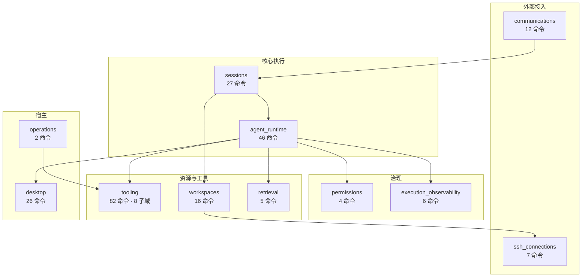
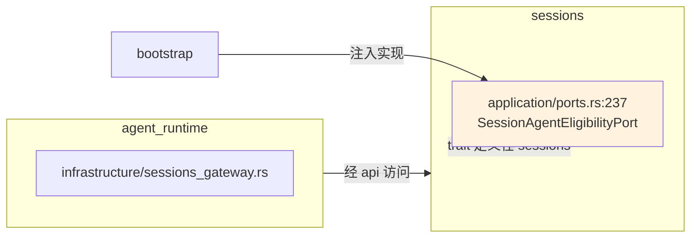

# 十一个限界上下文

> **原生侧按领域切成 11 个限界上下文**，声明在 `src-tauri/src/contexts/mod.rs:3-13`。`commands/` 与 `bootstrap/` 都与之对应，命令层不跨上下文聚合。

## 设计目标与约束

**目标是让每个领域可以被独立理解和修改。**具体约束：

| 约束 | 说明 |
|---|---|
| 单一门面 | 每个上下文对外只暴露 `api.rs`，其余模块为 `pub(crate)` 或更窄 |
| 不共享领域类型 | 上下文之间通过 api 层交互，**不直接引用彼此的 domain 类型** |
| 命令一文件一命令 | `commands/` 按上下文分组，每个 Tauri command 一个文件（`AGENTS.md`） |
| 命令层极薄 | 只做 DTO 映射与错误转换，领域逻辑不上浮 |

## 全景



> 箭头表示主要依赖方向，非穷举。

## 各上下文职责

**命令面大小可作为复杂度的粗略指标**（统计 `src-tauri/src/commands/` 下含 `tauri::command` 的文件数；仓库约定每个 command 一个文件，全仓共 237 处命令声明）：

| 上下文 | 命令文件 | 职责 |
|---|---|---|
| **`tooling`** | 82 | 元上下文：MCP、Skills、Prompt Hooks、扩展、插件、SDK、CLI 检测、CLI 参数 |
| **`agent_runtime`** | 46 | Agent 目录、CLI 进程与终端、群聊席位、Loop 运行时、记忆、个性化、专家角色、原生 API Agent |
| **`sessions`** | 27 | 会话、分类、消息、聊天配置、工作区标签页、导出、定时任务 |
| **`desktop`** | 26 | 设置、悬浮助手、托盘、开机自启、网络代理、日志目录、前端日志上报 |
| **`workspaces`** | 16 | 项目目录、Git 与 worktree、路径边界、shell 与输出捕获、命令模板、文件夹打开器 |
| **`communications`** | 12 | 飞书、钉钉、企业微信、微信、Telegram 五个连接器 |
| **`ssh_connections`** | 7 | SSH 连接配置、主机密钥信任、远程终端运行时 |
| **`execution_observability`** | 6 | 执行追踪、Span 存储、采集策略、保留清理 |
| **`retrieval`** | 5 | 记忆池的索引与混合检索 |
| **`permissions`** | 4 | 策略判定、审批、授权模板、审计、Claude Code 钩子桥接 |
| **`operations`** | 2 | 长时操作的排队、状态与日志 |

**命令数与复杂度不完全成正比**：`permissions` 只有 4 个命令，但它的领域模型（Effect、Scope、RiskLevel、Template、Grant、Principal、Policy、Resource、Action）是全仓最细致的之一。**命令面反映的是"对外暴露多少操作"，不是"内部有多复杂"。**

## `tooling` 是元上下文

**`tooling` 不是单一领域，而是 8 个各自完整的子域的容器**（`src-tauri/src/contexts/tooling/`）：

| 子域 | 结构 | 领域焦点 |
|---|---|---|
| `mcp` | 完整四层 | 传输、作用域、连接状态、中继 |
| `skills` | 完整四层 | 作用域、挂载、漂移检测 |
| `prompt_hooks` | 完整四层 | 分类、阶段、绑定、版本 |
| `extensions` | 完整四层 | OCR/ASR/TTS 框架与模型需求 |
| `plugin_integrations` | 完整四层 | 第三方集成 |
| `sdk` | 完整四层 | 受管 npm 包的生命周期 |
| `cli` | 完整四层 | 安装来源、版本、冲突 |
| `cli_config` | 目录 | 配置档案 |
| `cli_parameters.rs` | 单文件 | 参数控件、风险、启动场景 |

**这解释了它 82 个命令文件的规模**——它实际上相当于 8 个上下文。收在一个目录下的代价是这个"上下文"的边界不如其他上下文清晰。

**它们的共性是"都是外部可插拔的能力"**，这大概是当初归为一类的理由；但从领域模型看，MCP 的传输协议与 SDK 的 npm 版本管理几乎没有共享概念。

## 跨上下文依赖

**这些依赖是设计中明确存在的，不是意外耦合：**

| 依赖 | 说明 | 证据 |
|---|---|---|
| `agent_runtime` → `desktop` | 个性化设置存在 desktop 设置上下文 | `agent_runtime/infrastructure/personalization_gateway.rs:11-22` |
| `agent_runtime` → `sessions` | Agent 运行需要读写会话 | `agent_runtime/infrastructure/sessions_gateway.rs` |
| `agent_runtime` → `permissions` | 执行前判定 | `agent_runtime/infrastructure/permission_adapter.rs` |
| `agent_runtime` → `tooling` | 调用 MCP 工具、注入 Skill | `mcp_tool_gateway.rs`、`skill_gateway.rs` |
| `agent_runtime` → `retrieval` | recall 工具 | `retrieval` 的 `IndexSourcePort` 由记忆表适配器实现 |
| `sessions` → `agent_runtime` | 会话创建需校验 Agent 资格 | `sessions/application/ports.rs:237` 的 `SessionAgentEligibilityPort` |
| `workspaces` → `ssh_connections` | 远程工作区依赖 SSH 连接 | `workspaces/domain/error.rs:6-7` |
| `communications` → `sessions` | 连接器创建会话 | `SessionOwner::Connector` |
| `execution_observability` ← 各处 | 追踪由多个上下文写入 | `ExecutionSource` 三种来源 |

### 双向依赖如何不成环

**`sessions` 与 `agent_runtime` 互相需要，但方向被端口隔开**：



**`sessions` 定义自己需要的接口**（`SessionAgentEligibilityPort`），由 `agent_runtime` 侧提供实现、`bootstrap` 注入。**依赖倒置把编译期的循环依赖变成了运行期的注入关系。**

反方向的 `agent_runtime` → `sessions` 则通过 `*_gateway.rs` 走 api 层。

### 命名约定读出用途

| 文件名后缀 | 含义 |
|---|---|
| `*_gateway.rs` | 跨上下文访问的出口 |
| `*_adapter.rs` | 外部系统或其他上下文的适配 |
| `*_repository.rs` | 持久化实现 |

**看到 `agent_runtime/infrastructure/` 下的 `sessions_gateway.rs`、`skill_gateway.rs`、`mcp_tool_gateway.rs`、`prompt_gateway.rs`、`personalization_gateway.rs`、`memory_extraction_gateway.rs`，就知道 `agent_runtime` 向外伸了六只手。**这也是它偏大的一个侧面证据。

## 命令层约定

```text
commands/<context>/<command_name>.rs   # 一个命令一个文件
commands/<context>/dto.rs              # 跨边界数据结构
commands/<context>/mapper.rs           # 领域 ↔ DTO 映射
commands/registry.rs                   # 集中注册，按上下文分组
commands/error.rs                      # 统一错误转换
```

**注册表是集中且可审计的**（`commands/registry.rs:1`），文件头注释即：

> Auditable Tauri command registry grouped by bounded context.

所有命令在 `tauri::generate_handler!` 中按上下文分组列出，新增命令必须在此登记，**不存在隐式暴露**。

**错误必须在边界处转换**：跨 Tauri command 边界的错误要转成 `Result<T, String>` 或自定义 error enum（`AGENTS.md`），`unwrap()` / `expect()` 仅限测试代码。

### 注册的完整性由测试强制

**`contract_tests.rs:91` 的 `every_tauri_command_is_registered_exactly_once`** 用 `syn` 遍历所有 Rust 源文件，找出 `#[tauri::command]` 标注，验证每个在注册表中**恰好出现一次**。

**这拦住了三类靠 review 很难发现的问题**：新增命令忘了注册、同一命令注册两次、注册表中残留已删除的命令。

## bootstrap 的对应关系

**`bootstrap/` 有 22 个模块**，粒度比上下文更细——`tooling` 的每个子域都有自己的装配模块：

```text
agent_runtime  cli           cli_config    cli_parameters
communications desktop       execution_observability
extensions     managed_mcp_relay           mcp
operations     permissions   plugin_integrations
prompt_hooks   retrieval     runtime       scheduled_tasks
sdk            sessions      skills        ssh_connections
workspaces
```

**`runtime.rs` 是总装入口**，`managed_mcp_relay.rs` 与 `scheduled_tasks.rs` 是两个不直接对应上下文的横切装配。

## 已知取舍与演进方向

- **`agent_runtime` 过大** —— 46 个命令文件、`infrastructure/` 下近 50 个文件、向外伸出六个 gateway，同时承载 CLI 进程、群聊、Loop、记忆、原生 Agent 五类关注点。拆分是最明显的候选，但各部分共享 Agent 目录与会话网关，成本不低。
- **`tooling` 边界模糊** —— 8 个子域本可各自成为上下文；当前分组更像"按目录归类"而非领域划分。
- **`operations` 很薄** —— 只有 2 个命令文件，职责与 `execution_observability` 的日志部分存在概念重叠。
- **跨上下文边界靠约定维持** —— 端口都是 `pub(crate)`，跨上下文误用 domain 类型在**编译期不会报错**，只能靠 review 与架构测试拦。
- **`retrieval` 只服务一个消费方** —— 当前只索引记忆池、只被 OnePiece 使用，独立成上下文更多是为将来预留。

## 相关文档

- [端口与适配器](ports-and-adapters.md) —— 四层结构的实现方式
- [数据层](data-layer.md) —— 各上下文的表归属
- [架构总览](README.md) —— 装配与架构测试
- [功能与上下文对照](../02-features/README.md#功能与限界上下文的对应) —— 从功能反查上下文
