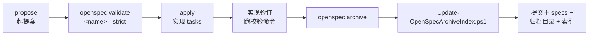

# OpenSpec 工作流

> **规范先行**：任何新功能或架构调整都要先在 `openspec/changes/` 下起一个提案，通过校验后再动代码。`openspec/specs/` 是已确认规范的唯一真源。

## 为什么是规范先行

**问题在于"代码写完了才发现理解偏了"。**OpenSpec 把"要做什么"与"怎么做"分成可独立评审的阶段，并且让规范本身成为**可校验的产物**——不是写完就放着的文档，而是 CI 会逐条检查的对象。

**这套流程在本仓库不是摆设**：归档区有 116 条完整记录，时间跨度是 `2026-07-13` 到 `2026-08-07`——**不到一个月**。平均每天 4 条以上。这个密度说明流程本身没有成为瓶颈。

## 目录结构

```text
openspec/
├── project.md                    # 项目上下文与详细规范
├── specs/                        # 已确认规范(88 个能力),唯一真源
│   └── <capability>/spec.md
├── changes/
│   ├── <change-name>/            # 未归档的活跃提案
│   │   ├── proposal.md
│   │   ├── design.md
│   │   ├── tasks.md
│   │   ├── manual-test-plan.md   # 可选
│   │   └── specs/<capability>/spec.md   # delta spec
│   └── archive/                  # 已完成变更(116 条),不可变
│       ├── archive-index.json
│       └── YYYY-MM-DD-<change-name>/
└── archive-cold-migrations.md    # 冷归档迁移记录
```

## 三阶段流程



### 一、propose

在 `openspec/changes/<change-id>/` 下产出工件。

**实际的工件组合分布**（统计自 `archive-index.json` 的 116 条记录）：

| 组合 | 数量 | 占比 |
|---|---|---|
| `proposal` + `design` + `tasks` | **101** | 87% |
| `proposal` + `design` + `tasks` + `verification` | **13** | 11% |
| 仅 `proposal` | 1 | — |
| `proposal` + `tasks` | 1 | — |

**结论很清楚：三件套是常态。**只有约一成的变更额外产出了 `verification` 工件——通常是涉及关键路径、需要留下实现验证记录的那些。

**delta spec 放在 `changes/<change-id>/specs/<capability>/spec.md`**，描述该变更对某个能力规范的增改。归档后这些 delta 会被合并进主 specs。

**部分变更还有 `manual-test-plan.md`**（例如 `2026-08-06-add-personalization-settings`）——涉及难以自动化的界面交互时手工测试计划也进归档。

**校验**：

```bash
openspec validate <change-name> --strict
```

**CI 会逐个校验 `openspec/changes/*` 下的每个活跃变更**（`ci.yml` 的 `openspec` job），`--specs --strict` 不覆盖这一层。

### 二、apply

按 `tasks.md` 实现。实现期间遵守 [五层约束体系](constraints.md)。

### 三、archive

**归档前必须满足的条件**：

| 条件 | 说明 |
|---|---|
| tasks 完成 | 全部任务已实现 |
| 通过严格校验 | `openspec validate <change-name> --strict` |
| 记录实现验证 | 涉及代码时需记录验证结果 |

**执行归档（两步都要做）**：

```bash
openspec archive <change-name>
powershell -ExecutionPolicy Bypass -File scripts/Update-OpenSpecArchiveIndex.ps1
```

**归档后必须更新索引**，并把**主 specs、归档目录、索引三者一起提交**——三者不同步会让索引失去可信度。

**关于跳过校验**：

| 选项 | 允许条件 |
|---|---|
| `--no-validate` | **正常流程禁止** |
| `--skip-specs` | 仅**无主规范影响**的变更可用 |

## 归档治理

**唯一在线归档位置**是 `openspec/changes/archive/YYYY-MM-DD-<change-name>/`。

**完整 Markdown 工件必须保留在 Git 中，不可用 zip/tar 替代**——归档是要能被检索和阅读的，不是压缩存档。压缩后 grep 不到、diff 不了，等于没归。

**归档目录不可编辑**：工具层已禁止直接修改 `openspec/changes/archive/`，只能走 `openspec archive` 流程。

### 查询归档的正确方式

**优先读索引，不要遍历目录**：

1. 读 `openspec/changes/archive/archive-index.json`
2. 按 `changeName` 或 `capabilities` 过滤
3. **定位到具体变更后，才读它的 Markdown 工件**

**索引结构**：

| 字段 | 内容 |
|---|---|
| `schemaVersion` | 索引结构版本 |
| `archives[]` | 归档条目数组（116 条） |
| `archives[].archivedOn` | 归档日期 |
| `archives[].changeName` | 变更名 |
| `archives[].path` | 归档目录路径 |
| `archives[].artifacts` | 工件类型 |
| `archives[].capabilities` | 影响的能力列表 |

**为什么强调先读索引**：116 个目录、每个 3–5 个 Markdown 文件，全量读取的成本远高于先过滤。索引把"找哪一个"和"读什么"分成了两步。

### 冷归档

**每 6 个月审查一次在线归档。**迁往冷归档前必须：

1. 验证目标 Git 仓库、不可变分支或 tag
2. 在 `openspec/archive-cold-migrations.md` 记录**可验证引用**
3. 之后才能移除在线副本

**顺序不能颠倒**——先记录引用再移除，否则一旦迁移出错就再也找不回来。

## 校验命令

| 场景 | 命令 |
|---|---|
| 改完必跑 | `openspec validate --specs --strict` |
| 起了提案 | `openspec validate <change-name> --strict` |

**CI 使用固定版本** `@fission-ai/openspec@1.6.0`（`ci.yml:92`）——校验工具本身升级会改变判定结果，因此不用浮动版本。本地最好也用同一版本，避免"本地过了 CI 不过"。

## 从归档反查历史

**想知道某个能力是怎么演进的**，用索引按 `capabilities` 过滤即可。

**按归档统计，变更数最多的能力**：

| 能力 | 归档变更数 |
|---|---|
| `settings-center-ui` | 32 |
| `main-layout-ui` | 25 |
| `native-runtime-architecture` | 24 |
| `frontend-runtime-architecture` | 18 |
| `session-management` | 16 |
| `chat-experience` | 14 |
| `unified-log-management` | 13 |
| `agent-terminal-runtime` | 9 |
| `session-workspace-tabs` | 8 |
| `agent-tool-registry` | 7 |

**这个分布本身就是信息**：

- **界面层改动最频繁**（`settings-center-ui` + `main-layout-ui` 合计 57 次）——功能一直在往设置中心加，主布局跟着调
- **两个 "runtime-architecture" 合计 42 次**——底层架构并非一次成型，而是持续重构
- **`unified-log-management` 13 次**——日志规范落地花了不少轮次

**归档区共覆盖 93 个不同能力**（`openspec/specs/` 下有 88 个），差异来自已合并或改名的能力，例如 `agent-tool-trust` 出现在归档中但不在当前 specs 里。

## 使用文档中的陷阱

### 设计稿的命名不一定落地

**归档 `design.md` 中的类型名可能与最终实现不同。**

最典型的例子：`AgentAdapter` 与 `ContextInjector` 只存在于 `2026-08-06-add-personalization-settings` 与 `2026-08-06-add-cli-custom-instructions-injection` 两份设计稿中，**代码里没有对应 trait**。

**读归档理解架构时应以代码为准**，详见 [CLI 集成](../02-architecture/cli-integration.md#先澄清一个常见误解)。

### 规范可能落后于代码

**撰写本文档集时，根 `README.md` 的 Feature status 一节有三处已落后于代码**，均已随文档一并修正：

| 原先的说法 | 实际情况 | 依据 |
|---|---|---|
| "Planned: The normal create-session UI still disables Multi Agent mode" | 多 Agent 群聊已合入 `main`，创建会话对话框已挂载席位分配组件 | commit `d104027`；`src/main-layout/create-session-dialog-content.tsx:158` |
| "Planned: Japanese runtime UI resources... not for the application UI" | **日语 UI 已完整支持** | `ja` 已注册进 `supportedLocales`（`src/i18n/supported-locales.ts:32`）；五种语言资源**键数完全一致（各 2197 条）** |
| "Preview: Multi-Agent coordination has native and Web/mock service contracts..." | **该运行时已被移除**，由群聊取代 | 迁移 45 `remove-multi-agent-coordination` 执行 `DROP TABLE coordination_runs`；`src/services`、`src/contracts`、`src-tauri/src/contexts` 中已无任何 coordination 引用 |

**第三处最值得留意**：它描述的不是"尚未做完"，而是**一个做过又被撤掉的能力**。归档区仍保留 `multi-agent-coordination` 的两条变更记录，但那是历史，不是现状。

**归档是不可变的历史记录，主 specs 才是当前真源**——但主 specs 也可能落后于最新合并的代码。**代码 > 主 specs > 归档 > README。**

### `--strict` 是默认要求

非严格模式通过不代表能进 CI。本地校验时就带上 `--strict`。

## 相关文档

- [五层约束体系](constraints.md) —— OpenSpec 在其中的位置
- [开发环境搭建](setup.md) —— 本地跑通校验命令
- [架构总览](../02-architecture/README.md) —— 架构如何被这些变更塑造
- [CLI 集成](../02-architecture/cli-integration.md) —— 设计稿与实现不一致的实例
