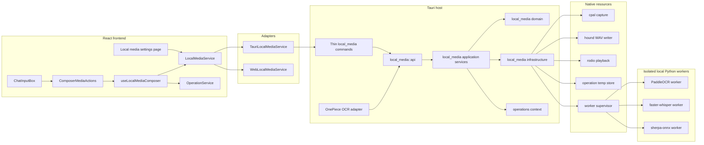
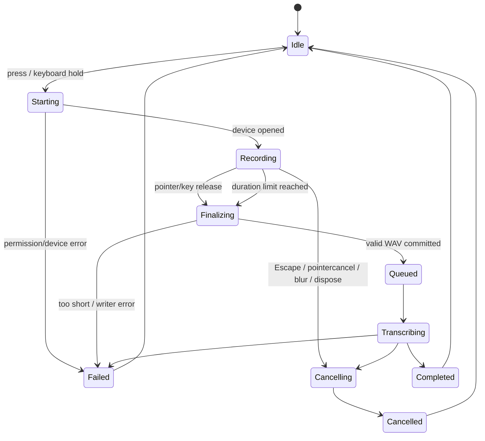

# Design: Local composer media runtime

## 1. Context

VaneHub AI is a React 19 + TypeScript desktop/web application with a Tauri 2 Rust host. The existing architectural boundary is:

```text
React component
  -> frontend service interface
    -> Tauri adapter | Web/mock adapter
      -> thin Tauri command
        -> native bounded-context application service
          -> domain/infrastructure
```

The primary API-session composer is assembled in `src/session-workspace/api-session-composer.tsx` and renders `src/components/chat/ChatInputBox.tsx`. `ChatInputBox` delegates its compact action row to `src/components/chat/ButtonArea.tsx`. `ButtonArea` already owns several selectors plus enhance/send/stop behavior and should not absorb media lifecycle logic.

The repository also has a OnePiece OCR capability specification that requires local PaddleOCR, bounded artifact inputs, structured output, provenance, privacy, and truthful Web/mock behavior. Composer OCR and OnePiece OCR have different product entry points but the same inference, model, security, admission, and process-lifecycle requirements.

The three requested libraries have different dependency stacks and lifecycle characteristics:

- PaddleOCR depends on a compatible Paddle/PaddleX environment and potentially several local model directories.
- faster-whisper depends on CTranslate2 and may use CPU or CUDA with different compute types.
- sherpa-onnx supports several TTS model families with model-specific files such as model, tokens, lexicon, data, dictionaries, or rule FSTs.

Loading all three into the Tauri process would increase binary/build complexity and make Python package compatibility the desktop application's responsibility. Loading all three into one Python process would couple unrelated native runtimes, memory, OpenMP/CUDA libraries, crashes, and restarts. This design therefore treats them as local, independently supervised inference workers.

## 2. Goals

1. Add OCR, whole-utterance push-to-talk transcription, and local TTS playback to the primary composer.
2. Guarantee local execution by construction: no cloud adapter, no hosted fallback, no implicit model/package download.
3. Keep audio sample data outside frontend state and Tauri JSON payloads.
4. Preserve the latest user draft and append results without automatically sending a message.
5. Share one PaddleOCR runtime between composer OCR and OnePiece OCR.
6. Fit the repository's service-boundary, DDD, operation/task, logging, localization, and Web/mock conventions.
7. Make engine installation/configuration failures diagnosable without exposing user content or full local paths.
8. Support Windows, macOS, and Linux with explicit permission/packaging verification.
9. Keep the first implementation bounded enough for Codex to implement and validate incrementally.

## 3. Non-goals

- Live token/segment streaming from faster-whisper while recording.
- Browser `MediaRecorder` capture for the desktop path.
- Continuous listening, wake words, or voice activity auto-start.
- Cloud providers or remote inference endpoints.
- Built-in model/package installation or model marketplace behavior.
- Screen capture, camera capture, or clipboard OCR.
- Assistant-message read-aloud or global auto-play.
- Voice cloning, speaker recognition, or biometric processing.
- Arbitrary Python execution exposed through IPC or tools.

## 4. Architectural decision summary

| Decision | Selected approach | Reason |
|---|---|---|
| Native owner | New peer context `local_media` | Independent language, lifecycle, worker supervision, devices, and ephemeral media |
| Frontend boundary | `LocalMediaService` with Tauri and Web/mock adapters | Preserves service architecture; no component-level `invoke` |
| Recording | Rust/native capture using `cpal` | Audio bytes remain outside JavaScript and browser permission differences |
| WAV encoding | `hound`, 16-bit PCM mono | Stable local interchange format and bounded implementation |
| Playback | Rust/native playback using `rodio` | Local device control and immediate stop without frontend blobs |
| Inference | Three independent Python workers | Isolates package/ABI/GPU/memory failures and restarts |
| Worker protocol | Versioned JSON Lines over stdin/stdout | Simple, testable, bounded, no local network server |
| Long tasks | Existing operations/task runtime | Stable IDs, cancellation, status, diagnostics, observability |
| Configuration | Context-owned versioned `LocalMediaProfile` | Avoids overloading generic app settings and preserves DDD ownership |
| OCR sharing | Published `local_media::api` | One PaddleOCR worker/config/admission implementation |
| Web behavior | Unavailable adapter with deterministic test fake | Truthful product behavior without pretending native capability |
| Model provisioning | User-configured absolute local paths | Prevents implicit network/model acquisition |

## 5. Target architecture



### 5.1 Bounded-context registration

Add the following row to the canonical bounded-context map in `openspec/project.md` in the same change:

```text
local_media | Local OCR, microphone capture and whole-utterance transcription, speech synthesis/playback, engine profiles, worker supervision, and ephemeral media lifecycle
```

`local_media` is a peer context, not a child of `desktop` or `tooling`:

- `desktop` continues to own windows, tray, global desktop settings, and shell lifecycle.
- `tooling` continues to own CLI/MCP/SDK/extensions/plugins/skills/prompt hooks.
- `operations` owns generic operation records, status, cancellation routing, and retention.
- `local_media` owns media-specific policy, result types, device coordination, profiles, and workers.
- `onepiece` or its tooling adapter calls only `local_media::api`; it must not import `local_media::infrastructure`.

### 5.2 Native module layout

```text
src-tauri/src/contexts/local_media/
  mod.rs
  api.rs
  domain/
    mod.rs
    engine.rs
    error.rs
    operation.rs
    profile.rs
    recording.rs
    result.rs
    staged_input.rs
  application/
    mod.rs
    cancel_operation.rs
    get_operation_result.rs
    get_profile.rs
    get_status.rs
    list_audio_devices.rs
    probe_engine.rs
    recording_service.rs
    run_ocr.rs
    run_stt.rs
    run_tts.rs
    save_profile.rs
  infrastructure/
    mod.rs
    audio_capture/
      mod.rs
      cpal_capture.rs
      pcm_writer.rs
    audio_playback/
      mod.rs
      rodio_player.rs
    persistence/
      mod.rs
      sqlite_profile_repository.rs
    staging/
      mod.rs
      input_admission.rs
      temp_store.rs
    workers/
      mod.rs
      protocol.rs
      supervisor.rs
      process.rs
      paddle_ocr.rs
      faster_whisper.rs
      sherpa_onnx.rs
  tests/
    fixtures.rs
    fake_worker.rs
```

Thin command mappings belong with the repository's existing command convention, for example:

```text
src-tauri/src/commands/local_media.rs
```

The exact command registration location must follow the current host runtime rather than creating a second command registry.

## 6. Domain model

### 6.1 Engine identifiers and status

```rust
pub enum LocalMediaEngine {
    PaddleOcr,
    FasterWhisper,
    SherpaOnnxTts,
}

pub enum EngineReadiness {
    Disabled,
    Unconfigured,
    Checking,
    Ready,
    Unavailable { code: LocalMediaErrorCode },
    RestartRequired,
}

pub struct EngineStatus {
    pub engine: LocalMediaEngine,
    pub readiness: EngineReadiness,
    pub profile_revision: i64,
    pub worker_state: WorkerState,
    pub installed_version: Option<String>,
    pub model_identity: Option<String>,
    pub device_summary: Option<String>,
    pub last_checked_at: Option<DateTime<Utc>>,
}
```

Status data must not contain full executable/model paths. The UI can show path fields from the saved profile, but runtime status and logs use safe labels or basename-plus-hash where a distinction is necessary.

### 6.2 Local media profile

The native context owns a single versioned profile in V1. The DTO is future-compatible with multiple named profiles, but only `profileId = "default"` is accepted initially.

```ts
export type LocalMediaDevice = "auto" | "cpu" | "cuda";

export interface LocalMediaProfile {
  profileId: "default";
  revision: number;
  enabled: boolean;
  ocr: PaddleOcrProfile;
  stt: FasterWhisperProfile;
  tts: SherpaOnnxTtsProfile;
  updatedAt: string;
}

export interface PaddleOcrProfile {
  enabled: boolean;
  pythonExecutable: string;
  paddleXConfigPath?: string;
  textDetectionModelDir?: string;
  textRecognitionModelDir?: string;
  textLineOrientationModelDir?: string;
  language: string;
  device: LocalMediaDevice;
  maxPdfPages: number;
}

export interface FasterWhisperProfile {
  enabled: boolean;
  pythonExecutable: string;
  modelDirectory: string;
  device: LocalMediaDevice;
  computeType: "auto" | "int8" | "float16" | "int8_float16";
  language: "auto" | string;
  vadFilter: boolean;
  beamSize: number;
  microphoneDeviceId?: string;
  maxRecordingSeconds: number;
}

export interface SherpaOnnxTtsProfile {
  enabled: boolean;
  pythonExecutable: string;
  modelKind: "vits" | "piper" | "kokoro" | "matcha";
  modelPath: string;
  tokensPath: string;
  lexiconPath?: string;
  dataDir?: string;
  dictDir?: string;
  ruleFsts: string[];
  speakerId: number;
  speed: number;
  numThreads: number;
  outputDeviceId?: string;
}
```

Validation rules:

- `enabled = false` permits empty engine paths and results in disabled composer actions.
- Every configured path must be absolute, canonicalizable, local, and of the expected file/directory type.
- URLs, UNC/network shares when disallowed by policy, special devices, FIFOs, sockets, and non-regular input files are rejected.
- OCR requires either:
  - a local PaddleX pipeline configuration whose referenced model paths resolve locally; or
  - explicit local text-detection and text-recognition model directories.
- Optional PaddleOCR preprocessing/orientation models remain disabled unless every required local path is configured. Omitting a local path must never make PaddleOCR download a default model.
- faster-whisper requires a local model directory and invokes the model loader with local-only behavior.
- TTS required fields depend on `modelKind`; validation is performed by a model-kind validator, not a single permissive path list.
- `beamSize` is `1..=10`.
- `speed` is `0.5..=2.0`.
- `numThreads` is `1..=16`.
- `maxRecordingSeconds` defaults to `120` and may be configured only in `5..=120` for V1.
- Save uses optimistic concurrency through `expectedRevision`. A stale edit returns `PROFILE_REVISION_CONFLICT`.

### 6.3 Persistence

Do not add these fields to the generic `AppSettings` aggregate. Add a context-owned repository and migration:

```sql
CREATE TABLE local_media_profiles (
  profile_id TEXT PRIMARY KEY CHECK (profile_id = 'default'),
  revision INTEGER NOT NULL,
  enabled INTEGER NOT NULL,
  ocr_config_json TEXT NOT NULL,
  stt_config_json TEXT NOT NULL,
  tts_config_json TEXT NOT NULL,
  updated_at TEXT NOT NULL
);
```

Rules:

- Insert disabled defaults on first read when no row exists.
- Increment `revision` atomically on save.
- JSON fields are parsed into versioned domain structs; unknown future fields are tolerated only where the repository's existing serialization policy permits.
- No credentials or secrets are stored.
- Paths are data, not log fields.
- Saving a profile affects only operations started after the commit.

### 6.4 Configuration snapshot

Every probe/inference operation captures an immutable `LocalMediaProfileSnapshot` containing:

- profile revision;
- engine sub-profile;
- validated/canonical model and executable identities;
- selected device and parameters;
- controller limits;
- operation ID and creation time.

Changing settings while an operation is running does not mutate the running operation. After a successful save, an idle worker with an older revision is terminated and lazily restarted. A busy worker completes or is explicitly cancelled; it is never hot-mutated.

## 7. Frontend service design

### 7.1 Service contract

Create `src/services/local-media-service.ts` following existing service-factory and adapter patterns.

```ts
export type LocalMediaCapability = "ocr" | "stt" | "tts";

export interface LocalMediaOperationHandle {
  operationId: string;
  kind: "probe" | "ocr" | "stt" | "tts";
  acceptedAt: string;
}

export interface RecordingHandle {
  recordingId: string;
  startedAt: string;
  maxDurationMs: number;
}

export interface StagedOcrSource {
  stagedInputId: string;
  displayName: string;
  mediaType: "image" | "pdf";
  byteLength: number;
}

export type LocalMediaOperationResult =
  | { kind: "probe"; status: LocalMediaRuntimeStatus }
  | { kind: "ocr"; result: ComposerOcrResult }
  | { kind: "stt"; result: TranscriptionResult }
  | { kind: "tts"; result: SpeechPlaybackResult };

export interface LocalMediaService {
  isAvailable(): Promise<boolean>;
  getProfile(): Promise<LocalMediaProfile>;
  saveProfile(input: SaveLocalMediaProfileInput): Promise<LocalMediaProfile>;
  getStatus(): Promise<LocalMediaRuntimeStatus>;
  listAudioDevices(): Promise<AudioDeviceCatalog>;
  probeEngine(engine: LocalMediaCapability): Promise<LocalMediaOperationHandle>;

  selectAndStageOcrSource(): Promise<StagedOcrSource | null>;
  startOcr(input: { stagedInputId: string }): Promise<LocalMediaOperationHandle>;

  startRecording(input: { composerScopeId: string }): Promise<RecordingHandle>;
  stopRecordingAndTranscribe(input: {
    recordingId: string;
    composerScopeId: string;
  }): Promise<LocalMediaOperationHandle>;
  cancelRecording(input: { recordingId: string }): Promise<void>;

  startTts(input: {
    text: string;
    composerScopeId: string;
  }): Promise<LocalMediaOperationHandle>;
  stopPlayback(input: { playbackId?: string; operationId?: string }): Promise<void>;

  getOperationResult(operationId: string): Promise<LocalMediaOperationResult | null>;
}
```

The Tauri adapter may use the existing Tauri dialog plugin inside the adapter to obtain a user-selected path. It must immediately pass that path to the staging command and discard it after receiving an opaque `stagedInputId`. React components receive only the display name/type/size and never pass an arbitrary path to a Python worker.

The Web adapter returns `isAvailable() = false`, disabled status, and stable `LOCAL_MEDIA_NATIVE_ONLY` errors for mutation methods. Tests may inject a deterministic fake service through the normal service provider; production Web behavior must never claim that real capture/inference occurred.

### 7.2 Thin Tauri commands

Use repository naming conventions when registering the following semantic operations:

```text
get_local_media_profile
save_local_media_profile
get_local_media_status
list_local_media_audio_devices
start_local_media_probe
stage_local_media_ocr_source
start_local_media_ocr
start_microphone_recording
stop_recording_and_transcribe
cancel_microphone_recording
start_local_media_tts
stop_local_media_playback
get_local_media_operation_result
```

Command responsibilities are limited to:

1. Deserialize and validate DTO shape.
2. Resolve the application service from managed host state.
3. Invoke one application use case.
4. Map domain output/error to a stable frontend DTO.

Commands do not open model files, write WAV data, spawn Python, implement cancellation, or update generic operation tables directly.

## 8. Operation and result integration

### 8.1 Operation kinds and phases

Register operation kinds:

```text
local-media.probe
local-media.ocr
local-media.stt
local-media.tts
```

Common phases:

```text
accepted -> queued -> loading-engine -> processing -> terminal
```

Additional phases:

- STT: `finalizing-recording` before `queued`.
- TTS: `generating-audio -> playing` before terminal.
- OCR: `admitting-input` occurs before the operation is accepted; the accepted operation owns an already staged input.

Every long operation returns its ID immediately. Existing `OperationService` remains the generic source for status and cancellation. `LocalMediaService.getOperationResult()` supplies a bounded discriminated result because the current generic operation API does not expose media-specific result DTOs.

### 8.2 Result retention

- Store typed results in the operation/task result store according to existing retention policy.
- OCR and STT textual results are available only to the initiating local application session; they are not emitted to generic logs.
- Generated TTS output remains an ephemeral file managed by the operation and playback session; result DTOs expose metadata and `playbackId`, not a host file path.
- A terminal result read is idempotent.
- Expired results return `OPERATION_RESULT_EXPIRED`, not a generic not-found ambiguity.

### 8.3 Cancellation

Cancellation sources include:

- existing operation cancel UI/service;
- Escape during recording;
- pointer cancellation/window blur before release;
- explicit TTS stop;
- session/composer disposal;
- application shutdown.

Cancellation policy:

1. Mark cancellation requested in the operation runtime.
2. Stop capture/playback immediately when applicable.
3. Send a cooperative `cancel` frame to the relevant worker when it is not inside a native blocking call.
4. After a short bounded grace period, terminate only that engine worker if the job has not stopped.
5. Mark the operation cancelled, clean all owned temp files, and allow lazy worker restart for the next operation.

Do not mark a cancelled result as failed. Do not append a transcript/OCR result after cancellation.


## 9. Native microphone capture

### 9.1 Why capture in Rust

The desktop implementation uses native capture rather than browser `getUserMedia`/`MediaRecorder`:

- raw samples never enter React state or Tauri JSON serialization;
- device enumeration, single-recorder coordination, and shutdown are host-owned;
- WAV generation and temporary-file ownership are deterministic;
- desktop permission behavior can be verified independently of WebView implementation differences;
- cancellation does not depend on a live component retaining a JavaScript media stream.

### 9.2 Recording state machine



Constraints:

- Only one recording can be active application-wide.
- Minimum accepted duration: `300 ms`.
- Default and hard maximum duration: `120 s`.
- On maximum duration, capture stops automatically and the complete recording proceeds to transcription. The UI states that the limit was reached; it does not discard the utterance.
- A press that fails before a recording handle is returned does not enter the visual recording state.
- `pointercancel`, lost pointer capture, window blur, Escape, route disposal, or application shutdown cancels and deletes the recording; it does not transcribe implicitly.
- Release after a successful hold means “finish and transcribe,” not “cancel.”

### 9.3 Sample pipeline

1. Resolve configured microphone device or system default.
2. Open a `cpal` input stream using the device's supported configuration.
3. Convert samples (`f32`, `i16`, or `u16`) into bounded normalized PCM frames.
4. Downmix all input channels to mono using an overflow-safe accumulator.
5. Send frames through a bounded channel to a dedicated writer task. The real-time audio callback must not perform file I/O, allocate unbounded memory, block on inference, or log sample data.
6. Write 16-bit PCM WAV with the native sample rate using `hound`.
7. On release, stop the stream, drain the bounded channel, finalize the WAV header, `fsync` according to existing local task policy, and atomically mark the file committed.
8. Pass only the canonical operation-owned WAV path to the faster-whisper worker. Local decoder/resampler behavior remains inside the configured faster-whisper environment.

Backpressure policy:

- The channel has a fixed capacity sized for a short audio window.
- If the writer cannot keep up, capture fails with `AUDIO_CAPTURE_OVERRUN`; the application cancels the recording rather than silently dropping arbitrary frames and producing misleading text.
- Sample counts, duration, and overrun counters may be logged; sample values may not.

### 9.4 Recording coordinator

`RecordingCoordinator` is a host-managed singleton inside `local_media`:

```rust
pub trait RecordingPort: Send + Sync {
    async fn start(&self, request: StartRecordingRequest) -> Result<RecordingHandle, LocalMediaError>;
    async fn finish(&self, recording_id: RecordingId) -> Result<CommittedRecording, LocalMediaError>;
    async fn cancel(&self, recording_id: RecordingId) -> Result<(), LocalMediaError>;
    async fn active(&self) -> Option<RecordingSummary>;
}
```

The coordinator validates ownership by `recordingId` and `composerScopeId`. A caller cannot stop/cancel an unrelated recording by guessing only a session ID. IDs are random, opaque, and not derived from file paths.

## 10. Python worker architecture

### 10.1 Process model

Bundle one small bridge package and launch it in one of three modes:

```text
src-tauri/resources/local-media-worker/
  pyproject.toml-or-requirements-note   # documentation/metadata only; no install action
  vane_local_media_worker/
    __main__.py
    protocol.py
    errors.py
    privacy.py
    paddle_ocr_engine.py
    faster_whisper_engine.py
    sherpa_onnx_tts_engine.py
```

Example launch shape:

```text
<configured-python> -I -u <bundled-worker-entry> --engine faster-whisper --protocol 1
```

Implementation notes:

- Prefer an execution form compatible with the selected Python environment and Tauri resource location. `-I` may be used only after verifying that it does not prevent importing the user-installed packages; otherwise isolate `PYTHONPATH` explicitly and retain the other offline/sanitized environment controls.
- `-u` or equivalent unbuffered mode is required for protocol liveness.
- The worker's current directory is an application-owned empty temp directory, not the project or user home directory.
- Standard input/output are protocol-only. Human diagnostics go to stderr and are redacted by the host.
- Each engine has an independent process, queue, restart counter, and health state.
- Workers start lazily on probe or first operation and may be evicted after an implementation-defined idle period when no operation or playback depends on them.

### 10.2 Offline environment

The supervisor starts workers with an allowlisted environment and, at minimum, offline flags used by relevant model ecosystems:

```text
HF_HUB_OFFLINE=1
TRANSFORMERS_OFFLINE=1
```

Additional rules:

- Do not pass application proxy variables into the worker unless an existing security policy requires them for local paths; default is to remove `HTTP_PROXY`, `HTTPS_PROXY`, `ALL_PROXY`, and equivalent lowercase variables.
- Pass an application-owned cache/temp root rather than arbitrary user caches where supported.
- faster-whisper must construct `WhisperModel` from the explicit local model directory and set local-only loading behavior.
- PaddleOCR must receive explicit local model configuration; no omitted model argument may trigger an official-model download.
- sherpa-onnx must receive explicit local model/token/auxiliary file paths.
- Worker code contains no HTTP client integration or cloud provider adapter.
- Automated tests deny socket creation in the worker and assert a stable `MODEL_DOWNLOAD_BLOCKED`/offline failure instead of a network attempt.

This is a code-path guarantee, not a claim that the desktop application provides a universal operating-system network sandbox on every platform.

### 10.3 Versioned JSON Lines protocol

Every frame is one UTF-8 JSON object followed by `\n`. Maximum frame size is bounded. Textual results above the bound are written to operation-owned result files and referenced by opaque IDs internally; frontend result DTOs remain bounded by product limits.

Worker hello:

```json
{
  "v": 1,
  "type": "hello",
  "engine": "faster-whisper",
  "workerVersion": "1",
  "packageVersion": "1.x",
  "capabilities": ["probe", "transcribe", "cancel"]
}
```

Request:

```json
{
  "v": 1,
  "type": "request",
  "id": "01J...",
  "method": "transcribe",
  "params": {
    "audioPath": "<canonical-operation-path>",
    "modelDirectory": "<canonical-local-model-path>",
    "device": "cpu",
    "computeType": "int8",
    "language": "auto",
    "vadFilter": true,
    "beamSize": 5
  }
}
```

Success response:

```json
{
  "v": 1,
  "type": "response",
  "id": "01J...",
  "ok": true,
  "result": {
    "text": "transcribed text",
    "detectedLanguage": "zh",
    "languageProbability": 0.98,
    "durationMs": 6432
  }
}
```

Error response:

```json
{
  "v": 1,
  "type": "response",
  "id": "01J...",
  "ok": false,
  "error": {
    "code": "MODEL_INCOMPATIBLE",
    "messageKey": "localMedia.errors.modelIncompatible",
    "retryable": false,
    "safeDetails": {
      "engine": "faster-whisper"
    }
  }
}
```

Required methods:

| Engine | Methods |
|---|---|
| PaddleOCR | `probe`, `ocr`, `cancel`, `shutdown` |
| faster-whisper | `probe`, `transcribe`, `cancel`, `shutdown` |
| sherpa-onnx | `probe`, `synthesize`, `cancel`, `shutdown` |

Protocol rules:

- Unknown protocol versions, methods, duplicate IDs, malformed frames, oversized frames, stdout contamination, or response-ID mismatches terminate and quarantine the worker with `WORKER_PROTOCOL_ERROR`.
- The host never logs complete request/response frames.
- `probe` imports the package, validates configured files, creates the engine/model where safe, and returns safe version/device/model metadata.
- A worker handles one inference at a time. The supervisor queues a small bounded number per engine; excess work receives `ENGINE_BUSY` rather than unbounded memory growth.
- Cancellation is cooperative first. Since native inference calls may not be interruptible, the host may terminate and recreate the one affected worker after a grace period.

### 10.4 Supervisor model

```rust
pub struct LocalMediaWorkerSupervisor {
    paddle: EngineWorkerSlot,
    whisper: EngineWorkerSlot,
    sherpa: EngineWorkerSlot,
}

struct EngineWorkerSlot {
    state: WorkerState,
    profile_revision: Option<i64>,
    active_operation: Option<OperationId>,
    queue_depth: usize,
    consecutive_failures: u32,
    restart_not_before: Option<Instant>,
}
```

Policies:

- One active job per engine.
- OCR, STT, and TTS may run concurrently because they use separate workers, subject to existing global operation/resource admission policy.
- Default queue depth per engine: `2` waiting jobs. The composer itself prevents duplicate local actions, but OnePiece may submit OCR independently.
- Exponential restart backoff is bounded and reset after a successful probe/job.
- Repeated startup crashes produce `ENGINE_UNAVAILABLE` until the user probes again or changes the profile; do not spin forever.
- A stale-revision idle worker is shut down before serving a new job.
- Process handles are owned by the supervisor and closed on application shutdown.

## 11. PaddleOCR flow

### 11.1 Composer input admission

The composer selects one image or PDF. The frontend adapter obtains the selected path through the existing native dialog facility and immediately calls staging. The native admission pipeline:

1. Canonicalizes the selected path without following an unbounded chain of links.
2. Verifies it is a regular file.
3. Opens it once and derives type from bounded content sniffing/magic bytes; filename extension alone is insufficient.
4. Allows configured image formats supported by the selected PaddleOCR pipeline plus PDF.
5. Enforces controller limits before inference:
   - file bytes: default `50 MiB`;
   - PDF pages: profile/controller maximum, default `20`;
   - decoded image pixels: default `50,000,000` per page;
   - operation wall time: existing operation deadline plus engine-specific timeout;
   - output nodes/lines/characters: bounded to prevent result amplification.
6. Copies the content into a new operation-staging directory using an opaque filename and restrictive permissions.
7. Returns `StagedOcrSource { stagedInputId, displayName, mediaType, byteLength }`.
8. Stores the mapping only inside `local_media`; the Python worker receives the staged canonical path, never the caller path.

A staged source expires quickly (for example, after 10 minutes) if the user never starts OCR. Starting OCR atomically claims it for one operation. It cannot be reused across unrelated operations.

### 11.2 OnePiece input admission

OnePiece remains artifact-only. Its adapter provides a managed artifact reference to `local_media::api`, which materializes/admits the artifact into the same operation-owned temp store. It must not add an arbitrary host-path entry point to the tool schema.

The context exposes semantic methods such as:

```rust
pub trait LocalMediaApi: Send + Sync {
    async fn run_ocr_for_artifact(
        &self,
        request: ArtifactOcrRequest,
    ) -> Result<OperationId, LocalMediaError>;

    async fn get_ocr_result(
        &self,
        operation_id: OperationId,
    ) -> Result<Option<OcrResult>, LocalMediaError>;
}
```

Do not expose worker process handles, Python paths, or temp paths to OnePiece.

### 11.3 OCR result

The canonical native result preserves structure for OnePiece and derives plain text for the composer:

```ts
export interface ComposerOcrResult {
  source: {
    displayName: string;
    mediaType: "image" | "pdf";
    pageCount: number;
  };
  plainText: string;
  pages: Array<{
    pageNumber: number;
    text: string;
    lineCount: number;
  }>;
  warnings: Array<{
    code: string;
    messageKey: string;
    pageNumber?: number;
  }>;
  provenance: {
    engine: "paddleocr";
    engineVersion?: string;
    profileRevision: number;
    language: string;
    modelIdentity?: string;
  };
}
```

Ordering and text derivation:

- Preserve page order.
- Preserve engine reading order within each page.
- Join lines with `\n`.
- Join pages with a blank line.
- Normalize CRLF to LF but do not rewrite recognized punctuation or silently “correct” content.
- Empty recognition is a successful `NO_TEXT_DETECTED` outcome shown in the review UI, not an infrastructure crash.
- Do not silently truncate. If product insertion limits are exceeded, retain a bounded review/result representation and disable append with copy/export guidance already supported by the product.

## 12. faster-whisper flow

### 12.1 Whole-utterance contract

V1 is explicitly non-streaming:

1. Press starts local capture.
2. No partial transcript is requested or shown while recording.
3. Release finalizes the complete WAV.
4. The committed WAV is submitted once to the faster-whisper worker.
5. Only the final transcript is returned to the composer.
6. The transcript is appended to the latest draft after operation completion.

This avoids unstable partial-text merge semantics and matches the requested hold/release behavior.

### 12.2 Worker call

The worker loads a model only from `modelDirectory` and uses local-only loading. Conceptually:

```python
model = WhisperModel(
    model_size_or_path=profile.model_directory,
    device=resolved_device,
    compute_type=resolved_compute_type,
    local_files_only=True,
)
segments, info = model.transcribe(
    audio_path,
    language=None if profile.language == "auto" else profile.language,
    vad_filter=profile.vad_filter,
    beam_size=profile.beam_size,
)
text = "".join(segment.text for segment in segments).strip()
```

The actual bridge must:

- avoid returning word-level timestamps in V1 unless a bounded diagnostic requires them;
- exhaust the segment generator inside the worker so errors occur before success is reported;
- normalize only outer whitespace and line endings;
- return detected language/probability when available;
- map package/model/device errors to stable codes;
- never print the transcript to stderr/stdout outside the protocol response.

### 12.3 Draft merge semantics

The operation captures only `composerScopeId`, not a draft snapshot. On successful completion, the controller obtains the latest draft from the current composer model and applies:

```ts
export function appendSpeechTranscript(current: string, transcript: string): string {
  const normalized = transcript.replace(/\r\n?/g, "\n").trim();
  if (!normalized) return current;
  if (!current) return normalized;
  if (/\s$/u.test(current)) return `${current}${normalized}`;
  return `${current} ${normalized}`;
}
```

Required behavior:

- User text typed while transcription is running is retained.
- Existing trailing whitespace controls whether an extra separator is inserted.
- The transcript is appended, never prepended and never used to replace the draft.
- The same draft setter path updates slash/file-reference suggestions and textarea state.
- Focus returns to the textarea and the caret moves to the end after successful append unless the user moved focus to another substantive control.
- If the resulting draft violates an existing composer input limit, do not truncate or overwrite. Show a recoverable result dialog with copy and cancel actions.
- Empty transcript leaves the draft unchanged and shows an informational `NO_SPEECH_DETECTED` state.
- No code path invokes send automatically.

### 12.4 Session-scope race prevention

`composerScopeId` is derived from the active API session/composer instance and changes on session switch or composer remount.

Before applying any asynchronous result, the controller verifies:

```text
result.scopeId == currentComposerScopeId
AND operation is not cancelled
AND component/controller is active
```

If false:

- do not mutate any draft;
- retain only a bounded notification/result where the product already supports operation history;
- clean temp resources normally;
- do not append to the newly selected session.

## 13. sherpa-onnx TTS flow

### 13.1 Text selection policy

On activation:

1. Read the current textarea selection range.
2. If the range is non-empty after trimming, synthesize exactly the selected substring.
3. Otherwise synthesize the complete draft.
4. Reject empty text with a disabled control/tooltip rather than starting an operation.
5. Enforce a V1 maximum of `4,000` Unicode code points; return `TTS_TEXT_TOO_LONG` without silent truncation.

The text is passed through the local Tauri IPC command because it originates in the frontend, then written to or delivered to the local worker without logging. It is never sent to a network provider.

### 13.2 Synthesis

The worker constructs the configured sherpa-onnx offline TTS engine with explicit local files. Model-kind validation maps the profile to the appropriate sherpa configuration. The worker generates a local WAV into an operation-owned output path and returns only safe metadata:

```json
{
  "audioPath": "<operation-owned-output>",
  "sampleRate": 22050,
  "sampleCount": 65432,
  "durationMs": 2967
}
```

The host validates that the returned path is exactly the pre-authorized output path under the operation temp directory and that the file is a regular bounded WAV. A worker cannot redirect playback to an arbitrary path.

### 13.3 Playback

- `rodio` owns playback and output-device selection.
- Starting a new composer TTS request stops the previous local-media playback after explicit user activation; the UI does not mix multiple generated utterances.
- The operation remains in `playing` until playback completes, is stopped, or fails.
- The result exposes an opaque `playbackId`, duration, and device summary, never a path.
- Clicking the active speaker/stop control immediately stops the sink and marks the operation cancelled/stopped according to the existing operation vocabulary.
- Generated WAV is deleted after playback termination and result metadata commit.
- Application shutdown stops playback and removes the file.

V1 does not cache synthesis output across requests because the text may contain sensitive draft content.

## 14. Temporary media lifecycle

Use an application cache/temp root dedicated to this context:

```text
<app-cache>/local-media/
  staging/<staged-input-id>/source.bin
  operations/<operation-id>/input.wav
  operations/<operation-id>/source.bin
  operations/<operation-id>/output.wav
```

Rules:

- Directory and file permissions are restrictive (`0700`/`0600` on Unix where applicable).
- Names are opaque IDs, not user filenames or transcript fragments.
- Each resource has one owner (`stagedInputId`, `recordingId`, or `operationId`).
- Ownership transfer is atomic: staging -> OCR operation; recording -> STT operation.
- Cleanup runs in `finally`/drop guards on success, failure, and cancellation.
- Startup performs a bounded sweep of entries older than 24 hours and ignores paths that escape the canonical root.
- Symlinks/reparse-point escapes are rejected during creation and cleanup.
- Cleanup errors are recorded as redacted warnings and retried by the stale sweep; they do not convert a successful inference into a failed user result unless privacy policy requires it.
- No media file is included in crash reports, telemetry, exported diagnostics, or operation logs.

## 15. Composer UI design

### 15.1 Component decomposition

Keep `ButtonArea.tsx` small by introducing a slot and separate components:

```text
src/components/chat/
  ChatInputBox.tsx
  ButtonArea.tsx                    # existing; receives mediaActions slot
  ComposerMediaActions.tsx         # compact action group and visual states
  RecordingIndicator.tsx           # elapsed time/local status/cancel hint
  OcrReviewDialog.tsx               # editable OCR review and append decision
  LocalMediaResultDialog.tsx        # overflow/recoverable STT/OCR result

src/session-workspace/
  hooks/use-local-media-composer.ts
  local-media/
    draft-merge.ts
    local-media-composer-controller.ts
    local-media-composer-types.ts
```

Suggested boundary:

```tsx
<ButtonArea
  ...existingProps
  mediaActions={
    <ComposerMediaActions
      state={media.state}
      availability={media.availability}
      onOcr={media.selectAndRunOcr}
      microphoneBindings={media.microphoneBindings}
      onSpeak={media.speakOrStop}
    />
  }
/>
```

`ComposerMediaActions` is presentational. It receives state/callbacks and does not obtain services, poll operations, or mutate the session model directly. `useLocalMediaComposer` coordinates services, the latest draft accessor, scope checks, operation subscriptions/polling, and dialogs.

### 15.2 Layout

Desktop-wide conceptual layout:

```text
┌──────────────────────────────────────────────────────────────────────────┐
│ textarea / completion overlay                                            │
├──────────────────────────────────────────────────────────────────────────┤
│ [Config][Provider][Mode][Model][Reasoning]     [OCR][Hold mic][Speak][✨][↑] │
└──────────────────────────────────────────────────────────────────────────┘
```

Rules:

- Media controls are a visually grouped set immediately before enhance/send on the right action cluster.
- Use existing compact semantic button tokens; target `32 x 32 px` where the current action row uses that density.
- Do not reserve a different width for spinner vs icon; state changes cause no layout shift.
- On narrow widths, preserve send/stop visibility and allow the left selector group to wrap/collapse according to existing behavior. Media controls remain reachable and do not overlap the textarea.
- Do not introduce a permanently visible large waveform inside the input box.

### 15.3 OCR interaction

Idle:

- Icon: scan/text-recognition semantic icon.
- Tooltip: “Extract text locally (PaddleOCR)” or localized equivalent.
- Disabled when native runtime is unavailable, OCR is disabled/unready, another OCR initiated by this composer is active, or send/stop state policy forbids mutation.

Flow:

```text
click OCR
  -> native file picker
  -> stage and validate
  -> operation spinner/status
  -> editable review dialog
  -> user chooses Append / Copy / Cancel
```

Review dialog fields:

- source display name, media type, page count;
- local-engine badge and safe engine/version status;
- editable multiline text area containing `plainText`;
- character count and warnings;
- `Append to input` primary action;
- `Copy` secondary action where clipboard facilities already exist;
- `Cancel` action.

Append is explicit. OCR never inserts text before the review is shown. Append separator:

```ts
export function appendOcrText(current: string, text: string): string {
  const normalized = text.replace(/\r\n?/g, "\n").trim();
  if (!normalized) return current;
  if (!current) return normalized;
  if (/\n$/u.test(current)) return `${current}${normalized}`;
  return `${current}\n\n${normalized}`;
}
```

### 15.4 Hold-to-talk interaction

Pointer behavior:

- `pointerdown`: prevent accidental text selection, capture pointer, request start recording.
- after native start succeeds: show active recording visual and elapsed timer;
- `pointerup` for captured pointer: finish and transcribe;
- `pointercancel`, `lostpointercapture`, or window blur: cancel;
- Escape while recording: cancel;
- suppress the synthetic `click` following a completed hold so it does not start a second action.

Keyboard parity:

- Focused microphone button supports Space or Enter keydown to start.
- Ignore repeated keydown events.
- Keyup finishes and transcribes.
- Escape cancels.
- Standard Tab navigation remains intact.

Visual states:

| State | Control | Adjacent status |
|---|---|---|
| unavailable | muted mic icon, disabled | tooltip links/explains Local media settings |
| idle | mic icon | tooltip “Hold to talk — processed locally” |
| starting | fixed spinner | “Opening microphone…” via `aria-live` |
| recording | pulsing/ring mic, pressed state | elapsed `00:07`, “Esc to cancel”, local badge |
| finalizing | spinner | “Finishing recording…” |
| transcribing | spinner/waveform glyph | “Transcribing locally…” |
| failed | normal mic + error indicator | toast/inline recoverable error |

A small animated level/wave indicator may use aggregate RMS values emitted at a low bounded rate from Rust, but V1 should omit this unless it can be added without sending sample buffers or destabilizing the action row. Elapsed duration alone is sufficient acceptance behavior.

### 15.5 TTS interaction

- Idle icon: speaker.
- Disabled when no selected/draft text, TTS unready, native runtime unavailable, or another incompatible playback action is active.
- Click while idle: synthesize selection or draft.
- Generating: fixed-size spinner.
- Playing: stop/speaker-active icon with `aria-pressed=true`; tooltip “Stop local speech.”
- Click while generating/playing: cancel generation or stop playback.
- Do not auto-start from draft changes.
- Do not auto-read assistant messages.

### 15.6 Accessibility

- Every icon-only button has localized `aria-label` and tooltip text.
- Microphone uses `aria-pressed` during active hold.
- Status changes are announced through one `aria-live="polite"` region; do not announce elapsed time every second to screen readers.
- Errors are associated with the triggering control and remain available in an accessible notification/history pattern.
- Recording can be started, finished, and cancelled without a pointer.
- Motion respects `prefers-reduced-motion`; use a static active indicator when reduction is requested.
- Focus is restored predictably after dialogs and draft insertion.

### 15.7 Existing composer behavior

The integration must retain:

- current IME composition guards;
- Enter/send and Shift+Enter/newline semantics;
- slash-command and file-reference completion behavior;
- prompt enhancement;
- send/stop control priority;
- disabled/loading rules during active session operations;
- textarea sizing and selection behavior.

Do not bind global microphone shortcuts in this change.

## 16. Local media settings UI

### 16.1 Navigation

Add `local-media` to `src/settings/settings-pages.ts` under the capabilities group and add a lazy loader in `src/settings/settings-page-loaders.ts`. Recommended placement: after code intelligence and before MCP/tooling entries, while preserving whatever exact ordering convention the current settings registry tests enforce.

Page title: **Local media** / localized equivalent.

Intro text states:

- all three features execute through locally configured environments;
- VaneHub does not install packages/models from this page;
- no cloud fallback is used;
- microphone access is requested only when recording begins or when a platform probe requires it.

### 16.2 Page structure

```text
Local media
[Master enable]

┌ OCR — PaddleOCR ──────────────────────────────────────────────┐
│ [Enable] [status badge] [Check]                               │
│ Python executable                                             │
│ PaddleX config OR detection model + recognition model         │
│ Optional orientation model | language | device | PDF max pages│
└───────────────────────────────────────────────────────────────┘

┌ Speech-to-text — faster-whisper ──────────────────────────────┐
│ [Enable] [status badge] [Check]                               │
│ Python executable | local model directory                     │
│ microphone | language | device | compute type | VAD | beam    │
└───────────────────────────────────────────────────────────────┘

┌ Text-to-speech — sherpa-onnx ─────────────────────────────────┐
│ [Enable] [status badge] [Check]                               │
│ Python executable | model kind | model/tokens/auxiliary paths │
│ speaker | speed | threads | output device                     │
└───────────────────────────────────────────────────────────────┘

[Discard] [Save] [Check all saved engines]
```

### 16.3 Field behavior

- Use existing path-field and native file/directory picker patterns where available.
- Display full configured paths only inside explicit settings inputs; elsewhere show safe summaries.
- Engine-specific conditional fields are rendered from typed configuration, not stringly typed generic key/value rows.
- Client validation provides immediate field errors, but native save/probe remains authoritative.
- Unsaved edits do not alter active workers.
- `Save` uses `expectedRevision` and reports conflicts with reload/reapply guidance.
- `Check` probes the saved profile. To avoid ambiguity, do not probe unsaved values under a button that appears to validate persisted runtime state.
- After save, status becomes “Needs check” or “Restart on next use” until a successful probe/current operation establishes readiness.
- `Check all` returns a stable operation or a small set of engine probes and reports each result independently.
- A failed OCR probe does not hide working STT/TTS controls, and vice versa.

### 16.4 Readiness states

Status badges:

```text
Disabled | Not configured | Needs check | Checking | Ready | Unavailable | Restart required
```

Ready status includes safe metadata only:

- package/engine version;
- device (`CPU`, `CUDA`, or resolved auto value);
- model/voice safe identity;
- last checked time.

Do not include buttons named “Install,” “Download,” or “Fix automatically” in V1. Error guidance may explain which local dependency/path is missing but must not execute package managers or open arbitrary remote installers.

## 17. Error model

### 17.1 Stable error codes

```text
LOCAL_MEDIA_NATIVE_ONLY
LOCAL_MEDIA_DISABLED
ENGINE_DISABLED
ENGINE_UNCONFIGURED
ENGINE_BUSY
ENGINE_UNAVAILABLE
PYTHON_NOT_FOUND
PYTHON_EXECUTION_DENIED
ENGINE_IMPORT_FAILED
ENGINE_VERSION_UNSUPPORTED
PROFILE_REVISION_CONFLICT
MODEL_NOT_CONFIGURED
MODEL_NOT_FOUND
MODEL_INCOMPATIBLE
MODEL_DOWNLOAD_BLOCKED
DEVICE_CONFIGURATION_INVALID
MIC_PERMISSION_DENIED
MIC_DEVICE_UNAVAILABLE
AUDIO_CAPTURE_START_FAILED
AUDIO_CAPTURE_OVERRUN
RECORDING_ALREADY_ACTIVE
RECORDING_NOT_FOUND
RECORDING_TOO_SHORT
RECORDING_LIMIT_REACHED
INPUT_NOT_FOUND
INPUT_TOO_LARGE
UNSUPPORTED_MEDIA_TYPE
PDF_PAGE_LIMIT_EXCEEDED
IMAGE_PIXEL_LIMIT_EXCEEDED
NO_TEXT_DETECTED
NO_SPEECH_DETECTED
TTS_TEXT_TOO_LONG
PLAYBACK_DEVICE_UNAVAILABLE
WORKER_START_FAILED
WORKER_CRASHED
WORKER_PROTOCOL_ERROR
OPERATION_CANCELLED
OPERATION_RESULT_EXPIRED
TEMP_STORAGE_FAILED
TEMP_CLEANUP_FAILED
```

`RECORDING_LIMIT_REACHED` is normally a non-fatal warning attached to a successful transcription when auto-stop occurred. `NO_TEXT_DETECTED` and `NO_SPEECH_DETECTED` are user outcomes with unchanged draft, not generic system failures.

### 17.2 Error DTO

```ts
export interface LocalMediaErrorDto {
  code: LocalMediaErrorCode;
  messageKey: string;
  retryable: boolean;
  operationId?: string;
  safeDetails?: Record<string, string | number | boolean>;
}
```

- UI text comes from `messageKey` and locale catalogs.
- `safeDetails` uses an explicit allowlist.
- Raw Python exception text is never passed directly to the frontend.
- Native logs may retain a redacted exception class/module and an internal diagnostic correlation ID.
- User guidance distinguishes configuration failures, permission failures, resource limits, worker crashes, and cancellation.

## 18. Privacy, logging, and observability

### 18.1 Data classification

Treat these as sensitive payloads and never log them:

- raw microphone samples and generated WAV bytes;
- selected image/PDF bytes;
- OCR output and recognized lines;
- STT transcript and segment text;
- TTS source text;
- full Python executable/model/source/temp paths;
- complete worker protocol frames;
- raw Python tracebacks containing paths or content.

Allowed operational fields:

- operation ID and correlation ID;
- engine identifier and safe version;
- profile revision;
- phase and terminal status;
- duration, sample count, byte count, page count, line/character count;
- safe device category;
- stable error code;
- restart count and queue depth.

### 18.2 Spans/events

Use the repository's existing operation observability conventions. Suggested spans:

```text
local_media.operation
local_media.stage_input
local_media.capture
local_media.worker.start
local_media.worker.probe
local_media.worker.infer
local_media.playback
local_media.cleanup
```

No span attribute contains user text or path. Operation history labels use generic descriptions such as “Local speech transcription,” not snippets of the transcript.

### 18.3 Network assurance

Acceptance evidence includes:

- source review showing no HTTP/cloud adapter in `local_media` or worker bridge;
- worker environment tests for offline flags and proxy removal;
- unit tests where socket creation is denied and model loading maps to a stable offline/configuration error;
- desktop test traffic monitoring or network namespace isolation where the platform/CI permits it;
- documentation that the guarantee covers this feature's code paths, not unrelated application traffic.

## 19. Concurrency and resource policy

- One active microphone recording application-wide.
- One active playback application-wide for local-media TTS.
- One active inference per engine worker.
- OCR/STT/TTS may execute concurrently through separate workers if admitted by global resource policy.
- Composer prevents duplicate action submission while its own operation is active.
- Bounded queue per engine; no unbounded requests.
- Worker/model memory is released on idle eviction, profile change, repeated failure, or app shutdown.
- GPU selection is explicit/auto-resolved; the app does not silently move a failed CUDA configuration to CPU unless `device = auto` and that fallback is part of the documented resolver.
- Operations have engine-specific deadlines and use the generic task timeout/cancellation model.

## 20. Platform and packaging design

### 20.1 Bundled resources

Bundle only the versioned bridge code and any static schema/compatibility metadata needed to run it. Do not bundle:

- a Python interpreter;
- PaddleOCR/Paddle/PaddleX;
- faster-whisper/CTranslate2;
- sherpa-onnx Python package;
- CUDA/cuDNN runtimes;
- OCR/STT/TTS models, tokens, lexicons, voices, or dictionaries.

Tauri resource resolution must be used rather than assuming a development filesystem path. Add a packaging test that resolves the bridge from a packaged application fixture/path.

### 20.2 macOS

- Add a clear `NSMicrophoneUsageDescription` to the packaged application metadata.
- Verify first-use permission, denial, later OS-settings recovery, and application restart behavior.
- Do not prompt for microphone permission merely by opening settings or the composer.

### 20.3 Windows

- Verify default and explicitly selected microphone devices.
- Map Windows privacy denial/device disablement to stable permission/device errors.
- Ensure configured Python paths with spaces/non-ASCII characters are passed as process arguments without shell interpolation.
- Do not invoke `cmd.exe`/PowerShell to launch workers.

### 20.4 Linux

- Verify ALSA/PulseAudio/PipeWire environments supported by `cpal`/`rodio` in the project's target matrix.
- Classify missing runtime audio services/devices as `MIC_DEVICE_UNAVAILABLE` or `PLAYBACK_DEVICE_UNAVAILABLE`.
- Document required system runtime libraries in packaging/release docs; do not silently install them.

## 21. Source-code integration plan

### 21.1 Frontend files

Expected additions/changes:

```text
src/services/local-media-service.ts
src/services/service-provider-or-existing-factory.ts
src/services/adapters/tauri-local-media-service.ts
src/services/adapters/web-local-media-service.ts

src/components/chat/ComposerMediaActions.tsx
src/components/chat/RecordingIndicator.tsx
src/components/chat/OcrReviewDialog.tsx
src/components/chat/LocalMediaResultDialog.tsx
src/components/chat/ButtonArea.tsx
src/components/chat/ChatInputBox.tsx

src/session-workspace/hooks/use-local-media-composer.ts
src/session-workspace/local-media/draft-merge.ts
src/session-workspace/local-media/local-media-composer-controller.ts
src/session-workspace/api-session-composer.tsx

src/settings/settings-pages.ts
src/settings/settings-page-loaders.ts
src/settings/pages/local-media-page.tsx
src/settings/local-media/**

src/locales-or-current-catalogs/**
```

Resolve exact adapter/factory and locale paths from the current repository. Do not create parallel registries.

### 21.2 Native files

```text
src-tauri/src/contexts/local_media/**
src-tauri/src/commands/local_media.rs
src-tauri/resources/local-media-worker/**
src-tauri/migrations/<next>_local_media_profiles.sql
src-tauri/Cargo.toml
workspace Cargo.toml or dependency manifest
src-tauri/tauri.conf.json and platform metadata as required
```

Register managed context state and commands in the existing host runtime composition root. Add `local_media` to architectural dependency tests/context map.

### 21.3 OnePiece integration

Search for the actual OnePiece OCR implementation before editing:

- If it already spawns PaddleOCR, move/adapt the worker and admission implementation into `local_media`, preserve public behavior, and switch OnePiece to `local_media::api`.
- If only the OpenSpec capability exists, implement the OCR engine once in `local_media` and build the OnePiece adapter on top of it.
- Delete/deprecate duplicate process/configuration paths in the same change. The acceptance criterion is one runtime owner, not merely similar configuration values.

## 22. Migration plan

1. Add the `local_media` context, profile schema, service contracts, Web unavailable adapter, and fake worker ports with no composer controls enabled.
2. Implement worker protocol/supervisor and profile probes behind feature-independent application tests.
3. Implement native temp store and OCR admission; connect composer OCR and then OnePiece OCR to the same API.
4. Implement native recording/WAV lifecycle and faster-whisper worker; add controller tests before enabling the mic control.
5. Implement sherpa-onnx synthesis and native playback; add stop/cancellation tests.
6. Add settings page, status/probe workflow, and all locale strings.
7. Add composer controls and review/result UI behind readiness status.
8. Add packaging metadata and cross-platform desktop verification.
9. Remove any temporary feature flag only after all required checks pass and architecture/context documentation is synchronized.

Default migration state:

- `LocalMediaProfile.enabled = false`.
- All engines disabled and unconfigured.
- No Python process is launched on startup.
- Existing users see disabled/unavailable controls with settings guidance only after the product decision enables their visibility; there is no surprise microphone prompt.

No existing settings or chat records require data transformation.

## 23. Test strategy

### 23.1 TypeScript unit tests

- `appendSpeechTranscript` and `appendOcrText` whitespace/newline cases.
- Unicode, empty output, CRLF normalization, and no truncation.
- Media controller state transitions.
- Pointer hold/release, pointer cancel, lost capture, blur, Escape, keyboard hold/release, repeated keydown suppression.
- Session switch while recording/transcribing/OCR/TTS is active.
- User edits draft while transcription runs; result appends to latest draft.
- No auto-send under every result path.
- Service adapter DTO/error mapping.
- OCR review edit/append/copy/cancel behavior.
- TTS selection-vs-draft source selection and length checks.

### 23.2 React component tests

- All availability, recording, transcribing, OCR, generating, playing, failure, and cancellation states.
- Stable toolbar geometry when icons become spinners.
- Keyboard/screen-reader labels and `aria-live` behavior.
- Reduced-motion behavior.
- Narrow-width action row and send/stop priority.
- Existing IME and completion behavior regression tests.
- Settings conditional fields, revision conflict, save/probe separation, and per-engine status.

### 23.3 Rust tests

- Profile validation and optimistic concurrency.
- Context API dependency boundaries.
- One active recorder and one active playback.
- Capture conversion/downmix and bounded-channel overrun using synthetic sample sources.
- Minimum/maximum duration and auto-stop behavior.
- Staging content sniffing, size/page/pixel bounds, canonicalization, symlink escape, ownership transfer, and expiry.
- Temp cleanup on success/failure/cancel/panic boundary and startup stale sweep.
- Worker framing, handshake, request correlation, frame limits, stdout contamination, crash/restart/backoff, queue bounds, cancellation kill/restart.
- Profile revision snapshot and stale-worker restart.
- Error mapping/redaction and no sensitive log fields.
- Operation status/result/cancel integration.

### 23.4 Python bridge tests

Use fake/import-injected engine modules by default:

- protocol hello, probe, OCR, transcribe, synthesize, cancel, and shutdown;
- malformed/oversized input rejection;
- local path validation;
- package/model/device exception mapping;
- transcript/OCR/TTS text absent from stderr;
- no socket creation/network fallback;
- output path is the pre-authorized path;
- result bounds.

Actual-model smoke tests are opt-in and skipped by default CI because models are large and hardware-dependent. Document environment variables/fixtures needed to run them locally without downloading.

### 23.5 Web E2E

- Controls render consistently but are disabled/native-only.
- Settings page explains unavailability without offering a fake successful probe.
- Deterministic injected fake service can drive UI state tests without claiming production Web support.

### 23.6 Desktop E2E

Use a test-only injected audio/input/playback port or deterministic fixture instead of depending on a physical microphone in CI:

- press -> capture -> release -> operation -> final transcript -> latest draft append;
- cancellation on Escape/blur/session switch;
- OCR staged fixture -> review -> edited append;
- TTS selected/draft fixture -> generated WAV -> playback state -> stop;
- worker crash and restart;
- permission/device failures;
- no-network evidence where supported.

Manual platform evidence still verifies real microphone/output devices and OS permission prompts.

## 24. Required validation commands

Run the repository's exact gates after implementation, including:

```bash
npm run lint:ci
npm run test
npm run build
npm run architecture:check
cargo fmt --manifest-path src-tauri/Cargo.toml --all -- --check
cargo check --workspace
cargo clippy --workspace --all-targets -- -D warnings
npm run native:panic:check
cargo test --workspace
openspec validate add-local-composer-media-tools --strict
openspec validate --specs --strict
```

Also run the repository's current Playwright Web command and native desktop verification command(s). Record Windows, macOS, and Linux evidence as `PASSED`, `FAILED`, `BLOCKED`, or `NOT RUN` with concrete reasons. Do not convert missing hardware or OS permission automation into a passing result.

## 25. Risks and mitigations

| Risk | Mitigation |
|---|---|
| Python/native package conflicts | Separate engine processes and separately configurable Python executables |
| Accidental model download | Explicit local paths, offline flags, local-only loader options, denied-socket tests, no install UI |
| High model memory | Lazy load, one job per engine, idle eviction, independent restart |
| Audio callback stalls | Bounded channel and dedicated WAV writer; fail on overrun |
| Result appended to wrong session | `composerScopeId` validation and latest-draft accessor |
| User loses typed text | Append to latest draft; never replace; overflow dialog instead of truncation |
| Duplicate PaddleOCR implementation | One published `local_media::api`; migrate/delete prior runtime path |
| Worker hangs during native inference | Cooperative cancel then bounded process termination/restart |
| Sensitive content in diagnostics | Explicit redaction allowlist and tests scanning logs/protocol handling |
| Cross-platform audio variance | Port abstractions, synthetic CI fixtures, per-platform manual evidence |
| Tauri bundle path differences | Resource resolver and packaged-path test |
| Toolbar overcrowding | Dedicated compact action group, fixed dimensions, responsive tests |
| Misleading Web parity | Native-only adapter with disabled status; fakes only through test injection |

## 26. Rejected alternatives

### 26.1 Browser MediaRecorder + base64 IPC

Rejected because raw/compressed audio would enter frontend memory and cross JSON/binary IPC, complicating local privacy guarantees, cancellation, and desktop permission consistency.

### 26.2 Embed all Python packages/models in the application

Rejected because bundle size, licenses, GPU variants, model selection, update cadence, and platform packaging would become application responsibilities. V1 explicitly binds user-installed local environments.

### 26.3 One Python process for all three engines

Rejected because Paddle, CTranslate2, and sherpa-onnx may load conflicting native runtimes and consume large independent memory. A crash or profile change should not take down unrelated engines.

### 26.4 Spawn a fresh Python process for every request

Rejected as the default because model load latency is significant and would make hold-to-talk/OCR/TTS interaction unnecessarily slow. Long-lived lazy workers provide better usability while still allowing bounded restart/idle eviction.

### 26.5 Put media fields in generic AppSettings

Rejected because local media has its own aggregate, validation, revision, worker lifecycle, readiness, and persistence semantics. A dedicated profile avoids coupling generic settings to engine implementation details.

### 26.6 Reuse the local LLM runtime context

Rejected because that capability owns LLM endpoint profiles/routing, not microphone devices, media files, OCR structure, or TTS playback. Sharing it would blur context ownership.

### 26.7 Automatic OCR insertion

Rejected because OCR can be noisy, large, or structurally imperfect. Explicit editable review prevents accidental draft corruption.

### 26.8 Streaming partial transcription in V1

Rejected because the requested behavior is release-then-transcribe and partial replacement/merge semantics would add substantial UI/state complexity. The protocol can add streaming in a future change without changing the recording ownership model.

## 27. Implementation decisions Codex must not reinterpret

- The feature is local-only; do not add remote provider interfaces “for future flexibility” in this change.
- Do not auto-download packages or models.
- Do not move raw audio into React or Tauri command payloads.
- Do not call `invoke` directly from React components.
- Do not create a second PaddleOCR worker/configuration path for the composer.
- Do not auto-send after OCR/STT.
- Do not overwrite the draft captured when recording started; append to the latest draft.
- Do not synthesize assistant messages or enable global auto-play in V1.
- Do not log recognized/synthesized text or full paths.
- Do not claim Web support for native inference.
- Do not mark unexecuted desktop/model tests as passed.

## 28. Open questions resolved by this design

1. **Should microphone capture use the WebView?** No; native Rust capture is normative.
2. **Should STT be streaming?** No; whole utterance after release is normative for V1.
3. **Where should settings live?** A dedicated `LocalMediaProfile` owned by `local_media`.
4. **Can OnePiece and composer each manage PaddleOCR?** No; they share `local_media::api` and one worker supervisor.
5. **Should OCR append immediately?** No; editable review and explicit append are required.
6. **What does TTS read?** Current textarea selection, otherwise the entire draft.
7. **Does TTS create a chat attachment?** No; local preview/playback only.
8. **What happens when the user changes sessions during inference?** The result is not inserted into another session.
9. **Are models bundled?** No; only the bridge is bundled.
10. **Can the feature fall back to cloud?** No.

## 29. Verification record

Two environments produced different results, and the difference is the environment rather than the code. Both are recorded because collapsing them would hide which claims rest on a clean machine.

### Clean GitHub runners — PR #209, all 17 checks green

| Job | Command | Result |
| --- | --- | --- |
| Rust | `cargo test --workspace` | PASSED |
| Frontend | `npm run test:coverage` | PASSED |
| Playwright E2E | `npx playwright test` | PASSED |
| Desktop Smoke, Windows | `npm run test:desktop` | PASSED |
| Desktop Smoke, macOS | `npm run test:desktop` | PASSED |
| Desktop Smoke, Ubuntu | `xvfb-run -a npm run test:desktop` | PASSED |
| Native Check, Windows and macOS | fmt, check, clippy, panic gate | PASSED |
| Documentation | docs check, screenshots, read-only build | PASSED |
| Native Coverage, Contracts, OpenSpec, CodeQL, Dependency Review | — | PASSED |

`npm run test:desktop` on a runner executes the **smoke layer only** — `tests/desktop/specs/smoke.e2e.mjs`, one spec covering startup, IPC, and navigation — because `runFullSuite` is false when `CI` is set. It proves the desktop build starts and resolves its packaged resources on that operating system. It does not execute `domain-local-media.e2e.mjs`, and it proves nothing about real models or real audio hardware.

### Local developer host — Windows 11, contended

- `npm run test`: 1480/1482. Two async-render tests unrelated to this change time out under the 303-file parallel run and pass in isolation.
- `cargo test --workspace`: a rotating handful of timing-sensitive tests fail per run in `relay_stdio`, `code_intelligence`, `browser_automation`, `platform_sandbox`, and `tauri_desktop_lifecycle`. All pass in isolation; `relay_stdio` passes 5/5 with `--test-threads=1`. The clean runner passes the same command.
- `npm run test:desktop`: the full five-layer suite. `desktop-smoke` ran all 33 specs including `domain-local-media` and passed, as did `desktop-session-workspace`, `desktop-dialogs`, and `desktop-settings-persistence`. `desktop-cli-terminal` failed on three consecutive runs because `npm view` takes 18.3 s on this network and CLI detection issues roughly ten such calls inside the terminal's 30 s readiness window.

`domain-local-media.e2e.mjs` has therefore been exercised only on the local Windows host.

### Not evidenced anywhere

Real PaddleOCR, faster-whisper, and sherpa-onnx models; real microphone and speaker hardware; microphone permission denial and recovery; Linux ALSA/PulseAudio/PipeWire classification against real devices; macOS audio hardware. Tasks 18.4, 18.5, 19.5, 19.6, and 19.7 remain unchecked for this reason. Task 20.2 remains unchecked because the Frontend job runs `npm run test:coverage`, which is a different command from the one that task names.

### Known generated-artifact hazard

`npm run test:desktop:build` enables the WDIO webdriver plugin, and the Tauri build regenerates the tracked `src-tauri/gen/schemas/*.json` with that plugin's ACL entries. Those entries are not produced by a normal build, so committing them makes the documentation job's read-only check fail. Until a follow-up task gives the test build an isolated output directory or restores the generated files afterwards, run `git status` after any desktop test build and discard changes to `gen/schemas`.
