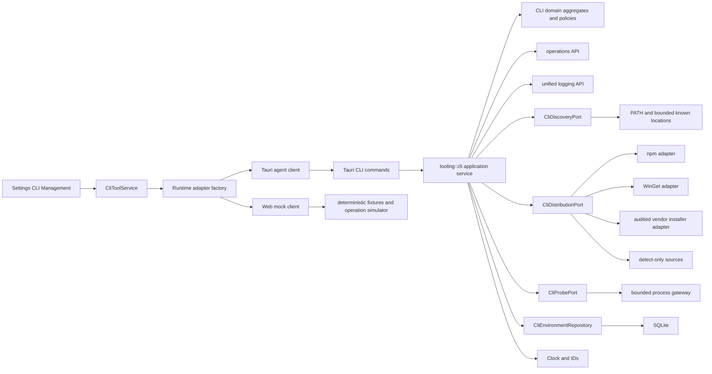
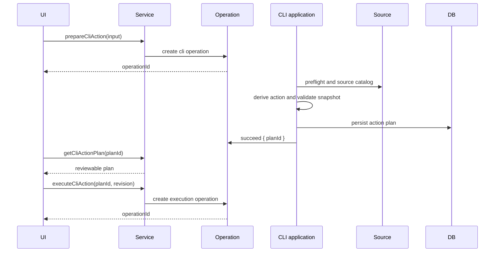

\
## Context

The current CLI implementation is already placed in the correct Rust ownership boundary: `tooling::cli` owns discovery and lifecycle behavior, `operations` owns observable task state, and unified logging owns redacted persistence. React consumes a frontend service interface, with Tauri and Web/mock adapters implementing the same shape.

The weakness is the contract, not the top-level context map. The current model stores one `latestVersion`, one `availableVersions` list, one active path, one conflict enum, and one `LifecycleEligibility`. Detection queries npm whenever a tool has an npm package even when the active installation came from WinGet, Homebrew, a vendor installer, Bun, Volta, a desktop bundle, or an unknown path. Package execution selects behavior from the coarse eligibility enum, can silently fall back from a vendor installer to npm, and can write a pre-operation snapshot back after the machine has already changed.

The frontend compounds the problem by comparing versions and deriving the action itself. The selected version state is not the value passed to the package mutation path, and equality is treated as an upgrade. One operation also disables every card even though only one tool or mutation domain is affected.

Industry designs point to four principles:

1. UniGetUI-style management surfaces show one normalized inventory while retaining package-manager identity, supported operations, skipped items, and bulk previews.
2. WinGet exposes source-native install, upgrade, exact-version selection, uninstall, repair, pin, import, and export as distinct capabilities; a product must not claim an action merely because another source supports it.
3. mise lockfiles and rustup overrides show that version resolution must be explicit, source-aware, and reproducible. Project toolchain locking is intentionally deferred to a later change, but this change establishes the necessary source and version model.
4. Provider CLIs expose different read-only diagnostics and release channels. Doctor and authentication readiness must therefore be provider-specific and must return `unknown` when no safe non-interactive probe exists.

## Goals

- Make the Rust backend the single authority for CLI lifecycle decisions.
- Model each installation source and its capabilities explicitly.
- Resolve available versions from the source that will perform the action.
- Use reviewable, expiring, single-use action plans for every machine mutation.
- Guarantee that the selected target version is the target the adapter executes.
- Distinguish discovery, executable health, authentication, readiness, compatibility, update state, manageability, freshness, and conflict state.
- Preserve actual post-operation machine state, including partial completion and failed verification.
- Keep all variable-duration work asynchronous and cancellable where the underlying process can be cancelled.
- Keep Tauri and Web/mock behavior contract-compatible.
- Provide a compact, accessible, localized CLI Management UI suitable for daily operational use.
- Add deterministic Rust, component, Web E2E, and native desktop coverage without modifying a developer or CI runner's real global package environment.

## Non-Goals

- Project-level `.vanehub/cli-toolchain.toml` or lockfile enforcement.
- Global/project/workspace override precedence.
- WSL, SSH, container, or remote environment scopes. The only scope in this change is `local-desktop`.
- Automatic background installation or unattended auto-update policy.
- Version pinning or ignored-version policy.
- Automatic source migration or source switching.
- Full lifecycle management for Homebrew, Bun, Volta, desktop bundles, system packages, manual paths, or unknown sources.
- Dynamic third-party Provider/source plugins or a lifecycle marketplace.
- Reading, storing, proxying, or displaying provider credentials.
- Adding new CLI providers beyond the currently registered catalog.
- Replacing the shared operation or unified logging contexts.

## Terminology

- **Tool**: one stable VaneHub CLI Agent id, such as `claude-code` or `codex-cli`.
- **Installation**: one canonical executable candidate discovered on the local desktop.
- **Source**: the distribution mechanism that owns or most likely owns an installation, such as npm or WinGet.
- **Source confidence**: `verified`, `inferred`, or `unknown`.
- **Version catalog**: versions exposed by one source and optional channel.
- **Environment snapshot**: the latest normalized read model for one tool in one environment scope.
- **Allowed action**: a backend-derived action that is valid for the current snapshot and source capabilities.
- **Action plan**: a persisted, expiring, single-use mutation proposal bound to a snapshot fingerprint and exact source.
- **Doctor probe**: a bounded, read-only, non-interactive provider command used to derive readiness or authentication state.
- **Mutation key**: the resource domain serialized by the backend, for example `npm-global` or `winget`.

## Target Architecture



Dependency direction remains:

```text
commands -> application -> domain
infrastructure -> application ports + domain
bootstrap -> concrete assembly only
```

No domain type imports Tauri, Rusqlite, filesystem, process, network, logging, or another context's private module.

## Domain Model

### Stable identifiers

The wire contract retains `agentId`. Rust domain code uses value objects:

```rust
pub(crate) struct CliToolId(String);
pub(crate) struct CliSourceId(String);
pub(crate) struct CliInstallationId(String);
pub(crate) struct CliActionPlanId(String);
pub(crate) struct CliBulkPlanId(String);
```

Constructors reject empty values, control characters, and oversized identifiers. Existing stable Agent ids are not renamed.

### Tool and distribution definitions

```rust
pub(crate) struct CliToolDefinition {
    pub agent_id: CliToolId,
    pub display_name: &'static str,
    pub provider: &'static str,
    pub executable_names: &'static [&'static str],
    pub distributions: &'static [CliDistributionDefinition],
    pub probes: CliProbeDefinition,
    pub compatibility: CliCompatibilityPolicy,
}

pub(crate) struct CliDistributionDefinition {
    pub source_id: CliSourceId,
    pub kind: CliSourceKind,
    pub package_reference: Option<CliPackageReference>,
    pub platforms: PlatformSet,
    pub capabilities: CliSourceCapabilities,
    pub channels: &'static [CliReleaseChannel],
    pub trust: CliSourceTrustPolicy,
}

pub(crate) struct CliSourceCapabilities {
    pub install: CliTargetVersionMode,
    pub upgrade: CliTargetVersionMode,
    pub downgrade: CliTargetVersionMode,
    pub reinstall: CliTargetVersionMode,
    pub uninstall: bool,
    pub repair: CliDynamicCapability,
}

pub(crate) enum CliTargetVersionMode {
    Unsupported,
    LatestOnly,
    Exact,
}
```

`LifecycleEligibility::Wget` is removed. `wget`, `curl`, and PowerShell download APIs are transports, not installation sources.

### Initial source capability matrix

| Source | Platforms | Catalog | Install | Upgrade | Downgrade | Reinstall | Uninstall | Repair |
| --- | --- | --- | --- | --- | --- | --- | --- | --- |
| npm | supported desktop platforms with npm | exact source versions | exact | exact | exact | exact | yes | no |
| WinGet | Windows with WinGet | WinGet source versions | exact when available | exact when supported | no in initial adapter | no in initial adapter | yes | dynamic preflight |
| audited vendor installer | only explicitly declared platform templates | latest or explicitly declared exact versions | latest by default | latest by default | no | latest when declared | no | no |
| Homebrew | detected installations only | none in this change | no | no | no | no | no | no |
| Bun | detected installations only | none in this change | no | no | no | no | no | no |
| Volta | detected installations only | none in this change | no | no | no | no | no | no |
| desktop/system/manual/unknown | detected installations only | none | no | no | no | no | no | no |

Capabilities are source data, not UI conditionals. A dynamic capability is resolved during planning and recorded in the plan.

### Installation model

```rust
pub(crate) struct CliInstallation {
    pub id: CliInstallationId,
    pub executable_path: PathBuf,
    pub canonical_path: Option<PathBuf>,
    pub reported_version: Option<NormalizedCliVersion>,
    pub source_id: Option<CliSourceId>,
    pub source_kind: CliSourceKind,
    pub source_confidence: CliSourceConfidence,
    pub path_priority: Option<u32>,
    pub environment_origin: CliEnvironmentOrigin,
    pub executable_status: CliExecutableStatus,
    pub is_active: bool,
}
```

Rules:

- Enumerate all PATH results in their real order, then bounded known locations.
- Canonicalize when possible, deduplicate by canonical target, and retain a safe fallback identity when canonicalization fails.
- The active installation is the first runnable PATH result. If none are runnable, preserve the first PATH result as active-but-broken for diagnosis.
- A known-location candidate never outranks a valid earlier PATH candidate merely because its source is more manageable.
- Directory names that contain versions, including NVM paths, are ordered with the normalized version parser rather than lexical string order.
- Source classification records confidence. A path heuristic is `inferred`, never `verified`.
- Discovery never recursively scans an arbitrary disk.

### Environment snapshot

```rust
pub(crate) struct CliEnvironmentSnapshot {
    pub schema_version: u16,
    pub agent_id: CliToolId,
    pub scope: CliEnvironmentScope,
    pub overall_state: CliOverallState,
    pub freshness: CliFreshness,
    pub environment_fingerprint: String,
    pub installations: Vec<CliInstallation>,
    pub active_installation_id: Option<CliInstallationId>,
    pub discovery: CliDiscoveryStatus,
    pub executable: CliExecutableStatus,
    pub authentication: CliAuthenticationStatus,
    pub readiness: CliReadinessStatus,
    pub compatibility: CliCompatibilityStatus,
    pub update: CliUpdateStatus,
    pub conflicts: Vec<CliConflict>,
    pub sources: Vec<CliSourceSummary>,
    pub allowed_actions: Vec<CliAllowedAction>,
    pub last_mutation: Option<CliMutationSummary>,
    pub last_operation_id: Option<String>,
    pub checked_at: Option<DateTime<Utc>>,
}
```

The only scope in this change is:

```rust
CliEnvironmentScope::LocalDesktop
```

Orthogonal statuses:

- discovery: `not-scanned`, `not-found`, `found-one`, `found-multiple`;
- executable: `not-applicable`, `healthy`, `broken`, `timeout`, `permission-denied`, `unsupported-architecture`, `unknown`;
- authentication: `authenticated`, `required`, `expired`, `unknown`, `not-applicable`;
- readiness: `ready`, `needs-auth`, `missing-dependency`, `misconfigured`, `broken`, `unknown`;
- compatibility: `supported`, `unsupported-version`, `unsupported-platform`, `unknown`;
- update: `not-applicable`, `up-to-date`, `available`, `ahead`, `catalog-unavailable`, `unknown`;
- freshness: `never`, `fresh`, `stale`, `refreshing`.

`overall_state` is backend-derived with a documented precedence:

```text
broken
> conflict
> needs-auth
> update-available
> ready
> missing
> unknown
```

The UI may group and count by `overall_state`, but it also displays the orthogonal fields.

### Source-specific version catalog

```rust
pub(crate) struct CliVersionCatalog {
    pub agent_id: CliToolId,
    pub source_id: CliSourceId,
    pub channel: Option<String>,
    pub versions: Vec<NormalizedCliVersion>,
    pub latest: Option<NormalizedCliVersion>,
    pub fetched_at: DateTime<Utc>,
    pub expires_at: DateTime<Utc>,
    pub status: CliCatalogStatus,
}
```

Rules:

- There is no global `latestVersion`.
- An npm installation is compared only with the npm catalog selected for the plan.
- A WinGet installation is compared only with the WinGet source catalog selected for the plan.
- Detect-only sources return `update = not-applicable` or `catalog-unavailable`; they do not borrow npm metadata.
- Stable is the default channel when the source defines channels.
- An opaque version can be tested for equality but is not ordered. The backend does not infer upgrade or downgrade for unordered versions.
- The frontend never compares versions.

### Allowed actions

```rust
pub(crate) struct CliAllowedAction {
    pub action: CliActionKind,
    pub source_id: CliSourceId,
    pub target_mode: CliTargetVersionMode,
    pub default_target: Option<String>,
    pub requires_target_selection: bool,
    pub reason_code: Option<CliActionReasonCode>,
}
```

Derivation rules:

- missing installation + source install capability -> `install`;
- target newer than active version + upgrade capability -> `upgrade`;
- target equal to active version -> no mutation action and UI state `current`;
- target older than active version + downgrade capability -> `downgrade`;
- source unsupported or uncertain -> no mutation action and safe guidance;
- a healthy manual installation remains healthy even when it is detect-only;
- uninstall, repair, and reinstall appear only when the active source and current preflight allow them.

## Action Plan Aggregate

Every mutation is prepared before execution.

```rust
pub(crate) struct CliActionPlan {
    pub id: CliActionPlanId,
    pub revision: u32,
    pub agent_id: CliToolId,
    pub action: CliActionKind,
    pub source_id: CliSourceId,
    pub installation_id: Option<CliInstallationId>,
    pub current_version: Option<String>,
    pub target_version: Option<String>,
    pub channel: Option<String>,
    pub command_preview: CliCommandPreview,
    pub preconditions: Vec<CliPrecondition>,
    pub warnings: Vec<CliPlanWarning>,
    pub requires_elevation: bool,
    pub requires_network: bool,
    pub fallback_policy: CliFallbackPolicy,
    pub environment_fingerprint: String,
    pub state: CliActionPlanState,
    pub created_at: DateTime<Utc>,
    pub expires_at: DateTime<Utc>,
}
```

Invariants:

- `fallback_policy` is `none` in this change.
- The source and action must be declared by the selected distribution.
- Exact target actions require a normalized target version present in or explicitly accepted by the selected source catalog.
- The plan is bound to the current environment fingerprint.
- Default expiry is ten minutes.
- The plan is single-use. Execution transitions `draft -> executing` atomically before the external effect begins.
- Retry creates a new plan; it does not reuse a consumed plan.
- Execute requests contain `planId` and `expectedRevision`, never a command string.
- Execution reloads the plan and current snapshot and rejects `expired`, `consumed`, or `stale` plans before launching a process.
- Command preview is structured and redacted. It contains executable identity and safe arguments, not a shell-interpolated command.
- Vendor script bodies are never stored in the plan or returned to the frontend.

### Plan preparation flow



## Application Use Cases and Ports

### Frontend-facing use cases

```text
list_cli_environments()                         -> cached snapshots
refresh_cli_environments(input)                 -> OperationTask
prepare_cli_action(input)                       -> OperationTask
get_cli_action_plan(plan_id)                    -> CliActionPlan
execute_cli_action(plan_id, expected_revision)  -> OperationTask
prepare_cli_bulk_upgrade(input)                 -> OperationTask
get_cli_bulk_action_plan(plan_id)               -> CliBulkActionPlan
execute_cli_bulk_action(plan_id, revision)       -> OperationTask
run_cli_doctor(agent_id)                        -> OperationTask
```

All methods that can access a process, package manager, or network return an operation id before work completes. Cached reads and persisted-plan reads remain bounded direct calls.

### Application ports

```rust
pub(crate) trait CliDiscoveryPort {
    fn discover(&self, definition: &CliToolDefinition, budget: &CliProbeBudget)
        -> Result<Vec<DiscoveredCliCandidate>, CliInfrastructureError>;
}

pub(crate) trait CliDistributionPort {
    fn source_id(&self) -> &CliSourceId;
    fn preflight(&self, request: &CliSourcePreflightRequest)
        -> Result<CliSourcePreflight, CliInfrastructureError>;
    fn list_versions(&self, request: &CliCatalogRequest)
        -> Result<CliVersionCatalogResult, CliInfrastructureError>;
    fn build_execution(&self, plan: &CliActionPlan)
        -> Result<CliExecutionSpec, CliInfrastructureError>;
    fn execute(
        &self,
        spec: CliExecutionSpec,
        cancellation: CliCancellation,
        output: &dyn CliOutputSink,
    ) -> Result<CliProcessOutcome, CliInfrastructureError>;
}

pub(crate) trait CliProbePort {
    fn run_version_probe(...);
    fn run_doctor_probe(...);
    fn run_authentication_probe(...);
}

pub(crate) trait CliEnvironmentRepository {
    fn list_snapshots(...);
    fn load_snapshot(...);
    fn save_snapshot_atomic(...);
    fn load_catalog(...);
    fn save_catalog(...);
    fn create_action_plan(...);
    fn load_action_plan(...);
    fn begin_action_plan_execution(...);
    fn finish_action_plan(...);
    fn create_bulk_plan_atomic(...);
}
```

Ports remain narrow and behavior-oriented. No port exposes a Rusqlite connection, Tauri handle, generic CRUD map, or raw process object.

## Distribution Adapters

### npm adapter

- Preflight resolves the npm executable without shell interpolation.
- Version catalog is queried from the configured npm registry through explicit arguments.
- Exact mutation commands use the backend whitelist:
  - install/upgrade/downgrade: `npm install --global <package>@<version>`;
  - uninstall: `npm uninstall --global <package>`;
  - reinstall: an adapter-owned explicit invocation verified by adapter tests.
- The package reference is never accepted from the frontend.
- The adapter only manages a missing installation when the user explicitly chooses npm, or an active installation whose source is verified/inferred as npm and whose plan remains current.

### WinGet adapter

- Available versions come from WinGet, not npm.
- Exact-version install or upgrade includes `--version <target>` when the dynamic source preflight reports support.
- The adapter uses `--id`, `--exact`, non-interactive agreement flags where appropriate, and explicit arguments.
- Uninstall is available for a WinGet-owned installation.
- Repair is exposed only when the installed package and local WinGet support it.
- Downgrade and reinstall are not exposed by the initial adapter.
- WinGet output parsing is isolated in the adapter with fixture-based tests for localized and machine-readable variants where available.

### Audited vendor installer adapter

- A vendor distribution exists only when the backend definition contains a platform-specific audited template.
- Windows requires a Windows-native execution template. A Bash template is not selected by fallback.
- HTTPS URLs are allowlisted by host and scheme.
- The installer is downloaded to a VaneHub-owned temporary file with size and timeout bounds.
- Redirects to a non-allowlisted host are rejected.
- A checksum or signature is verified when the definition provides one.
- PowerShell executes the downloaded file with `-File`; the implementation does not use `Invoke-Expression`, `irm | iex`, or an equivalent pipe-to-shell flow.
- Unix scripts are downloaded first and executed as a file through an explicit interpreter.
- Failure is returned for the disclosed source. The adapter never falls back to npm.
- Temporary files are deleted on success, failure, timeout, and cancellation where possible.

### Detect-only adapters

Homebrew, Bun, Volta, desktop, system, manual, and unknown sources can contribute source inference and guidance. They do not expose lifecycle actions in this change.

## Provider Probes

Provider probe definitions are data in the backend registry.

| Provider tool | Version probe | Doctor probe | Authentication probe |
| --- | --- | --- | --- |
| Claude Code | bounded `--version` | bounded read-only `doctor` | derive only when Doctor output has a documented stable signal; otherwise `unknown` |
| Codex CLI | bounded `--version` | none unless a documented command exists | bounded `login status` |
| OpenCode | bounded `--version` | none unless documented | bounded `auth list`, parsed only to a boolean/summary |
| Gemini CLI | bounded `--version` | `unknown` until a safe documented non-interactive probe is implemented | `unknown` |
| Antigravity CLI | bounded `--version` | `unknown` | `unknown` |

Probe requirements:

- non-interactive;
- timeout bounded;
- output budget bounded;
- no prompts or credential capture;
- output redacted before operation storage, UI delivery, and disk persistence;
- parsers return normalized reason codes, not raw secret-bearing data;
- a missing or unstable probe produces `unknown`, not `authenticated` or `ready`.

## Operation Model

The shared lifecycle remains:

```text
queued -> running -> succeeded
                  -> failed
                  -> cancelled
```

Add optional fields:

```ts
type OperationProgress = {
  phase: string | null;
  completedUnits: number | null;
  totalUnits: number | null;
  cancellable: boolean;
};
```

Add `OperationKind = "cli"`.

Recommended CLI phases:

```text
queued
preflight
resolving-source
querying-catalog
planning
downloading
mutating
verifying-executable
refreshing-environment
running-doctor
completed
```

Phase is descriptive; status remains authoritative. Cancellation is best-effort and only offered while the process gateway can terminate the child or before an irreversible external step begins.

### Execution outcome semantics

```rust
pub(crate) enum CliMutationOutcome {
    Verified,
    AppliedUnverified,
    ChangedButFailed,
    NoChangeFailed,
    Cancelled,
}
```

Rules:

1. Process success and target verified -> operation succeeds with `verified`.
2. Process success and verification unavailable/failed -> operation succeeds with warning and `applied-unverified`.
3. Process failure or cancellation followed by detection showing a changed machine -> terminal operation reflects failure/cancellation, but the persisted snapshot reflects the detected machine and includes `changed-but-failed`.
4. Process failure with no detected change -> operation fails with `no-change-failed`.
5. Post-operation detection runs best-effort after every admitted mutation, not only exit code zero.
6. The service never rewrites a pre-operation snapshot as though the machine were rolled back.
7. If post-detection itself fails, retain the last known fields only as `stale` and attach the mutation outcome and verification warning.

## Mutation Coordination

Each source adapter declares a mutation key:

```text
npm-global
winget
vendor:<agentId>
```

The coordinator:

- serializes operations with the same mutation key;
- permits at most two mutation operations globally;
- never runs two mutations for the same tool;
- permits read-only cached views, plan review, and unrelated UI interaction while a mutation is queued or running;
- lets targeted detection run when the adapter says it is safe, otherwise queues it after the conflicting mutation;
- bulk execution schedules items through the same coordinator and records independent item outcomes.

The frontend never implements the lock. It only renders operation state.

## Bulk Upgrade Plan

```rust
pub(crate) struct CliBulkActionPlan {
    pub id: CliBulkPlanId,
    pub revision: u32,
    pub items: Vec<CliBulkActionItem>,
    pub skipped: Vec<CliBulkSkip>,
    pub environment_fingerprint: String,
    pub created_at: DateTime<Utc>,
    pub expires_at: DateTime<Utc>,
}
```

Preparation returns:

- eligible item, source, current version, target version, elevation/network flags, and warnings;
- skipped tool and stable reason code, such as `already-current`, `detect-only-source`, `catalog-unavailable`, `needs-auth`, `broken`, or `unsupported-action`.

Execution does not recompute silently. Stale items are skipped with `plan-stale`, and the remaining valid items may continue. The terminal result contains an item outcome for every item.

## Persistence and Migration

### New additive tables

Exact migration version numbers must follow the repository's current sequence.

```sql
CREATE TABLE cli_environment_snapshots (
    agent_id TEXT NOT NULL,
    scope_id TEXT NOT NULL,
    schema_version INTEGER NOT NULL,
    environment_fingerprint TEXT NOT NULL,
    snapshot_json TEXT NOT NULL,
    checked_at TEXT,
    last_operation_id TEXT,
    PRIMARY KEY (agent_id, scope_id)
);

CREATE TABLE cli_version_catalogs (
    agent_id TEXT NOT NULL,
    scope_id TEXT NOT NULL,
    source_id TEXT NOT NULL,
    channel TEXT NOT NULL DEFAULT '',
    catalog_json TEXT NOT NULL,
    fetched_at TEXT NOT NULL,
    expires_at TEXT NOT NULL,
    PRIMARY KEY (agent_id, scope_id, source_id, channel)
);

CREATE TABLE cli_action_plans (
    plan_id TEXT PRIMARY KEY,
    plan_kind TEXT NOT NULL,
    agent_id TEXT,
    scope_id TEXT NOT NULL,
    revision INTEGER NOT NULL,
    state TEXT NOT NULL,
    environment_fingerprint TEXT NOT NULL,
    plan_json TEXT NOT NULL,
    created_at TEXT NOT NULL,
    expires_at TEXT NOT NULL,
    started_at TEXT,
    completed_at TEXT,
    operation_id TEXT
);

CREATE INDEX idx_cli_action_plans_expiry
    ON cli_action_plans(state, expires_at);
```

A bulk plan and its item plans are inserted in one transaction.

### Legacy migration

- Do not delete or rewrite `cli_tool_status`.
- On first read after migration, if no new snapshot exists and a legacy row exists:
  - map identity, known installation paths, current version, and last checked time;
  - mark source confidence as inferred;
  - set catalog/update/authentication/readiness fields to unknown;
  - set freshness to stale;
  - persist the new snapshot and request a background refresh.
- Legacy rows are not authoritative after a new snapshot is written.
- Remove old repository usage after migration tests pass. The old table may remain for non-destructive compatibility.
- Expired draft plans are marked expired or deleted by bounded maintenance.
- Plan JSON and snapshot JSON have an explicit schema version and fallible decoding.
- Invalid persisted JSON returns a stale/unknown safe result and a redacted diagnostic; it does not panic.

## Environment Fingerprint and Cache

Fingerprint inputs:

- OS and CPU architecture;
- local-desktop scope id;
- normalized PATH entry order;
- HOME/USERPROFILE identity represented by a non-reversible hash, not raw secret data;
- active executable canonical path, file size, and modification time when available;
- detected source id and reported version;
- relevant package-manager availability and version.

Do not include credentials, environment variable values unrelated to resolution, command output, or full provider config.

Default freshness:

- local discovery snapshot: five minutes;
- source version catalog: fifteen minutes;
- action plan: ten minutes.

Opening the page returns cached snapshots immediately. If stale, the page preserves them and starts one background refresh. A changed environment fingerprint invalidates plans and forces refresh.

## Tauri Commands

One command per file under `src-tauri/src/commands/tooling/cli/`:

```text
list_cli_environments.rs
refresh_cli_environments.rs
prepare_cli_action.rs
get_cli_action_plan.rs
execute_cli_action.rs
prepare_cli_bulk_upgrade.rs
get_cli_bulk_action_plan.rs
execute_cli_bulk_action.rs
run_cli_doctor.rs
dto.rs
mapper.rs
background.rs
```

Command names:

```text
list_cli_environments
refresh_cli_environments
prepare_cli_action
get_cli_action_plan
execute_cli_action
prepare_cli_bulk_upgrade
get_cli_bulk_action_plan
execute_cli_bulk_action
run_cli_doctor
```

Rules:

- list/get commands are bounded and may return directly;
- refresh/prepare/execute/Doctor commands return an operation id immediately;
- handlers map DTOs and command-safe errors only;
- handlers contain no SQL, package-manager command construction, source policy, version comparison, or process execution;
- all commands are registered centrally;
- old CLI commands remain only until both runtime adapters and tests migrate, then are deleted before task completion.

Command-safe error categories:

```text
unknown-tool
unsupported-source
unsupported-action
invalid-version
catalog-unavailable
plan-expired
plan-stale
plan-consumed
missing-dependency
elevation-required
operation-conflict
runtime-unsupported
source-unavailable
validation
storage
process
```

The frontend maps categories to localized text and can show a redacted diagnostic id.

## Frontend Contract

Move CLI environment types out of the broad Agent type file.

```ts
export interface CliToolService {
  listCliEnvironments(): Promise<CliEnvironmentSnapshot[]>;

  refreshCliEnvironments(input?: {
    agentIds?: string[];
    forceCatalog?: boolean;
  }): Promise<OperationTask>;

  prepareCliAction(input: PrepareCliActionInput): Promise<OperationTask>;
  getCliActionPlan(planId: string): Promise<CliActionPlan>;
  executeCliAction(input: {
    planId: string;
    expectedRevision: number;
  }): Promise<OperationTask>;

  prepareCliBulkUpgrade(input?: {
    agentIds?: string[];
  }): Promise<OperationTask>;
  getCliBulkActionPlan(planId: string): Promise<CliBulkActionPlan>;
  executeCliBulkAction(input: {
    planId: string;
    expectedRevision: number;
  }): Promise<OperationTask>;

  runCliDoctor(agentId: string): Promise<OperationTask>;
}
```

`OperationService` remains the common polling/cancellation surface.

The selected version defect is eliminated structurally: the UI sends the selected `sourceId`, `channel`, and `targetVersion` to `prepareCliAction`; the backend plan echoes and validates those exact fields; execution accepts only `planId` and revision.

No frontend utility:

- compares semantic versions;
- derives upgrade versus downgrade;
- decides source manageability;
- constructs commands;
- interprets raw package-manager output;
- changes a plan at execution time.

### Runtime adapter behavior

Tauri adapter:

- maps each service method to one declared command;
- returns normalized DTOs and typed errors;
- does not hide extra native work in React.

Web/mock adapter:

- implements the same methods;
- returns deterministic queued/running/terminal operations;
- supports cancellation;
- provides fixed catalog/source examples for UI testing;
- never claims to have inspected the host;
- never invents host paths, credentials, or real installed versions;
- executes no local process and writes no local log file.

## Frontend Component Structure

Replace the oversized page flow with feature modules. Final names may follow existing conventions, but production TS/TSX files remain at or below 300 lines.

```text
src/settings/pages/cli-management/
├─ cli-management-page.tsx
├─ cli-summary-bar.tsx
├─ cli-toolbar.tsx
├─ cli-environment-list.tsx
├─ cli-environment-card.tsx
├─ cli-status-badges.tsx
├─ cli-details-drawer.tsx
├─ cli-installations-tab.tsx
├─ cli-diagnostics-tab.tsx
├─ cli-operations-tab.tsx
├─ cli-action-plan-dialog.tsx
├─ cli-bulk-plan-dialog.tsx
├─ cli-operation-panel.tsx
├─ cli-management-view-model.ts
└─ *.test.tsx
```

Update the settings page registry to import the new page and remove `providers-page.tsx` after all call sites migrate. Do not leave a permanent compatibility wrapper.

Use the shared data-fetching foundation for cached snapshots, refresh, invalidation, and error state. Preserve mounted page state.

## UI Design

### Page shell

```text
┌ CLI Management ───────────────────────────────────────── [Refresh] ┐
│ Last checked 2 min ago · Local desktop                            │
│ Ready 3 | Needs login 1 | Updates 2 | Conflicts 1 | Broken 0      │
│ [Search tools…] [Status ▾] [Source ▾] [Only needs action □]       │
├────────────────────────────────────────────────────────────────────┤
│ Codex CLI         Ready · npm                    Update available  │
│ 0.44.0 → 0.45.0   C:\…\npm\codex.cmd             [Review update] │
│ [Executable] [Authenticated] [Compatible]                  […]     │
├────────────────────────────────────────────────────────────────────┤
│ OpenCode          Healthy · Manual               Detect only       │
│ 1.2.3             /usr/local/bin/opencode        [Run diagnostics]│
└────────────────────────────────────────────────────────────────────┘
```

The summary is a compact operational bar, not oversized stat cards.

### Card or row rules

- Show tool identity, overall state, active version, source, truncated active path, update summary, and one backend-derived primary action.
- Show orthogonal badges for executable, authentication, compatibility, and source.
- A healthy detect-only installation is not rendered as broken.
- Only the affected card shows running state.
- Other cards remain inspectable and can prepare plans; conflicting mutations may queue in the backend.
- The overflow menu contains only actions returned by `allowedActions`.
- Paths use the existing user-safe display normalizer and reveal the full value through an accessible tooltip/copy action.

### Details drawer

Tabs:

1. **Overview**
   - overall and orthogonal states;
   - active version/source/path;
   - freshness and last checked time;
   - update catalog source/channel;
   - last mutation outcome.
2. **Installations**
   - path, canonical target, version, source, confidence, PATH priority, runnable state, active/shadowed state;
   - no automatic PATH editing in this change;
   - copy path and open containing directory only where an existing safe service supports it.
3. **Diagnostics**
   - version probe, Doctor, authentication, compatibility, dependency checks;
   - normalized results and safe guidance;
   - rerun action.
4. **Operations**
   - recent CLI operations for this Agent id;
   - phase, status, started/completed time, outcome, bounded logs, copy safe summary.

### Action plan review dialog

The dialog must show before every mutation:

- action;
- source;
- current and target version;
- channel when present;
- structured command preview;
- network access;
- elevation requirement;
- preconditions;
- warnings;
- explicit “No automatic fallback to another source” statement;
- expiry/stale notice;
- confirm and cancel actions.

If target equals current, the dialog is not opened and no operation is created.

### Bulk upgrade dialog

Show two sections:

- **Will run**: tool, source, version transition, warnings.
- **Skipped**: tool and localized reason.

The user confirms one persisted bulk plan. During execution, each item shows queued/running/terminal state and can be inspected independently. Cancelling stops not-yet-started items and attempts to cancel the active cancellable item.

### Stale and partial-completion states

- Cached rows remain visible while refreshing.
- A stale badge and last checked time are visible.
- `applied-unverified` is a warning state: “The package command completed, but VaneHub could not verify the active executable. Refresh or run diagnostics.”
- `changed-but-failed` states that the machine appears to have changed despite a failed/cancelled command.
- The UI never claims rollback unless an adapter actually performed and verified one.

### Accessibility and localization

- All controls are keyboard reachable.
- Drawer/dialog focus is trapped and restored.
- Expanders expose `aria-expanded` and `aria-controls`.
- Icon-only buttons have translated labels/tooltips.
- Status is not communicated by color alone.
- Running and terminal changes use an appropriate live region without repeatedly announcing streaming logs.
- All visible strings exist in every locale registered by `src/i18n/supported-locales.ts`.
- Dates use the active locale.
- Both `futuristic` and `minimal` styles use semantic tokens and compact desktop density.
- No nested card-in-card decoration.

## Logging and Output Safety

Budgets:

```text
version probe: 16 KiB per stream
Doctor/auth probe: 128 KiB total
lifecycle operation retained output: 1 MiB total
```

When a budget is exceeded:

- stop retaining additional output;
- insert one truncation marker;
- keep reading or terminate safely as required to avoid child-process deadlock;
- expose the same bounded/redacted view to operation polling and unified logging.

Redaction happens before:

1. operation log storage;
2. frontend DTO delivery;
3. disk persistence.

Never persist or return:

- Authorization headers;
- bearer tokens;
- API keys;
- passwords;
- cookies;
- OAuth codes;
- secret-like environment variables;
- provider configuration bodies;
- raw credential-store data.

Audit context may include:

- operation id;
- Agent id;
- source id;
- action;
- safe target version;
- phase;
- exit code;
- timeout/cancel flag;
- elapsed time;
- outcome;
- redacted diagnostic id.

## File-by-File Implementation Map

### Rust domain

- Split `src-tauri/src/contexts/tooling/cli/domain/mod.rs` into focused modules.
- Add source capabilities, normalized versions, environment snapshot, status values, conflicts, allowed actions, action plans, bulk plans, and probe definitions.
- Remove `LifecycleEligibility` and transport-named `Wget` semantics after migration.
- Keep domain tests free of Tauri, SQLite, filesystem, process, network, and logging.

### Rust application

- Replace the current package-oriented ports with discovery, distribution, probe, repository, operation, clock/id, and mutation-coordinator ports.
- Implement list, refresh, prepare/get/execute action, prepare/get/execute bulk plan, and Doctor use cases.
- Make post-mutation refresh and partial-completion rules explicit.
- Emit semantic diagnostics through the operations/logging APIs only.

### Rust infrastructure

- Reuse bounded candidate enumeration and executable location helpers where correct.
- Split npm, WinGet, vendor, and detect-only behavior into source adapters.
- Replace path-only source classification with confidence-bearing inference.
- Add safe vendor download execution.
- Extend process execution with cancellation and output budgets.
- Add SQLite repository/migration implementation and compatibility tests.

### Tauri and bootstrap

- Add one command per file and register all commands centrally.
- Assemble the application service and source registry in bootstrap.
- Map domain/application errors to command-safe categories.
- Delete old commands after frontend migration and contract tests pass.

### Frontend

- Add `src/types/cli-environment.ts`.
- Extend `OperationTask` with optional CLI-compatible progress metadata and add operation kind `cli`.
- Replace `CliToolService` methods and both runtime adapters.
- Replace frontend action/version derivation utilities with presentation-only selectors.
- Refactor the page into compact components and add drawer/dialog flows.
- Keep shared query caching and operation polling.

### Tests and fixtures

- Add Rust domain, application, adapter, SQLite migration, command DTO, and architecture tests.
- Add Tauri/Web adapter conformance tests.
- Replace SSR/string-only page assertions with interaction tests using the selected version and source.
- Add Playwright coverage.
- Add deterministic desktop fixture executables and fake package managers under the existing desktop fixture hierarchy.
- Never call a real global npm, WinGet, vendor installer, or provider login command in automated tests.

## Migration Plan

1. Add delta specs and validate the change.
2. Add new domain contracts and tests while old APIs still compile.
3. Add operation fields and contract verification.
4. Add persistence migrations and legacy-to-stale snapshot mapping.
5. Add source adapters and application use cases.
6. Add new Tauri commands and Web/mock parity.
7. Migrate frontend types, service interface, and page.
8. Add E2E/desktop fixtures and tests.
9. Update documentation and `src-tauri/ARCHITECTURE.md`.
10. Remove old service methods, flat types, utilities, commands, and repository writes.
11. Run the complete repository verification matrix.
12. Mark tasks complete only after evidence exists.

No destructive database migration is performed.

## Risks and Trade-offs

### More domain types

The normalized model is larger than `CliToolStatus`. This is intentional: installation, health, authentication, update, source, and manageability are separate facts. The UI becomes simpler and correctness moves to one backend policy.

### Source adapters require fixture maintenance

Package-manager output can change and can be localized. Adapters must use stable/machine-readable forms where available and fixture tests otherwise. An unparseable catalog returns `catalog-unavailable`; it must not borrow another source's data.

### Vendor installers remain high risk

The safest default is detect-only. A vendor adapter is enabled only by an audited platform definition and has no automatic fallback. This may expose fewer one-click actions than the current UI, but the remaining actions are truthful.

### Plans can become stale

An external terminal can change PATH or a CLI after plan review. Fingerprint validation intentionally rejects execution and asks the user to prepare a new plan.

### Partial completion is more visible

Package managers are external effects and cannot be transactionally rolled back with SQLite. The product must report applied-but-unverified or changed-but-failed states instead of presenting a false rollback.

### Generic operation contract growth

`phase`, bounded progress, and `cancellable` are optional additions. Existing operation consumers remain compatible, and lifecycle status semantics do not change.

## Follow-up Changes

These must be separate OpenSpec changes:

- project CLI toolchain lockfile and reproducible bootstrap;
- source switching and migration;
- version pins, ignored versions, channels, and auto-update policy;
- Homebrew/Bun/Volta lifecycle adapters;
- PATH repair actions;
- environment export/import;
- WSL, SSH, and container scopes;
- dynamic Provider/source extension SDK.
