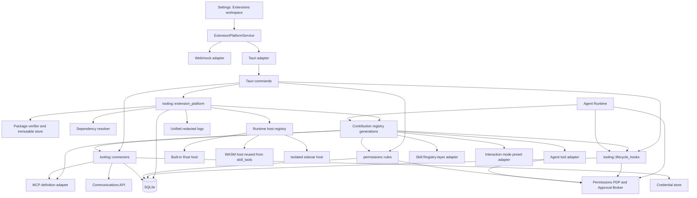

## Context

VaneHub is a desktop-first React/Tauri/Rust application with explicit frontend service boundaries, Web/mock parity, SQLite persistence in Rust, and a modular-monolith native architecture. The current Tooling context already contains `extensions`, `mcp`, `plugin_integrations`, `prompt_hooks`, `skill_tools`, and `skills`. Permissions owns policy and approval; Communications owns messaging connectors; Agent Runtime owns execution.

The existing systems are valuable and must remain the source of truth for their domains:

* `skills` owns SKILL.md metadata, effective resolution, configuration, Overlay, delegation, and Skill lifecycle.
* `skill_tools` owns declarative/WASM Skill tool validation and execution safety.
* `mcp` owns MCP server configuration, transports, discovery, sessions, and tool invocation.
* `prompt_hooks` owns non-executable prompt-template authoring, binding, preview, versioning, and trace.
* `permissions` owns `(principal, action, resource) -> Allow | Deny | Ask`, risk, approval scopes, remembered grants, audit, and the Claude Code permission bridge.
* `plugin_integrations` currently owns only built-in product/CLI readiness definitions and tests.
* `extensions` currently owns built-in local OCR/ASR/TTS capability installation and lifecycle.
* `communications` owns the five messaging connector runtimes and inbound/outbound message routing.

The new platform must unify packaging, lifecycle, contribution discovery, security review, and management without collapsing these bounded contexts into one generic module.

Several active OpenSpec changes already extend Skills, especially remote Registry supply-chain governance, Utility delegation, configuration, and Skill evolution. This change therefore treats the effective Skill runtime and immutable Registry layer as dependencies. It SHALL NOT create a second remote Skill registry, a second Skill configuration store, or an alternative Skill tool sandbox.

## Goals / Non-Goals

Goals:

* Provide one stable extension package and manifest contract for tools, Skills, MCP definitions, declarative modes, Hooks, authorization rules, connectors, and configuration.
* Keep all untrusted executable code outside the Tauri main process.
* Make extension contributions visible and reviewable without executing extension code.
* Reuse existing Skill, MCP, tool, permission, task, logging, credential, and connector capabilities through ports and adapters.
* Support lazy activation, deterministic dependency resolution, atomic contribution publication, generation-pinned calls, hot reload, rollback, and crash-loop quarantine.
* Preserve a hard permission floor that extensions, Hooks, rules, grants, and modes cannot weaken.
* Provide a coherent Settings surface while keeping specialist pages for Skills, MCP, Prompt Hooks, Agent Policies, and IM connectors.
* Maintain deterministic Web/mock behavior and real Tauri behavior behind one frontend service contract.

Non-Goals:

* Building a public extension marketplace, billing, ratings, recommendations, publisher portal, or automatic updates.
* Loading arbitrary Python modules, shared libraries, Node.js modules, or native binaries into the Tauri process.
* Claiming that process isolation alone is a complete cross-platform operating-system sandbox.
* Allowing external packages to add model providers or CLI providers through the existing internal provider SDK.
* Replacing the Skill Registry, MCP transport implementation, current prompt-template editor, current approval broker, or messaging runtimes.
* Implementing every proprietary enterprise connector in the first release. The first release establishes the SPI, migrates GitHub CLI readiness, and projects current IM connectors.
* Allowing third-party executable orchestration strategies. First-release mode contributions are declarative presets over registered strategies.
* Automatically enabling, activating, or granting new authority to a package merely because its signature is valid.

## Industry-derived design principles

The design adopts four established patterns:

1. **Declarative contribution points and lazy activation.** The manifest describes contributions without running code. Activation events start executable runtime only when needed.
2. **A packaging layer over reusable capability systems.** An extension can bundle or reference tools, Skills, Hooks, MCP definitions, policies, and connectors, while each capability remains owned by its native subsystem.
3. **Permission review and immutable verified packages.** Installation previews show requested authority and dependencies; installed bytes are immutable and content-addressed.
4. **Human-in-the-loop tool safety.** Model-visible tools remain subject to explicit application policy, Hook interception, approval, and auditable execution.

These principles are applied to VaneHub's current architecture rather than copied literally from another product.

## Architecture overview



### Ownership boundaries

`tooling::extension_platform` owns:

* extension identities, manifests, packages, snapshots, installations, dependencies, lifecycle, operation previews, activation plans, runtime generations, trust profile, publisher trust, and the contribution registry;
* runtime-host interfaces and built-in/WASM/sidecar host adapters;
* projection coordination, but not the internal state of Skills, MCP, Permissions, Agent Runtime, or Communications.

`tooling::lifecycle_hooks` owns:

* Hook definitions, bindings, event/decision schemas, handler configuration, dispatch budgets, compatibility mapping, execution trace, and circuit-breaker state;
* dispatch ports consumed by Agent Runtime and other event emitters.

`permissions::rules` owns:

* AuthorizationRule parsing, normalization, compilation, source precedence, project YAML watching, evaluation trace, simulation, and last-known-good rule-set generations;
* translation into existing Permissions decisions. It does not replace grants or the approval broker.

`tooling::connectors` owns:

* generic connector descriptors, instances, driver registration, authentication strategy metadata, health/lifecycle orchestration, capability projection, and unified connector view;
* credentials only by opaque credential-store handle.

Existing domains remain owners:

* Skills stores and resolves Skill definitions.
* MCP manages connections and tool calls.
* Agent Runtime performs model/tool loops.
* Permissions makes final policy decisions and handles approvals.
* Communications operates messaging connectors.

No new top-level bounded context is added. Cross-domain calls use published `api.rs` contracts or application ports; infrastructure modules never import another context's repository implementation.

## Decision 1: Use a versioned declarative extension manifest

The package root contains `vanehub-extension.yaml`. Schema version 1 rejects unknown security-sensitive fields and normalizes all identifiers before any file or runtime operation.

```yaml
schema_version: 1
id: acme.git-guardian
display_name: Git Guardian
publisher: acme
version: 1.2.0
description: Adds guarded Git tools, Hooks, rules, and a GitHub connection.
license: Apache-2.0
min_vanehub_version: 0.9.0
runtime:
  kind: wasm-module
  entry: runtime/git_guardian.wasm
  trust_profile: standard
activation_events:
  - onTool:git_status
  - onHook:tool.before_execute
  - onConnector:github
requires:
  skills:
    code-reviewer:
      version: ">=2.0.0 <3.0.0"
permissions:
  filesystem:
    read:
      - "${workspace}/**"
  network:
    origins:
      - "https://api.github.com"
  secrets:
    - github.token
contributes:
  tools:
    git_status:
      display_name: Git status
      input_schema: schemas/git-status-input.json
      output_schema: schemas/git-status-output.json
      handler: tool.git_status
  skills:
    guarded-reviewer:
      path: skills/guarded-reviewer/SKILL.md
  hooks:
    protect-force-push:
      event: tool.before_execute
      matcher:
        tool_ids: [native.shell]
      handler:
        kind: extension-runtime
        entry: hook.protect_force_push
      failure_mode: fail_closed
  authorization_rules:
    force-push-ask:
      operation: git_operation
      matcher:
        command_regex: "(^|\\s)git\\s+push(?:\\s+.*)?--force(?:-with-lease)?(\\s|$)"
      effect: ask
      risk: critical
      allowed_scopes: [once]
  connectors:
    github:
      type: cli
      driver: connector.github
      auth_strategy: external-cli
      capabilities: [repository.read, pull_request.read]
```

### Collections are keyed by id, not lists of records

Every contribution and dependency is a mapping whose key *is* the id. A list of records was the first shape drafted, and it does not survive contact with the parser: the bounded subset's sequences hold scalars, so `- id: git_status` followed by an indented sibling is `MisalignedIndentation`, and a single-entry item parses silently into the scalar string `"id: git_status"` — a wrong parse rather than a rejection.

Growing the subset to accept sequences of mappings was the alternative. It was rejected: the scanner is a security primitive shared with Skill configuration, and the format is the cheaper thing to change. Keying by id also makes duplicate ids unrepresentable, because the parser already rejects duplicate keys — a validation rule that no longer has to be written, tested, or remembered.

An empty collection is written as a bare key or omitted entirely; `[]` and `{}` are flow collections and only `[]` of scalars is supported. The decoder recognises the list-of-records shape and says what to write instead, since it is the form an author arriving from another extension ecosystem will reach for first.

### Identity rules

* Extension id is `<publisher>.<name>`, lower-case ASCII, 3–128 characters.
* Every contribution receives the stable global id `ext::<extension-id>::<kind>::<local-id>`.
* Display names are never identifiers.
* Package version uses SemVer; installed snapshot identity additionally includes SHA-256 content hash.
* Manifest paths are relative, normalized, and constrained to the immutable package root.
* Contributions may not claim non-namespaced native ids.

### Manifest parsing

The domain uses versioned Rust types:

```rust
pub enum VersionedExtensionManifest {
    V1(ExtensionManifestV1),
}

pub struct ExtensionManifestV1 {
    pub id: ExtensionId,
    pub display_name: String,
    pub publisher: PublisherId,
    pub version: semver::Version,
    pub min_vanehub_version: semver::VersionReq,
    pub runtime: RuntimeDeclaration,
    pub activation_events: Vec<ActivationEvent>,
    pub requires: ExtensionRequirements,
    pub permissions: CapabilityRequest,
    pub contributes: ContributionManifest,
}
```

Serde/infrastructure types are converted into validated domain types. Application services do not accept raw strings where a validated id, path, URL, matcher, or version type exists.

### The manifest is parsed in two stages, over a shared bounded YAML subset

Parsing is split so that no domain type is ever constructed from text:

```text
Bounded YAML Parser -> BoundedYamlValue -> ExtensionManifestV1Decoder -> ExtensionManifestV1
```

The first stage answers "is this well-formed YAML within our limits?" and knows nothing about extensions. The second answers "does this describe a valid extension?" and never touches bytes or indentation. Collapsing them would put resource limits and domain rules in the same pass, where a manifest rule change could quietly move a security bound.

**`serde_yaml` is excluded.** The repository already made this call: `skills/domain/config_document.rs` hand-writes a bounded subset scanner because a general YAML parser accepts anchors, aliases, and merge keys whose expansion is unbounded *before* any validator runs. A manifest arriving from an untrusted `.vhext` is the case that rationale was written for. `serde_yaml` is also unmaintained. Anchors, aliases, merge keys, tags, multi-document streams, and any construct not explicitly supported are rejected rather than interpreted.

**The subset scanner becomes a shared crate.** Copying it into `extension_platform` would fork a security primitive; importing `skills`' domain module across contexts is prohibited and would invert the dependency. It is extracted to `crates/vanehub-bounded-yaml`, a workspace member containing only:

* the restricted lexer and grammar;
* resource limits as a caller-supplied profile;
* duplicate-key detection;
* a generic `BoundedYamlValue` AST.

It contains no I/O and no domain semantics. `SkillConfigDocument` decoding and validation stay in Skills; `ExtensionManifestV1` decoding and validation belong to `extension_platform`. Skills does not depend on `extension_platform`, and `extension_platform` does not reach into `skills`.

**Limits are per-consumer profiles.** `BoundedYamlLimits` is supplied by the caller, so a manifest that needs more nesting or more nodes than a Skill config cannot widen the Skill bound as a side effect. Each consumer pins its own profile and tests it.

**Extraction is behavior-preserving.** Characterization tests covering the current accept and reject behavior — including every limit and every rejected construct — land *before* the move, and must pass unchanged after it. A relocation that silently changes what Skills accepts is the failure mode worth spending a test suite on.

## Decision 2: Package installation is immutable, bounded, and witness-bound

`.vhext` is a ZIP archive in the first release. The archive implementation SHALL be selected after maintenance, advisory, license, Windows path, and streaming-limit review. If the active Skill Registry change introduces shared safe-archive primitives, this change SHALL reuse or extract them into an application-owned package-security module rather than fork validation logic.

Default ceilings:

* 64 MiB compressed package;
* 256 MiB expanded content;
* 2,048 entries;
* 128 MiB maximum single entry;
* nesting depth 12;
* normalized path length 240;
* compression ratio 100:1.

The extractor rejects:

* absolute paths, traversal, empty or dot-only paths;
* duplicate normalized targets, Unicode normalization collisions, case-fold collisions, Windows reserved names, NTFS alternate streams;
* symlinks, hardlinks, devices, sockets, sparse surprises, unsupported entries;
* files outside the allowlisted top-level package structure;
* manifest/runtime/schema references that escape the snapshot;
* undeclared executable files.

Filesystem roots under application data are separate:

```text
extensions/
  quarantine/<operation-id>/
  packages/sha256/<hash>/
  scratch/<installation-id>/<generation-id>/
  sidecars/<installation-id>/<generation-id>/
```

A preview creates an immutable `ExtensionInstallWitness` containing package hash, signature state, publisher key fingerprint, normalized manifest digest, current installed version/hash, compatibility result, dependency plan, contribution summary, requested capability diff, and selected trust profile. Confirmation must present the same witness; stale state fails rather than silently changing the operation.

Install publishes by atomic rename on the same volume and commits SQLite pointer/state through the current compensated transaction pattern. Startup reconciliation removes only verified application-owned orphan staging paths and never follows user-controlled links.

## Decision 3: Signature trust and runtime authority are independent

Package verification answers whether exact bytes are authorized by a trusted publisher key. It does not grant operational authority.

Signature policy:

* built-in extensions are part of the reviewed application build and use `RuntimeKind::Builtin`;
* external packages use detached Ed25519 signatures over a canonical package manifest and content digest;
* trusted publisher keys are stored with source, fingerprint, label, first/last seen, trust state, and revocation state;
* an unsigned package is rejected by default;
* Developer Mode may install an unsigned package only as disabled and `Strict`; enabling displays a persistent warning, forbids automatic startup activation, and is audited;
* signature revocation makes new activation ineligible but retains bytes, metadata, logs, and recovery information.

The install wizard separately reviews requested capabilities. Updating to a version with broader filesystem, network, process, secret, Hook, connector, or rule authority always requires a new confirmation.

## Decision 4: Use three runtime kinds and a conservative trust matrix

```text
Runtime kind       Trusted             Standard             Strict
-----------------  ------------------  -------------------  -------------------
Built-in Rust      Allowed             Not allowed          Not allowed
WASM Component     Allowed             Allowed (default)    Allowed
Sidecar process    Allowed             Feature-gated only*  Not allowed

* Standard sidecar activation requires an available platform sandbox provider
  that passes a startup self-test. Without it, activation fails closed.
```

Trust-profile budgets:

* Trusted: 30-second default callback timeout, overridable only downward per contribution.
* Standard: 10-second maximum callback timeout.
* Strict: 5-second maximum callback timeout.

All profiles remain subject to the Permissions safety floor. `Trusted` means reviewed publisher/runtime placement, not unrestricted tool authority.

### Built-in host

Built-in extensions are statically registered Rust implementations. They are suitable for migration adapters such as GitHub CLI readiness and local capability projections. Built-in registration is compile-time reviewed and cannot be supplied by `.vhext`.

### WASM host

The WASM host reuses the existing Skill Tool Wasmtime engine, resource accounting, interruption, output bounds, and capability mediation wherever possible. It adds an extension ABI for initialization, tool calls, Hooks, and connector operations. WASI ambient filesystem/network/process access is disabled; host functions expose only capability-brokered operations.

The first release should prefer the WebAssembly Component Model when compatible with the pinned Wasmtime version. If the current Skill Tool runtime is core-module based, implement an application-owned adapter and an explicit migration seam rather than maintaining two Wasmtime engines.

### Sidecar host

A sidecar runs outside the Tauri process under a scrubbed environment, application-owned working directory, bounded stdout/stderr, process-tree termination, timeout, cancellation, heartbeat, and crash-loop accounting. It communicates using length-prefixed JSON-RPC 2.0 over stdio.

Required protocol methods:

```text
initialize
ping
contributions/ready
tool/call
hook/invoke
connector/configure
connector/authenticate
connector/health
connector/connect
connector/disconnect
shutdown
```

Allowed reverse host calls are explicit and capability-mediated:

```text
host/fs/read
host/fs/write
host/http/request
host/process/spawn
host/secret/use
host/log/write
```

`host/secret/use` performs an operation using a credential handle where possible; it does not return raw secret text by default. Frame size, nesting, schema size, log rate, result size, and concurrent request count are bounded.

An optional Python SDK may expose:

```python
async def activate(context: ExtensionContext) -> Contributions:
    ...
```

The SDK is only a sidecar client/bootstrap. Python is never embedded or imported in the Tauri process. In the first release, Python sidecars require Trusted status unless a platform sandbox provider is available and verified.

## Decision 5: Register manifest contributions before runtime activation

Declarative contributions are indexed from the validated manifest at install/enable time. The runtime remains cold until an activation event requires executable behavior.

Supported activation events:

* `onStartupFinished`
* `onSessionStart`
* `onAgentMode:<mode-id>`
* `onTool:<tool-id>`
* `onHook:<event-id>`
* `onConnector:<connector-id>`
* `onCommand:<command-id>`
* `manual`

A tool, connector, or Hook can therefore appear in UI and diagnostics while its runtime is inactive. Invocation performs single-flight activation. Concurrent callers await the same activation result. Failed activation returns a stable error and updates diagnostics; it does not partially publish runtime-backed handlers.

## Decision 6: Publish contributions transactionally through adapters

The registry is an immutable generation:

```rust
pub struct ContributionRegistryGeneration {
    pub id: RegistryGenerationId,
    pub created_at: DateTime<Utc>,
    pub contributions: Arc<ContributionIndex>,
    pub installations: Arc<InstallationIndex>,
}
```

Activation constructs an `ActivationPlan` and calls contribution publishers using prepare/commit/rollback semantics:

```rust
#[async_trait]
pub trait ContributionPublisher: Send + Sync {
    async fn prepare(
        &self,
        plan: &ContributionProjectionPlan,
    ) -> Result<PreparedProjection, ContributionError>;

    async fn commit(
        &self,
        prepared: PreparedProjection,
    ) -> Result<CommittedProjection, ContributionError>;

    async fn rollback(&self, committed: CommittedProjection);
}
```

The coordinator validates every publisher before committing. If any commit fails, it compensates committed adapters and retains the prior registry generation. New calls use only the atomically swapped generation. In-flight calls hold `Arc` references to the generation that started them.

### Tool contribution adapter

* Converts each tool contribution to the current native tool descriptor/executor contracts.
* Supports declarative and WASM/sidecar handlers; does not bypass `agent-tool-execution`.
* Applies input/output JSON Schema bounds, provenance, permission decision, before/after Hooks, timeout, cancellation, output truncation, unified trace, and audit.
* First release exposes extension tools to the OnePiece native Agent. Projection into external CLI Agents is deferred unless an existing CLI has a safe supported tool bridge.

### Skill contribution adapter

* Validates each referenced `SKILL.md` through the existing Skill parser and package validator.
* Materializes one immutable virtual Registry-layer package per Skill contribution with source `extension:<extension-id>`, version `<extension-version>`, and content hash derived from the Skill subtree.
* Preserves current `Project > User > Registry > System` precedence.
* Disabling the extension makes the virtual package ineligible for new effective resolutions but does not delete Overlay, configuration, history, or in-flight immutable snapshots.
* Package provenance never implies Skill Tool trust or permission grants.

### MCP contribution adapter

* Creates a read-only namespaced MCP definition owned by the extension.
* Manifest definitions may include command/args or URL/transport metadata but no secret values.
* Users provide environment values, headers, credentials, and Agent bindings through existing MCP configuration/credential flows.
* Disabling the extension prevents new sessions from selecting the definition; active sessions follow current MCP shutdown policy.
* Existing MCP approval floors remain unchanged.

### Mode contribution adapter

First-release `ModeContribution` is data-only:

```rust
pub struct ModePresetContribution {
    pub id: ContributionId,
    pub strategy: RegisteredStrategyId,
    pub default_policy_template: Option<PolicyTemplateId>,
    pub required_tool_groups: Vec<ToolGroupId>,
    pub required_skills: Vec<SkillId>,
    pub required_hooks: Vec<HookBindingId>,
    pub configuration_schema: Option<JsonSchemaRef>,
}
```

The strategy must already exist in VaneHub's registered allowlist, such as single, supervisor, persona, or guardrails. A package cannot provide arbitrary scheduler/executor code as a mode in version 1.

### Rule and Hook adapters

Rules and Hooks are registered into their own compiled/typed subsystems with source provenance and extension installation/generation identity. Disabling or reloading the extension atomically replaces those source contributions.

### Connector adapter

Connector definitions are registered with Connector Platform. Driver calls lazily activate the owning runtime and remain subject to connector auth state, capability grants, Hook interception, and Permissions.

## Decision 7: Implement a typed lifecycle Hook bus

### Internal event catalog

Version 1 defines these stable internal events:

```text
session.start
session.resume
session.before_compact
session.after_compact
session.stop
prompt.before_assemble
prompt.after_assemble
messages.before_model
messages.after_model
tool.before_resolve
tool.before_execute
tool.after_execute
tool.failed
permission.requested
risk.assessed
delegation.before
delegation.after
connector.before_send
connector.after_receive
```

Each event has a versioned payload type and a list of admissible decisions. Unknown payload fields are ignored only when the event schema explicitly allows forward-compatible metadata; security-relevant fields are strict.

### Handler kinds

* `builtin`: reviewed Rust handler.
* `extension-runtime`: WASM or sidecar entrypoint.
* `command`: user/admin-configured external command.
* `http`: user/admin-configured HTTP POST endpoint.
* `mcp-tool`: invokes a selected MCP tool.
* `prompt`: one bounded model decision with no tool loop.
* `agent`: bounded multi-turn read-only verification Agent.

Command and HTTP handlers are not automatically trusted because they are configured locally. They receive the same permission, timeout, redaction, and audit treatment as extension handlers.

### Hook decisions

```rust
pub enum HookDecision {
    Continue,
    Deny { reason: String },
    Ask { reason: String, minimum_risk: Option<RiskLevel> },
    ModifyInput { patch: JsonPatch },
    ModifyOutput { patch: JsonPatch },
    AppendSystem { content: String },
    AppendMessages { messages: Vec<HookMessage> },
    EmitNotice { notice: UserNotice },
}
```

The event schema constrains valid decisions. For example, `tool.before_execute` may Deny, Ask, or apply an allowlisted input patch; `tool.after_execute` cannot retroactively Allow an operation; `permission.requested` may only preserve or strengthen the pending decision; prompt transform events may append bounded content but cannot inject tool results or impersonate protected system messages.

### Ordering and failure

Deterministic order:

1. immutable built-in safety handlers;
2. managed/system handlers;
3. user/project handlers;
4. extension handlers ordered by explicit priority then stable id;
5. session-scoped handlers.

Within the same tier, lower numeric priority runs first, then stable id. A Hook cannot rely on filesystem discovery order.

Security-critical events run synchronously and default to fail-closed for a handler that declares enforcement. Observational handlers may fail-open but emit diagnostics. Timeouts, invalid decisions, protocol failures, repeated errors, and forbidden patches count toward a per-handler circuit breaker. A tripped handler is disabled for the configured cooldown; fail-closed enforcement still returns Ask or Deny according to policy.

### Claude compatibility

A versioned compatibility catalog maps supported Claude Code event names and payloads to internal events. The initial high-value set includes SessionStart, UserPromptSubmit, PreToolUse, PermissionRequest, PostToolUse, PostToolUseFailure, Stop, StopFailure, PreCompact, PostCompact, and SessionEnd. Unsupported events return explicit diagnostics rather than being silently ignored.

The catalog version is stored with each imported Hook definition because the external event set may evolve. Existing `vanehub-permission-hook` remains the specialized Claude permission bridge and may emit/consume internal Hook events through an adapter.

## Decision 8: Add a compiled AuthorizationRule layer without replacing Permissions

### Rule model

```rust
pub struct AuthorizationRule {
    pub id: AuthorizationRuleId,
    pub source: RuleSource,
    pub principal: PrincipalMatcher,
    pub operation: OperationKind,
    pub matcher: OperationMatcher,
    pub effect: RuleEffect,
    pub risk: RiskLevel,
    pub allowed_scopes: BTreeSet<ApprovalScope>,
    pub auto_approve: bool,
    pub priority: i32,
    pub expires_at: Option<DateTime<Utc>>,
    pub enabled: bool,
}
```

Operation kinds:

```text
shell_command
file_read
file_write
code_modification
git_operation
network_request
mcp_tool
extension_tool
connector_operation
```

Matchers are structured by operation type and may contain bounded glob or Rust-regex fields. The engine does not execute PCRE or user code. Regex length, DFA/NFA size where available, input length, and evaluation time are bounded. Invalid or unsupported matcher fields fail validation.

### Rule sources

* immutable safety floor;
* built-in default rules;
* global/user rules;
* project `.vanehub/authorization.yaml` rules;
* extension-contributed rules;
* session-specific temporary rules when explicitly created by the user.

Remembered approval grants remain managed by the existing approval broker and are not compiled as rules.

### Evaluation sequence

```text
Normalize request and classify risk
  -> immutable safety floor
  -> compiled matching rules
       Deny dominates Ask; Ask dominates Allow
  -> existing policy template/PDP fallback when no stronger rule decides
  -> permission/risk Hooks may only preserve or strengthen
  -> remembered grant may satisfy an Ask within permitted scope
  -> user approval when still Ask
  -> audit final decision and complete decision chain
```

No rule, extension, Hook, mode preset, or grant may reduce an immutable floor. Existing MCP explicit-approval behavior remains a floor unless a separate approved OpenSpec change alters it.

Extension-contributed rules may use `Deny` or `Ask`. `Allow` is accepted only for reviewed built-in Trusted extensions and still cannot weaken a floor. This prevents a downloaded package from granting itself authority.

### Compilation and reload

Rules are normalized into an immutable `CompiledPolicySet` generation. A new generation is published only when the full source set parses, validates, compiles, and passes conflict checks. Project-file changes are debounced. On failure, the previous generation remains active and diagnostics identify source, rule id, field, and safe error code without exposing secrets.

The project file uses VaneHub naming:

```yaml
version: 1
rules:
  - id: project-readonly-git
    operation: git_operation
    matcher:
      subcommands: [status, diff, log, show]
    effect: allow
    risk: low
    allowed_scopes: [session, project]
    priority: 100
```

### Simulation

`simulate_authorization_decision` accepts a non-executing synthetic request and returns normalization, risk, matching rules, source/priority/specificity, safety floors, template fallback, Hook simulation policy, grant eligibility, and effective decision. Simulation never writes grants or runs the target operation.

## Decision 9: Introduce a generic Connector SPI

### Domain contracts

```rust
pub struct ConnectorDescriptor {
    pub id: ConnectorId,
    pub display_name: String,
    pub connector_type: ConnectorType,
    pub auth_strategy: AuthStrategy,
    pub capabilities: BTreeSet<ConnectorCapability>,
    pub configuration_schema: Option<JsonSchema>,
    pub source: ConnectorSource,
}

#[async_trait]
pub trait ConnectorDriver: Send + Sync {
    async fn configure(&self, context: ConnectorContext, input: JsonValue) -> Result<()>;
    async fn authenticate(&self, context: ConnectorContext, input: AuthInput) -> Result<AuthState>;
    async fn health(&self, context: ConnectorContext) -> Result<HealthReport>;
    async fn connect(&self, context: ConnectorContext) -> Result<ConnectionState>;
    async fn disconnect(&self, context: ConnectorContext) -> Result<()>;
    async fn execute(&self, context: ConnectorContext, operation: ConnectorOperation) -> Result<JsonValue>;
}
```

Connector types:

* CLI
* HTTP API
* MCP
* Messaging
* Workspace
* Browser
* Custom

Auth strategies:

* none;
* external CLI;
* API key;
* OAuth 2.0 authorization code with PKCE;
* device code;
* QR pairing;
* host-delegated.

### Secret handling

Connector and extension records store credential handles, never raw secret values. UI contracts expose configured/missing/expired/error status only. Drivers request a scoped use operation from the credential broker. For remote OAuth/MCP-style authorization, implementations enforce PKCE, audience/resource binding, redirect validation, no token passthrough, and origin-scoped credential forwarding.

### Lifecycle

```text
discovered -> unconfigured -> ready -> authenticating -> disconnected
          -> connecting -> connected -> degraded -> reconnecting
          -> auth_expired -> error -> disabled
```

State transitions are generation-safe and operation-driven. Authentication, test, connect, disconnect, reconnect, refresh, and uninstall are stable-id asynchronous operations where they may exceed the synchronous budget.

### First-release adapters

* Migrate current GitHub CLI readiness (`gh auth status`) into a built-in Connector descriptor/driver. Keep legacy commands as wrappers for one release.
* Project Feishu, Telegram, DingTalk, WeCom, and WeChat from `communications::api` into the unified catalog. Their existing runtimes and persistence remain authoritative.
* Project existing MCP configurations as Connector Type MCP only for unified visibility; MCP continues to own transport/session state.
* Do not fabricate CodeHub, CloudScope, CI, Knowledge CLI, Browser, Remote Workspace, or other proprietary drivers. Those become later extension packages or built-in adapters using the new SPI.

## Decision 10: Hot reload uses shadow generations and draining

Reload algorithm:

1. acquire an installation operation lock;
2. validate the target package/snapshot and dependencies;
3. build a shadow runtime generation;
4. initialize runtime and perform health handshake;
5. prepare every contribution adapter;
6. commit adapters and atomically swap the registry generation;
7. mark the prior generation draining;
8. allow pinned in-flight calls to finish within a bounded drain window;
9. cancel remaining calls, shut down old runtime/process tree, and reconcile scratch data;
10. if any step before swap fails, keep the current generation; if post-swap health fails within the stabilization window, roll back to the prior known-good generation.

Disable follows the same contribution swap without creating a new executable runtime. Uninstall requires disable, no pinned active generation, a witness-bound confirmation, and deletion only of verified application-owned snapshots that are not referenced by rollback or audit retention.

Crash-loop policy defaults to three unexpected exits/timeouts within five minutes. The installation enters `Quarantined`, automatic activation stops, and the user may inspect diagnostics, reset after correction, roll back, or uninstall. Quarantine never silently grants a less restrictive runtime profile.

## Decision 11: Persistence and migrations are additive

Recommended tables, adjusted to current migration conventions:

```text
extension_publishers
extension_packages
extension_installations
extension_snapshots
extension_dependencies
extension_contributions
extension_runtime_generations
extension_operation_witnesses
hook_definitions
hook_bindings
hook_executions
authorization_rules
authorization_rule_sets
connector_definitions
connector_instances
connector_bindings
```

Long-running operation state uses the existing operation/task infrastructure rather than a parallel generic operation table. Domain rows reference stable operation ids.

Constraints:

* package/snapshot bytes remain filesystem-owned; SQLite stores verified identity and pointers;
* active installation points to one immutable snapshot and one current runtime generation;
* contributions are keyed by installation + snapshot + local id + kind;
* rule sets and registry generations are immutable records with one active pointer;
* Hook execution payloads are redacted and size-bounded;
* connector secrets are absent from SQLite;
* migrations seed built-in adapters idempotently and never overwrite user state.

## Decision 12: Tauri commands remain thin and operation-oriented

Commands are grouped by domain and one command per file. Representative commands:

```text
extension_list
extension_get
extension_preview_install
extension_start_install
extension_start_enable
extension_start_disable
extension_start_reload
extension_preview_uninstall
extension_start_uninstall
extension_operation_get
extension_contributions_list
extension_diagnostics_get
publisher_keys_list
publisher_key_preview_add
publisher_key_add

hooks_list
hook_get
hook_preview_upsert
hook_start_upsert
hook_start_delete
hook_test
hook_executions_list

rules_list
rule_get
rule_preview_upsert
rule_start_upsert
rule_start_delete
rules_reload_project
rules_simulate
rules_diagnostics_get

connectors_list
connector_get
connector_start_configure
connector_start_authenticate
connector_start_test
connector_start_connect
connector_start_disconnect
connector_bindings_update
```

Commands validate serializable request shape, resolve application state, call an application service, map errors to stable DTOs, and return. They do not parse packages, compile rules, run Hooks, operate processes, or write repositories directly.

Long operations return `operation_id`. The frontend polls/subscribes using the current stable operation contract and supports cancellation when the domain operation is cancellable.

## Decision 13: Frontend service and Web/mock parity

Add a capability-oriented service interface, either as a dedicated service composed by the current service layer or as a typed extension of the existing root service contract:

```text
src/services/extension-platform-service.ts
src/services/tauri-extension-platform-client.ts
src/services/web-extension-platform-client.ts
```

The exact placement follows current service composition, but components depend only on the interface. The Tauri client contains all `invoke()` calls. The Web client provides deterministic in-memory fixtures and operation progression without claiming package extraction, process launch, credentials, persistence, or real connector authentication.

Frontend DTOs are discriminated unions, not `any`. Native and Web clients have contract tests proving equivalent shape, stable error codes, operation stages, filters, pagination, and disabled-capability behavior.

## UI design

### Information architecture

Settings navigation exposes one **Extensions** entry. Existing deep links remain compatible:

```text
/settings/extensions                       -> Installed
/settings/extensions?tab=contributions    -> Contributions
/settings/extensions?tab=hooks            -> Hooks
/settings/extensions?tab=rules            -> Rules
/settings/extensions?tab=connections      -> Connections
/settings/extensions?tab=diagnostics      -> Diagnostics
/settings/plugin-integrations             -> redirect to Connections
```

Skills, MCP, Prompt Hooks, Agent Policies, and IM connector pages remain available. Unified rows include deep links to the authoritative specialist page.

### Installed tab

Header:

* search;
* state filter;
* source filter (Built-in, Local signed, Developer unsigned);
* runtime filter;
* trust filter;
* “Install from file” action;
* developer-mode warning when enabled.

List/card fields:

* icon, display name, extension id, publisher, version;
* state badge: Disabled, Activating, Active, Degraded, Quarantined, Incompatible;
* runtime/trust badge;
* signature/publisher status;
* contribution counts by kind;
* update or rollback availability when applicable;
* last activation/health summary;
* context menu: Enable, Disable, Reload, View details, Roll back, Uninstall.

### Install wizard

1. Select `.vhext`.
2. Validate structure, hash, signature, publisher, compatibility, and archive limits.
3. Review contributions and dependencies; unresolved required dependencies block confirmation.
4. Review capabilities grouped by filesystem, network, process, secrets, Hooks, rules, connectors, and runtime profile. Show diffs for updates.
5. Select an allowed trust profile. The UI may only tighten the manifest request; it cannot widen it.
6. Confirm a witness-bound plan and show operation progress.
7. On success, choose “Enable now” only when policy permits. Unsigned Developer Mode packages remain disabled by default.

The wizard distinguishes:

* verified publisher provenance;
* requested runtime capabilities;
* Agent operation permissions;
* connector credentials;
* Skill Tool trust.

These are never collapsed into one “Trusted” toggle.

### Extension detail drawer/page

Tabs:

* Overview: identity, version, description, status, signature, compatibility.
* Contributions: tools, Skills, MCP, modes, Hooks, rules, connectors with global ids and eligibility.
* Permissions: requested, granted, denied, safety-floor conflicts, version diff.
* Dependencies: extension and Skill requirements with resolution state.
* Runtime: kind, trust profile, generation, activation events, pid/instance where safe, budgets, health.
* Logs: filtered unified logs and operation trace with redaction.

### Hooks tab

Table columns:

* name/id;
* event;
* handler kind;
* source/scope;
* priority;
* enabled;
* failure mode;
* recent latency/error/circuit state.

Actions:

* create user/project Hook;
* inspect extension Hook read-only;
* enable/disable where source permits;
* duplicate into user scope;
* test with a synthetic event;
* inspect execution trace and redacted input/output;
* import supported Claude Hook configuration through compatibility preview.

The editor renders event-specific matcher and decision fields. It does not expose invalid decisions for the selected event.

### Rules tab

Views:

* rules table with source, operation, effect, risk, priority, scope, expiry, status;
* structured editor with operation-specific matcher fields and advanced YAML preview;
* project-file diagnostics and last-known-good state;
* decision simulator with principal, operation, resource/arguments, matched rules, safety floors, template fallback, grant eligibility, and final decision chain;
* immutable built-in and extension rules are read-only; user may disable only where policy permits.

A cross-link from Agent Policies opens this tab because templates and rules answer different questions: templates provide a broad default posture; rules decide specific operations.

### Connections tab

Cards/rows show:

* connector name/type/source;
* configuration/auth/connection/health status;
* capabilities;
* bound Agents/Skills/workspaces;
* last test and redacted error;
* Authenticate, Test, Connect, Disconnect, Reconnect, Configure actions.

Existing IM connectors render through projection and deep-link to their detailed messaging configuration when necessary. GitHub CLI appears as the first migrated native connector.

### Diagnostics tab

Displays:

* package validation/quarantine issues;
* install/enable/reload/uninstall operations;
* active and draining registry/runtime generations;
* activation event, startup duration, timeout, crash count, circuit breaker, quarantine reason;
* contribution adapter failures and rollback status;
* rule compilation generation and project-file error;
* Hook latency/error statistics;
* connector health and auth-expiry state.

Diagnostics provide copyable redacted reports, never raw credentials, full environment variables, or unrestricted package paths.

### UI implementation constraints

Suggested split:

```text
src/components/settings/extension-platform/
  extension-platform-page.tsx
  extension-platform-tabs.tsx
  installed/
  contributions/
  hooks/
  rules/
  connections/
  diagnostics/
  shared/
```

Each production TS/TSX file remains at or below 300 physical lines. Components use semantic design tokens, Tailwind, existing primitives, keyboard navigation, visible focus, accessible names/status announcements, compact desktop density, responsive stacking, loading/empty/error states, and all supported locale keys.

## Security and threat model

The implementation must test these threat classes:

* archive traversal, collision, decompression bomb, link/device abuse, oversized schemas and manifests;
* signature substitution, revoked publisher key, package/version rollback, stale install witness;
* extension id/contribution namespace collision and dependency cycle/confusion;
* runtime escape through ambient WASI capabilities, inherited environment, cwd, PATH, child process, network, or secret leakage;
* sidecar protocol frame abuse, unsolicited requests, malformed JSON, excessive nesting, output flood, stderr flood, heartbeat loss, orphan process tree;
* Hook recursion, decision injection, forbidden patches, event spoofing, prompt/system-role impersonation, latency amplification, fail-open misconfiguration;
* catastrophic or expensive regex, matcher type confusion, source precedence ambiguity, project-file partial write, symlink swap;
* connector token passthrough, redirect abuse, missing PKCE/audience binding, cross-origin credential forwarding, auth-state races;
* disable/reload races, partial contribution publication, in-flight use-after-unload, rollback failure, stale UI operation.

All errors use stable codes and redacted context. Logs flow through unified logging. Audit records identify extension id/version/hash, runtime generation, contribution id, rule/Hook source, decision chain, operation id, and final outcome.

## Feature gates and rollout

The repository has no general feature-flag mechanism, and this change does not create one. Gates are an Extension Platform domain concern, owned by `tooling::extension_platform` and published through its application API.

### Two layers, deliberately not merged

**Build capability** answers "is this code in the binary at all?" It is a Cargo feature, derived at evaluation time through `cfg!`, and never persisted. **Runtime kill switch** answers "does the operator want this on right now?" It is a persisted desired state that can be flipped in a shipped build.

```text
effective_enabled =
      build_available            // cfg!(feature = "...")
   && persisted_enabled          // SQLite desired state, default disabled
   && prerequisites_satisfied    // e.g. sandbox self-test, adapter parity
   && !forced_disabled           // operator or safety override
```

Collapsing the two would produce the worst failure mode in this design: an operator turning a gate "on" in a build that cannot honour it, and reading silence as success. The reported state is therefore a five-way discriminated union that never merges the first two members:

```text
not_compiled | runtime_disabled | enabled | blocked_by_prerequisite | forced_disabled
```

### Gates

| Gate | Cargo feature | Runtime default |
| --- | --- | --- |
| `extension_platform.catalog` | — | disabled |
| `extension_platform.external_packages` | — | disabled |
| `extension_platform.lifecycle_hooks` | — | disabled |
| `extension_platform.authorization_rules` | — | disabled |
| `extension_platform.connectors` | — | disabled |
| `extension_platform.wasm_module_runtime` | `extension-wasm-module-runtime = ["skill-tool-module-runtime"]` | disabled |
| `extension_platform.sidecar_runtime` | `extension-sidecar-runtime = []` | disabled |

`extension-wasm-module-runtime` exists only to reuse the current Skill Tool Wasmtime **module** runtime. It SHALL NOT introduce a second Wasmtime engine and SHALL NOT enable the component model. Sidecar activation additionally requires a passing platform sandbox self-test, expressed as `blocked_by_prerequisite` rather than a silent failure.

### Contract rules

* The gate set is a closed `ExtensionPlatformFeature` enum. Arbitrary string key/value pairs are not a domain interface.
* SQLite stores desired state, revision, `updated_at`, `updated_by`, and an optional reason — nothing derived.
* A missing record, unknown gate, storage read failure, or parse failure evaluates to disabled. Fail-closed is the only admissible default.
* Enabling a gate whose build capability is absent returns `FeatureUnavailableInBuild`. It never succeeds silently.
* Other contexts read gates through the published API/port and an immutable cached snapshot, never through the repository.
* Every mutation is audited with gate, prior/new desired state, revision, actor, and reason. Gate state never lives only in frontend storage.
* Disabling refuses new install/activate/register/execute immediately; running work drains under the existing lifecycle policy and a sidecar is terminated after its safe-shutdown timeout. Re-enabling never reactivates a quarantined extension.

### Scope boundaries

Each gate governs new Extension Platform behavior only:

* `lifecycle_hooks` does not disable existing Prompt Hooks.
* `authorization_rules` does not disable the existing PDP, immutable safety floors, or approval brokering.
* `connectors` does not disable existing IM connectors.
* `wasm_module_runtime` does not change existing Skill Tool enablement.
* `external_packages` does not affect the existing built-in local OCR/ASR/TTS pages.

With every gate off, the application behaves exactly as it does today.

Rollout gates:

1. Schema, persistence, read-only catalog, and built-in projections.
2. Contribution registry and current-domain adapters without external execution.
3. Hook bus and rule compiler in shadow/trace-only mode.
4. GitHub connector migration and IM/MCP/local-extension projections.
5. Signed local package install, enable/disable, WASM execution, atomic rollback, and full UI.
6. Trusted sidecar/Python SDK, hot reload, crash quarantine, and developer mode.
7. Remove legacy UI navigation only in a later change after telemetry/evidence and one-release compatibility.

Every gate has a kill switch and preserves existing authoritative stores.

## Migration plan

1. Add additive tables and seed built-in extension/connector projections idempotently.
2. Introduce the contribution registry with adapters that mirror current built-in catalogs. Run parity tests before Agent Runtime reads it.
3. Wrap current GitHub readiness operations behind Connector Platform while retaining legacy Tauri commands and frontend service methods as delegates.
4. Project current local OCR/ASR/TTS and IM/MCP state read-only into the unified UI. Do not move their data.
5. Register Prompt Hooks as a source in the generalized Hook catalog while keeping current prompt-template execution and editor unchanged.
6. Enable rule compilation in trace-only comparison against current Permissions; differences fail tests and surface diagnostics, not user behavior.
7. Switch Permissions to consume the compiled rule result before template fallback once parity and safety tests pass.
8. Enable external package installation under a feature flag; packages install disabled until confirmed and activated.
9. Enable WASM runtime; then enable Trusted sidecars. Standard sidecars remain unavailable without a verified platform sandbox provider.
10. Retain compatibility routes/commands for one release. A follow-up change may remove them after migration evidence.

Rollback disables feature flags, swaps back to the previous contribution/rule generation, and leaves existing Skill/MCP/Prompt Hook/Permissions/IM/local-extension stores untouched. Additive rows and immutable package files may remain for later recovery or explicit cleanup.

## Active-change coordination

Before implementation, Codex must inspect and rebase against these active changes if present:

* `add-remote-skill-registry-and-supply-chain-governance` — reuse Registry snapshot and package-security contracts; do not implement a parallel Skill registry.
* `add-skill-configuration-management` — preserve configuration ownership and effective Skill contracts.
* `add-delegated-utility-skills` — preserve delegated Utility constraints and provenance.
* Skill evolution changes — extension-provided base content remains immutable and is not silently auto-evolved.
* `simplify-prompt-hooks-settings-experience` or equivalent — project Prompt Hooks after its UI/service contract is current.

If a referenced contract changes, update this change's delta specs and run `openspec validate add-unified-extension-platform --strict` before code modifications.

## Contract reconciliation against current code (Task Group 0)

Recorded on 2026-08-22 against `main` at `ee3eaf3f`. Where this section and an earlier Decision disagree, this section is the current fact and the Decision is the intent to be reconciled.

### Active-change implementation state

| Change | Tasks complete | Consequence for this change |
| --- | --- | --- |
| `add-remote-skill-registry-and-supply-chain-governance` | 0 / 76 | Its safe-archive and content-addressed-store primitives do not exist. Task 2.1 cannot "reuse" them. |
| `add-delegated-utility-skills` | 6 / 89 | Its `permissions-core` MODIFIED requirement (parent-chain Deny) is authored but unimplemented. Decision 8's evaluation sequence must compose with it. |
| `add-skill-configuration-management` | 31 / 53 | Skill configuration ownership is mid-flight; task 7.5 must treat it as a moving contract. |
| `simplify-prompt-hooks-settings-experience` | 26 / 26 | Complete but unarchived. Prompt Hook projection is unblocked. |
| `improve-workspace-ui-ergonomics` | 47 / 47 | Complete but unarchived. Touches `settings-center-ui`; the new workspace must not regress it. |
| `establish-cargo-workspace-skeleton` | 31 / 32 | The native side is a cargo workspace (`src-tauri`, `crates/vanehub-permission-hook`). Published `api.rs` items are `pub(crate)` within `vanehub-ai`. |
| 4 × skill-evolution, `expand-builtin-skill-catalog` | 0 | Authored only. Extension-provided base content must stay immutable, as already stated. |

### WASM runtime: core modules, not components, and off by default

`skill_tools` pins `wasmtime = "=47.0.3"` with `default-features = false, features = ["cranelift", "runtime", "std"]` and executes `wasmtime::Module::new` in `skill_tools/infrastructure/module_runtime.rs`. The pin deliberately omits WASI, the component model, threads, cache, and profiling, and the whole dependency sits behind the off-by-default cargo feature `skill-tool-module-runtime`.

Therefore, in the first release:

* the extension WASM host reuses the existing **core-module** engine; `runtime.kind` accepts `wasm-module`, and `wasm-component` is reserved and rejected with an explicit unsupported-runtime diagnostic until the component model is enabled by a separate approved change;
* `extension_wasm_runtime` is gated by both the runtime feature flag and the `skill-tool-module-runtime` cargo feature. With the cargo feature off, extension WASM contributions report `module-runtime-unavailable` rather than disappearing, matching current Skill tool behavior;
* enabling Wasmtime's `component-model` feature is out of scope here because it changes the reviewed, pinned engine build for Skill tools as well.

### Shared package security must be extracted, not reused

The only bounded archive implementation in the repository is `skills/infrastructure/filesystem/overlay_import.rs`, which already enforces compressed size, expanded size, entry count, per-file size, symlink rejection, and path-component validation. It lives in another context's `infrastructure`, which cross-context callers may not import.

Task 2.1 is therefore an **extraction**, not a reuse: the safe-archive, path-normalization, and content-addressed-store primitives move to an application-owned `platform` module that `skills`, the future `skill_registry`, and `extension_platform` all consume. `zip`, `sha2`, `flate2`, `globset`, and `regex` are already pinned; Ed25519 signature verification is a genuinely new dependency for task 2.2.

### Manifest-parsing dependencies

| Need | Repository state | Decision |
| --- | --- | --- |
| YAML | No general parser, deliberately. `skills/domain/config_document.rs` is a 435-line bounded subset scanner whose header records why. | Extract to `crates/vanehub-bounded-yaml`. No `serde_yaml`. |
| SemVer | Absent as a direct dependency; already in the graph at 1.0.28. | Adopt `semver = "1"`. Review recorded below. Version parsing is not hand-written — a subtly wrong precedence rule is worse than an audited dependency. |
| JSON Schema | No engine. `skill_tools` hand-wrote `BoundedSkillToolSchemaValidator`. | Follow that precedent. No full `jsonschema` engine, and an unknown keyword fails closed rather than being ignored. |
| Property testing | No `proptest` or `quickcheck`. | Use invariant, table-driven, and bounded-combinatorial tests. Do not describe an example test as property-based. |
| URL / origin | `url` present, already used by `skill_tools`. | Reuse. |
| Hashing, archive, encoding | `sha2`, `zip`, `base64` present. | Reuse. |

#### `semver` review (Task 1.C)

* **Version** 1.0.28, already resolved in `Cargo.lock` through `cargo_metadata`, `rustc_version`, and `wasmparser`. Adopting it directly compiles no new code.
* **License** `MIT OR Apache-2.0`. Both texts ship in the crate. No `NOTICE` file, so Apache-2.0 §4(d) attribution does not attach; MIT is available regardless.
* **Dependencies** none with default features. `serde` is optional and stays off — the manifest decoder reads the AST explicitly rather than deserializing.
* **Maintenance** dtolnay, whose `serde`, `thiserror`, and `syn` this repository already depends on. Minimum Rust 1.68, far below the toolchain in use.
* **Advisories** monitored by Dependabot and GitHub dependency alerts per `software-supply-chain-security`. No RustSec query was run from this environment; that check belongs to CI, not to a local claim.

Adding it exposed a gap in that monitoring. `establish-cargo-workspace-skeleton` moved every version pin into the root `[workspace.dependencies]` — `src-tauri/Cargo.toml` now carries 73 `workspace = true` inheritances against 2 concrete pins, while the root carries 72 — but `.github/dependabot.yml` still aimed its cargo scan at `/src-tauri`. Seventy-two of seventy-four Cargo pins were unmonitored, and `semver` would have landed among them. The scan now targets the workspace root.

### Package security dependencies (Task 2.2)

Four of the five needs were already answered by pins this repository carries; one, Ed25519 verification, is new.

| Need | Decision | Why |
| --- | --- | --- |
| ZIP | `zip = "=8.6.0"`, already pinned, `default-features = false`, only `deflate-flate2-zlib-rs` | MIT, MSRV 1.88, exact pin. The deflate backend resolves to `flate2` over `zlib-rs` 0.6.7, which is a pure-Rust port: no `libz-sys`, no `cc`, so no C toolchain on any of the three platforms. |
| Ed25519 | `ed25519-dalek = { version = "3", default-features = false }`, new | BSD-3-Clause, MSRV 1.85, pure Rust. Already compiled in this build at exactly 3.0.0 through `russh` → `ssh-key`, so the whole addition is one edge in `Cargo.lock`. |
| Hashing | `sha2 = "0.11"`, already pinned | MIT OR Apache-2.0, RustCrypto. `ed25519-dalek` 3.0.0 resolves to the same 0.11.0, so package hashing and signature verification share one implementation rather than two. |
| Canonicalization | No new dependency | The signed payload is the length-prefixed canonical encoding already written for `manifest_digest`, and Unicode canonicalization is the `unicode-normalization` reviewed at Task 1.G. A JCS-style JSON canonicalizer would only help if the payload were JSON, and it is not. |
| SemVer | `semver = "1"` | Reviewed at Task 1.C above. |

Three things this review turned up that the code has to account for rather than assume:

* **`default-features = false` is not a preference here.** It matches what `ssh-key` already requests, and it keeps signing, batch verification, randomness, `serde`, and PKCS#8 out of a build whose only operation is verification. A verify-only build cannot accidentally grow a signing path.
* **Verification uses `verify_strict`, not `verify`.** Plain `verify` accepts small-order public keys and non-canonically encoded signatures, which means the same signature can verify under one library and fail under another. For a supply-chain check, "valid here, invalid there" is a defect; `verify_strict` performs both malleability checks and refuses those inputs.
* **The pinned ZIP reader refuses encrypted entries and unreadable compression methods inside `by_index`**, before this repository's own checks for either are reached. Task 2.1 recorded that with tests asserting the answer that actually comes back. Those checks stay as a guard against a future reader that is more permissive; they are not what is doing the work today, and no diagnostic may claim otherwise.

**Advisories** are monitored by Dependabot and GitHub dependency alerts per `software-supply-chain-security`. As with `semver`, no RustSec query was run from this environment; that check belongs to CI.

**Test vectors and fuzzing are obligations of later tasks, not of this one.** RFC 8032 signature vectors and the tampered/substituted/revoked cases land with the verifier in task 2.3; the archive-boundary corpus lands in task 2.11. Recording that here is what keeps "reviewed for fuzz and test vectors" from meaning "decided not to".

### The signature envelope, and what verifying it establishes (Task 2.3)

Decision 3 says "detached Ed25519 signatures over a canonical package manifest and content digest" without saying what the envelope looks like or in what order the checks run. Both turned out to be load-bearing.

**Detached means beside the archive, not inside it.** A signature stored inside the `.vhext` cannot cover the `.vhext`, so a signature inside would have to cover some subset of entries — and every such scheme has to answer "which entries?" in a way an attacker cannot influence. A sidecar `vanehub-extension.sig` covers the whole file and has no such question.

**The envelope is nine scalar fields, read by the bounded YAML parser under a 4 KiB, depth-1, no-sequences profile.** It is the one structure this context reads *before* anything has been verified, so it gets the tightest profile in the change and the same explicit field-by-field reader and unknown-field rejection the manifest uses. A second hand-written parser for pre-verification input would be the wrong place to add surface.

```text
envelope_version: 1
algorithm: ed25519
publisher: <publisher-id>
extension: <extension-id>
version: <semver>
package_sha256: <64 hex>
package_bytes: <decimal>
manifest_sha256: <64 hex>
key_fingerprint: <64 hex>
signature: <base64 of 64 bytes>
```

**The signature covers the values, not the file.** Signing the bytes as written would make verification depend on whitespace and field order. The payload is the shared length-prefixed canonical encoding of every field except `signature`, prefixed with the context string `vanehub.extension-platform.package-signature.v1`. The context is not decoration: an Ed25519 key is just a key, and without domain separation a signature the publisher produced for an unrelated protocol could be replayed here if the byte strings ever coincided.

**Nothing untrusted is parsed before verification, and the manifest is still bound.** `manifest_sha256` is the publisher's *claim*, carried in the envelope and covered by the signature. So the order is: hash the file, read the envelope, look up the key by fingerprint, verify — and only then open the archive and compare the extracted manifest against the claim. That comparison is not a rule written in a comment: `verify_package_signature` returns a `VerifiedSignature`, and the only way to reach the `ConfirmedSignature` a witness can record is `confirm_manifest`, which fails on a mismatch. "Valid signature, real publisher, different manifest" cannot be forgotten because there is no route past it.

**Key lookup is by fingerprint only.** Looking up by publisher id would let a package choose which of a publisher's keys it is checked against, and trying every trusted key would turn "which key signed this" — a fact the evidence has to record — into a guess.

**A lookup failure is not a verdict.** `SignatureState` has four states — `Unsigned`, `Unreadable`, `Rejected`, `Verified` — and a storage failure is none of them; the service returns it separately. Collapsing "we could not check" into "untrusted" would report a definite finding about a package nothing actually examined. The same reasoning keeps `Unsigned` and `Rejected` apart: the first is what Developer Mode exists to contain, the second is an attack or a corrupt download.

**Check order is chosen for diagnostics, not speed.** Key fingerprint mismatch, then revocation, then publisher, then package hash, then package length, then the signature. An operator whose download was truncated should be told the hash does not match, which is actionable; "signature invalid" is true and useless. Revocation outranks every package-level problem because the answer does not change once a key is revoked, and reporting a hash mismatch would invite a pointless retry.

### Trusted publisher keys (Task 2.4)

"Store key material and fingerprint according to current secure-storage conventions" has a shorter answer than it looks: **no secret is involved on this path**. A publisher key verifies signatures and cannot make them, so it is public by construction. It lives in SQLite alongside its provenance, and the credential store is not used. The rule that raw secrets never reach SQLite is untouched because nothing here is a secret; the property this store needs is integrity, not confidentiality.

Four rules the implementation encodes:

* **A fingerprint is derived, never supplied.** Every operation reads the store by the fingerprint of the bytes that were actually pasted. On the way back out, the stored fingerprint is checked against the one the stored key material produces, and a row whose two disagree is refused. That is what stops whoever can edit the database file from choosing which key a fingerprint resolves to.
* **Revocation is permanent in V1, and adding a key again does not undo it.** `PublisherKeyAdmission` reports `Revoked`, `add` refuses, and the SQLite `revoke` is idempotent so the recorded moment stays the moment trust was actually withdrawn. The safe way back from a revoked key is a new key, not an un-revoke. Nothing is deleted: which key signed an installed package is a fact about the past.
* **One key claimed by two publishers is refused rather than resolved.** It is either an operator error or an attempt to have a package verify under an identity its signer does not hold, and picking one would be guessing.
* **Preview and commit compute the same answer.** `add` recomputes the admission rather than trusting the preview, so a key revoked while a dialog was open is refused; the approved preview only has to still describe the same key and publisher.

A row that no longer parses — key material that is not 32 bytes, an unknown source or trust state — is dropped from a list read rather than failing it. One corrupt row must not make every trusted key invisible, because invisible keys mean every signed package suddenly reads as signed by an unknown publisher. Dropping resolves the broken row to "not trusted", which is fail-closed for the row that is actually broken.

The publisher-key table (`extension_platform_publisher_keys`, migration 83) lands here rather than in task 3.1, because 2.4 comes first in the required order and needs somewhere to write. Task 3.1 covers the remaining tables and must not add a second one for keys.

### Unsigned content and Developer Mode (Task 2.5)

**Developer Mode is not an eighth capability gate.** The seven gates say which parts of the Extension Platform are compiled and switched on; this says whether content with no provenance may be installed at all. Filing an admission policy behind a rollout switch would conflate two different questions, and the gate enum is deliberately closed. It gets its own single-row table and audit trail (migration 84).

Three rules the code encodes rather than documents:

* **Unsigned is refused, not warned about.** A default that admits and warns is a default that admits.
* **Developer Mode admits unsigned, never forged.** A package whose signature is present and wrong is not unsigned content; it is content someone tried to make look signed. `admit_package` refuses `Unreadable` and `Rejected` under either mode, so the switch is exactly as dangerous as it reads and no more.
* **Developer Mode changes admission and nothing else.** `AdmittedPackage` has no field that could carry a limit, a permission, or a ceiling. Archive, path, compatibility, Permissions, Hook, rule, connector, logging, and runtime limits are decided elsewhere and are unreachable from this decision — which is a property of the type, not a promise in a comment.

What an admitted unsigned package gets is fixed: installed disabled, the Strict profile, a persistent `unsigned_content` warning, no automatic updates, and no activation at startup. Turning Developer Mode off later uninstalls nothing and deletes no evidence; `activation_eligibility` reports the extension ineligible for *new* activation until it is signed and trusted or the switch is explicitly turned on again.

Two fail-closed properties on the switch itself. A read that cannot be answered — no row, a storage failure, an unparseable value — is `Off`, because the alternative is a database problem quietly admitting content with no provenance. And a change nobody can see did not happen: the audit write is part of the change, so a switch that flipped without a record is reported as a failure.

### Portable package paths

Manifest paths are validated as a `PortablePackagePath` value object before any filesystem type sees them. The raw string is checked *first*, because `Path::components()` silently treats a backslash as an ordinary filename character on Unix — a traversal spelled `..\..\etc` passes component analysis on a Linux CI runner while failing on Windows. Backslashes, NUL, absolute paths, drive prefixes, UNC prefixes, empty segments, `.`, and `..` are rejected on the raw string. An invalid path is refused, never silently normalized into a valid-looking one.

### Permissions seam

`PermissionsApi::evaluate(agent_id, action, resource, session_id, generation_id, project_key) -> Effect` is the current PDP entry point. It is infallible and fails closed to `Ask`. `Action` is an open-ended `String` newtype, not a closed enum, so the nine operation kinds in Decision 8 map onto it without a breaking change.

The bare `Effect` return carries no decision chain. Decision 8's trace, simulation, and audit requirements need a richer result, so this change adds a trace-carrying evaluation path alongside the existing signature rather than changing `evaluate` in place. Decision 8's evaluation sequence also gains an explicit parent-chain ceiling step so it composes with `add-delegated-utility-skills`:

```text
... -> compiled matching rules -> parent-chain explicit Deny ceiling -> policy template/PDP fallback -> ...
```

### Frontend conventions

* Adapters follow `<x>-service.ts` (interface) + `runtime-<x>-client.ts` (selector) + `tauri-<x>-client.ts` + `web-<x>-client.ts`. Decision 13 omits the selector; task 11.4 SHALL add `src/services/runtime-extension-platform-client.ts`.
* `src/services/extension-service.ts`, `runtime-extension-client.ts`, and `tauri-extension-client.ts` already belong to the local OCR/ASR/TTS capabilities. The new contract keeps the distinct `extension-platform` stem so the two never alias.
* Settings page id `extensions` is already taken by the local capabilities page (`settings.pages.extensions`), and `src/settings/settings-pages.test.ts` asserts its position relative to `im`, `plugins`, and `usage`. The unified workspace requires an explicit route decision plus an update to those ordering assertions; it cannot silently claim the existing id.
* Registered locales are exactly `zh-CN` (default), `en`, `zh-TW`, `ja`, `ko`. Task 12.13 covers five locales.
* `npm run architecture:check` runs `scripts/architecture/*.node-test.mjs`, `scripts/architecture/check.mjs`, `lint:ci`, `tsc --noEmit`, and `cargo test --manifest-path src-tauri/Cargo.toml --test architecture`. Task 0.7 extends the last two, not a new harness.

### Repository documents that must change with the code

`openspec/project.md` declares the bounded-context table complete and requires a row update in the same change that adds a context. This change adds the `tooling` subdomains `extension_platform`, `lifecycle_hooks`, and `connectors`, and the `permissions` subdomain `rules`, so the `tooling` and `permissions` rows SHALL be updated in this change. Task 14.8 covers this explicitly.

## Risks / Trade-offs

* **Scope size.** The platform crosses several domains. Mitigation: one umbrella contract with hard implementation gates; each gate must leave the application releasable.
* **Sidecar sandbox portability.** Process isolation is not sufficient. Mitigation: WASM is the default; sidecars are Trusted-only unless a verified platform sandbox provider exists.
* **Adapter transaction complexity.** Cross-domain publication cannot use one SQLite transaction. Mitigation: prepare/commit/compensate with immutable generations and rollback evidence.
* **Skill Registry overlap.** Bundled Skills could create a second source model. Mitigation: virtual Registry-layer projection, one immutable virtual package per contributed Skill.
* **Hook latency and recursion.** Rich handlers can amplify every Agent turn. Mitigation: event budgets, recursion guards, concurrency limits, circuit breakers, trace, and strict admissible decisions.
* **Rule ambiguity.** Multiple sources can produce surprising decisions. Mitigation: fixed Deny/Ask/Allow semantics, immutable floor, deterministic ordering, simulation, and decision-chain UI.
* **Unified UI density.** One page can become overwhelming. Mitigation: task-oriented tabs, progressive disclosure, deep links to specialist pages, and compact filters.
* **Compatibility burden.** Existing routes/commands remain temporarily. Mitigation: explicit deprecation adapters and a later removal change, not silent deletion.

## Validation strategy

Unit and property tests:

* manifest/id/path/version/capability validation;
* archive security corpus and package signature vectors;
* dependency DAG, cycles, incompatible versions, deterministic ordering;
* lifecycle state-machine and operation witness freshness;
* generation swap, in-flight pinning, drain, rollback, crash quarantine;
* WASM budgets/host capability denial; sidecar framing, timeout, kill tree, output limits;
* contribution prepare/commit/compensation for every adapter;
* Hook event schema, ordering, decisions, patches, budgets, recursion, circuit breaker, Claude mapping;
* rule parsing, regex/glob bounds, precedence, expiry, last-known-good, simulation, property tests proving floor monotonicity;
* connector auth/secret-handle/lifecycle/health and GitHub/IM projection parity.

Frontend tests:

* service contract parity for Tauri/Web adapters;
* install wizard permission/signature/dependency states;
* operation polling/cancellation and stale witness;
* tab filters, detail drawer, Hook test trace, rule simulator, connector lifecycle;
* accessibility, keyboard/focus, responsive layouts, locale coverage;
* legacy route redirects and specialist-page deep links.

Desktop/E2E:

* signed fixture install, enable, lazy tool activation, permission prompt, Hook deny, disable, reload, rollback, uninstall;
* malformed/unsigned/oversized package rejection;
* Tauri restart persistence and startup reconciliation;
* sidecar crash and process-tree cleanup where platform-supported;
* GitHub readiness through both new and legacy paths;
* IM connector projection without breaking real communications ownership.

Required repository validation commands remain the exact commands in `AGENTS.md`; tasks.md records the change-specific additions and evidence.
