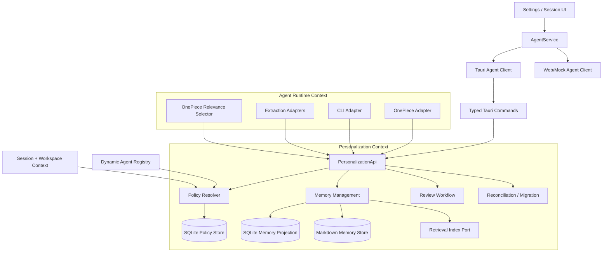

# Design: Unified Personalization Governance

## Context

VaneHub currently has two personalization inputs in `AppSettings`:

- custom instructions: `about user`, `response style`, and one enablement toggle;
- cross-session memory: one global enablement toggle and one OnePiece tool-assisted extraction toggle.

The runtime behavior is partly unified:

- OnePiece receives custom instructions, a memory index, and selected memory bodies;
- VaneHub-managed CLI messages receive custom instructions and a shared memory index;
- OnePiece creates long-term memories around native compaction;
- CLI wrappers create long-term memories after a completed turn by calling the configured OnePiece provider;
- all outputs are stored in one host-level directory and exposed by one settings list.

The behavior that must remain separate is each runtime's internal conversation compaction. VaneHub owns OnePiece compaction, while Claude Code, Codex, OpenCode, Gemini CLI, and Antigravity own their own internal context windows and native memory/instruction files.

The change therefore introduces a unified **control plane**, not a single universal compactor.

## Goals / Non-Goals

### Goals

- Apply one explicit personalization policy model to every generation started through a VaneHub runtime adapter.
- Allow global defaults with Agent, workspace, workspace-Agent, and session specialization.
- Ensure workspace memory cannot leak into another workspace unless it is explicitly global.
- Provide project-only and temporary session behavior.
- Keep OnePiece and CLI runtime adapters behaviorally appropriate while resolving from the same policy snapshot.
- Make memory creation reviewable, attributable, editable, and safely deletable.
- Eliminate silent file overwrite and partial reset behavior.
- Make configuration and memory mutation revisioned and conflict-aware.
- Let the user preview what will be applied before a generation.
- Keep React behind `AgentService`, keep Tauri/Web adapters in parity, and keep persistence in Rust.
- Preserve existing user data through an idempotent migration.

### Non-Goals

- Replacing or controlling internal compaction in Claude Code, Codex, OpenCode, Gemini CLI, or Antigravity.
- Editing `CLAUDE.md`, `AGENTS.md`, `.github/copilot-instructions.md`, OpenCode configuration, or any CLI-owned memory directory.
- Applying VaneHub personalization to a CLI process launched outside VaneHub.
- Cross-device synchronization, team sharing, organization policy, or cloud backup.
- Path-glob instruction rules in the first version. The policy schema must leave room for a future path scope, but this change implements workspace and Agent scopes only.
- Replacing the existing semantic retrieval subsystem or changing context-quality metrics.
- Full secret-vault encryption of memory files. Automatic extraction still passes through existing redaction and must never persist credentials knowingly; encryption at rest is a separate change.
- User-created personalization profiles in the first release. The storage schema may include a default policy-set identifier so profiles can be added later without another data rewrite.

## Industry Design Basis

The design follows stable patterns already used by leading developer and assistant products:

- user-level defaults with workspace-level overrides and deterministic precedence;
- project instructions that apply only inside the project;
- project-only memory boundaries;
- repository and path-specific rules rather than loading all instructions everywhere;
- inspectable plain-text memory with a concise derived index;
- explicit context/memory inspection and correction.

VaneHub adds a distinct requirement: all policy resolution must work across OnePiece and a dynamic Agent registry rather than being coupled to one model vendor.

## Existing Failure Modes to Remove

### Capped scan reused for destructive work

`MemoryDirectory::scan()` currently returns at most 200 parsed memories. `delete_all()` and filename collision detection reuse that result. This can leave files behind during reset and can omit old names during new-file allocation.

**Decision:** user queries may be paginated and bounded; internal enumeration for migration, reset, repair, and collision checks must be complete and must not depend on successful frontmatter parsing.

### Path is identity and write means replace

A directory-relative path is currently the external memory id, while `fs::write` replaces an existing path.

**Decision:** memory identity becomes an immutable UUID/ULID. The filename is derived only from that id. Display name is metadata and may be duplicated.

### Provenance is mistaken for scope

`agent_id` and folder are currently recorded but do not restrict later access.

**Decision:** provenance and authorization are separate fields. A record has an explicit scope and optional Agent audience. The resolver filters before any prompt assembly.

### Generic settings writes are too coarse

The personalization UI submits a whole `AppSettings` snapshot and uses a single saving key. Concurrent requests can return out of order and replace unrelated fields.

**Decision:** complex personalization data moves to a dedicated, revisioned API. Generic settings retain only a migration marker and deprecated deserialization fields during the compatibility window.

### Automatic extraction directly changes active state

Model-inferred and tool-derived content can become persistent shared memory without review.

**Decision:** automatic extraction writes candidates. User-initiated memory creation can create an active record. Candidate approval is the only route from automatic extraction to active memory.

## Known Current Integration Points

Claude Code should begin from these existing production areas and follow local names if the branch has moved:

### Frontend

- `src/settings/pages/personalization-page.tsx` currently composes the two personalization sections.
- `src/settings/pages/personalization/custom-instructions-section.tsx` currently owns blur-based drafts and the global custom-instruction toggle.
- `src/settings/pages/personalization/agent-memory-section.tsx` currently loads the flat global list and invokes single/all deletion.
- `src/settings/settings-provider.tsx` currently owns whole-`AppSettings` saves and a single global saving key.
- `src/services/agent-service.ts`, `src/services/tauri-agent-client.ts`, and `src/services/web-agent-client.ts` are the service/adaptor boundaries that must remain in parity.
- Existing session-creation and conversation-header components must be located through the current session service and stable session type rather than introducing a parallel session state.

### Rust / Tauri

- `src-tauri/src/contexts/agent_runtime/infrastructure/memory_directory.rs` currently owns capped enumeration, filename generation, file writes, index rebuilding, and reset behavior.
- `src-tauri/src/contexts/agent_runtime/application/ports.rs` currently exposes the unscoped host-level memory port.
- OnePiece memory extraction, selection, and CLI prompt/extraction paths currently live under `src-tauri/src/contexts/agent_runtime/`; retain model/timing code there while moving governance and persistence ownership.
- Existing list/delete/reset Agent-memory commands under `src-tauri/src/commands/agent_runtime/` must be migrated or delegated, not left as a second production write path.
- The current bootstrap/composition root and command registration must construct one shared `PersonalizationApi` and inject it into every runtime adapter.
- Use the next migration identifier from the current SQLite migration registry; do not hard-code a migration number from this document.

### Canonical specifications affected

- `openspec/specs/custom-instructions/spec.md`
- `openspec/specs/agent-cross-session-memory/spec.md`
- `openspec/specs/app-settings/spec.md`
- `openspec/specs/session-management/spec.md`
- `openspec/specs/agent-context-compaction/spec.md` is an explicit compatibility boundary and is not replaced.

## Architecture



### Ownership boundary

The new `personalization` context owns:

- policy scopes and precedence;
- custom-instruction records;
- memory identity, scope, lifecycle, provenance, persistence, and review;
- migration, reset, and reconciliation;
- effective-policy resolution and safe preview data.

The existing `agent_runtime` context continues to own:

- OnePiece system-prompt composition;
- CLI prompt composition;
- OnePiece relevance selection of memory bodies;
- OnePiece compaction timing;
- CLI completion timing;
- model-specific extraction prompts and provider calls.

Runtime adapters may request eligible records or submit candidates, but they may not bypass personalization policy or write memory files directly.

## Runtime Coverage

Coverage is based on the Agent registry and the standard VaneHub execution path, not a hard-coded list.

```text
VaneHub-managed generation
  -> resolve stable Agent id
  -> resolve workspace identity
  -> read session personalization mode
  -> capture effective personalization snapshot
  -> invoke runtime-specific prompt adapter
```

This includes:

- OnePiece;
- built-in CLI Agents such as Claude Code, Codex, OpenCode, Gemini CLI, and Antigravity;
- future API or CLI Agents registered through the standard registry;
- each seat in a multi-Agent session;
- Loop workers and scheduled runs that use the standard session/generation application service.

A new runtime adapter must declare personalization support capabilities:

```rust
pub struct PersonalizationRuntimeCapabilities {
    pub supports_custom_instructions: bool,
    pub supports_memory_index: bool,
    pub supports_selected_memory_bodies: bool,
    pub supports_automatic_extraction: bool,
}
```

The UI derives available controls from these capabilities. It must not assume that every Agent supports selected body injection or automatic extraction.

## Scope Model and Precedence

### Stable identities

```rust
pub struct PersonalizationResolutionContext {
    pub agent_id: AgentId,
    pub session_id: SessionId,
    pub workspace: Option<WorkspaceIdentity>,
    pub runtime_kind: AgentRuntimeKind,
    pub session_mode: SessionPersonalizationMode,
}

pub struct WorkspaceIdentity {
    pub key: WorkspaceKey,
    pub display_path: String,
    pub kind: WorkspaceKind,
}
```

`WorkspaceKey` must be stable and local. Prefer an existing stable project/workspace id. When no id exists, derive a SHA-256 key from a platform-normalized canonical root plus the connection identity for remote workspaces. Do not expose the hash as the primary UI label.

### Policy scopes

```rust
pub enum PersonalizationPolicyScope {
    Global,
    Agent { agent_id: AgentId },
    Workspace { workspace_key: WorkspaceKey },
    WorkspaceAgent {
        workspace_key: WorkspaceKey,
        agent_id: AgentId,
    },
}
```

Session overrides are stored with the session record rather than as a durable policy row.

### Precedence

Later layers override earlier layers:

```text
built-in safe defaults
  < global policy
  < Agent override
  < workspace override
  < workspace-Agent override
  < session override
  < hard session-mode restrictions
```

Workspace policy intentionally overrides a generic Agent override. A workspace-Agent row is the explicit exception for one Agent in one workspace.

### Tri-state controls

Non-global scopes use inheritance:

```rust
pub enum PolicyToggle {
    Inherit,
    Enabled,
    Disabled,
}
```

The global row stores only concrete enabled/disabled values.

Instruction text uses an explicit merge mode:

```rust
pub enum InstructionMergeMode {
    Inherit,
    Append,
    Replace,
    Disabled,
}
```

Resolution rules:

- `Inherit`: make no change at this layer;
- `Append`: add this layer's non-empty instruction fields after the inherited segments;
- `Replace`: discard lower-precedence user instruction segments and use this layer's fields;
- `Disabled`: discard all user instruction segments for the effective request;
- hard product/system instructions are never removed by this policy.

Every resolved segment retains provenance so the preview can explain why it is present.

## Session Personalization Modes

```rust
pub enum SessionPersonalizationMode {
    Standard,
    ProjectOnly,
    Temporary,
}
```

### Standard

- applies all resolved custom-instruction segments;
- may read global and workspace active memories according to policy;
- may explicitly save and automatically extract according to policy.

### Project-only

- applies resolved custom instructions;
- excludes global memories;
- reads and writes only the active workspace scope;
- requires a workspace identity;
- each Agent still receives its own Agent/workspace-Agent policy resolution.

### Temporary

- applies resolved custom instructions so language and response-style preferences remain available;
- reads no long-term memories;
- writes no active memories or candidates;
- performs no automatic extraction and no long-term retrieval indexing;
- keeps current-session history and each runtime's internal compaction unchanged;
- displays a persistent UI indicator.

A future clean-room mode may also disable custom instructions, but it is not part of this change.

## Immutable Per-Generation Snapshot

The policy is resolved once at the start of every generation or multi-Agent seat turn.

```rust
pub struct EffectivePersonalizationSnapshot {
    pub revision_token: String,
    pub resolved_at: DateTime<Utc>,
    pub context: PersonalizationResolutionContext,
    pub instruction_segments: Vec<ResolvedInstructionSegment>,
    pub memory_access: EffectiveMemoryAccess,
    pub eligible_memory_index: Vec<MemorySummary>,
    pub exclusions: Vec<PersonalizationExclusion>,
    pub warnings: Vec<PersonalizationWarning>,
}
```

The snapshot is immutable for that generation. Policy edits during generation apply only to later generations. This mirrors the existing rule that active runtime work captures its settings context.

The `revision_token` is derived from all policy row revisions, session mode, workspace identity, and relevant migration generation. It is safe metadata for diagnostics and does not contain instruction or memory content.

## Runtime Assembly

### OnePiece

```text
core OnePiece instructions
  -> resolved custom-instruction segments
  -> skills / runtime capabilities
  -> scoped active-memory index
  -> relevance selector chooses bounded memory bodies
  -> scoped selected memory bodies with provenance and staleness caveats
  -> task/session context
```

Only records already allowed by the snapshot may be passed to the relevance selector. Selection cannot broaden scope.

### CLI wrappers

```text
resolved custom-instruction segments
  -> scoped active-memory index
  -> existing Prompt Hook output
  -> user message
```

The CLI adapter remains index-only unless a future adapter explicitly declares selected-body support. The change does not modify CLI-owned `CLAUDE.md`, `AGENTS.md`, settings, or native auto-memory.

### Multi-Agent and background execution

Each seat/worker resolves a snapshot with its own stable Agent id and the shared session/workspace context. A supervisor cannot copy a worker's excluded memory into another Agent's prompt through the personalization API. Ordinary conversation messages may still contain facts previously stated by Agents; that is session context, not long-term memory authorization.

## Memory Domain Model

```rust
pub struct MemoryRecord {
    pub id: MemoryId,
    pub name: String,
    pub description: String,
    pub memory_type: MemoryType,
    pub content: String,
    pub scope: MemoryScope,
    pub audience: MemoryAudience,
    pub status: MemoryStatus,
    pub source: MemorySource,
    pub provenance: MemoryProvenance,
    pub sensitivity: MemorySensitivity,
    pub revision: u64,
    pub created_at: DateTime<Utc>,
    pub updated_at: DateTime<Utc>,
    pub verified_at: Option<DateTime<Utc>>,
    pub last_used_at: Option<DateTime<Utc>>,
    pub use_count: u64,
}

pub enum MemoryScope {
    Global,
    Workspace { workspace_key: WorkspaceKey },
}

pub enum MemoryAudience {
    AllAgents,
    SelectedAgents { agent_ids: Vec<AgentId> },
}

pub enum MemoryStatus {
    Candidate,
    Active,
    Archived,
}

pub enum MemorySource {
    ExplicitUser,
    OnePieceAutomatic,
    CliAutomatic,
    ModelMemoryTool,
    LegacyMigration,
    ExternalFileEdit,
}
```

`source_agent_id`, workspace, session, and source message ids are provenance, not scope. `MemoryAudience` is an additional restriction after scope filtering.

### Stable file format

Each memory is stored as `<memory-id>.md`. The display name is not part of the path.

```markdown
---
schema_version: 2
id: 01K2...
name: Use pnpm
description: Package-manager preference for VaneHub
memory_type: project
scope_kind: workspace
workspace_key: ws_...
audience: all_agents
status: active
source: explicit_user
source_agent_id: onepiece
source_session_id: ses_...
revision: 3
created_at: 2026-08-22T08:00:00Z
updated_at: 2026-08-22T09:30:00Z
---

Use pnpm for this repository. Do not generate npm lockfiles.
```

The Markdown file remains authoritative for content and portable metadata. SQLite is an indexed projection for query, concurrency, and diagnostics. The retrieval index and `MEMORY.md` are derived views.

### Validation limits

- name: 1–120 Unicode characters;
- description: 0–500 Unicode characters;
- content: 1–32,000 Unicode characters;
- selected Agent audience: maximum 100 ids;
- no path separators or control characters are derived from user fields because filenames use ids;
- invalid frontmatter never becomes active silently.

## Memory Repository Contract

```rust
#[async_trait]
pub trait MemoryRepository: Send + Sync {
    async fn list_page(&self, query: MemoryQuery) -> Result<MemoryPage>;
    async fn get(&self, id: &MemoryId) -> Result<Option<MemoryRecord>>;
    async fn create(&self, input: CreateMemoryInput) -> Result<MemoryRecord>;
    async fn update(
        &self,
        id: &MemoryId,
        expected_revision: u64,
        patch: UpdateMemoryPatch,
    ) -> Result<MemoryRecord>;
    async fn delete(
        &self,
        id: &MemoryId,
        expected_revision: Option<u64>,
    ) -> Result<DeleteMemoryOutcome>;
}

#[async_trait]
pub trait MemoryMaintenanceRepository: Send + Sync {
    async fn enumerate_owned_entries(&self) -> Result<Vec<StorageEntry>>;
    async fn reset(&self, request: ResetMemoryRequest) -> Result<ResetMemoryOutcome>;
    async fn reconcile(&self) -> Result<ReconcileMemoryOutcome>;
}
```

`list_page` is bounded for UI/runtime query behavior. `enumerate_owned_entries` is internal and complete; it scans all application-owned files, including malformed files, and is never exposed as an unbounded frontend response.

### Write semantics

- `create` uses a new immutable id and create-new semantics; it never replaces an existing file;
- `update` requires the id and expected revision;
- writes use a temporary file in the same directory, flush, and platform-safe atomic replacement;
- the application serializes mutations per memory directory and uses a cross-process lock where the current dependency stack supports it;
- projection/index failures do not corrupt the authoritative file; they set a repair-required state and emit a safe warning;
- startup and user-invoked reconciliation rebuild derived state.

## Memory Eligibility

A memory is eligible only when all checks pass:

```text
status == active
AND scope allowed by session mode
AND scope allowed by effective global-memory policy
AND workspace key matches for workspace memory
AND current Agent is in audience
AND memory-read policy is enabled
AND migration/reconciliation state is safe
```

Eligibility occurs before token budgeting and relevance selection.

For `project-only`, global records are excluded even if global-memory access is enabled elsewhere. For `temporary`, all records are excluded.

## Candidate Review Workflow

### Creation paths

| Path | Initial status |
|---|---|
| User chooses “Remember globally/project” from message UI | `active` |
| User creates memory from Settings | `active` |
| OnePiece automatic extraction | `candidate` |
| CLI post-turn automatic extraction | `candidate` |
| OnePiece/model memory tool | `candidate` unless invoked by an explicit UI-backed user action |
| Legacy migration | `active` |
| Unrecognized external file | `candidate` or quarantined after validation |

Automatic extraction returns proposals rather than direct file operations:

```rust
pub enum MemoryCandidateOperation {
    Create(CreateMemoryCandidate),
    Update(UpdateMemoryCandidate),
    Archive(ArchiveMemoryCandidate),
}
```

An automatic `Update` or `Archive` proposal does not modify the active target before approval. The review record captures the proposed diff and target revision; approval fails with a conflict if the target changed.

### Review actions

- approve as proposed;
- edit and approve;
- reject;
- change global/workspace scope;
- change Agent audience;
- mark sensitive and archive;
- merge into an existing memory.

Rejected candidates are retained only as bounded audit metadata according to existing local retention policy; their full content is deleted unless needed for a displayed conflict until the review action completes.

## Policy Persistence

Use the next available SQLite migration in the existing migration registry.

### `personalization_policy_overrides`

```sql
CREATE TABLE personalization_policy_overrides (
  id TEXT PRIMARY KEY NOT NULL,
  policy_set_id TEXT NOT NULL DEFAULT 'default',
  scope_key TEXT NOT NULL UNIQUE,
  scope_kind TEXT NOT NULL,
  workspace_key TEXT,
  agent_id TEXT,
  instruction_merge_mode TEXT NOT NULL,
  about_user TEXT,
  style_rules TEXT,
  memory_read_mode TEXT NOT NULL,
  explicit_save_mode TEXT NOT NULL,
  automatic_extraction_mode TEXT NOT NULL,
  global_memory_access_mode TEXT NOT NULL,
  revision INTEGER NOT NULL,
  created_at TEXT NOT NULL,
  updated_at TEXT NOT NULL
);
```

The application validates that the nullable scope columns match `scope_kind`. `scope_key` is generated from typed values and is not assembled from unescaped display text.

### `personalization_memory_projection`

```sql
CREATE TABLE personalization_memory_projection (
  memory_id TEXT PRIMARY KEY NOT NULL,
  file_name TEXT NOT NULL UNIQUE,
  name TEXT NOT NULL,
  description TEXT NOT NULL,
  memory_type TEXT NOT NULL,
  scope_kind TEXT NOT NULL,
  workspace_key TEXT,
  audience_json TEXT NOT NULL,
  status TEXT NOT NULL,
  source TEXT NOT NULL,
  source_agent_id TEXT,
  source_session_id TEXT,
  sensitivity TEXT NOT NULL,
  revision INTEGER NOT NULL,
  content_hash TEXT NOT NULL,
  created_at TEXT NOT NULL,
  updated_at TEXT NOT NULL,
  verified_at TEXT,
  last_used_at TEXT,
  use_count INTEGER NOT NULL DEFAULT 0
);
```

Add indexes for `(status, updated_at)`, `(scope_kind, workspace_key, status)`, `(source_agent_id, status)`, and `(memory_type, status)`.

### `personalization_memory_candidates`

Store candidate metadata and proposed content/diff locally with bounded retention. Candidate content must not enter `MEMORY.md` or the retrieval index before approval.

### `personalization_migration_state`

Store schema generation, started/completed timestamps, last error, and repair-required status. Migration and reconciliation must be idempotent.

## Policy API and Optimistic Concurrency

```rust
pub struct PatchPersonalizationPolicyRequest {
    pub scope: PersonalizationPolicyScope,
    pub expected_revision: Option<u64>,
    pub patch: PersonalizationPolicyPatch,
}

pub enum PatchPolicyResult {
    Updated(PersonalizationPolicyRecord),
    Conflict {
        current: PersonalizationPolicyRecord,
    },
}
```

The frontend must never update this domain by sending an entire `AppSettings` object. A conflict preserves the user's local draft and offers reload or comparison.

## Tauri Command Surface

Use the repository's existing command registration and error mapping conventions. Command names may be adjusted to match local naming, but the service contract must provide these operations:

```text
get_personalization_configuration
patch_personalization_policy
preview_effective_personalization
list_personalization_agents
list_personalization_memories
get_personalization_memory
create_personalization_memory
patch_personalization_memory
review_personalization_memory_candidate
delete_personalization_memory
preview_reset_personalization_memories
reset_personalization_memories
reconcile_personalization_memories
```

Destructive reset is two-stage:

1. preview returns a short-lived confirmation token and exact counts by scope/status;
2. execute requires that token plus a typed confirmation phrase.

The token prevents the UI from confirming against stale counts.

## TypeScript Service Contract

Add `src/types/personalization.ts` and a dedicated service slice exposed through `AgentService`.

```ts
export interface PersonalizationService {
  getPersonalizationConfiguration(): Promise<PersonalizationConfiguration>;
  patchPersonalizationPolicy(
    input: PatchPersonalizationPolicyInput,
  ): Promise<PatchPersonalizationPolicyResult>;
  previewEffectivePersonalization(
    input: EffectivePersonalizationPreviewInput,
  ): Promise<EffectivePersonalizationPreview>;
  listPersonalizationMemories(
    query: PersonalizationMemoryQuery,
  ): Promise<PersonalizationMemoryPage>;
  getPersonalizationMemory(id: string): Promise<PersonalizationMemory>;
  createPersonalizationMemory(
    input: CreatePersonalizationMemoryInput,
  ): Promise<PersonalizationMemory>;
  patchPersonalizationMemory(
    input: PatchPersonalizationMemoryInput,
  ): Promise<PatchPersonalizationMemoryResult>;
  reviewPersonalizationMemoryCandidate(
    input: ReviewMemoryCandidateInput,
  ): Promise<ReviewMemoryCandidateResult>;
  deletePersonalizationMemory(
    input: DeletePersonalizationMemoryInput,
  ): Promise<DeletePersonalizationMemoryOutcome>;
  previewResetPersonalizationMemories(
    input: PreviewResetMemoriesInput,
  ): Promise<ResetMemoriesPreview>;
  resetPersonalizationMemories(
    input: ResetMemoriesInput,
  ): Promise<ResetMemoriesOutcome>;
  reconcilePersonalizationMemories(): Promise<ReconcileMemoriesOutcome>;
}
```

Rules:

- React components call only `AgentService`;
- only the Tauri adapter invokes native commands;
- the Web/mock adapter uses deterministic in-memory data and exposes the same revision/conflict/paging behavior;
- query keys include filter and cursor state;
- old `AgentMemoryService.listAllMemories()` is removed after all callers migrate.

## Suggested Rust Code Layout

```text
src-tauri/src/contexts/personalization/
├── mod.rs
├── api.rs
├── domain/
│   ├── mod.rs
│   ├── policy.rs
│   ├── scope.rs
│   ├── snapshot.rs
│   ├── memory.rs
│   ├── candidate.rs
│   ├── migration.rs
│   └── error.rs
├── application/
│   ├── mod.rs
│   ├── ports.rs
│   ├── resolve_personalization.rs
│   ├── manage_policy.rs
│   ├── query_memories.rs
│   ├── manage_memory.rs
│   ├── review_candidate.rs
│   ├── reset_memories.rs
│   ├── reconcile_memories.rs
│   └── migrate_legacy_personalization.rs
└── infrastructure/
    ├── mod.rs
    ├── sqlite_policy_repository.rs
    ├── sqlite_memory_projection.rs
    ├── markdown_memory_repository.rs
    ├── memory_file_lock.rs
    └── legacy_memory_reader.rs
```

Keep model-call-specific code in `contexts/agent_runtime`:

```text
src-tauri/src/contexts/agent_runtime/
├── application/
│   ├── onepiece_personalization_adapter.rs
│   ├── cli_personalization_adapter.rs
│   └── memory_extraction_adapter.rs
└── domain/
    ├── memory_extraction.rs
    └── memory_selection.rs
```

Reuse existing modules where practical instead of copying code. During migration, old modules may delegate to the new API, but there must be one production write path when the change completes.

## Suggested Frontend Code Layout

```text
src/settings/pages/personalization/
├── personalization-page.tsx
├── personalization-page-model.ts
├── personalization-overview-view.tsx
├── personalization-instructions-view.tsx
├── personalization-memory-view.tsx
├── personalization-runtime-preview-view.tsx
├── policy-scope-selector.tsx
├── instruction-editor.tsx
├── agent-policy-list.tsx
├── memory-filter-bar.tsx
├── memory-list.tsx
├── memory-detail-panel.tsx
├── memory-review-panel.tsx
├── memory-reset-dialog.tsx
└── personalization-health-panel.tsx
```

Prefer shared primitives already in the repository. Avoid one component per trivial field; split by user workflow and test boundary.

## UI Information Architecture

Rename the destination to **AI Personalization** so it is not confused with visual appearance settings.

### View 1: Overview

First viewport:

```text
AI Personalization
Manage instructions and long-term memory for VaneHub-managed Agents.

[Policy health] [Active memories] [Pending review] [Agent coverage]

Current workspace: vanehub-ai
Session default: Standard

Agents
OnePiece      Inherits global     Memory read: On    Auto extract: On
Claude Code   Workspace override  Memory read: On    Auto extract: Review
Codex         Agent override      Memory read: Off   Auto extract: Off
OpenCode      Inherits global     Memory read: On    Auto extract: Review
```

Requirements:

- use the registry-provided Agent list and capability flags;
- show inheritance/override source, not only final booleans;
- show migration, reconciliation, and policy-load warnings;
- do not expose raw prompts or secrets in summary cards.

### View 2: Instructions

Layout:

```text
Scope: [Global] [Workspace] [Agent] [Workspace + Agent]
Workspace: vanehub-ai
Agent: Claude Code
Mode: Inherit / Append / Replace / Disabled

About you
[editor]
0 / 3000 characters · estimated tokens

Response style and rules
[editor]
0 / 3000 characters · estimated tokens

Effective order
Global -> Agent -> Workspace -> Workspace + Agent -> Session

[Discard changes] [Save]
```

Behavior:

- explicit Save/Discard for long text;
- dirty indicator and navigation protection;
- inline character validation and approximate token count;
- save only the selected scope through expected revision;
- preserve draft on network/native error or conflict;
- show current inherited text read-only when mode is `Inherit`;
- show a diff/summary when `Replace` discards inherited segments;
- support keyboard and IME composition correctly;
- saving one scope must not disable unrelated page controls.

### View 3: Memory

Header controls:

```text
[Search] [Scope] [Status] [Type] [Source Agent] [More filters]
Pending review (7)                         [Create memory] [Maintenance]
```

List rows show:

- name and bounded description;
- scope and Agent audience;
- active/candidate/archived status;
- type;
- source Agent and source kind;
- updated time and optional stale marker;
- row actions: open, approve/reject when candidate, archive, delete.

Do not render every full memory body in the main list. Use cursor pagination with a default page size of 50 and maximum of 200. Normal document flow is sufficient per page; add measured virtualization only if a single rendered result set can exceed the repository's established 500-item threshold.

The detail panel supports:

- full content view/edit;
- name, description, type, scope, Agent audience;
- provenance and timestamps;
- revision conflict handling;
- approve/edit-and-approve/reject for candidates;
- archive/reactivate;
- permanent delete with confirmation;
- open source session when it still exists.

Maintenance contains:

- preview scoped reset;
- exact counts before deletion;
- export/backup suggestion without implementing export in this change;
- typed confirmation;
- result details for files, projection rows, retrieval entries, and failures;
- reconciliation/rebuild action and last result.

### View 4: Runtime Preview

Inputs:

- registered Agent;
- workspace;
- session mode;
- optional existing session.

Output:

```text
Effective policy revision: ...
Instruction segments
  Global response style                 Included
  Workspace project guidance            Included
  Codex Agent override                  Disabled

Memory eligibility
  Active global                         12
  Active workspace                      31
  Excluded by project-only mode         12
  Excluded by Agent audience             3
  Candidates (never injected)            7

Runtime behavior
  Adapter: CLI index-only
  Automatic extraction: Candidate review
  Internal CLI compaction: Not managed by VaneHub
```

The preview may show instruction text and memory metadata to the local user, but it must not expose credentials, hidden core system prompts, or unredacted trace payloads.

### Session creation and active session UI

Add a mode selector near project/workspace selection:

```text
Personalization
(•) Standard      Use allowed global and project memory
( ) Project-only  Use only this workspace's memory
( ) Temporary     Do not read or create long-term memory
```

- disable `Project-only` when no workspace is selected;
- persist mode in the session;
- show a compact `Project-only` or `Temporary` badge in the conversation header;
- explain that temporary mode does not disable the runtime's current-session history or internal compaction.

## Error and Safe-Fallback Behavior

### Policy load failure

- if a validated in-memory last-known-good policy exists, use it and emit a warning;
- if no validated policy exists, omit custom instructions and deny memory read/write/extraction;
- do not block the main Agent generation;
- never use a fallback that silently enables memory.

### Extraction failure

- preserve the completed Agent response;
- do not create a partial candidate;
- record a safe metadata error for diagnostics;
- allow manual retry only from a bounded source transcript already available to the application.

### Projection or retrieval-index failure

- authoritative file mutation may complete;
- mark repair required;
- exclude an unprojected/invalid record from normal runtime use until reconciliation confirms it;
- show maintenance state in the UI;
- retry idempotently.

### Revision conflict

- return a typed conflict with the current revision and safe current record;
- preserve the user's draft;
- do not silently apply last-response-wins.

## Migration Plan

### Stage 1: policy migration

1. Create the new SQLite tables and a default global policy row.
2. Read legacy `AppSettings` personalization fields once.
3. Map legacy values:
   - custom instruction text -> global instruction fields;
   - custom-instructions enabled -> global instruction mode enabled/disabled;
   - memory enabled -> global read/save/extraction defaults;
   - tool-assisted extraction -> OnePiece automatic-extraction Agent override when it differs from the global default.
4. Mark policy migration complete in one transaction.
5. Keep deprecated fields deserializable for one compatibility window, but stop using them as runtime truth.

### Stage 2: memory migration

1. Acquire the memory-directory maintenance lock.
2. Enumerate every application-owned entry without a 200-file cap.
3. Ignore derived `MEMORY.md`, lock files, temp files, and the quarantine directory according to explicit rules.
4. For each valid legacy memory:
   - generate an immutable id;
   - preserve content, name, description, type, timestamps, source Agent, and folder provenance;
   - assign `scope = global`, `audience = all_agents`, `status = active`, `source = legacy_migration` to preserve prior behavior;
   - atomically write v2 format and insert/update the projection;
   - remove the legacy file only after verification.
5. Move malformed or unsafe entries to a quarantine directory and record a diagnostic; never activate them silently.
6. Rebuild `MEMORY.md` from active records.
7. Reconcile the retrieval index from active records.
8. Mark migration complete.

The migration must be idempotent after interruption. V2 files with valid ids are recognized and not duplicated. Legacy files already represented by a content hash and migration record are not imported twice.

### Stage 3: runtime cutover

- switch OnePiece and CLI assembly to `PersonalizationApi` snapshots;
- switch extraction to candidate submission;
- switch settings UI and service adapters;
- remove old unscoped production calls;
- retain a narrow read-only compatibility adapter only until all callers are migrated.

### Rollback

Database migration is additive. A code rollback may continue to deserialize legacy `AppSettings`, but it cannot safely interpret v2 scoped files through the old path-as-id logic. Therefore release rollback must either:

- restore the previous application binary together with the pre-migration memory backup created by the migration; or
- keep the v2 compatibility reader in the immediately previous release branch.

The migration must create a local manifest/backup map before deleting legacy files. No UI should claim rollback is possible without that artifact.

## Performance and Budgets

- policy resolution is an indexed read of at most four durable policy rows plus the session override;
- cache validated policy rows and invalidate by revision/event;
- list queries use SQLite projection and cursor pagination;
- only active, eligible summaries enter runtime memory budgeting;
- OnePiece's existing independent memory context budget remains authoritative after scope filtering;
- CLI index size remains bounded by the existing CLI memory budget after scope filtering;
- migration and reconciliation may scan all files but run under maintenance state and report progress; normal UI queries remain bounded;
- do not add per-memory N+1 file reads to list pages; load body only for detail or selected runtime records.

## Security and Trust Boundaries

- workspace/project content and tool output are untrusted inputs;
- automatic extraction never directly activates memory;
- candidates never enter runtime prompts, `MEMORY.md`, or retrieval indexes;
- generic file tools must not bypass the personalization API for v2 memory writes;
- memory filenames are generated ids, not model/user strings;
- path traversal and symlink escape checks remain mandatory;
- remote workspace identity includes connection identity to prevent equal paths on different hosts from sharing scope;
- all reset and repair operations are local and auditable;
- frontend errors use safe typed messages and do not expose filesystem paths unless the user opens advanced local diagnostics;
- prompt preview excludes hidden core system instructions and credentials.

## Key Decisions and Rejected Alternatives

### New bounded context instead of expanding generic settings

Chosen because policies, memories, candidates, migrations, and previews form a coherent domain with their own invariants. Keeping them in generic `AppSettings` would preserve coarse whole-object writes and make runtime access rules difficult to test.

### Runtime adapters instead of one universal prompt builder

Chosen because OnePiece can inject selected bodies while CLI wrappers currently receive only an index and retain internal compaction. A universal builder would either reduce OnePiece quality or pretend VaneHub controls opaque CLI internals.

### Candidate-by-default automatic extraction

Chosen to prevent model/tool output from becoming persistent cross-session context without a user-visible trust step. Direct activation was rejected despite lower friction because it amplifies prompt-injection and stale-fact risks.

### Stable id filenames instead of sanitized display names

Chosen to eliminate collisions and make rename independent from identity. Longer readable filenames were rejected because uniqueness and cross-platform normalization would remain coupled to user/model text.

### File authority plus SQLite projection instead of SQLite-only content

Chosen to preserve local inspectability and current Markdown interoperability while gaining indexed paging and revision checks. The trade-off is reconciliation complexity, addressed through atomic writes and explicit repair state.

### Project-only and temporary modes instead of one memory toggle

Chosen because users need per-session boundaries without globally destroying or disabling useful personalization. A single host-wide toggle cannot express sensitive one-off work or project isolation.

## Risks / Trade-offs

- **Large migration surface** → implement in task groups, keep idempotent migration fixtures, and cut over one runtime adapter at a time behind tests.
- **Dual file/projection state can diverge** → authoritative file rules, content hashes, repair-required state, startup reconciliation, and user-invoked maintenance.
- **Candidate review adds friction** → active creation remains one action for explicit user saves; overview shows a bounded pending count and bulk reject/approve where safe.
- **Scope UI can become dense** → progressive views, inheritance summaries, and detail panels; do not render the full matrix and full memory bodies simultaneously.
- **Dynamic Agent support can expose unsupported controls** → capability flags and disabled explanations from the registry/runtime adapter.
- **Legacy global memories remain broadly visible after migration** → preserve behavior for compatibility but label them `Legacy shared`; offer a bulk move-to-workspace workflow in the memory view.
- **Temporary mode may be misunderstood as no history at all** → explain that it disables long-term VaneHub memory, not the active session or a CLI's internal context.
- **Policy changes during generation** → immutable snapshot with revision token; changes apply to later generations only.

## Implementation Sequence

1. Add domain types, repository contracts, SQLite migration, and safe defaults.
2. Harden memory identity and storage; add complete maintenance enumeration.
3. Implement idempotent migration and reconciliation.
4. Implement policy resolution, snapshot capture, and preview.
5. Integrate OnePiece read/extraction behavior.
6. Integrate all CLI wrappers through the shared adapter path.
7. Add session modes and multi-seat propagation.
8. Expose typed Tauri and Web/mock service contracts.
9. Replace the settings UI and add session controls.
10. Remove obsolete unscoped production paths, update documentation, and run all release gates.
