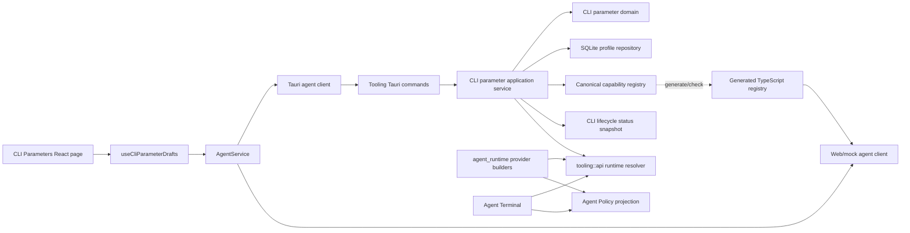

## Context

The existing feature has a sound security intent but an implementation split that is no longer sustainable.

### Current state

- `src-tauri/src/contexts/tooling/cli_parameters.rs` owns catalog construction, validation, SQLite access, safe preview rendering, and part of the runtime API in one large module.
- `src/services/cli-parameter-catalog.ts` repeats catalog definitions and rendering rules for Web/mock behavior.
- `src/settings/pages/cli-parameters-page.tsx` ignores the service-provided preview, rebuilds it locally, joins tokens with spaces, and implicitly uses the `chat` scope.
- `src/settings/pages/cli-parameter-control.tsx` keeps transient custom input inside a reusable component. Selecting Custom can commit an empty value before the user types, and a control keyed only by parameter id can retain text when the active CLI changes.
- Saved values are untyped JSON values. The literal string `default`, `false`, and an empty list are overloaded to mean “do not emit a token,” even when `default` may be a real provider enum value.
- Provider-specific rendering is partly encoded as parameter-id conditionals, such as the Codex reasoning-effort `--config` mapping.
- The SQLite table rewrites one agent profile atomically, but it has no profile revision. A second window can overwrite newer data after a refetch without detecting the conflict.
- Historical invalid rows are ignored and logged, but the settings page cannot explain or repair them.
- The CLI lifecycle subsystem already detects active paths, versions, multiple installations, and conflicts. CLI Parameters should reuse that state rather than create a second detector.

### External design signals

The design follows current provider behavior rather than treating every CLI as a generic `--flag value` surface:

- Claude Code documents model-dependent effort values, version-gated options, positive/negative Chrome flags, ordered fallback models, setting-source lists, and print-mode-only flags.
- Codex has dedicated flags plus typed TOML `--config` overrides, named profiles, local-provider dependencies, and model-dependent reasoning capabilities.
- Gemini CLI documents repeated extension flags and a maximum of five include directories while approval and sandbox behavior remain security policy concerns.
- OpenCode identifies models as `provider/model`; its `variant` is provider-specific and `thinking` only controls display of thinking blocks.
- OpenSpec delta specifications are behavioral contracts. Architecture, storage, and file-level instructions therefore remain in this design and `tasks.md`.

## Goals / Non-Goals

### Goals

- Make one catalog the authority for native validation, native launch projection, desktop preview, generated Web/mock behavior, documentation metadata, and contract tests.
- Model inheritance separately from provider values so a real value named `default` can be emitted when a provider requires it.
- Represent current safe provider launch options without adding raw argument escape hatches.
- Make compatibility, dependencies, conflicts, validation, rendering, and audit provenance explicit and testable.
- Keep `tooling` as the owning bounded context and publish a narrow runtime-resolution contract to `agent_runtime`.
- Prevent stale profile writes while preserving existing saved profiles through a deterministic migration.
- Make the page operationally dense, responsive, accessible, and clear about what VaneHub controls versus what the CLI or Agent Policy controls.
- Keep desktop and Web/mock service contracts behaviorally equivalent.
- Keep preview and save fast and deterministic; neither operation starts a CLI process.

### Non-Goals

- Editing vendor configuration files such as Claude settings, Codex `config.toml`, Gemini `settings.json`, or OpenCode configuration. That remains Agent Configuration / vendor configuration management.
- Adding user, project, team, or cloud-synchronized profile layers. This change retains one persisted VaneHub profile per managed CLI.
- Adding arbitrary raw arguments, environment-variable editors, API keys, tokens, prompt/system-prompt overrides, or unverified flags.
- Making approval, permission, automatic-approval, sandbox, tool allowlist, or dangerous bypass fields editable here.
- Replacing CLI Management installation detection or adding a second path/version scanner.
- Running `--help`, model discovery, or any executable synchronously when the page renders or a field changes.
- Restarting or mutating already-running CLI processes after save/reset.
- Guaranteeing that VaneHub can resolve the final vendor configuration value when the profile is inherited. The UI reports that no VaneHub token is emitted; it does not pretend to evaluate every vendor configuration layer.
- Supporting old frontend binaries against a new native binary. The repository ships one coordinated application, but persisted user data is migrated.

## Architecture Overview



The registry describes only ordinary user-editable launch parameters. Agent Policy projection remains separate and is applied after ordinary profile resolution at process construction.

## Decisions

### 1. Keep CLI Parameters as a `tooling` subdomain

CLI lifecycle and CLI launch-parameter management share the stable managed CLI ids, but they have different invariants and persistence. The implementation will therefore remain inside the `tooling` bounded context while using a dedicated subdomain layout.

Target native layout:

```text
src-tauri/src/contexts/tooling/
├─ api.rs
├─ cli_parameters/
│  ├─ mod.rs
│  ├─ api.rs
│  ├─ domain/
│  │  ├─ mod.rs
│  │  ├─ catalog.rs
│  │  ├─ compatibility.rs
│  │  ├─ definition.rs
│  │  ├─ diagnostic.rs
│  │  ├─ rendering.rs
│  │  ├─ selection.rs
│  │  └─ validation.rs
│  ├─ application/
│  │  ├─ mod.rs
│  │  ├─ ports.rs
│  │  └─ service.rs
│  ├─ infrastructure/
│  │  ├─ mod.rs
│  │  ├─ catalog_loader.rs
│  │  ├─ lifecycle_snapshot_adapter.rs
│  │  └─ sqlite_profile_repository.rs
│  └─ catalog/
│     └─ catalog.v2.json
└─ ...
```

`contexts/tooling/api.rs` re-exports only the immutable runtime contract and command-facing application facade required outside the subdomain. `agent_runtime` must not import the SQLite repository, catalog loader, or private domain modules.

The current single `cli_parameters.rs` file is removed after callers and tests use the new modules. No standing compatibility module remains.

### 2. Use one native-owned capability registry

The canonical registry is `src-tauri/src/contexts/tooling/cli_parameters/catalog/catalog.v2.json`.

Reasons:

- Rust remains authoritative for desktop validation and process construction.
- JSON is inspectable, diffable, and can be consumed by a deterministic Node generator.
- The registry can carry i18n keys and audit metadata without embedding frontend labels in Rust domain code.
- Web/mock can use a generated immutable artifact without duplicating hand-written definitions.

The registry has a semantic `catalogVersion` and the generator embeds a content hash. A script such as `scripts/generate-cli-parameter-catalog.mjs`:

1. reads the canonical JSON;
2. validates structural invariants;
3. emits `src/generated/cli-parameter-catalog.ts`;
4. emits no user-facing prose;
5. supports `--check` and fails when generated output differs.

`npm run contracts:check` must include the check mode. The generated TypeScript file is never edited manually.

Desktop list, save, reset, preview, and runtime resolution always use the Rust-loaded registry. Web/mock list, save, reset, and preview use the generated artifact through the same `AgentService` interface.

### 3. Separate inheritance from provider values

Replace untyped maps such as `BTreeMap<String, serde_json::Value>` with a tagged selection envelope.

Rust shape:

```rust
#[derive(Debug, Clone, PartialEq)]
pub(crate) enum CliParameterSelection {
    Inherit,
    Value(CliParameterValue),
}

#[derive(Debug, Clone, PartialEq)]
pub(crate) enum CliParameterValue {
    Text(String),
    Boolean(bool),
    TextList(Vec<String>),
}
```

Transport shape:

```ts
export type CliParameterSelection =
  | { state: "inherit" }
  | { state: "value"; value: string | boolean | string[] };
```

Consequences:

- `inherit` means VaneHub emits no token for that parameter.
- A provider value literally named `default` is represented as `{ state: "value", value: "default" }` and is emitted if the catalog allows it.
- A one-way presence flag uses `inherit` or `value: true`; `value: false` is rejected unless the renderer defines a negative flag.
- Empty lists are normalized to `inherit`.
- Empty or whitespace-only custom text never becomes a valid selection.

The UI label is “Inherit from CLI” rather than “Default” because the actual value may come from vendor user/project configuration, environment, or the provider’s built-in default.

### 4. Expand the definition model rather than adding parameter-id conditionals

The registry definition shape is conceptually:

```ts
interface CliParameterDefinition {
  id: string;
  agentId: ManagedCliAgentId;
  category: "model" | "experience" | "context" | "runtime" | "diagnostics";
  ownership: "user-editable" | "policy-governed" | "runtime-reserved";
  maturity: "stable" | "preview" | "experimental" | "deprecated";
  control:
    | "enum"
    | "boolean-flag"
    | "tri-state"
    | "multi-enum"
    | "custom-text"
    | "ordered-string-list"
    | "path-list";
  labelKey: string;
  descriptionKey: string;
  defaultSelection: { state: "inherit" } | { state: "value"; value: unknown };
  launchScopes: Array<"interactive" | "chat">;
  risk: "normal" | "warning";
  advanced: boolean;
  options: CliParameterOption[];
  optionSource?: CliParameterOptionSource;
  renderer: CliParameterRenderer;
  constraints: CliParameterConstraints;
  compatibility: CliParameterCompatibility;
  dependencies: CliParameterDependencies;
  audit: CliParameterAudit;
}
```

Renderer kinds:

```ts
type CliParameterRenderer =
  | { kind: "presence-flag"; flag: string; slot: CliArgumentSlot }
  | { kind: "positive-negative-flag"; positiveFlag: string; negativeFlag: string; slot: CliArgumentSlot }
  | { kind: "flag-value"; flag: string; slot: CliArgumentSlot }
  | { kind: "repeat-flag-value"; flag: string; slot: CliArgumentSlot }
  | { kind: "joined-list"; flag: string; separator: ","; slot: CliArgumentSlot }
  | {
      kind: "config-key-value";
      flag: "--config";
      key: string;
      encoding: "toml-string" | "toml-boolean";
      slot: CliArgumentSlot;
    };
```

Initial argument slots:

- `global`: options that must precede a provider subcommand.
- `invocation`: options owned by the interactive/fresh-chat/resume invocation grammar before positional prompt or session values.

Provider builders own the exact insertion points for these two token segments. The domain renderer does not construct prompt/session/output-protocol tokens and does not return one combined command line.

This removes special cases such as `if id == "reasoningEffort"`.

### 5. Validate the registry as a contract

The registry loader and generator enforce at least these invariants:

- `catalogVersion` is present and parseable.
- Agent ids are exactly the supported managed CLI ids.
- Parameter ids are unique within an agent.
- Every user-editable definition has non-empty launch scopes and one renderer.
- Policy-governed and runtime-reserved definitions are not returned as editable definitions.
- Renderer kind is compatible with control/value kind.
- Positive and negative flags differ.
- Defaults and static options pass the same validator used for saves.
- Dependency/conflict references exist in the same agent catalog and contain no cycles.
- Compatibility ranges are valid and platform identifiers are known.
- i18n keys are non-empty and generated parity tests verify that every registered locale contains them.
- Audit source, review date, and reviewed behavior note are present.
- Reserved flags and known dangerous bypass flags cannot be admitted to an editable definition.
- Prompt, session, output-format, stdin, and secret-bearing concerns fail the registry safety check.

A catalog error is a build/test failure. Native production code still returns a structured `CATALOG_INVALID` error instead of panicking.

### 6. Evaluate compatibility from the existing lifecycle snapshot

The CLI Parameters application service consumes a narrow read-only installation snapshot supplied by the CLI lifecycle subdomain:

```rust
pub(crate) trait CliInstallationSnapshotPort {
    fn active_installation(
        &self,
        agent_id: &ManagedCliAgentId,
    ) -> Result<CliInstallationSnapshot, CliParametersApplicationError>;
}
```

The snapshot contains only stable id, installed/runnable state, active path, parsed version when available, and conflict state. It reuses existing detection data and its refresh operation.

Compatibility status per definition:

```ts
type CliParameterSupport =
  | { state: "supported" }
  | { state: "not-installed" }
  | { state: "unknown-version"; requiredRange?: string }
  | { state: "unsupported-version"; installedVersion: string; requiredRange: string }
  | { state: "unsupported-platform"; platform: string };
```

Rules:

- The page may save stable parameters when the CLI is not installed; this supports preconfiguration.
- A parameter with no version gate is considered supported even when the version is unknown.
- A version-gated parameter with unknown version remains visible but disabled and explains that detection must be refreshed.
- A newly submitted value for a known unsupported parameter is rejected.
- An old stored unsupported value is quarantined, omitted from launch tokens, and returned as a repair diagnostic; it is not silently rewritten.
- A CLI conflict is visible in the sidebar, but the active-path version remains the compatibility input. The UI links to CLI Management to resolve the conflict.
- Compatibility checks never execute a child process during list, preview, field edit, save, or reset.

### 7. Represent dependencies and conflicts declaratively

Initial conditions support:

```ts
type CliParameterCondition =
  | { parameterId: string; operator: "equals"; value: string | boolean }
  | { parameterId: string; operator: "not-inherit" }
  | { parameterId: string; operator: "contains"; value: string };

interface CliParameterDependencies {
  requiresAll: CliParameterCondition[];
  conflictsWith: string[];
}
```

Examples:

- Codex `localProvider` requires `oss == true`.
- A provider’s special disable-all extension value conflicts with other extension values.
- Positive/negative behavior is one tri-state control, not two conflicting checkboxes.

The frontend uses these declarations for immediate guidance and disabled states. Rust repeats the validation and is authoritative.

### 8. Add a dedicated backend preview use case

New service operation:

```ts
previewCliParameterProfile(
  input: PreviewCliParameterProfileInput,
): Promise<CliParameterPreview>;
```

Input:

```ts
interface PreviewCliParameterProfileInput {
  agentId: ManagedCliAgentId;
  catalogVersion: string;
  selections: CliParameterSelections;
  scope: "chat" | "interactive";
}
```

Output:

```ts
interface CliParameterPreview {
  agentId: ManagedCliAgentId;
  catalogVersion: string;
  scope: "chat" | "interactive";
  normalizedSelections: CliParameterSelections;
  segments: {
    global: CliArgumentToken[];
    invocation: CliArgumentToken[];
  };
  diagnostics: CliParameterDiagnostic[];
}

interface CliArgumentToken {
  value: string;
  parameterId: string;
  segment: "global" | "invocation";
}
```

The page debounces draft preview requests by approximately 150–250 ms. Preview is pure validation/rendering and does not use the long-running operation framework because it performs no network, filesystem scan, database-heavy work, or child process execution.

Desktop preview calls a Tauri command through `AgentService`. Web/mock preview uses generated registry code behind the same service method. The React page never imports a catalog renderer.

The UI displays raw argv tokens with index and segment. It offers “Copy argv JSON.” It does not join tokens into a command, does not claim platform shell escaping, and does not include executable, prompt, session id, output protocol, credentials, or policy tokens.

### 9. Publish a narrow runtime-resolution API

The tooling context publishes a launch resolver similar to:

```rust
pub(crate) struct ResolveCliLaunchParametersInput {
    pub(crate) agent_id: ManagedCliAgentId,
    pub(crate) scope: CliLaunchScope,
    pub(crate) message_overrides: CliParameterOverrides,
}

pub(crate) struct ResolvedCliLaunchParameters {
    pub(crate) global_tokens: Vec<String>,
    pub(crate) invocation_tokens: Vec<String>,
    pub(crate) diagnostics: Vec<CliParameterRuntimeDiagnostic>,
    pub(crate) profile_revision: i64,
    pub(crate) catalog_version: String,
}
```

Resolution order:

1. Validate the managed agent and registry.
2. Load the persisted profile and migrate legacy representations in memory.
3. Evaluate installation compatibility.
4. Apply supported ordinary message overrides.
5. Apply supported persisted ordinary values where no message override exists.
6. Treat inherited values as no VaneHub token.
7. Validate dependencies/conflicts after precedence resolution.
8. Render global and invocation segments.
9. Return diagnostics for quarantined values; never render them.
10. Let the provider builder place segments around its VaneHub-owned grammar.
11. Apply Agent Policy security projection separately at the existing policy stage.

`agent_runtime` and Agent Terminal depend on this published API/contract. They do not read CLI parameter tables or call the catalog directly.

### 10. Return structured errors and diagnostics

Command-safe error shape:

```ts
interface CliParameterServiceError {
  code:
    | "CLI_PARAMETER_UNKNOWN_AGENT"
    | "CLI_PARAMETER_UNKNOWN_PARAMETER"
    | "CLI_PARAMETER_INVALID_VALUE"
    | "CLI_PARAMETER_DEPENDENCY_UNSATISFIED"
    | "CLI_PARAMETER_CONFLICT"
    | "CLI_PARAMETER_UNSUPPORTED_VERSION"
    | "CLI_PARAMETER_REVISION_CONFLICT"
    | "CLI_PARAMETER_CATALOG_MISMATCH"
    | "CLI_PARAMETER_CATALOG_INVALID"
    | "CLI_PARAMETER_REPOSITORY_FAILURE";
  agentId?: ManagedCliAgentId;
  parameterId?: string;
  details?: Record<string, string | number | boolean | string[]>;
}
```

Diagnostics are non-terminal and may include:

```ts
type CliParameterDiagnosticCode =
  | "LEGACY_SELECTION_MIGRATED"
  | "LEGACY_SELECTION_QUARANTINED"
  | "UNSUPPORTED_BY_ACTIVE_VERSION"
  | "VERSION_UNKNOWN"
  | "CLI_NOT_INSTALLED"
  | "ACTIVE_INSTALLATION_CONFLICT"
  | "DEPENDENCY_NOT_SATISFIED"
  | "MODEL_DEPENDENT_VALUE"
  | "CATALOG_REVIEW_REQUIRED";
```

React maps codes to localized text. It never regex-parses Rust error prose.

Native diagnostics use the unified logging port with redaction. Values are omitted or bounded/redacted in persisted logs. Repeated runtime warnings are deduplicated by `(agent_id, profile_revision, diagnostic_code, parameter_id)`.

### 11. Add optimistic concurrency and catalog-version checks

Profile response:

```ts
interface CliParameterProfile {
  agentId: ManagedCliAgentId;
  catalogVersion: string;
  revision: number;
  updatedAt: string | null;
  definitions: CliParameterDefinition[];
  selections: CliParameterSelections;
  savedPreviews: {
    chat: CliParameterPreviewSummary;
    interactive: CliParameterPreviewSummary;
  };
  diagnostics: CliParameterDiagnostic[];
}
```

Save/reset inputs include `expectedRevision` and `catalogVersion`.

A save transaction:

1. validates the entire submitted profile;
2. verifies the current revision equals `expectedRevision`;
3. verifies the client catalog version equals the active catalog version;
4. replaces the agent’s rows;
5. increments revision;
6. updates schema/catalog metadata;
7. commits atomically.

On mismatch, no row changes. The frontend keeps the draft and offers:

- Reload server version and discard local draft.
- Review local changes against the refreshed baseline.

Automatic merge is not attempted because parameter dependencies can make field-by-field merging unsafe.

### 12. Migrate persistence without destructive loss

Add a profile metadata table owned by the tooling context:

```sql
CREATE TABLE IF NOT EXISTS cli_parameter_profiles (
    agent_id TEXT PRIMARY KEY,
    revision INTEGER NOT NULL DEFAULT 0,
    selection_schema_version INTEGER NOT NULL DEFAULT 1,
    catalog_version TEXT NOT NULL,
    updated_at TEXT NOT NULL
);
```

The existing `cli_parameter_settings` table remains the per-parameter store. `value_json` stores the v2 selection envelope. Its existing `enabled` column remains for schema compatibility and is always written as `1`; domain code no longer derives selection state from it.

Legacy conversion is definition-aware:

| Legacy value | V2 conversion |
| --- | --- |
| old string equal to that definition’s legacy sentinel `default` | `inherit` |
| other non-empty string | `value(text)` |
| `true` for a presence flag | `value(true)` |
| `false` for a one-way presence flag | `inherit` |
| empty list | `inherit` |
| non-empty list | `value(text-list)` |
| malformed, unknown, or no longer valid | quarantined diagnostic; not emitted |

Migration behavior:

- Database migration creates metadata rows but does not eagerly delete user rows.
- Load converts legacy data in memory and reports diagnostics.
- The first successful save/reset rewrites that profile in v2 format and sets `selection_schema_version = 2`.
- Runtime resolution handles both formats until every profile is rewritten.
- Web/mock storage uses a namespaced envelope with the same schema version and migration logic.
- Tests cover repeated migration, partial legacy profiles, malformed JSON, unsupported values, and rollback of a failed save.

### 13. Use a controlled frontend draft model

Target frontend layout:

```text
src/settings/pages/cli-parameters/
├─ cli-parameters-page.tsx
├─ cli-parameter-sidebar.tsx
├─ cli-parameter-toolbar.tsx
├─ cli-parameter-group.tsx
├─ cli-parameter-field.tsx
├─ cli-parameter-preview-panel.tsx
├─ cli-parameter-diagnostics.tsx
├─ cli-parameter-policy-notice.tsx
├─ cli-parameter-view-model.ts
└─ use-cli-parameter-drafts.ts
```

The hook tracks, per agent:

```ts
interface CliParameterDraftState {
  baselineRevision: number;
  baselineCatalogVersion: string;
  baselineSelections: CliParameterSelections;
  draftSelections: CliParameterSelections;
  customInputByParameterId: Record<string, string>;
  dirtyParameterIds: Set<string>;
  serverConflict: boolean;
}
```

Refetch behavior:

- Not dirty: replace baseline and draft with the new server profile.
- Dirty and same revision: keep draft and refresh non-selection metadata.
- Dirty and newer revision: keep draft, mark conflict, disable save until the user resolves it.
- Switching agents preserves each draft while the page is mounted.
- Leaving the settings route with any dirty profile triggers the shared unsaved-change guard.

Custom text behavior:

- The field is fully controlled.
- A key includes both agent and parameter id.
- Selecting Custom only changes editor mode; it does not submit an empty value.
- A valid non-empty input updates the typed value.
- Clearing a custom input shows local validation and keeps save disabled without inserting an invalid transport value.
- Backend validation remains authoritative.

### 14. Redesign the settings page for operational clarity

Desktop information architecture:

```text
┌─────────────────────────────────────────────────────────────────────────────┐
│ CLI Parameters                                      [Agent Policies ↗]      │
│ Safe launch overrides. Vendor config remains unchanged.                    │
├───────────────────────┬─────────────────────────────────────────────────────┤
│ Claude Code           │ Claude Code · v2.1.xxx · active path               │
│ v2.1.xxx        ●     │ [Chat] [Interactive]  Filters: Modified Warning ...│
│ modified 2            ├───────────────────────────────┬─────────────────────┤
│                       │ Model & reasoning             │ Safe argv preview   │
│ Codex CLI             │ Model [Inherit ▼]             │ global              │
│ conflict        !     │ Effort [High ▼]               │ 0  --model          │
│ modified 1            │ Fallback models [...]         │ 1  sonnet           │
│                       │                               │ invocation          │
│ Gemini CLI            │ Context & extensions          │ 2  --fallback-model │
│ not installed         │ ...                           │ 3  haiku            │
│                       │                               │ [Copy argv JSON]    │
│ OpenCode              │ Diagnostics                   │                     │
│ ...                   │ ...                           │ Warnings             │
├───────────────────────┴───────────────────────────────┴─────────────────────┤
│ [Restore inherited values] [Discard draft]                  [Save profile] │
└─────────────────────────────────────────────────────────────────────────────┘
```

Behavior:

- The left rail contains only the five external managed CLIs. OnePiece is configured under Agent Configuration and is linked from an explanatory notice, not represented as an empty CLI profile.
- Each rail item shows brand, active version/detection state, conflict state, dirty count, and error/warning badge.
- The active header shows executable path and a link to CLI Management when missing, unrunnable, or conflicting.
- Scope tabs are explicit: `Chat` and `Interactive`.
- The existing settings search term filters label, description, flag, stable id, and option text.
- Additional filters are `All`, `Modified`, `Warnings`, `Unsupported`, and `Advanced`.
- Parameters are grouped into Model & reasoning, Experience & accessibility, Context & extensions, Runtime, and Diagnostics. Empty groups are omitted.
- Each field shows label, literal flag/render summary, localized description, compatibility/maturity badges, explicit Inherit choice, source line, and inline validation.
- “Source” means either “Inherited: VaneHub emits no token” or “VaneHub profile override.” It does not claim to resolve the vendor’s final configuration.
- A policy notice states that approval, permissions, sandboxing, automatic approval, and dangerous bypass controls are owned by Agent Policies and excluded from preview. It links to Agent Policies.
- The preview panel is sticky on wide layouts, follows controls on narrow layouts, never causes horizontal page overflow, and retains previous valid preview during a refreshing request.
- The sticky action area exposes Restore inherited values, Discard draft, and Save profile. There is no multi-profile Save All because cross-profile partial failure would create ambiguous atomicity.
- Dirty badges remain visible when another CLI is active.
- Unsupported existing values appear in diagnostics and are repaired by choosing a supported value or restoring inheritance.

Accessibility:

- Scope selection uses tabs or a radiogroup with an accessible name.
- Token indices are supplemental; each token has readable text.
- Compatibility badges have textual labels, not color-only meaning.
- Custom input, list reorder, remove buttons, directory controls, and conflict actions are keyboard accessible.
- Focus is preserved when filtering unless the focused field disappears, in which case focus moves to the result summary.
- Loading and preview error state use polite live regions; save conflicts use an assertive alert.
- Both `futuristic` and `minimal` styles use shared semantic tokens and compact settings primitives.

### 15. Curate the initial provider registry conservatively

The implementation must re-audit every retained current entry before copying it to v2. Unverified entries are omitted, not inferred from another CLI.

Initial additions/corrections:

#### Claude Code

- Keep model as custom text with known aliases and arbitrary full ids.
- Keep effort as enum with `low`, `medium`, `high`, `xhigh`, `max`, and version-gated `ultracode`; display model-dependent guidance rather than promising every model accepts every level.
- Add ordered fallback models rendered as one comma-joined `--fallback-model` value.
- Replace independent Chrome booleans with one tri-state control rendered as `--chrome`, `--no-chrome`, or inherit.
- Add setting sources as a catalog-ordered multi-enum for `user`, `project`, and `local`.
- Mark screen-reader mode as requiring Claude Code `>= 2.1.181`.
- Mark `ultracode` as requiring Claude Code `>= 2.1.203`.
- Scope `bare` to chat/scripted launches unless a verified supported interactive behavior is added later.
- Keep safe mode as a diagnostic launch option.
- Do not expose prompts, system prompts, tool allow/deny rules, additional directories, permission modes, session ids, output format, or dangerous bypass flags in this page.

#### Codex CLI

- Model remains custom text.
- Encode reasoning effort through the declarative `--config model_reasoning_effort=<TOML string>` renderer.
- Use `minimal`, `low`, `medium`, `high`, and `xhigh` as the stable baseline from the current configuration reference. Do not silently preserve the old globally hard-coded `max` as supported; quarantine it for user review unless a future audited registry version adds a model/version-specific capability.
- Keep named profile as custom text.
- Add local provider with `lmstudio` and `ollama`, requiring the existing OSS/local mode selection.
- Keep approval and sandbox parameters out of this catalog.
- Treat unstable feature toggles and ignore-user-config/rules diagnostics as future audited candidates rather than adding them opportunistically.

#### Gemini CLI

- Model remains custom text.
- Keep debug and screen-reader options where verified.
- Add extension selection as an ordered repeated string list using `--extensions`; the special `none` value conflicts with all other entries.
- Add include directories as a path list with deduplication and a maximum of five entries; render repeated flag-value tokens or the provider-approved comma form consistently.
- Directory existence validation for persisted profiles is non-destructive: missing paths produce a warning and are omitted at launch rather than making the settings page unusable after a folder is moved.
- Keep approval mode, allowed tools, sandbox, and YOLO behavior under Agent Policy or other owning surfaces.
- Keep prompt, resume, session listing/deletion, and output format runtime-owned.

#### OpenCode

- Model uses custom text with a `provider/model` format hint and may merge cached model options from the existing Agent Configuration/model inventory.
- Variant is custom text or dynamically enumerated from the selected model; it must not use one global `low/medium/high/max` enum because the provider defines it.
- Thinking remains a boolean display option whose description says “show thinking blocks,” not “increase reasoning.”
- Agent remains custom text.
- Auto approval remains policy-owned and is not editable.
- Authentication/server password, prompt, session, attach, format, and server flags remain runtime-owned or out of scope.

#### Antigravity CLI

- Retain only verified model, effort, and agent parameters.
- Continue to exclude mode, sandbox, prompt transport, output format, conversation identity, and dangerous bypass flags.
- Record the exact official source/review note. Do not derive Antigravity flags from Gemini CLI documentation.
- If a reliable official command reference is unavailable for a candidate, mark the audit as needing review and omit the candidate.

### 16. Keep dynamic options bounded and cached

The schema supports an `optionSource`, but this change does not start arbitrary commands from field controls.

Allowed initial sources:

- `static`: values embedded in the audited registry.
- `agent-configuration-models`: existing cached provider/model inventory exposed through a stable service read model.
- `cli-lifecycle-cache`: already collected non-sensitive lifecycle metadata, not new executable output.

Dynamic options supplement custom text. Failure to load them does not make a valid custom identifier impossible.

### 17. Preserve performance and stale-data behavior

- List queries may join profile metadata with cached compatibility snapshots but do not refresh installations.
- The page shows existing profile data while profile/tool-status queries refresh.
- Preview is debounced and latest-request-wins; stale responses do not replace a newer draft.
- Switching scope reuses the same draft and requests a new preview.
- Rendering and validation are deterministic and bounded by catalog size and submitted values.
- List values have catalog-defined maximum item counts and text lengths.
- No page operation blocks the Tauri main thread.
- Directory chooser UI, when used, is an explicit user action through an existing service/dialog adapter; validation does not recursively scan directories.

## Service and DTO Design

### Frontend service additions

```ts
export interface AgentService {
  listCliParameterProfiles(): Promise<CliParameterProfile[]>;
  previewCliParameterProfile(
    input: PreviewCliParameterProfileInput,
  ): Promise<CliParameterPreview>;
  saveCliParameterProfile(
    input: SaveCliParameterProfileInput,
  ): Promise<CliParameterProfile>;
  resetCliParameterProfile(
    input: ResetCliParameterProfileInput,
  ): Promise<CliParameterProfile>;
}
```

```ts
export interface SaveCliParameterProfileInput {
  agentId: ManagedCliAgentId;
  expectedRevision: number;
  catalogVersion: string;
  selections: CliParameterSelections;
}

export interface ResetCliParameterProfileInput {
  agentId: ManagedCliAgentId;
  expectedRevision: number;
  catalogVersion: string;
}
```

Both adapters implement the same signatures. Components import only `agentService`.

### Native command boundary

Command handlers:

- map camelCase DTOs into application inputs;
- reject malformed transport shapes before application invocation;
- obtain the assembled CLI-parameter application service from Tauri state;
- map domain/application errors into the structured command-safe error contract;
- contain no SQL, catalog rules, lifecycle detection, or token rendering.

Stable list/save/reset command names should be retained if their current registry names are already public. `preview_cli_parameter_profile` is added.

### Application ports

```rust
pub(crate) trait CliParameterProfileRepository {
    fn load(
        &self,
        agent_id: &ManagedCliAgentId,
    ) -> Result<StoredCliParameterProfile, CliParameterRepositoryError>;

    fn replace_if_revision(
        &self,
        mutation: ReplaceCliParameterProfile,
    ) -> Result<PersistedCliParameterProfile, CliParameterRepositoryError>;

    fn reset_if_revision(
        &self,
        mutation: ResetCliParameterProfile,
    ) -> Result<PersistedCliParameterProfile, CliParameterRepositoryError>;
}
```

The repository owns one transaction per mutation and exposes no raw connection.

```rust
pub(crate) trait CliParameterCatalogPort {
    fn catalog(&self) -> Result<Arc<CliParameterCatalog>, CliParameterCatalogError>;
}
```

```rust
pub(crate) trait CliParameterDiagnosticsPort {
    fn emit(&self, diagnostic: CliParameterApplicationDiagnostic);
}
```

The diagnostics adapter maps to the unified operations/logging contract with redaction.

## Catalog Example

Illustrative entries only; implementation must use the final audited values.

```json
{
  "catalogVersion": "2.0.0",
  "agents": [
    {
      "agentId": "codex-cli",
      "parameters": [
        {
          "id": "reasoningEffort",
          "category": "model",
          "ownership": "user-editable",
          "maturity": "stable",
          "control": "enum",
          "labelKey": "cliParameters.codex-cli.reasoningEffort.label",
          "descriptionKey": "cliParameters.codex-cli.reasoningEffort.description",
          "defaultSelection": { "state": "inherit" },
          "launchScopes": ["interactive", "chat"],
          "risk": "normal",
          "advanced": false,
          "options": [
            { "value": "minimal", "labelKey": "...", "descriptionKey": "..." },
            { "value": "low", "labelKey": "...", "descriptionKey": "..." },
            { "value": "medium", "labelKey": "...", "descriptionKey": "..." },
            { "value": "high", "labelKey": "...", "descriptionKey": "..." },
            { "value": "xhigh", "labelKey": "...", "descriptionKey": "..." }
          ],
          "renderer": {
            "kind": "config-key-value",
            "flag": "--config",
            "key": "model_reasoning_effort",
            "encoding": "toml-string",
            "slot": "global"
          },
          "constraints": {},
          "compatibility": { "platforms": ["windows", "macos", "linux"] },
          "dependencies": { "requiresAll": [], "conflictsWith": [] },
          "audit": {
            "sourceUrl": "https://developers.openai.com/codex/config-reference",
            "reviewedAt": "2026-08-22",
            "note": "Stable configuration-reference values; model support remains model-dependent."
          }
        },
        {
          "id": "localProvider",
          "category": "runtime",
          "ownership": "user-editable",
          "maturity": "stable",
          "control": "enum",
          "labelKey": "cliParameters.codex-cli.localProvider.label",
          "descriptionKey": "cliParameters.codex-cli.localProvider.description",
          "defaultSelection": { "state": "inherit" },
          "launchScopes": ["interactive", "chat"],
          "risk": "normal",
          "advanced": true,
          "options": [
            { "value": "lmstudio", "labelKey": "...", "descriptionKey": "..." },
            { "value": "ollama", "labelKey": "...", "descriptionKey": "..." }
          ],
          "renderer": {
            "kind": "flag-value",
            "flag": "--local-provider",
            "slot": "global"
          },
          "constraints": {},
          "compatibility": { "platforms": ["windows", "macos", "linux"] },
          "dependencies": {
            "requiresAll": [
              { "parameterId": "oss", "operator": "equals", "value": true }
            ],
            "conflictsWith": []
          },
          "audit": {
            "sourceUrl": "https://developers.openai.com/codex/cli/reference",
            "reviewedAt": "2026-08-22",
            "note": "Only valid with OSS/local mode."
          }
        }
      ]
    }
  ]
}
```

The registry must not contain comments. Descriptive rationale belongs in `audit.note`.

## Runtime Rendering Algorithm

```text
resolve(agent, scope, messageOverrides):
  catalog = loadValidatedCatalog()
  definitions = catalog.editableDefinitions(agent)
  stored = repository.load(agent)
  migrated = migrateLegacySelections(stored, definitions)
  installation = lifecycleSnapshot.activeInstallation(agent)

  candidate = applyOrdinaryPrecedence(
      messageOverrides,
      migrated.validSelections,
      inheritMeansNoToken
  )

  validateKnownIds(candidate)
  validateTypesAndConstraints(candidate)
  validateCompatibility(candidate, installation)
  validateDependenciesAndConflicts(candidate)
  normalized = normalize(candidate)

  global = []
  invocation = []

  for definition in catalogOrder(definitions):
      selection = normalized[definition.id] or inherit
      if selection is inherit:
          continue
      if scope not in definition.launchScopes:
          continue
      if compatibility blocks definition:
          recordDiagnostic()
          continue
      tokens = definition.renderer.render(selection.value)
      append tokens to definition.renderer.slot

  return { global, invocation, diagnostics, revision, catalogVersion }
```

The provider invocation builder inserts `global` and `invocation` only at designated safe slots. It still constructs all runtime-owned arguments.

## UI State Matrix

| Condition | Control | Preview | Save |
| --- | --- | --- | --- |
| Inherited, compatible | enabled | no token | enabled when draft differs |
| Explicit valid value | enabled | token shown | enabled |
| Custom mode, empty text | input error | previous valid preview retained | disabled |
| Dependency not met | disabled or inline error | dependent token omitted | disabled |
| Installed version too old | disabled with required version | token omitted | disabled for new value |
| Version unknown for gated flag | disabled, refresh guidance | token omitted | disabled for that value |
| CLI not installed, ungated flag | enabled with “not verified” badge | deterministic token | allowed |
| Legacy invalid value | repair diagnostic | value omitted | save allowed after repair/reset |
| Server revision changed | controls remain with local draft | local preview remains | disabled until conflict resolution |
| Preview request fails | controls remain | last valid preview plus error | save uses independent validation and may remain enabled |
| CLI installation conflict | controls remain | active-path compatibility | allowed; link to CLI Management |

## Security and Privacy

- The registry refuses secret, prompt, system-prompt, session, output-protocol, and policy-owned definitions.
- No raw-argument or shell-fragment field exists.
- Token preview is an argv data view, not executable text.
- Logs exclude raw custom values by default; diagnostic context uses parameter id, type, bounded length, and reason.
- Paths shown in the UI may be user-sensitive. Existing path-display conventions apply, and persistent diagnostic logs redact home/user segments.
- Web/mock never claims to inspect or launch local executables.
- Dynamic model options come only from existing bounded read models.
- The runtime revalidates every stored value before process construction; persisted data is never trusted merely because it was valid when saved.

## Testing Strategy

### Rust domain tests

- Registry invariant validation and reserved-flag rejection.
- Every control/value/renderer combination.
- TOML string encoding for Codex without shell quoting assumptions.
- Inherit versus literal `default`.
- Positive/negative flag rendering.
- List ordering, deduplication, max count, and special-value conflicts.
- Version/platform compatibility boundaries.
- Dependency/conflict graphs.
- Scope projection and deterministic catalog order.
- Redaction-safe diagnostic creation.

### Rust application tests

Use deterministic port doubles for:

- list with installed, missing, conflict, and unknown-version snapshots;
- preview with chat versus interactive scope;
- valid save/reset and revision increments;
- revision and catalog-version conflicts;
- unsupported and quarantined values;
- message override precedence;
- unified diagnostic emission without duplicate spam.

### SQLite infrastructure tests

- empty database initialization;
- migration from every legacy value shape;
- malformed JSON quarantine;
- atomic failure leaves old profile and revision unchanged;
- compare-and-swap save/reset;
- profile isolation across all five agents;
- repeated migration/load;
- rollback behavior on injected write failure.

### Frontend unit/component tests

- generated catalog contract/hash check;
- service DTO/error mapping in both adapters;
- custom selection does not commit an empty string;
- custom text does not leak across agent ids;
- dirty badges for inactive agents;
- refetch behavior for clean, dirty, and conflicting revisions;
- filters and grouping;
- dependency and compatibility presentation;
- chat/interactive preview requests;
- out-of-order preview responses;
- argv token rendering and JSON copy;
- no shell-command presentation;
- OnePiece absence and Agent Configuration link;
- all keyboard/focus/error states.

### Runtime tests

- provider builder placement for interactive, fresh chat, and resume.
- profile tokens never replace prompt, session, stdin, or structured-output arguments.
- Agent Policy remains final for governed arguments.
- unsupported/quarantined values are omitted.
- live processes are unchanged; next process reads the new revision.
- desktop CLI fixtures capture exact argv without model calls or credentials.

### E2E and visual checks

- Settings navigation, switch among all five CLIs, edit/save/reset, restart persistence.
- stale-window conflict using two page contexts where feasible.
- missing/install-conflict/version-warning states with deterministic fixtures.
- both visual styles at desktop and narrow widths.
- no clipping or horizontal overflow.
- zh-CN and en plus resource parity for every registered locale.
- screen-reader labels and keyboard traversal.

## Migration Plan

1. Add failing tests for the current empty-custom, cross-agent custom-state, chat-only preview, and token-join defects.
2. Introduce v2 domain types, registry loader, validator, and generated TypeScript artifact without changing runtime callers.
3. Add repository metadata/revision schema and dual-read migration tests.
4. Implement application list/preview/save/reset and structured errors behind the existing command/service boundary.
5. Switch native runtime resolution to the published tooling API and remove private cross-context imports.
6. Switch Tauri and Web/mock adapters to the new DTOs and generated registry.
7. Replace the page draft model and controls, then add the new layout and preview panel.
8. Add provider catalog additions/corrections after their audit tests pass.
9. Rewrite successful profiles to v2 on save/reset; keep dual-read until the release is complete.
10. Remove the old Rust monolith and hand-written TypeScript catalog after parity and runtime tests pass.
11. Update user documentation, OpenSpec main behavior through archive, and all verification evidence.

Rollback before release consists of reverting the change. The database additions are additive, and legacy rows are retained until a v2 save. If code is rolled back after a v2 save, the old implementation will not understand the tagged value JSON; therefore release rollback must either keep the v2 reader or include an explicit down-conversion utility. The preferred operational rollback is to retain the v2 persistence reader while reverting only UI/catalog additions.

## Risks / Trade-offs

- **One change touches catalog, persistence, runtime, and UI.** This is justified because the defects share one source-of-truth problem. Tasks are sequenced so the new domain/service can be landed and tested before the old path is removed.
- **A JSON registry introduces generation tooling.** The contract check and native runtime validation prevent silent divergence; generated code is simpler than a second manually maintained catalog.
- **Version metadata can become stale.** Every entry records source and review date, and unknown/unsupported status is explicit. Runtime never treats `--help` output as an automatic permission to expose a flag.
- **Quarantining an old value can change a future launch.** Emitting a known-invalid flag would fail the process; omission plus a visible diagnostic is safer. No stored row is silently deleted.
- **Optimistic concurrency adds user-visible conflicts.** This is preferable to silent last-write-wins. The number of profiles and fields is small enough that explicit reload/review is practical.
- **Directory existence can change after save.** Missing Gemini include directories become launch warnings and are omitted rather than invalidating the whole profile.
- **A dynamic OpenCode variant cannot be fully known offline.** Custom text remains available with validation and provider-specific guidance; dynamic options are advisory.
- **Keeping saved previews in list responses duplicates a small amount of rendering.** It preserves current profile semantics and gives immediate saved-state display; draft preview remains a separate use case.
- **No Save All action.** Per-profile atomicity stays clear and avoids partially saved multi-agent state.

## Open Questions

No blocking design questions remain. The following are explicitly deferred:

- Workspace/team-level CLI parameter profiles.
- Import/export and cloud synchronization.
- Automatic scheduled re-audit of provider documentation.
- A general native capability-probe protocol for CLIs that publish a machine-readable schema.
- Additional resource controls such as max turns or budget limits.
- A dedicated vendor-configuration effective-value resolver across all provider config layers.

## Reference Baseline

Reviewed on 2026-08-22:

- VaneHub AI `AGENTS.md`, `openspec/project.md`, current `cli-parameter-management` specification, Rust CLI parameter module, frontend catalog, settings page, and control implementation.
- [Claude Code CLI reference](https://code.claude.com/docs/en/cli-reference)
- [Codex configuration reference](https://developers.openai.com/codex/config-reference)
- [Codex CLI reference](https://developers.openai.com/codex/cli/reference)
- [Gemini CLI configuration reference](https://geminicli.com/docs/reference/configuration/)
- [OpenCode CLI reference](https://opencode.ai/docs/cli/)
- [OpenCode configuration reference](https://opencode.ai/docs/config/)
- [OpenSpec writing specifications](https://openspec.dev/docs/writing-specs)

Catalog values still require a final implementation-time audit against the repository’s currently supported executable grammar and fixtures. A documentation claim alone does not authorize a reserved or policy-owned flag.
