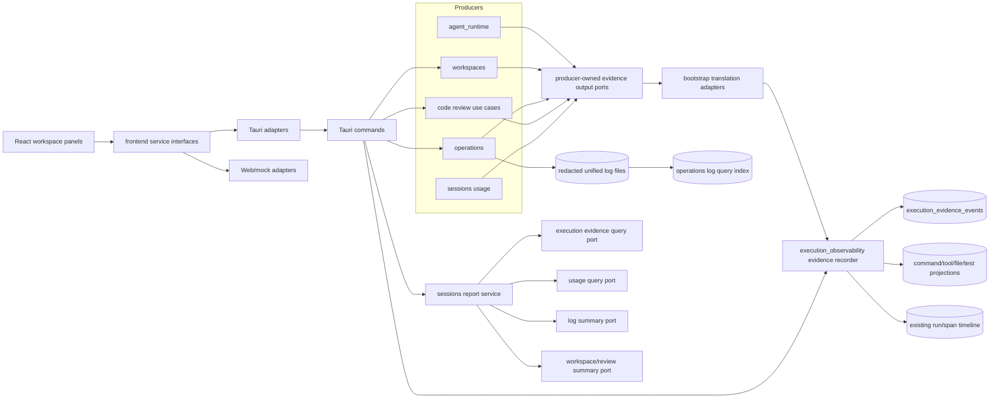
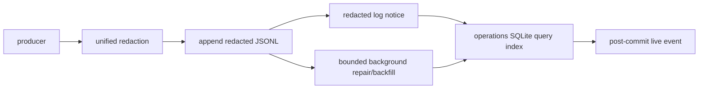

## Context

VaneHub AI has already implemented most of the visible Session Workspace surfaces and several strong backend primitives:

- `execution_observability` persists execution runs, traces, spans, events, fidelity, and optional OTLP export.
- `workspaces` owns bounded file/Git inspection and local/remote Session Shell creation.
- `operations` and `platform::logging` own unified redacted diagnostics and operation logs.
- `sessions` owns messages and usage accounting read models.
- Review Center persists Review Sessions, comments, findings, review decisions, and guarded revert witnesses.
- React workspace tabs are lazy loaded and visited tabs remain mounted.

The missing layer is not another telemetry system. It is a local, metadata-only evidence journal and query contract that makes existing facts correlatable and makes missing evidence explicit. The design deliberately keeps each business capability in its current bounded context and introduces narrow cross-context projections instead of a new cross-cutting context.

Industry patterns used as design anchors:

- OpenTelemetry Trace Context and log correlation for run/trace/span links and explicit semantic conventions.
- VS Code Terminal Shell Integration for command boundaries, duration/exit state, command navigation, and retained terminal presentation.
- GitHub pull-request review for per-file Viewed progress and separation of review decisions from repository mutations.
- OpenHands event streams and remote runtime boundaries for consistent command/file/event contracts across local and remote execution.

## Goals / Non-Goals

### Goals

- Make every workspace number and status traceable to a bounded evidence source with explicit fidelity and coverage.
- Correct existing hunk-decision, seat-scope, Shell capability, Shell lifecycle, log pagination, and report-source defects before adding presentation features.
- Preserve the existing React service boundary, Tauri/Web adapter split, Rust bounded-context map, SQLite ownership rules, unified logging, and OpenTelemetry privacy defaults.
- Make local and remote read-only workspace inspection use the same frontend contract.
- Keep loaded UI content visible during refresh, reconnect, indexing, and pagination failures.
- Allow implementation in independently testable vertical slices without a flag day migration.

### Non-Goals

The proposal lists product non-goals. Architecturally, this change also does not create a generic event bus, shared generic repository, Redux/Zustand store, direct React-to-Tauri calls, raw telemetry replay store, or a second source of truth for usage, Git, logs, traces, or reviews.

## Current-State Defects to Correct First

1. `ShellCapability` accepts only `native | simulated` in TypeScript while Rust returns `remote` for remote sessions.
2. `selectedSeat` exists in the workspace shell but is not consistently passed to seat-scoped tab queries.
3. Shell component cleanup invokes the close/kill operation instead of a detach operation.
4. Review hunk Accept calls the review-level decision service method.
5. Log pages use integer offsets over a changing newest-first scan and do not describe searchable-corpus coverage.
6. A load-more log failure can replace already loaded rows with an error surface.
7. Terminal History and Report derive from loaded messages rather than a durable execution read model.
8. Trace stage presentation infers kinds from span-name substrings.
9. Remote Sessions can have an SSH Shell but the file/document/Git inspection root resolver returns unavailable.

Task Group 1 fixes these contracts or introduces failing tests before any broad UI rewrite.

## Architecture Overview



### Ownership Rules

| Concern | Owning context/layer | Notes |
| --- | --- | --- |
| Runs, spans, evidence journal, evidence projections | `execution_observability` | Metadata-only; no raw prompt/tool/terminal content |
| Session-run report and usage-quality composition | `sessions` | Usage remains a sessions read model |
| Redacted log persistence/rotation | `platform::logging` | Existing ownership unchanged |
| Log query index, coverage, live query publication | `operations` | Rebuildable from redacted unified logs |
| File/Git inspection and Session Shell lifecycle | `workspaces` | Local and SSH providers behind application ports |
| SSH authentication, host trust, transport pool | `ssh_connections` | Exposed only through its published API |
| Review aggregate, hunk/file decision state | Existing review owner | Uses `workspaces` for witnessed Git data |
| Cross-context wiring | `bootstrap` | Adapters translate producer events and query ports |
| UI state | React Context/local state/React Query | No new global state manager |

No context may import another context's repository, infrastructure type, or private aggregate.

## Frontend Runtime Boundary

### Service Shape

Do not grow `AgentService` into an unstructured implementation file. The public application service may compose narrower interfaces while retaining the existing top-level injection pattern.

```ts
export interface SessionWorkspaceEvidenceService {
  getWorkspaceEvidenceSummary(
    input: WorkspaceEvidenceSummaryQuery,
  ): Promise<WorkspaceEvidenceSummary>;

  listExecutionRecords(
    input: ExecutionRecordQuery,
  ): Promise<CursorPage<ExecutionRecord>>;

  getExecutionRecord(
    input: ExecutionRecordDetailQuery,
  ): Promise<ExecutionRecordDetail>;

  subscribeExecutionEvidence(
    input: ExecutionEvidenceSubscription,
    listener: (event: ExecutionEvidenceNotice) => void,
  ): Promise<Unsubscribe>;

  getSessionRunReport(
    input: SessionRunReportQuery,
  ): Promise<SessionRunReport>;
}
```

Recommended files:

```text
src/types/session-workspace-evidence.ts
src/services/session-workspace-evidence-service.ts
src/services/tauri-session-workspace-evidence-client.ts
src/services/web-session-workspace-evidence-client.ts
src/session-workspace/workspace-evidence-scope.tsx
src/session-workspace/workspace-evidence-navigation.ts
src/session-workspace/evidence-query-keys.ts
```

`agent-service.ts` may extend or expose this interface, but React imports the interface, not the Tauri client. The Tauri client owns `invoke()` and native event listeners. The Web client owns deterministic in-memory fixtures and timers.

### Staged Native Adapter Activation

The frontend contract is defined before the commands it will eventually call exist. That ordering
is deliberate — it lets the DTOs, schemas, and Web/mock behaviour be settled and tested while the
native work is still ahead — but it creates one hazard: an adapter method that invokes a command
the registry does not contain. Tauri answers an unregistered command with an opaque framework
error, so the panel would show a generic failure that looks like a runtime fault rather than an
unimplemented capability, and the conformance suite would be testing a call that cannot succeed.

Activation is therefore staged, and the stage is a property of the binding rather than of the
method signature:

| Stage | Task | Evidence methods | Report methods |
| --- | --- | --- | --- |
| Contract | Group 2 | Implemented against an injected transport; the production binding returns a typed unavailable reason code. Conformance runs against the fixture transport and Web/mock. | Same. |
| Evidence activation | 3.15 | Commands registered; the production binding invokes them and the existing conformance cases re-run against native results. | Still typed unavailable. |
| Report activation | 10.8 | Already active. | Command registered; the production binding invokes it and the existing conformance cases re-run against native results. |

The Tauri client takes a `NativeEvidenceTransport` by injection. Fixture transports supply
recorded payloads, the production transport wraps `invoke()` and the native event API, and the
unavailable binding answers with a stable reason code instead of a framework error. React depends
on the service interface throughout and never observes which transport is bound.

Two consequences are normative. A method SHALL NOT invoke a command before the task that registers
it. Activation SHALL be proven by re-running the conformance cases written in Group 2, not by
cases authored afterwards, so the wire shape the native side produces is checked against the shape
the frontend already committed to.

### Contract Validation

Add Zod schemas at the transport boundary for new discriminated unions and opaque cursors. Contract-conformance tests SHALL execute the same fixture suite against Tauri serialization fixtures and Web/mock results.

## Canonical Workspace Evidence Scope

One serializable scope object is the only cross-panel selection contract:

```ts
export interface WorkspaceEvidenceScope {
  sessionId: string;
  seatId?: string;
  runId?: string;
  traceId?: string;
  spanId?: string;
  operationId?: string;
  commandId?: string;
  relativePath?: string;
  hunkFingerprint?: string;
  occurredAt?: string;
}

export interface WorkspaceEvidenceTarget {
  tab:
    | "terminal"
    | "shell"
    | "logs"
    | "traces"
    | "changes"
    | "files"
    | "documents"
    | "report";
  scope: WorkspaceEvidenceScope;
  focus?: "row" | "detail" | "filter" | "timestamp";
}
```

`WorkspaceEvidenceScopeProvider` is mounted once inside the selected Session Workspace. It exposes:

```ts
interface WorkspaceEvidenceNavigation {
  scope: WorkspaceEvidenceScope;
  patchScope(patch: Partial<WorkspaceEvidenceScope>): void;
  clearScope(keys: Array<keyof WorkspaceEvidenceScope>): void;
  navigate(target: WorkspaceEvidenceTarget): void;
}
```

`navigate()` updates the active tab and scope atomically. Panels consume only the fields they support and show an explicit unsupported-filter notice rather than silently ignoring a target.

### Seat Scope Rules

- Chat, Changes, Documents, Files, Traces, and Report are session-scoped by default.
- Terminal History and Logs support `all seats` or one seat.
- Shell requires one concrete seat for a multi-Agent session because one interactive channel has one runtime owner.
- The global seat switcher renders only when the active tab declares `seatMode: optional | required`.
- Traces and Report may expose their own optional Seat filter without being changed by a hidden global selector.

```ts
interface WorkspaceTabCapability {
  id: WorkspaceTabId;
  seatMode: "none" | "optional" | "required";
  supportsLive: boolean;
  retention: "unmount" | "keep-state" | "keep-live";
}
```

## Execution Evidence Journal

### Purpose

The journal links existing facts; it does not replace the trace, log, usage, Git, terminal-output, or review stores. It is append-only, bounded, redacted, and locally queryable even when OTLP is disabled.

### Domain Model

```rust
pub struct ExecutionEvidenceEvent {
    pub event_id: EvidenceEventId,
    pub source_context: EvidenceSourceContext,
    pub source_event_id: SourceEventId,
    pub schema_version: u16,
    pub occurred_at: DateTime<Utc>,
    pub correlation: EvidenceCorrelation,
    pub kind: EvidenceKind,
    pub status: Option<EvidenceStatus>,
    pub fidelity: ObservationFidelity,
    pub payload: SafeEvidencePayload,
    pub redaction: RedactionReceipt,
}

pub struct EvidenceCorrelation {
    pub session_id: SessionId,
    pub run_id: Option<RunId>,
    pub trace_id: Option<TraceId>,
    pub span_id: Option<SpanId>,
    pub parent_span_id: Option<SpanId>,
    pub operation_id: Option<OperationId>,
    pub agent_id: Option<AgentId>,
    pub seat_id: Option<SeatId>,
    pub tool_call_id: Option<ToolCallId>,
    pub command_id: Option<CommandId>,
    pub file_mutation_id: Option<FileMutationId>,
}
```

Initial event kinds:

```text
run.started                 run.completed
agent.delegated             agent.completed
tool.started                tool.completed
command.started             command.completed
shell.opened                shell.closed
file.mutation.observed      review.decision.recorded
verification.completed      usage.observed
operation.failed            coverage.gap.recorded
```

Do not add a generic `custom` kind. A new semantic kind requires a versioned payload enum and tests.

### Safe Payload Rules

A payload is an allowlisted enum. It MAY contain bounded counts, durations, exit code, signal classification, stable ids, relative-path fingerprint, normalized basename, file status, severity, test counts, usage-quality category, output-availability flag, and safe reason codes. It MUST NOT contain:

- raw prompts or responses;
- raw tool/MCP arguments or results;
- unrestricted command arguments;
- full terminal output;
- credentials, headers, environment values, or private keys;
- absolute user paths;
- source code, full diffs, review prose, or test output.

A locally displayed redacted command summary is stored in the command projection, not in trace attributes, journal payload JSON exported through OTLP, or unified diagnostic logs.

### Idempotent Ingestion

Every producer supplies a stable `(source_context, source_event_id)`. The repository uses a unique constraint and treats a duplicate with identical normalized content as success. A duplicate with conflicting content is rejected, records a rate-limited diagnostic, and marks evidence coverage partial for the affected run.

Producer success does not depend on evidence success. Producers publish through a bounded non-blocking output port. Queue overflow or persistence failure increments a safe gap counter and eventually emits one `coverage.gap.recorded` event when recording recovers.

### SQLite Schema

Schema names may be adjusted to existing migration conventions, but ownership and fields are normative.

```sql
CREATE TABLE execution_evidence_events (
  sequence INTEGER PRIMARY KEY AUTOINCREMENT,
  event_id TEXT NOT NULL UNIQUE,
  source_context TEXT NOT NULL,
  source_event_id TEXT NOT NULL,
  schema_version INTEGER NOT NULL,
  session_id TEXT NOT NULL,
  run_id TEXT,
  trace_id TEXT,
  span_id TEXT,
  parent_span_id TEXT,
  operation_id TEXT,
  agent_id TEXT,
  seat_id TEXT,
  tool_call_id TEXT,
  command_id TEXT,
  file_mutation_id TEXT,
  kind TEXT NOT NULL,
  status TEXT,
  fidelity TEXT NOT NULL,
  occurred_at_ms INTEGER NOT NULL,
  safe_payload_json TEXT NOT NULL,
  redaction_applied INTEGER NOT NULL,
  redaction_rule_ids_json TEXT NOT NULL,
  created_at_ms INTEGER NOT NULL,
  UNIQUE(source_context, source_event_id)
);

CREATE INDEX idx_execution_evidence_session_sequence
  ON execution_evidence_events(session_id, sequence DESC);
CREATE INDEX idx_execution_evidence_run_sequence
  ON execution_evidence_events(run_id, sequence DESC);
CREATE INDEX idx_execution_evidence_trace_span
  ON execution_evidence_events(trace_id, span_id, sequence);
CREATE INDEX idx_execution_evidence_operation
  ON execution_evidence_events(operation_id, sequence);
```

Projection tables:

```sql
CREATE TABLE execution_command_projection (
  command_id TEXT PRIMARY KEY,
  session_id TEXT NOT NULL,
  run_id TEXT,
  trace_id TEXT,
  span_id TEXT,
  operation_id TEXT,
  agent_id TEXT,
  seat_id TEXT,
  runtime_kind TEXT NOT NULL,
  command_kind TEXT NOT NULL,
  redacted_display TEXT,
  cwd_display TEXT,
  started_at_ms INTEGER NOT NULL,
  ended_at_ms INTEGER,
  duration_ms INTEGER,
  exit_code INTEGER,
  signal TEXT,
  status TEXT NOT NULL,
  fidelity TEXT NOT NULL,
  stdout_ref TEXT,
  stderr_ref TEXT,
  output_availability TEXT NOT NULL,
  output_truncated INTEGER NOT NULL,
  last_sequence INTEGER NOT NULL
);

CREATE INDEX idx_command_projection_session_start
  ON execution_command_projection(session_id, started_at_ms DESC, command_id DESC);
CREATE INDEX idx_command_projection_run_start
  ON execution_command_projection(run_id, started_at_ms, command_id);
```

File/test/review summaries may use dedicated projection tables or one typed summary table. Do not query raw event JSON repeatedly for page rendering.

### Transaction Boundary

One repository transaction SHALL:

1. validate and insert a new journal event;
2. update the affected projection with monotonic `last_sequence` protection;
3. update coverage/gap metadata;
4. commit;
5. publish a Tauri/Web evidence notice after commit.

A failed projection update rolls back the event insert. Replaying events can rebuild projections deterministically.

## Producer Integration

Each producer context owns a narrow semantic output port. Example:

```rust
#[async_trait]
pub trait WorkspaceEvidencePublisher: Send + Sync {
    async fn publish(&self, event: WorkspaceEvidenceEvent) -> Result<(), PublishError>;
}
```

The workspaces domain does not know `ExecutionEvidenceEvent`. A bootstrap adapter maps `WorkspaceEvidenceEvent` to the public `execution_observability::api::RecordEvidenceInput`.

Initial producers:

- Agent runtime: run and observable tool/delegation lifecycle.
- Workspaces Shell: Shell lifecycle and structured command boundaries when available.
- Workspaces inspection: observed file mutation summaries after trusted operations or snapshot comparison.
- Operations: terminal operation failures and coverage gaps; logs remain in the log store and are linked by ids.
- Review: review/hunk decisions and automated finding outcomes.
- Sessions: normalized usage-observed references, not duplicate usage totals.

### Why the Bridge Lands Before the Query Side Is Signed Off

The query side (3.13-3.15) is built first because the panels depend on it, but a journal with no
producer is not a half-finished capability -- it is an unreachable one. Nothing in the library
build calls the recorder, so the whole write half is dead code: the recorder, its six ports, the
notice publisher, the redaction gate, the canonical encoding, the projection writer, and the
conflict path. `cargo clippy --workspace --all-targets -- -D warnings` reports every one of them.

That report is correct. Silencing it with `#[allow(dead_code)]` would hide the one signal that
distinguishes "the store is finished" from "the store has never been written to", and the two are
indistinguishable from the query side: both answer an empty page. Recording a synthetic startup
event would be worse -- once persisted, an event minted to satisfy a linter is indistinguishable
from an observation of real work, which is the exact confusion this capability exists to remove.
Making the recorder `pub` would assert that it is consumed outside the crate, which is false.

So the bridge -- ports (4.1), bootstrap adapters (4.2), bounded queue (4.3) -- lands before
3.13-3.15 are signed off, and all six are ticked together. The exception is scoped to those three
tasks: 4.4-4.11 govern which events each producer records and how completely, which is a different
question from whether a path exists at all.

### Bridge Shape

```text
producer use case  --try_publish(semantic DTO)-->  sender-backed port  --try_send-->  bounded queue
                                                                                          |
bootstrap adapter  <--maps DTO to RecordEvidenceInput--  queue worker  <--recv------------+
        |
        +--> execution_observability::api::ExecutionEvidenceApi::record
```

Four properties are normative:

- `try_publish` SHALL be synchronous and non-blocking. A producer never awaits the journal.
- A full queue, an unavailable recorder, and a failed append SHALL all leave the owning operation's
  result unchanged. Evidence describes work; it does not gate it.
- A full queue SHALL update a bounded drop accumulator and one rate-limited diagnostic, and SHALL
  NOT re-enter the evidence path to report itself.
- Only allowlisted, bounded values SHALL enter the queue. A raw producer object crossing that
  boundary would make the queue a second place where unredacted content lives.

### Correlation Counts Are Part of the Record Detail Read

A record's related counts are computed in the same store read that produced the record, not by a
second query a caller issues afterwards. Two reads would let the record and its counts describe
different moments, and a detail panel showing a failed command beside a count taken after the next
three finished is worse than showing no count -- the reader has no way to know the two disagree.

The counts are also scoped to what this context owns. `commands`, `files`, and `usageObservations`
come from its own tables. `logs` and `findings` belong to other contexts, so they read as zero next
to a coverage state that names them: a review finding is an unresolved comment, and filling that
field with a verification count would put a plausible number where the honest answer is "not
observed from here".

### Source Event Identity

Idempotency rides on `(source_context, source_event_id)`. The journal has no session of its own in
that key, so every id below carries whatever it needs to be unique inside its context -- including
the session, wherever two sessions could otherwise produce the same string.

Two failures follow from getting an id wrong, and they are opposite. Too coarse and a genuine new
observation arrives as a conflicting duplicate: the original row wins and the new state is lost, so
a review decided twice reads as decided once. Too fine and a replay becomes a second event: a
retried callback doubles a count nobody can then correct.

| Event | Authoritative identity | Retry identity | Revision axis | Unique because | Replay converges | New event required |
| --- | --- | --- | --- | --- | --- | --- |
| Run started/finished | `run-{started,finished}:{runId}` | same id | none -- a run starts once | run ids are UUIDs minted per run | duplicated start or finish | a second run is a second id |
| Tool started/finished | `tool-{started,finished}:{callId}[:{attempt}]` | same id | `attempt` | provider call ids are unique within a run, attempts within a call | re-delivered lifecycle, resume, restart replay | each attempt |
| Delegation started/finished | `delegation-{started,finished}:{delegationId}[:{attempt}]` | same id | `attempt` | delegation ids are minted per hand-off | re-delivered lifecycle | each attempt |
| Shell opened/closed | `shell-{opened,closed}:{shellId}` | same id | none -- a shell opens and closes once | shell ids are minted per shell | repeated close, shutdown racing an explicit stop | a new shell is a new id |
| File mutation | `file-mutated:{sessionId}:{pathFingerprint}:{revision}` where revision folds change kind and witness | same id | the witness: change kind, moment, observation ordinal | the digest covers workspace and relative path, the session separates two workspaces' identical paths, the ordinal separates two writes inside one clock tick | an exact duplicate of one observation | every write |
| Operation failure | `operation-failed:{operationId}` | same id | none | operation ids are minted per operation | a retried failure report | a new operation |
| Review decision | `review-decision:{reviewId}:{revision}` where revision folds witness, decision, and the review's `updated_at` | same id | the review's own `updated_at`, saved before the signal is published | one review, one snapshot, one verdict, one moment | a replay of one transition | every `set_decision`, including a verdict the reviewer returns to |
| Verification | `verification:{operationId}` | same id | the operation | `start_action` mints one operation per action, so one operation is one verification run | a re-reported result | re-running the check mints a new operation |
| Usage observed | `usage-observed:{invocationId}` | same id | none | invocation ids are minted per model call | a re-reported observation | a new invocation |
| Coverage gap | `coverage-gap:{sessionId}:{reason}:{bridgeInstanceId}:{generation}` | same instance and generation | generation, inside a runtime namespace | the generation is assigned once per accumulation; the instance is 64 random bits minted per bridge bootstrap | a retry after an ambiguous marker write | every new accumulation, in every runtime |

Every id above is built through one bounded builder rather than by formatting a string. A source
event id is capped at 128 characters, and several of the parts are the producer's: a tool call id,
a delegation id, and a model invocation id are all bounded only by that same cap, so a prefix, a
separator, and an attempt are enough to push a legal id past it. When that happened the journal
refused the write, the bridge counted the signal as unmappable, and the console showed a coverage
gap where a tool call should have been.

The builder keeps the readable form whenever it fits, because that form is what is already stored —
changing the shape of an id that fits would make every retry of an older event look like a new one.
Past the cap the parts fold into `{namespace}:v1:{sha256}`, with each part length-prefixed so two
part lists that concatenate identically cannot fold into one digest. Nothing is truncated: a
truncated id is a shorter id that two events can share, which trades a refused write for a silent
collision. The namespace carries the kind and the phase, the parts carry the authoritative id and
the attempt, and the whole thing is a pure function of its inputs — so a retry converges and two
attempts, phases, or events stay distinct. A part list that still cannot produce a valid id yields
no event and one honest coverage gap, exactly as before.

Three of these were wrong when first written and are corrected here. Two more were found by
auditing what the corrections had left, and are corrected below them.

`review-decision` keyed only on review and witness. A reviewer who accepts and then asks for
changes on the same diff has made two decisions, and the second would have arrived as a conflict --
the journal would have kept the acceptance and refused the change. The verdict is now part of the
identity, which also leaves re-asserting the same verdict as the replay it actually is.

`file-mutated` keyed on a path digest with no workspace or session in it. Two sessions editing
`src/main.rs` in different workspaces produced the same string, and the second was filed as a
replay of the first. The digest now covers the workspace, the id carries the session, and the
witness carries the moment so that two writes to one file are two observations.

A source event id is bounded at 128 characters, and the corrected `review-decision` id depended on
lengths chosen in another context: a review's snapshot fingerprint is a full SHA-256 hex and the
review id is a UUID, so the id reached 126 characters for `accepted` and 135 for
`changes_requested`. The journal refused the longer one, the bridge counted it as an unmappable
signal, and the console recorded reviewers approving work while silently never recording them
rejecting it. The variable parts now fold into a fixed-width revision, so the id's validity no
longer depends on how long someone else's fingerprint is.

Keying `review-decision` on the decision value also made it a state identity rather than a
transition one. A reviewer who accepts, retracts, and accepts again on one snapshot has made three
decisions, and the third arrived with the first's id. The review's own `updated_at` — saved before
the signal is published, and therefore stable across a replay — is now part of the revision, which
makes every `set_decision` its own event while a redelivered one still converges.

`file-mutated` witnessed itself with a clock reading, and a clock has a resolution. Two writes to
one file inside one tick produced one witness, so the second was filed as a replay of the first and
the file's second change was never recorded. The fanout is the single point every successful
mutation passes through, so its own observation ordinal joins the witness: two writes are two
events structurally, not probabilistically. The ordinal needs no cross-restart namespace, because
the moment already supplies that axis.

`coverage-gap` keyed on its count. Two gaps of the same size collided, and because the content
fingerprint includes the occurrence time the journal recorded a conflict rather than a second gap:
a session that lost evidence twice reported losing it once. A generation assigned per accumulation
replaces the count, so a retry converges and two equal-sized gaps stay distinct.

The generation alone was not enough. It is a process counter, so the first batch after a restart is
generation one again and collides with the first batch of the run before it — the same conflict,
across the boundary the journal is there to survive. A runtime namespace, minted once per bridge
bootstrap, prefixes it. The namespace is sixty-four random bits and nothing else: it is written
into a durable journal, so it carries no user, no machine, no path, and no start time. It is not a
whole UUID either, because the source event id has a 128-character bound the session, the reason
code, and the generation already share.

### Review Evidence Lands in Two Stages

Group 4 records what the review context can already observe: a review-level decision and an
automated verification outcome. Both have an authoritative row to point at the moment they are
published.

Hunk decisions and file Viewed state do not. Their store arrives in 13.1, and until it does the
only way to report them would be to derive them from review-level state -- a review accepted means
every hunk accepted, a file rendered means a file viewed. Both inferences are wrong often enough to
matter, and once written, a derived observation is indistinguishable from an observed one. So they
are deferred to 13.2 and 13.5, which publish immediately after their own commit.

The contract is settled here so those tasks publish against a fixed shape rather than inventing
one. Each is a reference plus a witness, never the content of what was decided:

| Signal | Published by | Correlation | Payload |
| --- | --- | --- | --- |
| Review decision | 4.7 | session, review id | decision value, snapshot witness fingerprint |
| Verification outcome | 4.7 | session, run, verification run id | outcome, passed/failed counts |
| Hunk decision | 13.2 | session, review id, file basename | decision value, hunk fingerprint, snapshot witness |
| File Viewed | 13.5 | session, review id, file basename | viewed or reset, snapshot witness |

Three rules apply to all four. The comment prose, the finding text, the diff, the patch, the source
line, and the absolute path never cross -- a review evidence record says a decision was made about
an identified thing, not what the thing said. The witness fingerprint travels with the decision, so
a reader can tell a decision about the current snapshot from one about a snapshot that has since
changed. And publication follows the authoritative commit, because a decision reported before it
persists can be rolled back into a record of something that never happened.

### Startup Projection Replay Is Repair-If-Needed

A projection is a cache of the journal, so it can always be rebuilt -- but rebuilding one that
already agrees with the journal produces the same rows at the cost of a full scan on every launch.
Replay SHALL therefore run only when the projection cannot be trusted: the journal's lifecycle
watermark is ahead of the projection's, the projection is missing, or a previous rebuild did not
finish. While a replay runs, coverage SHALL report `indexing` with
`evidence_projection_rebuilding`, and the watermark SHALL advance only on completion, so an
interrupted rebuild is retried rather than recorded as done.

A replay call SHALL NOT be introduced to give the replay code a caller. That is the same fake
wiring the note above forbids, and it would put a full journal scan on the startup path to do it.

## Execution Record Projection

### Record Types

```ts
export type ExecutionRecord =
  | CommandExecutionRecord
  | ToolExecutionRecord
  | DelegationExecutionRecord
  | VerificationExecutionRecord
  | LegacyActivityRecord;
```

Common fields:

```ts
interface ExecutionRecordBase {
  id: string;
  kind: "command" | "tool" | "delegation" | "verification" | "legacy";
  sessionId: string;
  runId?: string;
  traceId?: string;
  spanId?: string;
  operationId?: string;
  agentId?: string;
  seatId?: string;
  /**
   * Optional, because a runtime can observe a completion without ever observing the start. The
   * field is omitted in that case rather than derived: `endedAt`, `durationMs`, and the event's
   * occurrence time are all available to subtract from, and every one of them would manufacture
   * an observation nobody made. The record keeps its real terminal status and its coverage says
   * `evidence_start_not_observed`.
   */
  startedAt?: string;
  endedAt?: string;
  durationMs?: number;
  status: "queued" | "running" | "succeeded" | "failed" | "cancelled" | "incomplete";
  fidelity: "native" | "proxied" | "inferred" | "opaque";
  coverage: EvidenceCoverage;
}
```

Command-specific fields include runtime kind, bounded redacted display, working-directory display, exit code, signal, output availability, truncation, and output references. The UI SHALL not claim stdout/stderr when only merged PTY output is available.

### Legacy Activity

Historical `message.toolUse` data remains queryable through an adapter:

- record kind is `legacy` or `tool` with `source: message-history`;
- fidelity is `inferred` unless the message contains a verified native id;
- coverage states that only loaded/persisted message activity is available;
- it is never inserted into the journal as if it were native evidence.

## Stable Cursor and Coverage Contract

All append-heavy lists use opaque keyset cursors. Frontend code treats the cursor as an opaque string.

```ts
interface CursorPage<T> {
  items: T[];
  nextCursor?: string;
  coverage: QueryCoverage;
}

interface QueryCoverage {
  state: "complete" | "indexing" | "partial" | "unavailable";
  reasonCodes: string[];
  oldestAvailableAt?: string;
  newestAvailableAt?: string;
  indexedThroughAt?: string;
  droppedCount?: number;
  truncated: boolean;
}
```

A cursor encodes a version plus `(occurred_at_ms, sequence, id)` and query fingerprint. The backend rejects a cursor used with different filters instead of returning a shifted page.

## Session Log Query Index

### Ownership and Data Flow



The redacted log file remains the durable source for export and repair. The query index is rebuildable and stores only already-redacted fields.

```sql
CREATE TABLE unified_log_query_index (
  sequence INTEGER PRIMARY KEY AUTOINCREMENT,
  record_id TEXT NOT NULL UNIQUE,
  source_file_id TEXT NOT NULL,
  source_offset INTEGER NOT NULL,
  occurred_at_ms INTEGER NOT NULL,
  level TEXT NOT NULL,
  category TEXT NOT NULL,
  message TEXT NOT NULL,
  safe_context_json TEXT NOT NULL,
  session_id TEXT,
  run_id TEXT,
  trace_id TEXT,
  span_id TEXT,
  operation_id TEXT,
  agent_id TEXT,
  seat_id TEXT,
  redaction_applied INTEGER NOT NULL
);

CREATE INDEX idx_log_session_time
  ON unified_log_query_index(session_id, occurred_at_ms DESC, sequence DESC);
CREATE INDEX idx_log_trace_time
  ON unified_log_query_index(trace_id, occurred_at_ms, sequence);
CREATE INDEX idx_log_operation_time
  ON unified_log_query_index(operation_id, occurred_at_ms, sequence);
```

Use an FTS5 companion table only if the existing bundled SQLite build and migration tests support it. Otherwise use bounded indexed candidate filtering plus case-insensitive matching. Do not add an unbounded LIKE scan over all logs.

### Two Stores, One Authority

The redacted JSONL files are the durable record. The SQLite table above is a projection built from them, and it can be deleted and rebuilt at any time without losing anything. That asymmetry is what the whole design rests on, so it is stated rather than implied:

- **Export always reads the files.** An export served from the index would hand the user whatever the index happened to contain — a subset during repair, a stale set after a directory change — under a name that promises the log. The index is never the export authority.
- **Repair always reads the files.** The index cannot repair itself from itself.
- **Interactive queries always read the index, and only the index.** Once the migration lands there is no production fallback to scanning log files for a query. A fallback would be a second query implementation with different filters, different bounds and different coverage semantics, reached only when the first one failed — which is exactly when a reader is least able to tell which one answered.
- **Index failure never changes the result of appending a log.** The file append has already succeeded; letting a projection's back-pressure fail it would make observation a precondition of the thing observed.

### Record Identity

A record's id has to survive a retry, a restart, and a backfill, because all three can present the same durable line to the index again. Two sources of identity, one shape:

- **Records written from now on carry their own id**, assigned before the durable append and written into the JSONL line. The live notice, an index retry, and a later backfill of the same line all use that one id, so idempotency is a primary-key conflict rather than a guess.
- **Records written before the id existed get a deterministic legacy id**, derived from the source-file identity, the byte offset of the line, and a fingerprint of the already-redacted line. Deriving it the same way twice gives the same id, which is what lets repair run more than once over the same file without duplicating rows.

A timestamp plus a message is not an identity. Two records can share both — a retry loop logging the same failure inside one millisecond is the ordinary case, not a contrived one — and collapsing them would silently drop one.

### Source File Identity

A path is not an identity. Three different things happen to a log file, and a path cannot tell them apart:

- **Rotation** renames the file. The records in it are the same records, so the source keeps its identity and the new active file gets a new one. Treating the renamed file as new would re-index everything it holds.
- **Truncation or recreation** reuses the path for different content. The old checkpoint's byte offsets now point into unrelated bytes, so the recreated file is a new *generation* and its offsets start again. Reusing the old generation would resume mid-file into content that was never there.
- **A configured directory change** replaces the corpus. Checkpoints from the old directory do not attach to the new one, and rows indexed from the old directory do not let the new one claim complete coverage.

So the identity is a generation: the file's own witness (inode/file-id where available, plus a size and content witness of its head) rather than its name, scoped to the directory generation it was found in.

### Live Reconciliation

The notice carries identifiers, a sequence, correlation and coverage metadata. It does not carry the log line. A view that wants the row fetches it by record id, which keeps one authoritative shape for a row instead of two that can disagree, and keeps the event bus from carrying the corpus.

Subscribe first, then read the watermark. Reading first and subscribing after loses every notice published in between, and the sequences the subscriber then sees are contiguous — so nothing downstream can tell that anything was missed.

A view inserts a live row locally only when it can evaluate its current filters against that row itself. When it cannot — a text search, a filter the notice does not carry — it invalidates the first page instead. Guessing would either show a row the filter excludes or hide one it admits, and both look like the filter is broken.

### Search Bounds

Candidate matching is capped. When the cap is reached the answer is `partial` and `truncated`, never "complete, no match": a search that scanned the first N candidates and found nothing has not established that nothing matches, and reporting it as a definitive empty result is the same class of false claim as a coverage zero.

### Index Coverage

Persist checkpoints per source file identity, size/hash witness, and byte offset. Rotation, truncation, deletion, or configured log-directory change invalidates only affected checkpoints. Query responses report:

- `complete`: all retained source records for the query scope are indexed;
- `indexing`: a bounded repair job is active;
- `partial`: source records are known to be unavailable or a gap occurred;
- `unavailable`: index service cannot answer safely.

Index failure never blocks producer log persistence.

### Live Tail

After an indexed log transaction commits, the Tauri adapter publishes a metadata-bounded `session-log-appended` notice. The Logs tab inserts a matching row only when its current filter can be evaluated locally; otherwise it invalidates the first page. A bounded subscriber queue emits one gap notice when rows are dropped.

## Session Shell Lifecycle

### Separate Session Shell from Agent Terminal

This change modifies the Shell workspace tab and `workspaces` Shell lifecycle. It does not replace the existing provider-facing Agent Terminal runtime.

### Runtime Descriptor

```ts
export type ShellRuntimeDescriptor =
  | {
      kind: "native";
      supportsResize: true;
      supportsReplay: true;
      supportsReconnect: false;
    }
  | {
      kind: "remote";
      connectionId: string;
      profileRevision: number;
      supportsResize: true;
      supportsReplay: true;
      supportsReconnect: boolean;
    }
  | {
      kind: "simulated";
      supportsResize: false;
      supportsReplay: true;
      supportsReconnect: false;
    }
  | {
      kind: "unavailable";
      reasonCode: string;
      remediation?: string;
    };
```

### Native Registry

```rust
pub struct SessionShellDescriptor {
    pub shell_id: ShellId,
    pub session_id: SessionId,
    pub seat_id: Option<SeatId>,
    pub title: String,
    pub runtime: ShellRuntimeDescriptor,
    pub state: ShellState,
    pub created_at: DateTime<Utc>,
    pub last_activity_at: DateTime<Utc>,
}
```

Registry operations:

```text
list_session_shells
create_session_shell
attach_session_shell
detach_session_shell
write_session_shell
resize_session_shell
rename_session_shell
close_session_shell
```

Existing create/kill commands may delegate to the new service during migration, but React uses attach/detach/close semantics after Task Group 6.

### Replay Protocol

```ts
interface ShellOutputFrame {
  shellId: string;
  sequence: number;
  occurredAt: string;
  stream: "pty" | "stdout" | "stderr" | "system";
  data: string;
}

interface ShellAttachSnapshot {
  attachmentId: string;
  descriptor: SessionShellDescriptor;
  replay: ShellOutputFrame[];
  nextSequence: number;
  gap?: { fromSequence: number; toSequence: number; reason: string };
}
```

The native registry retains UTF-8-safe chunks up to 1 MiB per Shell. Eviction inserts one replay gap marker. Component cleanup calls detach; explicit close terminates the process/channel. Inactive Shells close after the configured idle window and all Shells close on application shutdown.

Input and resize errors are returned or published as state events; fire-and-forget calls must attach rejection handling and update UI state.

### Attachment Ownership

An attach returns a `ShellAttachmentId`, and `detach`, `write`, and `resize` carry it. Without one,
every one of those operations names only the Shell — and a React cleanup that runs after a newer
view has already attached would detach that newer view, or write into it, with nothing able to tell
the two apart. This is not a rare interleaving: it is what a hidden-then-visible tab does on every
switch, and what StrictMode does on every mount.

The registry holds at most one current attachment per Shell, so the rules are stated in terms of
"current":

- **Stale detach is an idempotent no-op.** A detach naming an attachment that is no longer current
  succeeds and changes nothing. Failing it would make a correct cleanup look like an error; honouring
  it would tear down the attachment that replaced it.
- **Stale write and resize are refused** with `shell_attachment_stale`. These are not idempotent —
  a write is input the user typed into a view that no longer exists, and delivering it would run it
  in a session the user is now looking at.
- **Attach never creates.** Attaching to a Shell that does not exist is a typed not-found, not an
  implicit create; a create that happened because a view mounted would spawn a process nobody asked
  for.
- **Attachments are not persisted.** They are in-memory ownership tokens for one view, and they do
  not survive an application restart. Neither do Shells: a retained Shell outlives a tab switch and a
  session switch, and nothing outlives the process. A replay offered after a restart would be replay
  of a process that no longer exists.

### Attach Ordering

The listener is registered before the attach request is sent, and frames arriving between those two
points are buffered rather than dropped. Attaching first and listening second loses every frame
emitted in the window, and loses it invisibly: the sequences the subscriber then sees are
contiguous, so nothing downstream can tell that a frame is missing.

The buffered frames are reconciled against the snapshot by `(shellId, sequence)`. A frame present in
both is one frame. `nextSequence` is exact — it is the sequence the next frame will carry, so a
subscriber that has consumed the snapshot can tell a gap from a race by comparing rather than
guessing.

Two counters, two meanings, and they are not interchangeable:

- **Output sequence** is per Shell, monotonic, and counts frames. It never resets while the Shell
  lives, and eviction advances the floor rather than the counter.
- **State revision** is per Shell, monotonic, and counts descriptor changes — state, title, runtime.
  A view compares revisions to decide whether a state notice is newer than what it holds, which a
  timestamp cannot do reliably when two changes land inside one clock tick.

### Bounds

Every structure named here has a stated ceiling, because each of them is fed by something outside
the registry's control:

| Structure | Bound |
| --- | --- |
| Retained replay | 1 MiB per Shell, whole frames evicted oldest first |
| Shells per session | configured capacity; creation fails typed rather than evicting |
| Shells per application | configured capacity, checked before per-session capacity |
| Attachments per Shell | one current attachment |
| Output notice | one bounded frame per event; replay never travels in an event |
| Input | bounded per write |
| Title | bounded length, validated on rename |
| Idle cleanup | bounded batch per sweep |
| Shutdown | bounded grace, then workers are joined or cancelled |

## Provider-Neutral Workspace Inspection

### Port

```rust
#[async_trait]
pub trait WorkspaceInspectionProvider: Send + Sync {
    async fn capabilities(
        &self,
        target: &WorkspaceTarget,
    ) -> Result<WorkspaceInspectionCapabilities, WorkspaceInspectionError>;

    async fn list_directory(
        &self,
        target: &WorkspaceTarget,
        request: ListDirectoryRequest,
    ) -> Result<CursorPage<FileEntry>, WorkspaceInspectionError>;

    async fn read_text_file(
        &self,
        target: &WorkspaceTarget,
        request: ReadTextFileRequest,
    ) -> Result<FilePreview, WorkspaceInspectionError>;

    async fn search(
        &self,
        target: &WorkspaceTarget,
        request: WorkspaceSearchRequest,
    ) -> Result<CursorPage<SearchMatch>, WorkspaceInspectionError>;

    async fn git_status(
        &self,
        target: &WorkspaceTarget,
    ) -> Result<GitStatusSnapshot, WorkspaceInspectionError>;

    async fn git_diff(
        &self,
        target: &WorkspaceTarget,
        request: GitDiffRequest,
    ) -> Result<StructuredDiff, WorkspaceInspectionError>;
}
```

`WorkspaceTarget` is resolved from the registered Session and is not accepted from arbitrary frontend absolute paths.

```rust
pub enum WorkspaceTarget {
    Local(LocalWorkspaceTarget),
    Remote(RemoteWorkspaceTarget),
}
```

### Capability Contract

```ts
interface WorkspaceInspectionCapabilities {
  provider: "local" | "ssh" | "simulated";
  listFiles: CapabilityState;
  readTextFiles: CapabilityState;
  searchFiles: CapabilityState;
  gitStatus: CapabilityState;
  gitDiff: CapabilityState;
  watchMode: "native" | "polling" | "event-derived" | "none";
}

interface CapabilityState {
  available: boolean;
  reasonCode?: string;
  remediation?: string;
}
```

### Local Provider

Reuse current canonical confinement, symlink rejection, UTF-8/binary/size bounds, Git locale pinning, and structured diff parsing. Add stable per-directory cursors and a change subscription. A local implementation may use a bounded filesystem watcher; watcher errors degrade to event-derived invalidation plus explicit refresh.

### SSH Provider

`workspaces` calls only `ssh_connections::api`. The first implementation uses a versioned static remote helper protocol over an authenticated exec channel:

- Probe a POSIX remote host and `python3` availability without sending credentials or user path content to logs.
- Execute a static `python3 -I -S -c <constant bootstrap>` command. User-controlled request data is sent as bounded JSON over stdin, not interpolated into the shell command.
- The helper resolves `realpath(root)` and `realpath(candidate)` on the remote host and rejects traversal/symlink escape before reading.
- It uses bounded `os.scandir`, bounded text reads, and argument-array `subprocess` calls for `git` or `rg`; it returns one length-bounded JSON response.
- Search is available only when the helper can use `rg --json` within declared limits; Git capabilities require a verified Git executable.
- The helper version, output limit, timeout, and capability result are explicit. Unsupported prerequisites return typed unavailability; the UI remains usable for Shell.
- No command is replayed automatically after disconnect. A retry reissues only idempotent inspection operations after current profile revision and host trust are revalidated.

The provider trait allows a future SFTP/native helper implementation without changing React or service DTOs.

### Invalidation

Local native watch, remote bounded polling, and execution-evidence file-mutation notices all produce normalized `WorkspaceInvalidationNotice` values. React Query invalidates only affected directory, file, document, status, diff, and review keys. A full tree reset is the fallback, not the default.

## Review Correctness and Workflow

### Separate Decisions

```ts
interface SetReviewDecisionInput {
  reviewId: string;
  decision: "pending" | "accepted" | "changes_requested";
  expectedReviewVersion: string;
}

interface SetHunkDecisionInput {
  reviewId: string;
  relativePath: string;
  hunkFingerprint: string;
  expectedSnapshotFingerprint: string;
  decision: "pending" | "accepted" | "changes_requested";
}
```

The review aggregate records them separately. A hunk mutation:

- verifies the Review Session and current snapshot;
- verifies the file and hunk fingerprint;
- upserts only the hunk decision row;
- leaves review decision, Git index, and working tree unchanged;
- returns `stale_witness` when the snapshot no longer matches.

Recommended additive tables:

```sql
CREATE TABLE review_hunk_decisions (
  review_id TEXT NOT NULL,
  relative_path TEXT NOT NULL,
  hunk_fingerprint TEXT NOT NULL,
  snapshot_fingerprint TEXT NOT NULL,
  decision TEXT NOT NULL,
  decided_at_ms INTEGER NOT NULL,
  PRIMARY KEY (review_id, relative_path, hunk_fingerprint)
);

CREATE TABLE review_file_states (
  review_id TEXT NOT NULL,
  relative_path TEXT NOT NULL,
  snapshot_fingerprint TEXT NOT NULL,
  viewed INTEGER NOT NULL,
  viewed_at_ms INTEGER,
  PRIMARY KEY (review_id, relative_path)
);
```

### Standard Patch Copy

Expose a backend operation:

```ts
getCodeReviewPatch(input: {
  reviewId: string;
  relativePath?: string;
  hunkFingerprint?: string;
  expectedSnapshotFingerprint: string;
}): Promise<ReviewPatchResult>;
```

It reuses the native structured diff and patch renderer, returns a valid bounded patch plus fingerprint, and fails stale rather than copying an obsolete patch. UI provides distinct actions:

- Copy displayed lines.
- Copy standard patch.

### Viewed Progress

Viewed state is witnessed to the current snapshot. A changed file becomes unviewed when its snapshot fingerprint changes. Review header shows `viewed files / current changed files` and unresolved comment/finding counts.

## Trace Timeline Upgrade

### Structured Span Kind

Add a versioned field to timeline DTOs:

```ts
export type ExecutionSpanKind =
  | "run"
  | "agent"
  | "llm"
  | "tool"
  | "mcp"
  | "process"
  | "shell"
  | "delegation"
  | "verification"
  | "other";
```

The Rust observability layer maps its pinned semantic conventions and VaneHub attributes to this field. React never classifies a span by testing its display name.

### Waterfall Data

The existing bounded timeline response gains safe derived fields:

```ts
interface ExecutionSpanSummary {
  // existing ids/status/timestamps
  kind: ExecutionSpanKind;
  depth: number;
  startOffsetMs: number;
  durationMs?: number;
  isCriticalPath: boolean;
  attempt?: number;
  delegation?: { parentAgentId?: string; childAgentId?: string };
  evidenceCounts: {
    logs: number;
    commands: number;
    files: number;
    findings: number;
    usageObservations: number;
  };
}
```

Critical path is derived from completed parent/child intervals without inventing duration for opaque or unfinished spans. If data is insufficient, the field remains false and coverage explains why.

### Live Update

A committed run/span transition publishes an identifier-only notice. The active Traces tab invalidates the selected run and summary query with bounded debounce. The Web mock uses deterministic scripted transitions. Hidden Traces tabs unsubscribe.

### Detail Drawer

Tabs inside the drawer:

```text
Overview | Attributes | Events | Logs | Commands | Files | Findings | Usage | Error
```

Only safe attributes are shown. Linked tabs query their owning service through the evidence scope. The drawer does not receive raw repository implementations or read log files directly.

## Backend Session-Run Report

### Ownership

`sessions` owns `SessionRunReportService` because usage quality and session identity are sessions read models. It consumes application ports:

```rust
pub trait ExecutionEvidenceReportPort { /* summaries, durations, records, coverage */ }
pub trait OperationLogSummaryPort { /* level/failure counts and coverage */ }
pub trait WorkspaceReviewSummaryPort { /* change/review/test summaries */ }
pub trait SessionUsageSummaryPort { /* existing sessions usage read model */ }
```

Bootstrap supplies adapters backed by published context APIs. The report service does not query another context's SQLite tables directly.

### Query and Result

```ts
interface SessionRunReportQuery {
  sessionId: string;
  runIds?: string[];
  seatIds?: string[];
  from?: string;
  to?: string;
  groupBy?: "run" | "agent" | "seat" | "model" | "tool";
}

interface SessionRunReport {
  scope: SessionRunReportScope;
  generatedAt: string;
  coverage: ReportCoverage;
  overview: ReportOverview;
  usage: SessionUsageReport;
  latency: LatencyReport;
  agents: AgentReportRow[];
  tools: ToolReportRow[];
  commands: CommandReport;
  changes: ChangeReport;
  verification: VerificationReport;
  failures: FailureReport;
  evidenceLinks: WorkspaceEvidenceTarget[];
}
```

The report contains reported, reported-derived, and estimated usage separately. Monetary cost is omitted or marked unavailable unless a separately versioned provider-pricing observation exists; this change does not create one.

### Coverage

Each section states `complete | partial | unavailable` and reason codes. A report can succeed with a partial section. The report never substitutes zero for unknown evidence without marking it unknown.

## UI Design

All strings use i18n resources for every registered locale. All surfaces use semantic CSS tokens and compact 8px-based spacing. No production TS/TSX file may exceed 300 lines.

### Workspace Tab Bar

```text
Chat | Changes 8/12 | Terminal 2 ! | Documents | Files | Shell 2 | Logs 3 | Traces 1 ! | Report
```

Badge meanings are tab-specific and accessible:

- Changes: unviewed or unresolved count.
- Terminal: running count; danger marker for failed records.
- Shell: live Shell count.
- Logs: new error count since last visit.
- Traces: running/failed run indicator.
- Report: coverage or verification warning.

Badges come from one bounded `WorkspaceEvidenceSummary`, not from mounting every panel query.

### Terminal History / Execution Records

```text
┌ Filters: All | Commands | Tools | Delegations | Verification | Legacy ─────────────┐
│ Seat: All   Status: Failed/Running   Run: latest   Search                       │
├──────────────────────────────────────────────────────────────────────────────────┤
│ 10:42:10  command  npm test          12.4s  exit 1  native   [Trace] [Logs]     │
│           cwd: …/vanehub-ai          output available, truncated               │
│ 10:41:51  tool     read_file          31ms  success proxied  [Trace] [File]     │
│ 10:41:20  legacy   shell toolUse       —    unknown inferred [source details]   │
└──────────────────────────────────────────────────────────────────────────────────┘
```

The list is virtualized. Selecting a row opens a detail drawer. The UI distinguishes unavailable, redacted, merged PTY, stdout, and stderr output.

### Shell

```text
[dev ●] [tests ×1] [+]
────────────────────────────────────────
 xterm viewport
────────────────────────────────────────
 runtime: Remote SSH · connected   [Rename] [Reconnect when supported] [Close]
```

Switching tabs detaches/attaches without killing. Closing asks for confirmation when a foreground process is running. Multi-Agent sessions show the owning seat. Split Shell is not part of this change.

### Logs

```text
[Follow on] [Pause] [Levels] [Search] [Run] [Trace] [Operation] [Seat] [Export]
Coverage: Complete through 10:44:12 · retained since Aug 1
```

Rows retain current content on refresh/load-more failure. A bottom inline error offers Retry. Live arrival does not move the viewport while Follow is paused or the user has scrolled away from the newest edge.

### Traces

```text
┌ Runs ───────────┐ ┌ Waterfall ───────────────────────────────┐
│ #124 failed     │ │ run        ███████████████████           │
│ #123 success    │ │ planner      ███                         │
│ #122 success    │ │ tool.read       ██                       │
└─────────────────┘ │ developer          ███████                │
                    │ command.test          ███ !               │
                    └────────────────────────────────────────────┘
                    ┌ Span detail: Overview | Logs | Commands ...┐
```

The waterfall supports horizontal time zoom, vertical virtualization, status/fidelity legend, critical-path toggle, and keyboard selection. Narrow layout switches Run list and detail into drawers.

### Report

```text
Overview | Usage | Latency | Agents | Tools | Changes | Tests | Failures | Evidence
```

Overview cards show scope, duration, outcome, evidence coverage, reported usage, changed files, review progress, tests, errors, and retries. Every card links to its detailed tab/filter.

### Files

```text
[Quick Open] [Content Search] [Refresh]
┌ Tree ───────────────┐ ┌ Preview: line/search/evidence toolbar ───────────────┐
│ src/                │ │  1  import ...                                      │
│ openspec/           │ │  2  ...                                             │
└─────────────────────┘ └───────────────────────────────────────────────────────┘
```

Quick Open searches paths. Content Search returns bounded matches with line/column/snippet and provider coverage. Preview keeps prior content visible while refreshing. Evidence actions show runs/commands that observed the file and open Changes when modified.

### Documents

```text
Recent | Tree/Search
┌ Documents ──────────┐ ┌ Source | Preview ───────────────────┐ ┌ Outline ───┐
│ README.md           │ │ Markdown content                    │ │ Heading 1   │
│ docs/...            │ │                                     │ │ Heading 2   │
└─────────────────────┘ └─────────────────────────────────────┘ └─────────────┘
```

Documents remain read-only. Outline is derived from bounded content. Mermaid uses the existing safe renderer. Switching documents preserves old content until the new document succeeds.

### Changes / Review

Header adds Viewed progress and unresolved counts. Hunk controls show the hunk decision independently from the Review decision. Copy menu separates Displayed Lines and Standard Patch. Findings show links to the originating run/operation/span.

### Information Panel Basic Info

Keep existing Basic Info, Token Usage, Skill, optional Members, IM, and Code Index behavior. Add a compact service-backed summary inside Basic Info:

```text
Runtime      Running · 06:32
Workspace    Remote SSH · Git · dirty
Shells       2 live
Changes      8 files · 4 unviewed
Verification 138 passed · 2 failed
Diagnostics  3 errors · 1 retry
Usage        112k reported · partial coverage
```

Each row navigates to the owning tab. Hidden information-panel panes stay mounted for local form state but suspend queries/subscriptions when inactive.

## Panel Lifecycle and Performance

Every workspace panel receives `isVisible`. Retained state and live work are separate concepts:

- Hidden Files/Documents/Changes retain selection and cached data but stop polling.
- Hidden Logs and Traces unsubscribe from live notices.
- Hidden Shell detaches its xterm view while the native Shell remains retained.
- Report performs no background refresh while hidden.
- Information-panel panes remain mounted as required but React Query `enabled` follows active visibility unless a mutation must finish.

Performance budgets:

- Default evidence/log page: 100 rows; maximum requested page: 500.
- Virtualize execution, log, run, span, file-search, and report detail lists above 200 loaded rows.
- Safe evidence payload: maximum 16 KiB serialized.
- Redacted command display: maximum 2 KiB.
- Shell retained output: maximum 1 MiB per Shell.
- Remote helper response: bounded by operation type and rejected before unbounded allocation.
- Live invalidation notices contain identifiers/counts only and are debounce-coalesced.

Exact constants live in domain/application configuration, not React literals, and are covered by boundary tests.

## Error and Recovery Semantics

Use typed errors with stable reason codes:

```text
stale_witness
cursor_filter_mismatch
coverage_partial
workspace_provider_unavailable
remote_helper_unavailable
remote_profile_stale
shell_not_found
shell_attach_gap
log_index_repairing
evidence_persistence_unavailable
```

React maps reason codes to localized messages and may show safe backend detail in an expandable diagnostic section. Existing loaded data remains visible whenever a later refresh or page append fails.

Long-running backfill, report export, and remote scans use backend-managed operations with stable operation ids, status, cancellation, terminal result, and unified logs.

## Privacy and Security

- Redaction happens before journal, log index, trace persistence, Tauri event publication, and OTLP.
- Evidence and log Tauri events contain no raw command, log message, code, prompt, file content, or secret.
- Remote path requests are session-root relative and checked on the remote host; the frontend never supplies an authority-defining root.
- Remote helper JSON is size bounded and schema validated; helper output is size bounded before JSON decoding.
- Review patch generation requires current witnesses and returns only the explicitly requested bounded patch.
- Cursor tokens are opaque, versioned, query-bound, and validated; they are not trusted SQL fragments.
- Export operations continue to use the native destination picker and do not expose arbitrary frontend filesystem writes.

## Web/Mock Runtime

The Web adapter implements the exact DTOs with deterministic fixtures:

- evidence pages and live notices use a seeded monotonic sequence;
- Shell instances retain bounded in-memory replay and distinguish detach from close;
- remote inspection reports `simulated` capabilities and fixture content;
- log index coverage can exercise complete, indexing, partial, and unavailable states;
- review hunk decisions and Viewed state mutate only fixture memory;
- reports are generated from fixture projections, not from DOM or loaded message arrays;
- no fixture claims native Git, SSH, process, SQLite, file export, or OTLP effects.

## Migration and Rollout

### Migration Order

1. Add schemas and repository tests.
2. Add service DTOs/adapters with old UI unchanged.
3. Fix P0 decision/type/scope/error behaviors.
4. Start recording evidence for new executions.
5. Expose execution records and summary badges.
6. Migrate logs to index-backed query with background repair.
7. Introduce retained Session Shell attach/detach.
8. Upgrade trace and report UI.
9. Add remote inspection provider.
10. Upgrade Files/Documents/Review/Info presentation.

### Historical Data

- Do not invent native evidence for old messages.
- Do not block startup on backfill.
- Backfill redacted logs in bounded operation batches and persist checkpoints.
- Existing traces and usage remain available through their current queries and appear with honest evidence coverage.
- Existing review-level decisions remain; hunk/file state begins empty.

### Compatibility

Preserve existing command names and response fields where practical. New fields are additive and optional until both adapters and UI are migrated. Remove obsolete offset-only/log and kill-on-unmount code only after contract and desktop tests pass.

## Testing Strategy

### Rust Domain/Application

- Evidence payload validation, idempotency, conflict, monotonic projection, replay, retention, and coverage gaps.
- Review decision independence, stale hunk witness, file Viewed invalidation, and patch witness.
- Workspace provider path confinement and capability rules.
- Shell registry create/attach/detach/close, replay gap, idle cleanup, and remote failure.
- Report composition with partial ports and usage-quality separation.

### Rust Infrastructure

- SQLite migrations from a current production fixture.
- Evidence insert/projection transaction rollback and query indexes.
- Log index append, rotation checkpoint, backfill, cursor stability, and failure recovery.
- Local provider bounds/symlink escape and SSH helper protocol fixtures.
- Tauri DTO serialization and command-safe error mapping.

### Frontend

- Tauri/Web contract conformance.
- Seat scope and cross-panel navigation.
- Preserve loaded rows on refresh/page errors.
- Hidden panel subscription suspension.
- Execution-record fidelity/coverage labels.
- Shell detach vs close and replay de-duplication.
- Trace waterfall keyboard/accessibility behavior.
- Report section coverage and evidence links.
- Review hunk/review decision independence.
- Locale parity and both visual styles.

### Desktop E2E

Use the real Tauri runtime to verify:

- a real local Shell survives tab/session switching and closes explicitly;
- an actual command produces a record, trace/log correlation, and report update when observable;
- log pages do not duplicate during live append;
- local file changes invalidate Files/Changes;
- Review standard patch passes `git apply --check` against a controlled fixture;
- remote provider tests use an isolated test SSH target only when CI credentials are explicitly available; otherwise protocol and Web fixtures remain deterministic.

## Rejected Alternatives

### Put everything in `workspaces`

Rejected because logs, usage, and trace topology have explicit existing owners. It would deepen the current session-log ownership leak and create a god context.

### Add a new `workspace_observability` bounded context

Rejected because the project standards define a closed context map and the new language is a read projection across existing owners, not a new independent business lifecycle.

### Continue deriving Report and Terminal History in React

Rejected because React pagination and compaction state cannot be an authoritative execution ledger and cannot provide stable cross-panel identifiers.

### Persist raw terminal/tool content in the journal

Rejected because it duplicates existing content stores, expands secret exposure, conflicts with metadata-only observability, and makes retention/export policy ambiguous.

### Use offset pagination with a larger scan limit

Rejected because it still shifts under newest-first insertion and still cannot state corpus completeness.

### Make React unmount every hidden panel

Rejected because the current product intentionally preserves workspace and information-panel state. The design instead suspends live work while retaining local state.

### Treat Review Accept as Stage

Rejected because human review decisions, Git index mutations, and working-tree mutations have different authority, safety, and audit semantics.

## Risks / Trade-offs

- The change is broad. Task groups enforce vertical slices and must not be merged as one unverified rewrite.
- The evidence journal can become a second truth if producers copy domain state. Payloads are therefore references and bounded summaries, and projections are rebuildable.
- Log indexing duplicates redacted fields. Retention maintenance must remove index rows when source retention expires and expose partial coverage on repair failure.
- Remote helper prerequisites may be unavailable. Honest typed capability degradation is preferred to unsafe shell parsing or a misleading empty panel.
- Live notices can be dropped. Bounded queues and explicit coverage-gap markers preserve runtime responsiveness and truthfulness.
- Multiple retained Shells consume processes/channels. Capacity, idle timeout, explicit close, and shutdown cleanup are mandatory.
- Cross-panel scope can become sticky and confusing. Panels show active filters, provide Clear Scope, and clear fields that are invalid when the selected Session changes.

## Expected Code Touchpoints

The exact split follows the current repository after implementation discovery. Expected areas:

```text
src/types/session-workspace*.ts
src/types/code-review.ts
src/services/agent-service.ts
src/services/tauri-agent-client.ts
src/services/web-agent-client.ts
src/services/tauri-session-workspace*.ts
src/services/web-session-workspace*.ts
src/session-workspace/session-tabs.tsx
src/session-workspace/tab-scope.ts
src/session-workspace/terminal-*.tsx
src/session-workspace/shell-*.tsx
src/session-workspace/logs-*.tsx
src/session-workspace/execution-timeline-*.tsx
src/session-workspace/report-*.tsx
src/session-workspace/files-*.tsx
src/session-workspace/documents-*.tsx
src/session-workspace/review-*.tsx
src/main-layout/session-info-panel*.tsx
src/i18n/**

src-tauri/src/contexts/execution_observability/{domain,application,infrastructure,api.rs}
src-tauri/src/contexts/sessions/{application,infrastructure,api.rs}
src-tauri/src/contexts/operations/{application,infrastructure,api.rs}
src-tauri/src/contexts/workspaces/{domain,application,infrastructure,api.rs}
src-tauri/src/contexts/ssh_connections/api.rs
src-tauri/src/commands/{execution_observability,sessions,operations,workspaces}/
src-tauri/src/bootstrap/runtime.rs
src-tauri/src/platform/database/migrations/
src-tauri/src/commands/registry.rs
```

Prefer extracting focused components and hooks instead of expanding the existing tab files beyond the production line-size rule.
