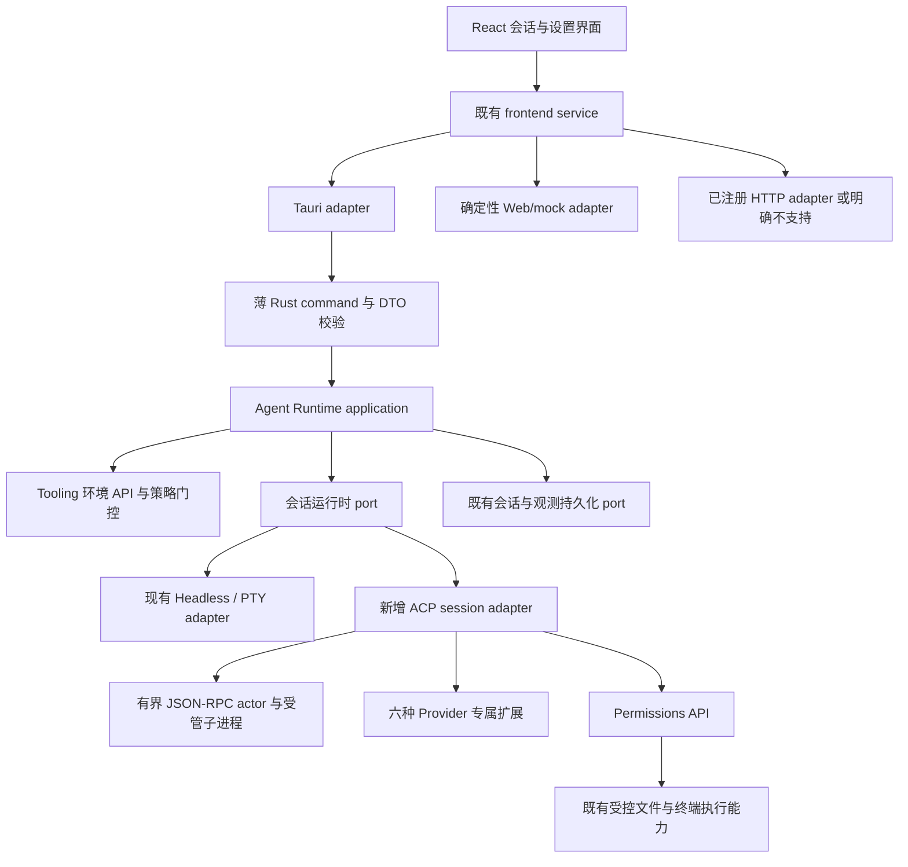
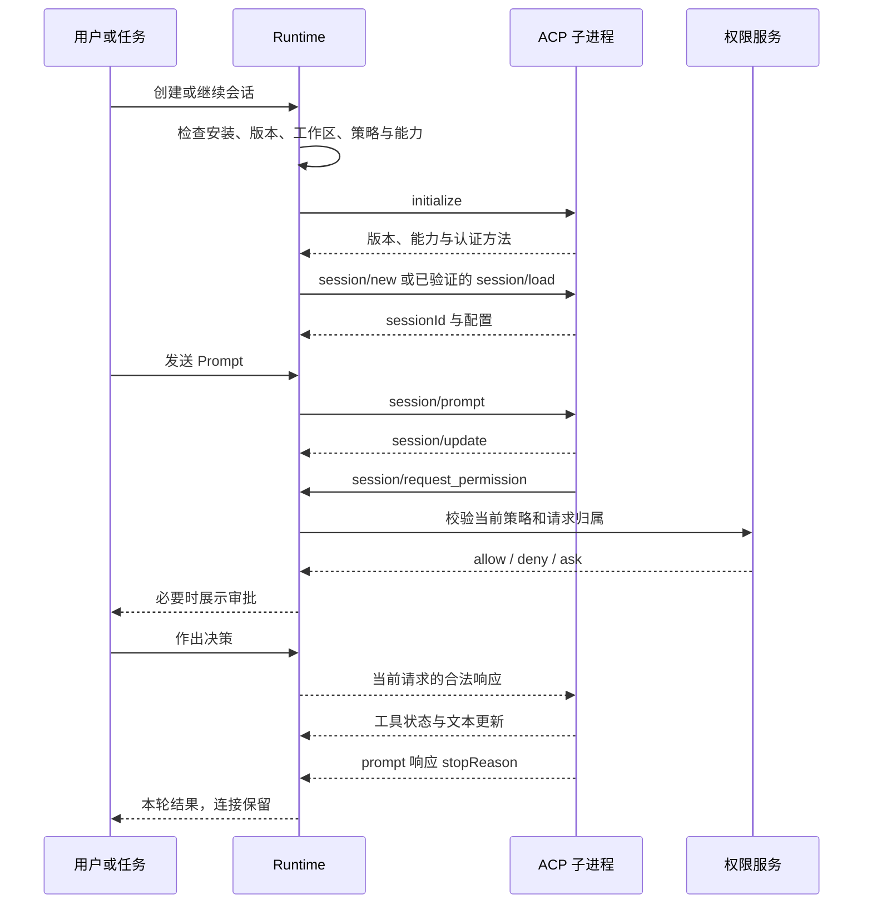

## Context

审阅基线是 `main@34a449e80a1badc16fcfb49dcbad26134aecf2d9`。执行时以当前工作区 `AGENTS.md`、实际代码和 OpenSpec 主规范为准，先记录差异，不能切回旧 SHA 覆盖现有修改。源码定位及需要执行者进一步追踪的位置见 [repository-audit.md](references/repository-audit.md)。

当前可复用资产包括静态 ProviderRegistry、CLI 环境快照与 action plan、受管 headless、PTY、权限域、统一操作和统一日志。不应另建一套“新 CLI 专用配置数据库”或“第二个进程管理器”。当前 SDK 对多项能力的统一声明不能直接用于新 Provider。

## Goals / Non-Goals

### Goals

1. 六种活跃 CLI 的终端入口与受管 ACP 入口真实贯通，并与多 Agent、定时任务共享执行契约。
2. 每个 Provider 在每个平台、版本和通道上准确声明能力，拒绝不满足安全要求的执行。
3. 旧五种 Provider、旧配置与旧会话保持兼容；新协议扩展可测试、可诊断、可单独禁用。
4. iFlow 有可用而不误导的本地历史兼容路径。

### Non-Goals

不增加任意 executable manifest、安装脚本 Hook 或动态插件；不自动同步各 CLI 的全局配置、认证和模型列表；不强制迁移旧 Provider 到 ACP；不实现 TCP/HTTP ACP 服务端；不把“模型供应商支持”统计为“CLI 支持”；不重做 Skill、MCP、Worktree 和 Memory 子系统。

## 1. Runtime boundary and composition

`tooling` 负责安装身份、来源、只读探测与 action plan；`agent_runtime` 负责连接、会话、turn 和 Provider 适配；`permissions` 负责策略决策；SQLite、OS 进程和协议 I/O 在基础设施层。跨上下文只用公开 API/port，不 import 对方 infrastructure。

六种 ACP Provider 静态编译进同一 registry。注册发现、选择器排序和自动化可选列表使用同一个元数据投影，不在前端另维护 provider 名单。不同上下文各有静态定义时，以一致性测试验证 ID、可执行身份和顺序，禁止两者互相越层 import。

## 2. Separate identities and execution transport

保留 `ProviderId` 与 `InteractionMode` 的现有业务含义，在内部引入或扩展 transport 描述，例如 `pty`、`headless`、`acp-stdio`。这些是设计名称，执行时按现有类型命名整合，不机械增加平行 DTO。

建议最小领域对象：

| 对象 | 关键数据与不变量 |
| --- | --- |
| ProviderMetadata | 稳定 ID、displayName、供应方、排序、active/legacy 标记 |
| InstallationIdentity | 已解析且校验的路径、来源、发行形态、版本、平台、架构、指纹 |
| ProviderExecutionProfile | transport、适配版本、允许模型/模式选项、配置档案引用与策略投影摘要 |
| CapabilityAssessment | supported/unsupported/unknown、reasonCode、证据来源、核验时间 |
| ProviderSessionBinding | VaneHub session/seat、外部 session ID、workspace/worktree、安装身份与 profile |
| ConnectionEpoch | 每次连接的新本地 ID，隔离迟到回复、审批和重连消息 |
| PendingInteraction | connectionEpoch、外部 request ID、本地请求 ID、session、turn、权限策略版本、截止时间 |

`effective capability = 受审查版本适配范围 ∩ 宿主已实现能力 ∩ 对端协商能力 ∩ 当前平台与策略`。ACP 中省略的能力按协议视为未支持；宿主预检测不足则显示 unknown。这两种情况不能混为一谈。未知版本不能仅因为 `--version` 可执行就宣布支持全部功能。

## 3. Provider SDK and Manifest evolution

采用显式 V2，而不是让 V1 从拒绝某字段突然变成接受任意 JSON。V1 解析与旧五种 Provider 行为保持兼容；V2 允许声明受支持 transport 和不支持的 usage/resume 等能力。V2 依旧仅包含数据，不包含 argv、环境变量值、网络安装位置、Hook、脚本或动态库。Provider 特有 argv 位于受审查的 Rust 适配器中。

SDK 的“完整”指每项职责都有可验证处理路径，包括明确返回 `UnsupportedCapability`，并不要求每种 CLI 都支持 reasoning、resume、usage 或 sandbox。必需运行职责（身份、可选执行通道、生命周期、取消、有界协议处理、错误分类）缺失则不得注册。

在现有 domain 中增加 usage-unavailable 的兼容表达；不能把没有用量的 CLI 标成 HeadlessReported。旧 V1 的解释不变，新 Provider 不靠将所有字段改成 true 绕过校验。生成契约须使用仓库现有生成链路，不能仅手改生成的 TypeScript 文件。

## 4. ACP process and connection lifecycle

首版采用一个活动 execution binding 独占一个 ACP 子进程，不做不同账号、策略或工作目录之间的进程池复用。特别是服务启动级别的工具过滤选项，不能在共享进程里冒充每会话隔离。

进程状态、连接状态、turn 状态分开管理，不给既有公共 lifecycle enum 硬塞多种语义。可在现有运行状态旁增加可选细分状态并由兼容映射投影：

- 连接：starting / negotiating / ready / disconnected / closing / closed。
- turn：running / waiting-permission / waiting-user / cancelling / completed / failed / cancelled / interrupted。
- stop reason：保留上游原值并分类，`max_tokens`、`refusal` 等不能一律变成“任务验收通过”。Agent turn 结束和任务验证成功是不同事实。

一条连接每会话只接受一个活动 turn。按连接接收顺序处理通知与最终响应，最终响应前已收到的输出必须先投影；响应之后的迟到消息不能污染下一轮。关闭 UI 标签不等于销毁仍运行任务，遵守原有会话生命周期约定；显式停止、删除运行会话或应用退出必须释放所有拥有资源。

## 5. Framing, JSON-RPC, errors and resource budgets

ACP stdio 使用 UTF-8 JSON-RPC 2.0 与换行分帧，不使用 LSP Content-Length，不把 stdout 混入诊断。保持 stdin 打开，专用 reader 与串行 writer 并发工作：等待 `session/prompt` 响应时，reader 仍能处理来自 Agent 的权限请求，否则会产生互相等待死锁。[协议来源](references/official-sources.md)

优先评估官方 Rust ACP SDK 的版本、许可与仓库适配；引入时固定版本和锁文件，不凭空指定 crate API。无合适依赖时在 infrastructure 内实现严格最小子集，并用官方 schema 与协议桩验证。JSON-RPC 未知请求应返回相应协议错误；未知通知有界记录并忽略；Manifest 的 deny-unknown-fields 不应照搬到允许扩展的 wire payload。

建议集中默认预算如下，均为本方案工程初值，不是 ACP 标准规定，也不是已有性能测量：

| 预算 | 建议初值 | 处理 |
| --- | --- | --- |
| 单帧 UTF-8 编码上限 | 1 MiB，延续当前 parser 量级 | 超限明确失败；大附件使用已验证的资源传递方式 |
| 每连接未决 RPC 数 | 128 | 拒绝新请求或背压，不无限增长 |
| 入站/出站总队列 | 各 8 MiB，同时约束条目数 | 文本可批次合并；审批、控制消息与最终状态不得静默丢失 |
| 单 RPC 初始化/建会话预算 | 30 秒，分类可配置 | 超时清理并明确失败 |
| stderr 保留尾部 | 64 KiB | 先脱敏，截断带标记 |
| 取消宽限期 | 2 秒，兼容现有 process-tree policy | 超时升级为受管进程树终止并等待回收 |
| 人工交互等待 | 单独可配置 deadline | 不计为模型无响应；超时拒绝/取消，绝不批准 |

同时约束 JSON 深度、collection 数量、附件大小与 UI 缓冲。测试以边界不变量为判定，不使用不稳定的毫秒级墙钟阈值。所有 timeout、EOF、spawn failure、broken pipe、malformed message、peer error、unknown capability 均输出 typed reason code，用户信息本地化，日志脱敏。

取消使用 `session/cancel` 通知，不等待这个通知的 JSON-RPC response；所有未决权限请求回复 cancelled outcome，扩展交互按各自协议取消；等待原 prompt 的结束响应。超时后先中断并回收宿主代理的子终端，再回收 ACP 进程树。只停止 VaneHub 拥有的子进程，不能按可执行名称 kill 用户其他会话。

## 6. Permissions, authentication and tool proxy

### Permission mapping

复用现有 policy template 的真实名称与语义，按 Provider/版本/transport 投影。adapter 必须返回可执行策略或 `policy-not-enforceable`，不得忽略不认识的策略。默认不添加 yolo、bypass 或 dangerously-skip 权限参数。

ACP request 的选项 ID 是对端给出的不透明值，必须验证返回的是原请求存在的 option ID，并精确保留 approve-once/approve-always/reject/cancel 等语义。不能把“本次同意”映射为“本会话永久同意”，不能返回伪造的 allow 参数。

每个交互绑定 connectionEpoch、session、turn、RPC ID、tool call ID 与 policy revision。响应只能消费一次；旧页面、重复点击、错会话响应和策略变化全部被后端拒绝或重新评估。页面刷新可以从后端恢复待处理交互，不是由 React 内存保存唯一状态；应用重启后的旧连接请求不可重新批准。

### Enforcement levels

至少区分 host-enforced、provider-delegated、unverified。宿主实际代理执行的文件/终端操作经权限域校验；CLI 内部自行执行的工具不能被包装成“宿主已经沙箱化”。任务要求 OS 级隔离而当前 CLI 不具备时应阻止执行或要求已有可靠隔离，不新增假的 sandbox=true。

对于 Kimi 等 print 模式可能不做逐次审批的执行方式，默认受管会话走已验证 ACP；不为方便接入增加不受控 headless fallback。终端也不可豁免硬性策略要求：若当前策略不能在 PTY 下兑现，只能阻止启动或让用户在风险说明后显式修改要求，不能暗改策略。

### Client file / terminal APIs

只有完整实现并测试相关方法时，才在 initialize 声明客户端 fs/terminal 能力。复用既有文件与进程能力；支持 namespace 下所有必须方法，而非只实现 create。

路径校验基于已授权的 workspace/additional roots；拒绝 traversal、越界 symlink/junction、UNC/设备路径绕过与不可信 env 覆盖。写入用原子写与适当的重新校验，处理不存在目标的父路径；不能只做字符串 startsWith。Shell 指令并非文件路径检查就安全，必须经既有治理执行器与所要求的隔离；不能安全表达的命令拒绝，不能靠提示词作为安全边界。

终端 ID 属于连接和会话；output/wait/kill/release 均校验所有权并保留有界输出。Agent 声称工具已完成不构成授权依据。接收到未经声明的客户端方法不能自动补开权限。

### Authentication

安装检测不触发登录、打开浏览器或发送模型任务。没有受支持的只读 auth command 时保留 unknown；用户可以显式发起登录或兼容性检查。首次显式连接所遇到的认证请求使用经过审查的适配流程。

复用 CLI 原有认证与当前安全凭据存储，只保存引用及脱敏摘要，不扫描/导出任意全局凭据文件。对外部登录地址先校验 scheme/host，再由用户确认打开；不自动执行来自 CLI 的命令字符串。账号、区域、API/BYOK profile 与 provider 身份分开，实际 env 仅注入该子进程，不持久化明文、不继承无关供应商密钥。

## 7. Provider-specific adapters

精确命令和来源见 [provider-matrix.md](provider-matrix.md)。六种 ACP 入口已核对，但本文件未宣称某个本地版本已联调成功。

- Qwen：独立 grammar 与 fixtures，不因历史来源复用 Gemini 的权限/输出假设；结构化 stdout 不等于双向协议；官方 vendor 脚本可能内部 fallback 安装来源，首版优先现有 npm 明确来源模式，未证明 source-locked 前只给该 vendor 渠道说明。
- Kimi：识别新版本 npm/native 与旧 Python/uv 安装，两个 `kimi` 不能盲目合并；迁移是单独用户确认的外部动作，本 change 不自动执行。
- Qoder：新 `qoder` 和历史同产品命令别名仅在核验身份后接受；启动级策略与登录 profile 固定在当前 execution binding。
- CodeBuddy：账号环境独立于语言；用客户端代理时必须满足 fs/terminal 契约。新增 provider 内部 Team 通知不等于新增 VaneHub seat，保留子任务归属而不重复累计 token。
- Copilot：独立 `copilot`，不是 gh 扩展。启动级参数只对拥有该进程的 binding 生效；stdout/headless 参数不照搬别家。
- Cursor：`agent` 名称通用，必须查验身份。`cursor/ask_question` 和 `cursor/create_plan` 需要响应；todo/task 等通知不应回复，未知阻塞扩展立即按协议失败，不无限等待。
- iFlow：只对用户已安装且显式选择的程序做 legacy 兼容；官方服务关闭说明常驻；自定义 API 由用户在原 CLI 配置，本 change 不读取或自动转换凭据；不编造 ACP/headless 支持。

## 8. Session binding, replay and persistence

通过既有迁移基础设施添加可空字段或扩展表，实际表名先审查代码再决定。禁止重建用户会话库。建议记录 installationId/fingerprint、distributionKind、adapterRevision、transport、externalSessionId、canonicalWorkspace、worktreeId、profileRef 和最近握手摘要。

旧记录的未知信息保持 null 或明确 legacy marker，继续走原有五种 Provider 逻辑，不能“迁移”为 ACP 记录。connectionEpoch 属于运行时短期身份，重启后更换。

ACP `session/load` 仅在对端声明支持且绑定吻合时使用。历史回放标记为 replay，不作为新生成再次写入对话、触发工具、累计 token 或再次请求用户同意；没有稳定事件 ID 时，以 load 阶段独立投影与本地消息映射处理，而不是按文本 hash 删除合法重复输出。

二进制指纹、账号环境或关键策略变更时重新评估兼容性。只有经过测试的发行形态之间才允许兼容恢复，不把新版/旧版 Kimi 或 ACP/PTY 的 session ID 互相套用。恢复不支持或外部会话丢失时保留本地历史，提示另建会话，不能悄悄用最近会话替代。

连接丢失后的 turn 标记 interrupted/unknown-effect；不自动重发 prompt，因为文件可能已经被写入。恢复先核对状态和副作用，再由用户或已有幂等工作流决定后续。会话删除默认只回收自身 runtime 资源；不删除 CLI 全局历史、账号目录或 Worktree，后者遵循原有显式清理流程。

## 9. UI and configuration

只扩展现有 CLI 管理与创建会话界面，不新增第二套 Agent 设置中心。卡片/详情展示 installed、auth、compatibility、source、freshness 与各场景能力，并由后端返回 allowed actions。过滤支持搜索、可用性与历史兼容；国内优先排序只作用于新增项，不擅自更改已有默认选择。

“统一对话”“原生终端”是用户交互入口；高级详情再展示 `acp-stdio` 等 transport，不把协议名字塞入 Agent 名字。未知能力选择后可发起显式兼容性检查，不能在页面 mount 时为所有 CLI 启动 ACP 进程。

审批/用户问题/计划批准接入统一交互队列，显示 CLI、seat、工作目录、操作和范围；支持键盘与焦点返回。按一次允许后禁用重复提交，关闭交互视图不代表同意。长路径/错误可换行，有安全复制；不默认显示 Token。

未支持模式显示原因，不仅变灰不解释。无 usage 显示“未提供”，context used/size 不当作计费 input/output，模型未报告费用不显示 0 元。slash commands、model/config options 只呈现当前会话真实提供且宿主已实现的项目，不执行任意命令。

沿用应用主题与终端主题；提供中文和英文键值，不新增与功能无关的大型 UI 改版。Web/mock 显示演示标识，不声称宿主程序已安装；web-http 未提供真实 adapter 时继续抛出明确不支持错误，不默默使用 mock。

## 10. Multi-agent and scheduled execution

多 Agent、定时任务和可用的 CLI delegation 路径均调用同一 launch preflight 与 runtime port。每个 seat/run 独立 externalSessionId、connectionEpoch、工作目录、profile 和权限上下文。Provider 内部 subagent 仅为该 seat 子事件，不自动变成平台级新 Agent。

后台任务必须有明确的交互策略与总时限。遇到需要人的批准/提问，默认阻塞并向现有任务中心升级为需要干预；无可用交互渠道时按配置拒绝/取消，不通过 yolo 保证“完成”。可预授权的工具严格限定授权范围，不能把定时启动当成 blanket approval。

任务保存时和每次实际启动时都检查能力和安装指纹。断线后通过 checkpoint 记录 unknown-effect，遵循已有调度幂等性，不在重试中重复写文件、commit 或发外部请求。Worktree 创建与清理由原服务负责，适配器只消费确定的 cwd。

## 11. Observability and usage

在现有观测服务记录 providerId、distribution、version、transport、adapterRevision、session/run/seat、handshake/first-event/turn/cancel 时间、工具状态、等待时长、错误分类、截断次数。只记录安全摘要和相关 ID，保留原 trace 关联，不引入第二套日志目录。

上述延时指标表示阶段耗时，不承诺本次有已测的基线；模型请求时长与人工等待分开。usage 标记 provider-reported / estimated / unavailable；本变更不强制增加估算算法。对累计值与增量值有不同归一化策略，replay、provider subagent 与宿主统计不能重复记账。

## 12. Rollout, reversibility and validation

新增 Provider 可单独 disabled/experimental/verified/legacy 展示，状态必须由明确配置与验收证据支持；不设置任意动态插件装载。首版默认旧会话继续旧通道，新六种受管会话选 ACP，不自动切换进行中的会话。回滚可禁用新增 Provider，增量字段保留，不删除历史。

先完成 fake ACP conformance，再逐家平台做有授权的真实 CLI smoke。所有构建、测试命令和证据分类见 [verification/runbook.md](verification/runbook.md)。阶段是实现顺序，不是省略其余 Provider 的许可；当前工作区已有部分实现时复用并补测试，不重复建 change。

## Risks and Mitigations

| 风险 | 处理 |
| --- | --- |
| CLI 版本/安装文档漂移 | 来源核验日期、实际 --help、发行形态与版本 profile，未知不假支持 |
| 首次启动/自动升级产生外部副作用 | 只读发现与显式兼容性检查分离；有支持时使用会话级禁自动升级；不改用户全局设置 |
| ACP 不强制覆盖 CLI 内部工具 | 暴露保障等级，硬性策略无法满足即拒绝 |
| UI 刷新丢审批或回错 seat | backend pending-interaction store、epoch 和单次消费 |
| 连接重试重复副作用 | interrupted 状态与不重放原则 |
| 用户环境多程序同名 | 已有 source-aware 发现、身份探测与显式选择 |
| 供应商安装脚本内部下载/切源 | 审核完整执行链，不能声称顶层 URL allowlist 约束其全部子请求 |
| 凭据缺失导致假验收 | fake/live 分开，BLOCKED 不等于 PASSED |
