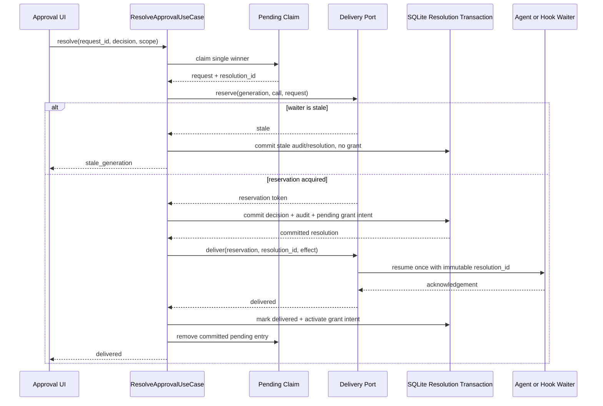

## Context

The `permissions` context owns policy evaluation, remembered grants, pending approvals, risk classification, approval audit, and the Claude hook wait registry. `agent_runtime` owns generation lifetime and native tool waiters. The current command bridges those contexts by delivering the decision first and calling `ApprovalBroker::finalize` afterward. That ordering crosses a security boundary without a transaction or an idempotency key.

Current grant lookup is similarly underspecified. The table has only a non-unique lookup index, `create` always inserts, and `find_matching` collects candidates with no `ORDER BY` before Rust selects the first scope match. The domain knows whether one row matches a context, but it does not decide which of several matching rows is authoritative.

This change keeps the pending queue in memory because an approval request cannot outlive its originating generation. It makes the **resolution evidence and delivery state durable**, not the live waiter.

## Goals / Non-Goals

**Goals:**

- Make grant lookup independent of insertion order, row id, query plan, database vacuuming, and concurrent remember operations.
- Guarantee that no `Allow` reaches a native Agent or Claude hook before an immutable resolution and audit are committed.
- Guarantee that a remembered grant cannot affect later evaluation before the originating delivery is acknowledged.
- Make resolve, retry, timeout, and stale-generation paths single-winner and idempotent.
- Preserve DDD ownership: `permissions` owns resolution policy and transaction boundaries; `agent_runtime` exposes a narrow delivery API; commands remain transport adapters.
- Preserve fail-closed availability for timeout and infrastructure failure without silently executing.

**Non-Goals:**

- Changing the four policy templates, action taxonomy, risk classification, MCP Ask floor, Skill authority model, or CLI launch flags.
- Persisting and resuming a live pending approval across application restart.
- Adding wildcard resources, hierarchical path grants, expiration, revocation UI, or delegation activation.
- Solving trusted/yolo backend challenge or Claude hook desired/active activation. Those require `harden-permission-policy-activation-and-confirmation`.
- Encrypting the whole application database or changing log storage.

## Invariants

1. A canonical grant key has at most one effective active row.
2. Grant selection is `Session exact > Project exact > Global`; specificity is evaluated before effect.
3. Within one canonical key, the highest revision is authoritative; normal operation physically enforces one row.
4. `Scope::Once` and `Effect::Ask` are never persisted as remembered grants.
5. One approval `request_id` has at most one immutable human/timeout/stale resolution.
6. A live waiter can be **reserved** without being resumed.
7. `Allow` delivery requires a committed resolution and audit.
8. A remembered grant is initially `pending_delivery` and is not consulted until delivery acknowledgement activates it.
9. A stale or ended generation receives no execution and activates no grant.
10. A retry carries the same `resolution_id`; the receiving waiter applies a resolution at most once.
11. Removing the pending request is never the first irreversible step.
12. Sensitive request payloads are not persisted or logged; only normalized action/resource, bounded provenance, ids, status, and safe reason codes are retained.

## Decisions

### 1. Canonical grant identity and precedence

The domain introduces `CanonicalGrantKey`:

```text
principal_id
+ action
+ resource
+ scope
+ scope_owner
```

`scope_owner` is:

- Session: `session_id`
- Project: `project_key`
- Global: the empty global sentinel

The following rows are invalid and are rejected by domain construction and schema checks:

- `Once` in `permission_grants`
- `Ask` as a remembered effect
- Session without exactly one non-empty `session_id`
- Project without exactly one non-empty `project_key`
- Global with either session or project ownership populated

Applicable rows are ranked as follows:

| Rank | Match |
| --- | --- |
| 3 | Session row whose `session_id` equals the evaluation session |
| 2 | Project row whose `project_key` equals the evaluation project |
| 1 | Global row |

A more specific scope deliberately overrides a broader scope, including a broader deny. At the same canonical key, repeated user decisions are updates: the row's effect is replaced, `revision` increments, and `updated_at` advances. There is no wildcard or prefix resource matching in this change.

The repository performs precedence in one deterministic SQL query with explicit scope rank and `LIMIT 1`; Rust does not load an unordered candidate vector and call `.find()`.

### 2. Legacy grant migration

A new migration, selected only after scanning current `main` and active changes, rebuilds `permission_grants` transactionally.

The migration:

1. Creates the replacement table with scope/effect checks, `revision`, `updated_at`, `activation_state`, and optional `resolution_id`.
2. Classifies malformed legacy rows. Rows representing `Once`, `Ask`, missing scope owner, or contradictory owners are excluded from active grants and counted in one redacted migration diagnostic; raw resources are not emitted.
3. Groups valid legacy rows by canonical key.
4. Selects one deterministic winner per key by `created_at DESC`, then safe effect rank `Deny > Allow`, then `id DESC` as a final stable tie-breaker.
5. Copies the winner as revision `1`, state `active`, and preserves the original `created_at` where valid.
6. Swaps tables and creates scope-specific partial unique indexes plus the lookup index.
7. Verifies row counts and schema invariants before commit.

Recommended uniqueness constraints:

```text
Global:  (principal_id, action, resource) WHERE scope = 'global'
Project: (principal_id, action, resource, project_key) WHERE scope = 'project'
Session: (principal_id, action, resource, session_id) WHERE scope = 'session'
```

The exact SQL belongs to `permissions` infrastructure and the version registration remains centralized in `platform::database`.

### 3. Durable approval-resolution ledger

Add `approval_resolutions` as a durable delivery ledger owned by `permissions`. It stores bounded metadata only:

```text
id                    immutable resolution_id, primary key
request_id            unique original approval id
principal_id
session_id
generation_id
call_id_hash           bounded correlation hash, not raw provider payload
action
resource
risk_level
decision_effect        allow | deny
decision_scope         once | session | project | global
decider                human | timeout | stale_generation | emergency_fail_closed
channel                 native_agent | claude_hook
state                   committed | delivered | delivery_failed | stale | aborted_by_restart
created_at
updated_at
delivery_attempts
last_error_code         bounded stable code, nullable
```

`approval_audit` gains `resolution_id` and a safe outcome/reason field. The audit remains append-only. The resolution row is mutable only for delivery state and counters; the decision fields never change.

A remembered grant written by the transaction has `activation_state = pending_delivery` and its `resolution_id`. Evaluation queries only `activation_state = active`.

### 4. Single-winner in-memory claim

The pending map stores an internal phase:

```text
Pending(request)
Resolving { request, resolution_id, claimant }
Committed { request, resolution_id }
```

`claim(request_id)` is atomic under the pending mutex:

- `Pending` becomes `Resolving` and returns the request.
- A second caller sees the existing claim/resolution and returns a typed idempotent status.
- A missing request consults `approval_resolutions` by `request_id`; if found, the use case returns its current durable state rather than claiming “not found”.
- A pre-commit retryable failure may compare-and-revert only its own claim back to `Pending`.
- After commit, the entry is not reverted to a fresh pending request.

The frontend receives `resolving` while a claim exists, disables Approve/Deny, and may reconcile by pull.

### 5. Reservation, transaction, delivery, activation

`permissions` defines a consuming-side `ApprovalDeliveryPort`. Concrete adapters call only published APIs:

- Native Agent adapter wraps `agent_runtime::api` generation/waiter reservation and delivery.
- Claude hook adapter wraps the `permissions`-owned hook wait registry.
- A routed adapter selects the channel recorded on the approval request.

A reservation proves the waiter and generation are current and prevents another effect from winning, but it **does not resume execution**.



The first SQLite transaction is one repository operation, not a chain of `GrantRepository::create` and `AuditRepository::append` calls. The acknowledgement transaction is idempotent and activates at most one grant revision.

### 6. Delivery failure and restart semantics

Delivery can fail after commit because it is outside SQLite. The result is explicit:

- `stale`: reservation was not available before commit; commit a stale resolution, no grant intent, no delivery.
- `delivery_failed`: decision is durable, grant remains inactive, pending UI no longer offers a second conflicting decision, and bounded retry is allowed only while the same reservation/generation remains valid.
- `aborted_by_restart`: startup finds `committed` or `delivery_failed` rows that cannot have a live pre-restart waiter. It marks them aborted, leaves grants inactive, and never delivers to a new generation.
- `delivered`: acknowledgement was received; activation is retried idempotently if the final SQLite update initially failed.

A crash after the waiter actually applies the effect but before acknowledgement can be recorded is `delivery_unknown` operationally and becomes `aborted_by_restart`; the grant stays inactive. This chooses least privilege over guessing that delivery happened.

### 7. Timeout and emergency fail-closed denial

Timeout sweep uses the same single-winner claim and resolution use case with `Deny` and `decider = timeout`.

Normally it reserves, commits, delivers denial, and records acknowledgement. If the database is unavailable, timeout must not release an `Allow` or leave the provider waiting indefinitely. The delivery port may send an emergency `Deny` only; it emits a redacted unified `error`/`warn` diagnostic containing safe ids and error code, and the request cannot later be converted into `Allow` without a new evaluation. No grant is created.

Human `Allow` never uses this exception. Human `Deny` may use the same fail-closed emergency path only when the product's existing timeout contract would otherwise be violated.

### 8. Atomic principal get-or-create

`PrincipalRepository` gains a behavior-oriented `get_or_create(agent_id, default_template)` operation. SQLite uses `INSERT ... ON CONFLICT(agent_id) DO NOTHING` followed by a read on the same connection/transaction. Concurrent first evaluations return the same principal and do not degrade into an incidental `Ask` caused by a uniqueness error.

Read-only policy listing continues to use `find_by_agent_id` and does not create rows.

### 9. Evaluation failure evidence

Evaluation continues to fail closed. When policy/grant/principal evaluation fails:

- it never returns `Allow`;
- if the audit store is available, append an audit attributed to `evaluation_error` with a stable safe reason code;
- if the same storage outage prevents audit persistence, emit one redacted unified diagnostic and return the existing Ask/fail-closed result;
- never log raw provider input, secrets, full shell commands, or unrestricted absolute paths.

### 10. Runtime and frontend boundaries

React continues to call the permission service. Tauri-specific invocation remains in the Tauri adapter. The service adds typed resolution status rather than exposing database rows:

```text
resolving | stale | committed | delivered | delivery_failed | denied_fail_closed
```

The Web/mock adapter implements deterministic in-memory equivalents of claim, commit, delivery acknowledgement, pending grant activation, and duplicate resolve. It labels all effects simulated and performs no native execution.

Commands obtain an assembled `ResolveApprovalUseCase`, map DTOs, invoke it, and return command-safe results. They do not call `agent_runtime` and then `ApprovalBroker` themselves.

## Risks / Trade-offs

- The migration changes grant identity. Deterministic deduplication can select a different row than an accidental prior query order; that is the intended correction and must be surfaced in migration tests.
- Two-phase grant activation means an approved action may execute while its remembered grant remains temporarily inactive if the acknowledgement update fails. This is safer than activating a grant for an action that was never delivered; reconciliation retries activation after confirmed acknowledgement.
- The reservation API adds a cross-context contract. Architecture tests must prove that only the adapter depends on `agent_runtime::api`, not its private repositories or generation internals.
- The resolution ledger retains normalized resources. Existing redaction and retention policy must be applied; no new raw payload storage is allowed.
- Emergency denial prioritizes fail-closed availability over a guaranteed SQLite audit during a storage outage. The unified diagnostic is mandatory and the path can never produce `Allow`.

## Migration Plan

1. Add domain and repository characterization tests before schema changes.
2. Add the new versioned migration and migration upgrade/duplicate fixtures.
3. Deploy readers that understand active/pending grant state and deterministic precedence.
4. Add the atomic resolution repository and use case behind existing commands.
5. Add reservation/delivery adapters and switch command orchestration.
6. Add startup reconciliation for incomplete delivery rows.
7. Remove obsolete separate-finalize paths only after compatibility tests prove no caller remains.
8. Keep the migration forward-only; rollback means restoring the prior application binary against a backed-up database, not editing an applied migration.

## Open Questions

None. Exact migration number and existing active-change merge conflicts are implementation-time facts and must be resolved before code changes.
