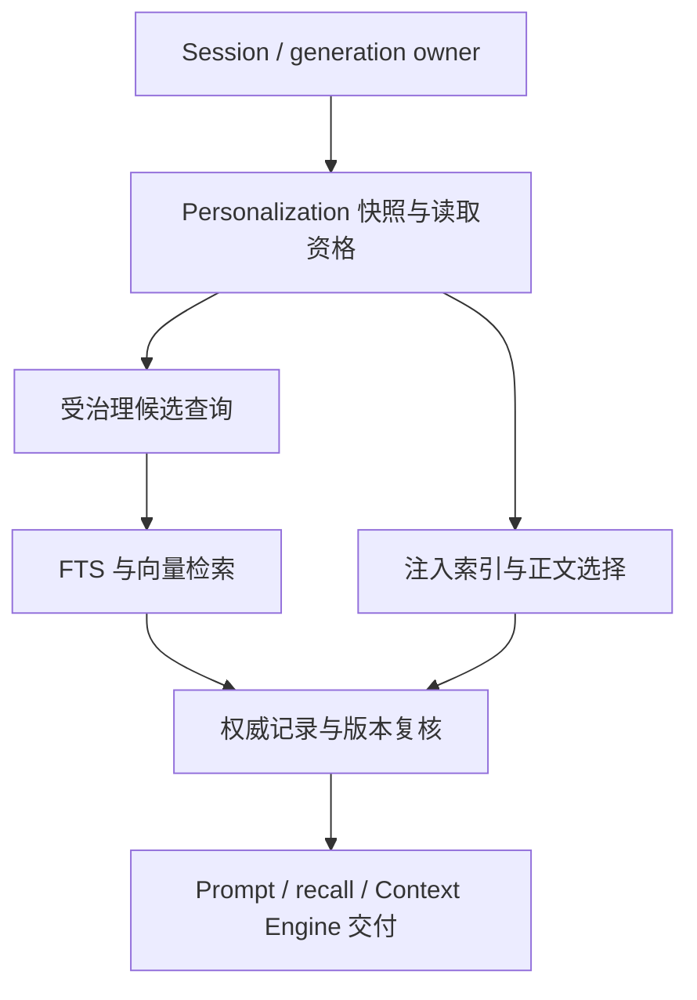

# Design

## 1. 已核实的读取链路

下表缩写 `runtime/`=`src-tauri/src/contexts/agent_runtime/`，`personalization/`=`src-tauri/src/contexts/personalization/`，`retrieval/`=`src-tauri/src/contexts/retrieval/`，`bootstrap/`=`src-tauri/src/bootstrap/`。基线见 README。

| 入口/位置 | 当前行为 | 需要修复 |
|---|---|---|
| `personalization/application/resolve_policy.rs::attach_eligibility` | 已按身份/策略查 eligible_page，refs 最大 200 | 复用规则，不能把 refs 页当 recall 全域 |
| `personalization/domain/memory.rs::eligibility` | active/read/scope/audience 判定 | 成为共享语义依据，含未知数据拒绝规则 |
| `personalization/infrastructure/sqlite_memory_projection.rs::eligible_page` | audience LIKE；未知 scope 可能落入 eligible | 结构化精确成员匹配和显式数据验证 |
| `runtime/application/ports.rs::AgentRetrievalPort` | search 只收 query、limit | 强制可信 MemoryReadContext |
| `bootstrap/retrieval.rs::DeferredAgentRetrieval`、`RetrievalApi::search` | 转发无范围检索 | typed governed search，不再提供 Agent 无上下文路径 |
| `bootstrap/retrieval.rs::GovernedMemoryIndexSource` | snapshot/fetch 均经 compatibility 公共视图 | 后台索引与 Agent 受治理回源分离 |
| `bootstrap/personalization_bridge.rs::pinned_bodies` | compatibility 只放 global/all，导致 scoped body 丢失 | 身份绑定的权威正文批量读取 |
| `runtime/infrastructure/api_process_adapter/prompt.rs::select_memory_bodies` | selector 按 name，重复名取第一个 | 候选 ID + revision + hash；名称只展示 |
| `runtime/infrastructure/context_sources.rs::RetrievalContextSource::collect` | memory 分支直接 search(task,8) | 先带授权上下文，再取候选 |
| `runtime/infrastructure/api_process_adapter/generation.rs` | Context Engine assemble 早于 snapshot | 先解析一次 snapshot，再提供给所有消费者 |
| `runtime/infrastructure/memory_surfaced.rs` | session → id → mtime，最多 64 sessions | 去重按实际 Agent/seat 和 revision/hash，不能缓存权限 |
| `src/services/web-personalization-preview.ts::previewFor` | 忽略部分读策略；用 eligible.length>0 表示 memoryRead | 按完整继承与模式判定，空池不等于无权限 |

旧 recall 不是完全无任何过滤：最终公共视图能排除 scoped/audience 记录；真正问题是它不认识当前会话的 read/global/project-only 限制，并且错误排除合法记录。Context Engine 是额外入口，不能只修 recall 工具 catalog。

## 2. 决策与边界

继续一个 host-level memory pool，读取资格由以下合取决定：

`eligible = validRecord && active && healthyContext && effectiveRead && allowedScope && admittedAudience`

策略仍按 built-in safe defaults → global → Agent → workspace → workspace-Agent → session override → session-mode hard restrictions 解析。不新增 readScope 开关，不更改既有用户选择。

| 条件 | Global | 当前 Workspace | 其他 Workspace |
|---|---|---|---|
| standard + read + global enabled + audience 匹配 | 允许 | 允许 | 拒绝 |
| standard + read + global disabled + audience 匹配 | 拒绝 | 允许 | 拒绝 |
| standard，明确没有 workspace | 按 global 策略 | 拒绝 | 拒绝 |
| project-only，可信 workspace | 拒绝 | audience 匹配才允许 | 拒绝 |
| project-only，缺 workspace | 拒绝全部 | 拒绝全部 | 拒绝全部 |
| temporary、read disabled、未知主体/模式、治理未就绪 | 拒绝全部 | 拒绝全部 | 拒绝全部 |

全部行先排除 candidate/archived/deleted/malformed/quarantined。`AllAgents` 只表示 audience 无额外限制；SelectedAgents 必须精确包含当前稳定 Agent ID。`source_agent_id`、`source_workspace`、`source_session` 只做溯源，不能当 ACL。同一作者不自动可读其他 audience 的记录。

统一是“资格判定相同”，不要求结果相同：注入看近期摘要，selector 看描述相关性，recall 看 query，Context Engine 有独立 budget。同一规则可产生不同 top-k 或空结果，不能把“recall 结果必须包含注入结果”写成要求。

本边界治理 VaneHub 直接交付的记忆及其可识别派生片段。黑盒 CLI 自己的记忆、任意本地文件访问、用户手动复制内容和模型自行转述不属于该逻辑 audience 的隔离保证。不得声称能撤回已发出的 prompt、工具结果或 CLI 历史。

## 3. 唯一可信读取上下文

新增内部类型（名称可按工程惯例调整，语义不能丢失）：

| 类型 | 字段/职责 |
|---|---|
| MemoryReadSubject | stable Agent id、session id、generation/seat-turn id、seat/受托管子执行归属、应用 epoch |
| MemoryReadContext | subject、规范化 workspace identity 或明确 Absent、session mode、frozen policy revision、read/global/workspace allowance、capability/maintenance generation、版本化 scope fingerprint |
| MemoryReadHandle | immutable memory id、明确的 source-id 映射、record revision、content hash、用于授权的 metadata fingerprint |
| AuthorizedMemoryQuery | 属于一次读请求的完整资格 metadata 关系及 read-context ref，独立于注入 refs 页；生命周期有界 |
| MemoryReadOutcome | authorized hits、通道状态、bounded reason、内部安全证据；模型结果不暴露隐藏记录名称/数量 |

上下文只能由 native session/generation owner 和 personalization service 构造。模型只提供 query/limit；即使输入塞入 agentId/workspaceKey/role/id列表，也不能影响主体。服务缺 context 时拒绝，禁止 `None = all`，禁止全局可变“当前 Agent”。内部上下文不经过 Web UI 往返作为授权凭据。

真实会话由 sessions 已发布 API 解析：稳定 workspace ID 优先，随后可信远程连接身份，worktree 优先于 project，legacy folder 只做兼容输入。worktree 是独立 workspace，不映射回同仓库父项目；远程同路径不同连接不可共享。区分 Absent 与 Unresolved，后者禁止全部 memory read。不得靠字符串路径、UI 当前选择或 Agent 显示名建立身份。群聊按当前 seat 的稳定 Agent 解析，不默认使用宿主 OnePiece；受托管子调用不得借另一个 seat 的上下文。

snapshot 必须在任何 memory source、selector 或 provider memory 内容构造前完成。将现有一次解析前移，API 工具循环与 Context Engine 消费同一对象，不能各自重解出两个政策版本；已有 `harden-onepiece-generation-runtime` 的 owner 若先实现就直接复用。

### 快照与记忆更新的时间语义

保留现有主规范：一次 generation/seat-turn 使用冻结政策，新 policy 保存后只影响后续 generation；本变更不偷偷引入热撤权系统。UI 说明“新生成生效”，需要立即停止当前生成可使用已有停止功能。维护状态、主体归属/应用 epoch 失效仍阻止新的读取。

冻结的是**规则与主体**，不是所有记忆永远可读，更不是那 200 条 refs。每次注入候选批次、recall 或 Context Engine 收集在同一规则下取得当时的资格 metadata，pin ID/revision/hash，再在交付前重验权威文件。等待期间被编辑、archive/delete、修改 scope/audience 或 hash 不一致的条目，丢弃并标记陈旧，不能偷换新版。之后一次新的 recall 请求可以按同一冻结规则看到新批准或新修订的合法记录；它不扩大允许的 scope。已构建的旧 index 不因这种刷新改用新 policy，后续 provider 发送/宿主重建时，对有来源标记的记忆片段重新检查并移除不再有效者。

LastKnownGoodPolicyCache 继续只缓存已验证的 policy bundle，复用现有写后失效和 migration generation；仅允许原有定义的瞬态故障、精确 key 命中与健康状态复核。不缓存正文授权结果，不将故障理解成公共池可读。

## 4. 一个读取服务，四类消费端

personalization 增加受治理只读应用接口，例如 `open_memory_query(context)`、`eligible_summaries(context, page)`、`read_pinned(context, handles, purpose)`。`agent_runtime` 定义自己的 port 和 DTO，bootstrap 在拥有上下文的 API 之间转换，retrieval 不直接 import personalization infrastructure 或查询它的内部表。

**索引注入：** 先校验资格，再排名/200 refs/字节行数预算。name、description、scope hint 本身也属于记忆内容，送给模型、selector 或 CLI 前必须核对权威 metadata；不允许只在正文阶段检查。`MEMORY.md` 是宿主派生视图，不能不经筛选整份加入 runtime。

**正文选择：** selection manifest 带候选 opaque ID / revision，模型返回 ID，不按 name `.find()`。通过本次候选集合校验后调用 `read_pinned`；未出现的 ID、同名歧义、版本/hash 变化不能借 owner detail 查找补齐。保留选择失败退回仍有效的 index-only。

**recall：** `AgentRetrievalPort::search(context, query, limit)` 与 Deferred bridge 接通 governed retrieval；旧无上下文方法不可供 Agent 调用。schema 保持 query/limit，limit 原有 1–20。隐藏工具只是第一道 UI/catalog 门禁，直接调用同样必须原生拒绝。

**Context Engine：** ContextRequest 加内部 read-context ref，memory source 调同一个 governed search；禁止 snapshot 前收集。关闭读时 memory source 为 disabled，不调用 memory search、query embedding 或 selector；其他代码/LSP/文件来源仍可工作。内部候选使用 memory id/revision/hash 和 scope fingerprint，不能仅以正文 hash 丢掉身份。manifest 不含正文/名称/原始路径；显式引用、required/protected 标记、排名都不能提升 memory 权限。

## 5. 授权前置到检索、权威复核放在交付

### 查询与性能

不采用“全池 top-k → 最后过滤权限”：未授权项会挤占合法结果，向量和 FTS 的返回路径也容易不同。新 query 只允许基于完整资格域产生候选，再执行各自 top-k、RRF 和最终限制。

选定最小可实施方案：personalization 通过领域谓词及等价 SQL 产生**完整 eligible metadata 的一致只读游标**，包含 id/revision/hash/metadata fingerprint，不含正文；bootstrap 以有界批次传给 retrieval，物化为 query-local、带主键的临时授权关系。retrieval 在自身查询中 JOIN/EXISTS 该关系，向量行在装载/打分前过滤，FTS 在 rank/LIMIT 前过滤。禁止跨上下文直接 JOIN personalization 的私有表，也不拼接巨大 `IN (...)`。

metadata 读取使用短期一致读事务或版本一致游标，构造授权关系后释放，再调用 embedding；不得跨网络调用持有 SQLite 事务。中途 metadata 版本失配可重试一次，仍失败则 unavailable，不能把半张关系当完整集合。关系构建/遍历的条目、页数、内存和耗时有版本化预算，失败明确关闭该可选源；不可静默截到 200/某任意前缀。完成一次 read batch 后回收临时关系，取消/异常同样清理，连接池不得把上一次请求关系用于下一主体。

读批次 incomplete/partial/stale 是内部类型化状态，不能随意发明新的 public degraded 字符串破坏现有工具合约。授权关系未完成或无法证明搜索完成时，转换为既有成功工具 envelope 中的“暂不可用”说明；正常完成的结果仍使用 `results` 与原有可选 `keyword_only` / `vector_only`，不把失败伪装成正常空数组。

保留只为最终有界候选读正文，避免为每次 recall 全量加载所有 Markdown 正文。有界补取合法新候选可避免被陈旧条目占位；耗尽查询预算后明确 partial/stale 状态，不把未完成搜索伪装成“确实无匹配”。授权 metadata 本身的扫描成本需测量，首版以 201、1,000、10,000 条数据记录查询计划、分页工作量、正文加载数、P50/P95 和峰值内存；不写虚构性能数字或用共享 CI 固定毫秒阈值。

### SQL 与领域判定

采用已验证 audience JSON 的精确成员查询（如 JSON1 `json_each` + BINARY 等值）或已有等价规范化成员关系，不能 LIKE/子串/大小写折叠。非法 JSON、未知 scope/status、workspace 字段组合错误、未知 schema 不进入候选与摘要；各层用同一 fixture 比较 Rust domain、SQL、Web 的 eligible ID 集合。Sqlite JSON 能力不足时采用安全的应用层精确过滤在排名前构建关系，不能回退 LIKE。

### 权威文件

回源使用 immutable memory id，source_id 仅是明确校验的 id-derived 文件映射，保留旧索引 id 兼容但不接受任意路径。校验文件仍存在、有效 v2、active、scope/audience、预期 revision/content hash 和授权 metadata fingerprint；外部编辑即使忘记提升 revision 也应被检测。读元数据与正文使用同一安全文件对象/一致内容，避免检查后按另一路径重开被替换；变化时 drop，不返回索引缓存的旧正文或未经准入的新正文。

这种复核也适用于 name/description 元数据交付。对受支持的应用内写入，读取交付与 mutation revision 通过现有锁/版本边界串行；对外部文件编辑使用一致读取和前后身份检查，不能声称远程收回已经写入 provider 通道的内容。

## 6. 索引后台、管理入口和兼容视图

拆开三种权能，不能用 `Option<context>` 混合：

| 权能 | 范围 | 可否交给模型调用 |
|---|---|---|
| RuntimeMemoryRead | 当前可信 context 的 eligible 记录 | 仅受治理 port |
| OwnerMemoryManagement | 用户管理所有允许管理的记录，包括候选/归档 | 否，既有 settings/detail 保持 |
| MemoryIndexMaintenance | 全部有效 active 记录的本地派生索引与维护 | 否，不能受当前会话临时过滤影响 |

新增后台索引源从全部合格 active v2 记录派生本地 FTS；workspace/audience 记录也进入索引。不得因某会话临时不可读而删除 owner 数据或全局索引。`IndexSourceRecord` 增加版本/权威身份所需 metadata，旧 scope_agent_id/scope_folder 继续只作溯源，不拿来冒充权限。

扩大本地 FTS 覆盖不等于授权新的正文外发。保持现有 embedding 配置与独立外发授权边界；本变更不新造一套同意系统，也不自动将原先未索引的 scoped/audience 正文发送给远端。对这些记录，若现有配置无法证明覆盖该内容的外发授权，首版仅本地 FTS，向量待已有明确授权流程允许后构建；scope-aware vector 查询用获准记录或本地 fixture 验证。UI 能说明 scoped 记录当前 keyword-only，不能将尚未嵌入当不存在。这不改变“没有 embedding 配置时不提供 recall 工具”的既有规则。

基线核实：memory RetrievalConfiguration 只有 profile/model 等设置，没有 scoped/audience 记忆外发授权；现有 confirm_embedding 属于代码索引，不能借用。因此首版 restricted 记录明确为 FTS-only，直到后续独立规范提供授权能力，不留“配置了模型就算授权”的实现选项。claim、retry、rebuild、模型切换及恢复都要排除未获准的正文；每次 embed 前回源核对当前 status/scope/audience、queue pinned revision/hash/metadata。公共记录排队后变 restricted 必须阻止该次正文外发，不能只在最初upsert判断。此类记录使用派生的 embedding-blocked/keyword-only 原因，不进入无休止失败重试，也不计为vector完成。查询文本 embedding 与存储正文 embedding 是两个通道：前者受当前read context准入，后者受此后台外发边界约束。

保存不得等待 embedding。权限/状态变化、delete/archive 后即使索引撤销失败，权威读取门禁立即排除受影响记录；索引不一致标识 repair/stale，不能把全池 missing scan 当删除全部。迁移只添加必要派生列/索引和可重入 rebuild，保留 v2 文件、scope、audience、历史来源和用户 policy；重建期间未证实上下文不可回退 compatibility。旧 compatibility API 保留其公共视图语义给确切遗留消费者，但不再用于 runtime 记忆注入、recall、Context Engine。

## 7. 缓存、派生上下文和故障

surfaced 是去重，不是授权。新 key 包含 session + 实际 Agent/seat authority + workspace/mode/context fingerprint，项为 id/revision/content hash；先过滤资格，再去重，换 seat/工作区不得借用缓存。相同 audience 的不同 seat 是否复用展示可后续优化，本次按独立主体处理。锁故障最多重复展示仍合法内容。当前未发现检索结果缓存，不宣称修复不存在的缓存；未来缓存只能返回候选，交付仍需新 context 与权威校验。

对 VaneHub 保存的可识别 memory tool result、Context Engine candidate 或重注入片段保留内部来源标签；换 Agent、seat、workspace 或宿主重新构建请求时重新检查，不能从旧片段直接绕过。此处只处理结构化来源可识别的 runtime 内容，不尝试检测用户文字或模型转述。CLI 自有上下文无法重写，准确展示边界。

| 故障 | 行为 |
|---|---|
| temporary / read disabled / 不支持该通道 | disabled；不触发该 memory source 或 query embedding，生成继续 |
| 上下文/健康状态/资格关系无法建立 | unavailable/blocked；不能返回公共池或 owner 搜索 |
| 向量失败，FTS 合格 | 原有 keyword_only，仍在同一授权关系内 |
| FTS 失败，向量合格 | 原有 vector_only，仍在同一授权关系内 |
| 两路正常无结果 | 正常空结果 |
| 两路失败 | 成功工具 envelope 中说明暂不可用，生成继续 |
| 单条权威记录陈旧/撤销 | 丢弃，有限补取；不能返回它的标题/ID证明存在 |

query 和记忆内容不写日志；安全诊断可以记录本次授权域的计数、原因码、版本指纹、source channel、延迟与降级。面向模型不返回被排除记录的存在性/标题/数量；owner 预览原有排除计数仍可见，因为属于管理权限。

## 8. UI、预览和双适配器

不新增读取范围开关。现有设置页补一句“记忆注入和 recall 使用相同资格范围，展示和搜索数量可能不同”。保持 scope/audience 编辑及 policy 继承入口。

预览输入拆成 `hypothetical` 与 `bound-session`：前者是用户比较不同 Agent/工作区设置的假设预览，不产生可用于运行的 context；后者只传 session/seat 标识，由 native 加载真实 mode/Agent/workspace。不得信任前端同时传来的 workspaceKey/mode 冒充已绑定会话。真实预览与 generation 使用同一 resolver。

预览输出区分 `memoryReadAllowed`、完整 `eligibleMemoryCount`、有界 `indexEntryCount/indexTruncated`、正文预算、`recallAvailability: available|unconfigured|disabled|unsupported|unavailable` 和安全原因。`memoryReadAllowed=true, eligibleMemoryCount=0` 是合法空池；CLI index-only 不代表 CLI 支持受治理 recall。可映射保留已有字段兼容，不能继续将 memoryRead 等同于有结果。

Web/mock 按现有完整 policy 继承顺序计算 memory read/global access/session restrictions/scope/audience，复用版本化真值表验证；保持 native refs/budget 的显示语义，明确 simulated，不读本地文件/SQLite/网络。React 经 AgentService，Tauri adapter/命令 DTO/mapper 和 Web 同步，中英文文案、可访问性与两主题回归。

## 9. 活动变更衔接与实施顺序

| 已有活动变更 | 重叠 | 本次处理 |
|---|---|---|
| `strengthen-governed-cross-session-memory` | governed recall task 5、正文 ID task 2.3、surfaced task 4.4、同名 retrieval requirement | 本 change 负责读取子范围；实施复用已完成部分并补齐遗漏，不重复实现；其抽取/episode/审批任务继续独立 |
| `harden-onepiece-generation-runtime` | generation snapshot owner | 若已实现则挂接；否则最小前移现有 snapshot，不另造运行系统 |
| `refactor-zh-cn-documentation-system` | 旧“所有共享无隔离”文档 | 同步当前开发者/用户手册的读取语义，不整站重写 |

本包只添加自己的 change，不修改其他活动提案或 archive。实施阶段更新相关提案的 overlap 说明与读取任务引用，不能把未做的外围任务勾完。主规范合并以最新 main 为基线，同名 requirement 一次合并为完整新条目；旧提案以后归档前必须 rebase 它的 delta，避免“无条件全池”或结果集合旧句覆盖回来。读取能力不依赖上一项 `enforce-loop-execution-scope` 已实现，两者只共享既有可信 session owner，不引入新的顺序锁死。

## 10. 验收方法

acceptance.md 提供可直接转测试的矩阵。对同一可信 context 和静态 corpus，四类消费者在预算前的 eligible ID 集合必须一致；最终输出只须为该集合子集，不要求排序/数量相等。使用真实临时 v2 文件、SQLite、FTS 和固定 embedding/provider fixture，断言具体 sentinel 是否进入 selector、prompt、tool response、Context Engine 或日志，不能只测返回 effect 或全部空结果。

实现门禁见 tasks.md。跨平台身份和文件一致性结果按实际执行平台报告。OpenSpec 校验只验证规范，不能替代运行验证。
